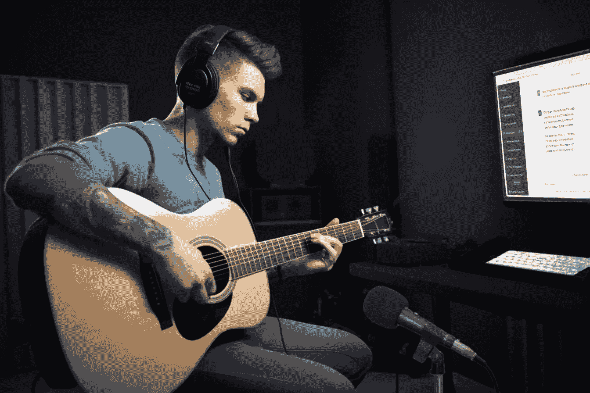

# 使用 GPT-4 写歌：第二部分，和弦

> 原文：[`towardsdatascience.com/writing-songs-with-gpt-4-part-2-chords-173cfda0e5a1?source=collection_archive---------11-----------------------#2023-05-10`](https://towardsdatascience.com/writing-songs-with-gpt-4-part-2-chords-173cfda0e5a1?source=collection_archive---------11-----------------------#2023-05-10)

## 如何利用 OpenAI 的最新大型语言模型为原创歌曲作曲

 [Robert A. Gonsalves](https://robgon.medium.com/?source=post_page-----173cfda0e5a1--------------------------------)

·

[跟进](https://medium.com/m/signin?actionUrl=https%3A%2F%2Fmedium.com%2F_%2Fsubscribe%2Fuser%2Fc97e6c73c13c&operation=register&redirect=https%3A%2F%2Ftowardsdatascience.com%2Fwriting-songs-with-gpt-4-part-2-chords-173cfda0e5a1&user=Robert+A.+Gonsalves&userId=c97e6c73c13c&source=post_page-c97e6c73c13c----173cfda0e5a1---------------------post_header-----------) 发布于[Towards Data Science](https://towardsdatascience.com/?source=post_page-----173cfda0e5a1--------------------------------) ·15 分钟阅读·2023 年 5 月 10 日

--

**“一位音乐家在专业录音室弹奏原声吉他，戴着耳机，旁边是电脑屏幕。”** 通过 AI 图像创作程序 Midjourney 创建，作者进行了编辑。

这是关于使用 OpenAI 新 GPT-4 语言模型创作音乐的三篇系列文章中的第二篇。在 [第一篇文章](https://medium.com/towards-data-science/writing-songs-with-gpt-4-part-1-lyrics-3728da678482)中，我探讨了使用该模型为歌曲创作歌词的各种风格。在这篇文章中，我使用该系统为歌曲创作和弦。我将在 第三篇文章 中探讨旋律创作。

# 关于 GPT-4 的背景

GPT-4 是 OpenAI 最新的大型语言模型。它可以通过他们的 [ChatGPT](https://chat.openai.com/) 用户界面访问，也可以通过他们的 [API](https://openai.com/blog/openai-api) 使用。新模型作为付费的 ChatGPT Plus 订阅的一部分提供，费用为每月 20 美元。正如我在上一篇文章中提到的，OpenAI 将会收集你的输入和响应，并可能用于训练未来版本的模型。默认情况下这是启用的，但你可以通过他们的表单 [这里](https://docs.google.com/forms/d/e/1FAIpQLScrnC-_A7JFs4LbIuzevQ_78hVERlNqqCPCt3d8XqnKOfdRdQ/viewform) 选择退出数据收集。

GPT-4 的响应显著优于之前的 GPT-3.5 模型。根据 OpenAI 的 [技术报告](https://arxiv.org/pdf/2303.08774.pdf)，新模型在 SAT 考试中得分 1400 分（语言 710 分，数学 690 分），而早期模型得分 1260 分（670 分，590 分）。
