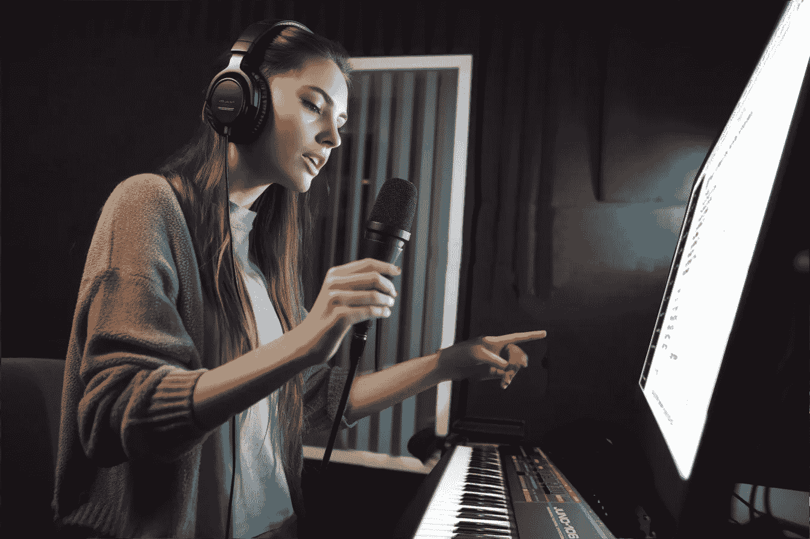
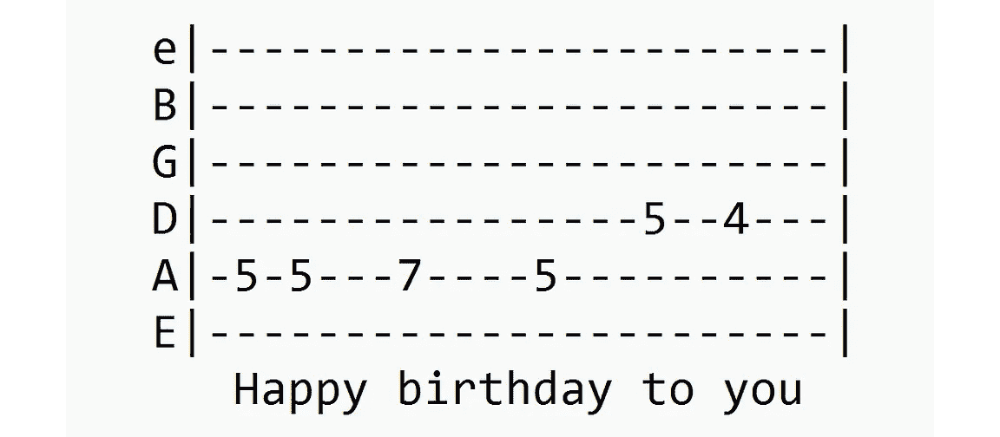
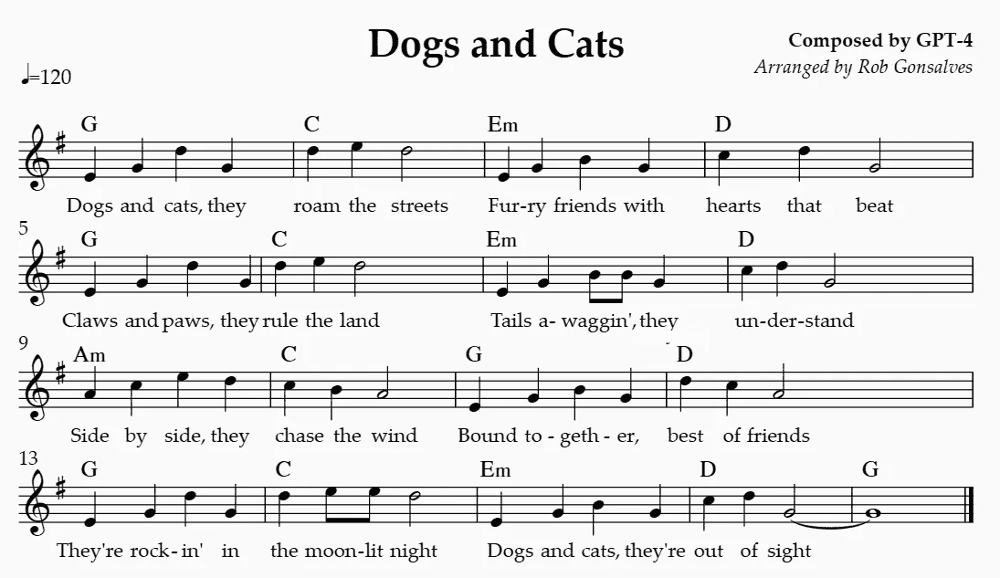
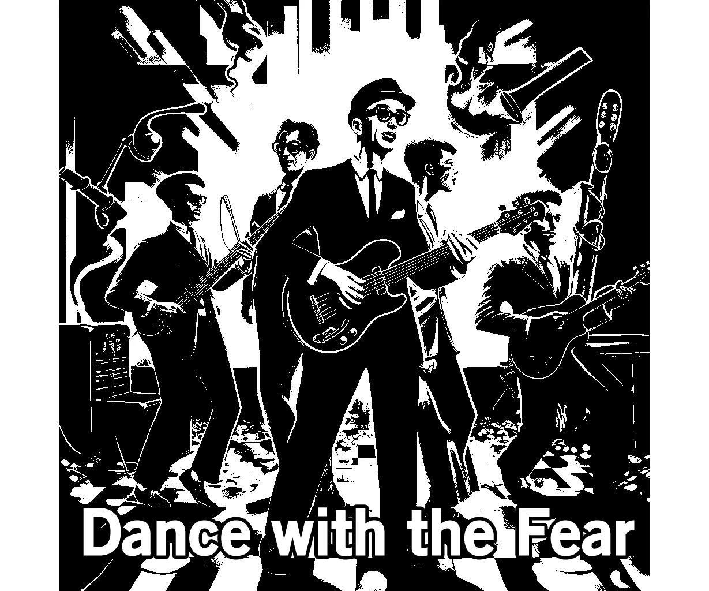
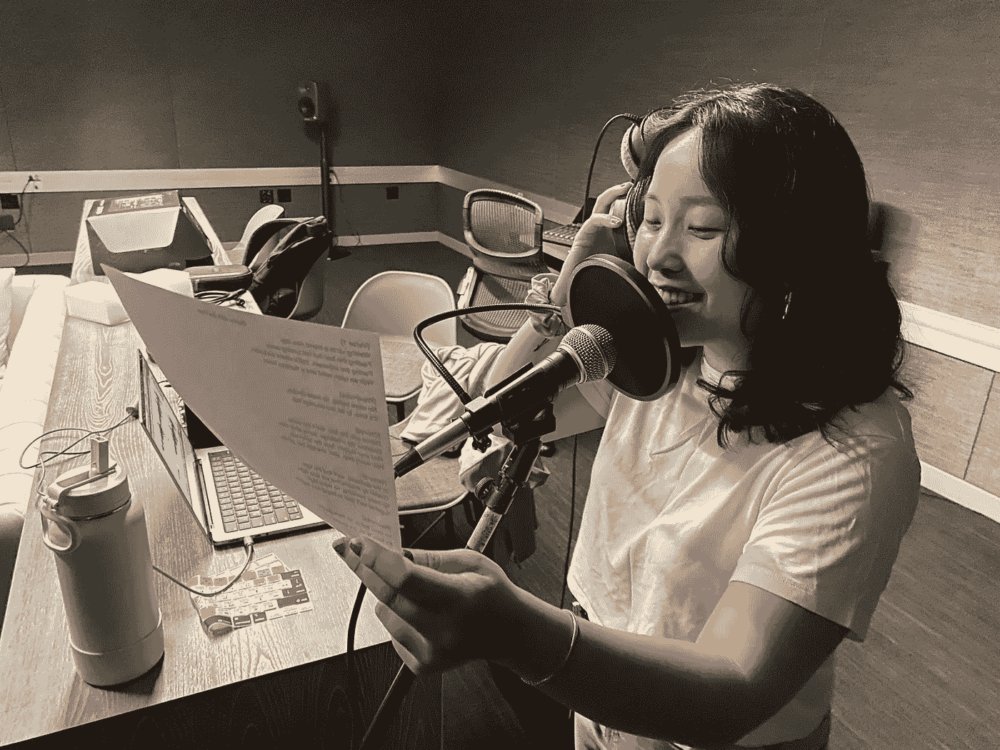

# 使用 GPT-4 写歌：第三部分，旋律

> 原文：[`towardsdatascience.com/writing-songs-with-gpt-4-part-3-melodies-848ab3614e7a`](https://towardsdatascience.com/writing-songs-with-gpt-4-part-3-melodies-848ab3614e7a)

## 如何使用 OpenAI 最新的语言模型帮助创作新歌曲的旋律

[](https://robgon.medium.com/?source=post_page-----848ab3614e7a--------------------------------)[](https://towardsdatascience.com/?source=post_page-----848ab3614e7a--------------------------------) [Robert A. Gonsalves](https://robgon.medium.com/?source=post_page-----848ab3614e7a--------------------------------)

·发表于 [Towards Data Science](https://towardsdatascience.com/?source=post_page-----848ab3614e7a--------------------------------) ·11 分钟阅读·2023 年 6 月 14 日

--



**“一位女士站立着，戴着耳机，看着电脑屏幕，同时对着专业麦克风唱歌，”** I*mage created using an AI image creation program,* Midjourney, and edited by the author

这是我关于使用 GPT-4 [1] 创作音乐系列的第三篇也是最后一篇文章。我的 第一篇文章 讲述了歌曲歌词的创作，我的 [第二篇文章](https://medium.com/towards-data-science/writing-songs-with-gpt-4-part-2-chords-173cfda0e5a1) 探讨了与歌词配套的和弦创作。在这篇文章中，在简要介绍 GPT-4 后，我将展示如何引导模型为歌曲创作旋律，并将和弦和歌词结合起来。我将总结一些通用讨论，并提供一些关于使用 AI 创作音乐的下一步建议。

# GPT-4 简介

GPT-4 是 OpenAI 最新的大型语言模型。它可在他们的 ChatGPT 服务的付费版本中使用，费用为每月 20 美元。该模型在他们之前的版本 GPT-3.5 上进行了改进。以下是 OpenAI 在他们的 [GPT4 登陆页面](https://openai.com/gpt-4) 上对新模型的描述摘录。

> GPT-4 比以往任何时候都更具创造力和协作性。它可以与用户在创意和技术写作任务上进行生成、编辑和迭代，例如创作歌曲、编写剧本或学习用户的写作风格。… 我们花了 6 个月的时间使 GPT-4 更加安全和一致。在我们内部评估中，GPT-4 对请求不允许的内容的回应概率降低了 82%，而生成事实响应的概率比 GPT-3.5 高出 40% - OpenAI

好吧，他们将“创作歌曲”列为他们创造性任务的例子之一。他们还提到模型变得更加“对齐”，这是 OpenAI 用来描述使 AI 模型遵循人类价值观和意图的流行词汇。你可以在他们的[技术报告](https://arxiv.org/pdf/2303.08774.pdf)中阅读更多相关内容。

正如我在之前关于 GPT-4 的文章中提到的，OpenAI 默认收集用户的提示和回应，并可能用它们来改进未来的模型。然而，你可以通过提交[此表单](https://docs.google.com/forms/d/e/1FAIpQLScrnC-_A7JFs4LbIuzevQ_78hVERlNqqCPCt3d8XqnKOfdRdQ/viewform)来选择退出此数据收集。

# 使用 GPT-4 创作旋律

目前，大型语言模型只处理输入文本和输出文本。然而，OpenAI 正在致力于扩展 GPT-4 以使用图像作为提示。这个模型尚未向公众开放，但在一个名为[Be My Eyes](https://openai.com/customer-stories/be-my-eyes)的应用程序的测试版中可以使用。该应用程序通过分析图片和读取场景的文本描述来帮助盲人或视力低下的人完成日常任务。

对于这篇文章，我探索了多种方式来让模型使用文本格式来创作旋律。我发现最好的格式是使用吉他谱（或称为 tab）符号。

## 吉他谱

音乐家使用吉他谱将弦乐器的音符和和弦转录为纯文本。与通常在谱表上的乐谱不同，吉他谱显示了乐器上每根弦随时间使用的品位。例如，这是《生日快乐歌》的吉他六弦谱的第一行。



**《生日快乐歌》旋律的吉他谱** 图片由作者提供

时间在横轴上；弦在纵轴上，从最底部的最低到顶部的最高。数字表示在特定时间点需要演奏哪个品位。较大的数字对应更高的音符。在进行实验后，我发现网络训练数据中有足够的吉他谱和相应的评论，允许语言模型以这种格式进行创作。

## 与 GPT-4 互动

使用我前两篇文章中的示例歌曲，我让 GPT-4 一次创作一个部分的旋律。以下是第一次互动的情况。

> *RobG: 为歌曲《狗狗和猫咪》用吉他谱格式编写旋律。每个音节播放一个音符。*
> 
> *[G] 狗狗和猫咪，[C] 它们在街上漫游
> 
> [Em] 毛茸茸的朋友们，[D] 他们的心脏在跳动
> 
> [G] 爪子和爪子，它们 [C] 统治着土地
> 
> [Em] 摆尾巴，[D] 它们懂得*
> 
> *GPT-4:*
> 
> 我是一个基于文本的 AI 模型，所以我不能创建或播放声音。但我可以给你一个例子，说明你如何使用吉他谱格式将这些和弦应用于简单旋律，每个音符对应一个音节。
> 
> 提供的基本和弦是 G、C、Em 和 D。我将使用 G 大调音阶作为旋律的基础。
> 
> 记住，在谱表格式中，线条代表吉他的弦（从底部的低 E 到顶部的高 E），数字表示在该弦上演奏哪个品位。这里是一个简单的例子：

```py
**e|----------------0------------------|-----------------3------------------|
B|---------1---3-----3-1---------1--|-------0---1-3-------3-1------------|
G|-------0---0-----------2-0--------|-----0---0---------------2-0--------|
D|-----2----------------------2------|---2-------------------------------|
A|----------------------------------|-----------------------------------|
E|----------------------------------|-----------------------------------|
     G          C                   Em             D

e|----------------0------------------|-----------------3------------------|
B|---------1---3-----3-1---------1--|-------0---1-3-------3-1------------|
G|-------0---0-----------2-0--------|-----0---0---------------2-0--------|
D|-----2----------------------2------|---2-------------------------------|
A|----------------------------------|-----------------------------------|
E|----------------------------------|-----------------------------------|
     G          C                   Em             D**
```

> 这只是一个非常简单的例子，旋律可能无法完全捕捉你歌词的精神，但我希望它能作为一个起点。你可能需要调整节奏和旋律，以更好地适应你的歌曲。

这很有趣。这是一个重复两次的两部分音乐短语。但仔细观察，你会发现短语中的音节太多了；它有十二+十一，而应该是七+七。此外，竖线没有对齐。我为第二段重复了这个过程，并在文本编辑器中稍微整理了一下短语，变成了这样。

```py
**e|-------------0-----|-------------------|
B|-------1---3---3---|-------0---1-3-----|
G|-----0---0---------|-----0---0-----0---|
D|---2---------------|---2---------------|
A|-------------------|-------------------|
E|-------------------|-------------------|
     G       C             Em      D

e|-------------------|-------------------|
B|-------0-3-1-0-----|-------0---3-1-----|
G|-----1---------2---|-----0---0-----2---|
D|---2---------------|---2---------------|
A|-------------------|-------------------|
E|-------------------|-------------------|
     Am      C           G       D**
```

我在[这里](https://colab.research.google.com/github/robgon-art/ml-tabify/blob/main/tab2midi.ipynb)写了一些 Python 代码，用于将吉他谱转换为 MIDI 文件，以便我可以播放它们来听听效果。代码基于 Brian Caffey 的类似项目[2]。这是完整的乐谱。



**狗与猫的乐谱**，作者图像

这就是歌曲的声音。我使用了[Band-in-a-Box](https://www.pgmusic.com/)来安排包含钢琴、吉他、贝斯和鼓的歌曲。欢迎你跟着唱。😀

**狗与猫**，作者歌曲

它简单却令人难忘，有点像儿歌。第一个音符有点奇怪，因为它是 E，这样的话 G 和弦实际上就是 G6。而且每次出现 G 和弦时都是如此。我认为这首曲子的最好之处在于第三次通过时的 Am 和 G 变奏。接下来，我将展示我如何为一首 ska 歌曲创作旋律。



**“ska 乐队的专辑封面，黑白色，”** Midjourney 图像，作者编辑

# 为整首歌曲创作一个声乐旋律

为了进一步测试这种方法，我为歌曲《Dance with the Fear》创作了主旋律，这首歌在本系列的前两篇文章中开发。歌词和和弦基于 ska 乐队[The Agents](https://www.facebook.com/theagentsri/)的歌曲《[Grow](https://www.youtube.com/watch?v=aL3N7j_wXPk)》，我在他们的许可下使用了这首歌。我设法让 GPT-4 为新歌创作了一段旋律，一次一个部分。

## 创作主歌

就像我上面使用的方法一样，我让 GPT-4 为主歌创作了旋律，并提供了和弦和歌词。我多次点击再生按钮，检查结果，然后决定了这个版本。

> *RobG: 为这首 ska 歌曲的主歌部分创作吉他谱，一次演奏一个音符。*
> 
> [Em] 醒来迎接一个 [G] 崭新的一天，
> 
> [D] 感受到恐惧但 [A] 不退缩，
> 
> [Em] 面对未知，[G] 这就是我们的起点，
> 
> [D] 以开放的心态和 [A] 无畏的心灵。
> 
> *GPT-4:*
> 
> 这是一个简单的吉他谱，演奏主歌的旋律，一次一个音符

```py
**e|-----------------|-----------------|-----------------|-----------------|
B|-----7-8-------8-|-8-8-7-7---------|-5-5-7-7-------8-|-8-8-7-7-5--5-5--|
G|---7-------7-7---|---------7--7-7--|-----------7-7---|-----------------|
D|-5---------------|-----------------|-----------------|-----------------|
A|-----------------|-----------------|-----------------|-----------------|
E|-----------------|-----------------|-----------------|-----------------|**

**e|-----------------|-----------------|-----------------|-----------------|
B|-----7-8-------8-|-8-8-7-7---------|-5-5-7-7-------8-|-8-8-7-7-5--5-5--|
G|---7-------7-7---|---------7--7-7--|-----------7-7---|-----------------|
D|-5---------------|-----------------|-----------------|-----------------|
A|-----------------|-----------------|-----------------|-----------------|
E|-----------------|-----------------|-----------------|-----------------|**
```

> 请注意，这个谱子是旋律的简化版，你可以根据你的表演或编曲进一步修改和美化它。

这是旋律的声音。

**与恐惧共舞**，**歌词**，作者作曲

总体来说，还不错。它为第一段确立了主题，并为第二段提供了一个很好的解决。可是，再一次，它为歌词创作了过多的音符。

## 创建前副歌

前副歌是一段引导歌曲进入副歌的旋律。请注意，ChatGPT 用户界面包含了会话中之前互动的背景，因此我在提示中可以更简洁地生成前副歌的旋律。

> *为前副歌写一段旋律。*
> 
> *[Am] 不再隐藏，[C] 不再怀疑，
> 
> [G] 是时候让我们的 [D] 勇气释放出来了。*
> 
> *GPT-4*
> 
> 当然，我可以使用提供的和弦进行为前副歌提供一个简单的旋律。以下是谱子：

```py
**e|------0-0-0-0----|-0---------------|-----------------|-0---------------|
B|----1----------|----3-1-1-1-1---|----1-3-3-1-3-3-|-------3-3-1-3-3-|
G|--0--------------|---------------|----------------|----------------|
D|-----------------|----------------|----------------|----------------|
A|-----------------|----------------|----------------|----------------|
E|-----------------|----------------|----------------|----------------|**
```

> 这段旋律分别使用了 A 小调、C 大调、G 大调和 D 大调音阶。像往常一样，欢迎根据你的表演需求进行修改。

我相信它在回应中指的是“和弦”而不是“音阶”，因为它生成的旋律是 G 大调的。为了确认，我请求了澄清。

> *RobG: 你是想用“音阶”这个词吗？*
> 
> *GPT-4:* 对于任何混淆，我深表歉意。我本意是说旋律音符是基于各自的和弦，而不是音阶。

好的，这清楚了。至于旋律，我感觉它写的许多音符可以被解释为持音。换句话说，一连串的四个八分音符可以演奏成一个二分音符。这反映了吉他谱格式的一个局限性，即音符长度没有表达。透过这个视角来看，旋律很好。以下是前副歌的旋律，包括最初的版本和我将一些重复音符转换为更长时值的单音符后的版本。

**与恐惧共舞，前副歌**，作者作曲

好的，第二次录音效果更好，音符保持得更好。以下是歌词和和弦，供参考。

[Am] 不再隐藏，[C] 不再怀疑，

[G] 是时候让我们的 [D] 勇气释放出来了。

## 所有四个部分

我对副歌和桥段进行了重复处理，并将这些部分汇总成一张包含钢琴和弦的乐谱。以下是歌曲的四个部分。

**与恐惧共舞，所有部分**，作者作曲

对于这个版本的歌曲，我清理了所有重复的音符，使它们与歌词的节奏和拍号匹配。总体来说，旋律的质量很好。没有不和谐的音符，短语与基础和弦契合。

接下来，你可以听到这首歌的真实人声演唱。



**凯特·李演唱《与恐惧共舞》**，作者作图

我非常感谢我的朋友兼同事 Kate Li，她为本文演唱了旋律。她将歌曲从 G 调升高了六个半音至 D-flat 调，以适应她的音域。我使用 Band-in-a-box 为乐器部分填充了钢琴、吉他、小号、贝斯和鼓。这是完成后的歌曲。

**与恐惧共舞，** 作者歌曲

Kate 在演唱主唱部分和为副歌添加和声方面表现出色。她在副歌的桥段中用上升的旋律带来了很多情感冲击，并为结尾部分提供了一些不错的即兴演唱。请在这里或在[SoundCloud](https://soundcloud.com/robgonsalves/dance-with-the-fear-final?si=88d83c25c8f148c3b37b93107705a83d&utm_source=clipboard&utm_medium=text&utm_campaign=social_sharing)分享你对歌曲的看法。

# 讨论

这花了一些功夫，但我让 GPT-4 生成了新歌曲的旋律。吉他谱格式很棘手，但目前是最好的方式。当 OpenAI 发布其带有视觉功能的 GPT-4 版本时，我希望它能够看到乐谱，以帮助创作旋律。

在本系列中，我设定的三个音乐创作任务中，分析和生成和弦在[第二篇文章](https://medium.com/towards-data-science/writing-songs-with-gpt-4-part-2-chords-173cfda0e5a1)中效果最好。尽管不完美，但语言模型对音乐理论有深刻的理解，能够轻松创造新的和创新的和弦进行。

分析和创作歌曲歌词，在[第一篇文章](https://medium.com/towards-data-science/writing-songs-with-gpt-4-part-1-lyrics-3728da678482)中讨论了，使用 GPT-4 也很简单，但生成的歌词通常简单且陈词滥调。尽管系统知道如何押韵，但引导系统创作独特、令人兴奋且有意义的歌词仍需一些工作。

# 源代码

该项目的源代码可以在[GitHub](https://github.com/robgon-art/ml-tabify)上找到。


**知识共享署名-相同方式共享**

# 致谢

我要感谢 Kate Li 为本文演唱了歌曲。我还要感谢来自 Agents 的 Pete Fayan 对这个项目的参与。最后，我感谢 Jennifer Lim 对文章的审阅和反馈。

# 更多关于使用 GPT-4 创作歌曲的内容

这是本系列的前两篇文章。

[](/writing-songs-with-gpt-4-part-1-lyrics-3728da678482?source=post_page-----848ab3614e7a--------------------------------) ## 使用 GPT-4 创作歌曲：第一部分，歌词

### 如何使用 OpenAI 最新的语言模型来帮助创作原创歌曲的歌词

towardsdatascience.com [](/writing-songs-with-gpt-4-part-2-chords-173cfda0e5a1?source=post_page-----848ab3614e7a--------------------------------) ## 使用 GPT-4 创作歌曲：第二部分，和弦

### 如何使用 OpenAI 最新的大型语言模型来帮助创作原创歌曲的和弦

towardsdatascience.com

# 参考文献

[1] OpenAI，[GPT-4 技术报告](https://arxiv.org/pdf/2303.08774.pdf)（2023 年）

[2] B. Caffey，[使用 Python 和正则表达式从吉他谱生成 MIDI 文件](https://briancaffey.github.io/2018/04/26/generating-music-from-guitar-tabs-with-python.html/)（2018 年）
