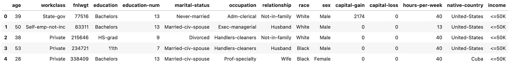
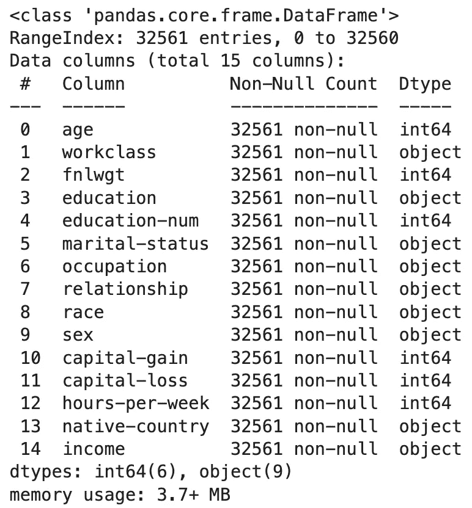
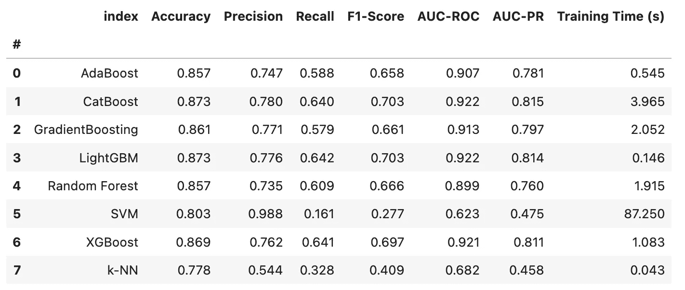
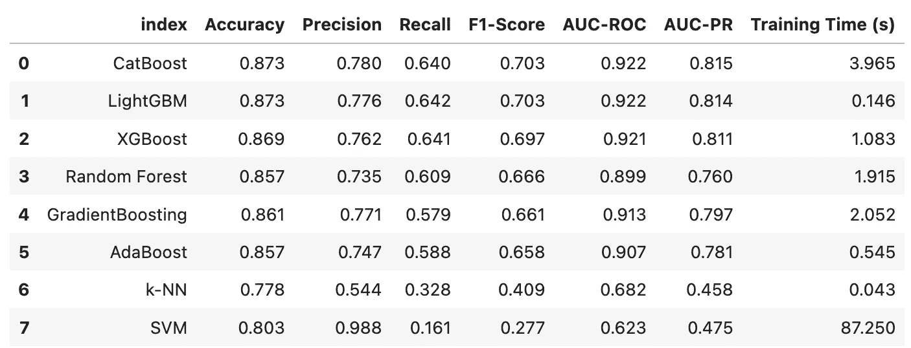

# XGBoost：简介、逐步实现和性能比较

> 原文：[`towardsdatascience.com/xgboost-intro-step-by-step-implementation-and-performance-comparison-6018dfa212f3`](https://towardsdatascience.com/xgboost-intro-step-by-step-implementation-and-performance-comparison-6018dfa212f3)

## 极端梯度提升：快速可靠的回归器和分类器

[](https://medium.com/@fmnobar?source=post_page-----6018dfa212f3--------------------------------)[](https://towardsdatascience.com/?source=post_page-----6018dfa212f3--------------------------------) [Farzad Mahmoodinobar](https://medium.com/@fmnobar?source=post_page-----6018dfa212f3--------------------------------)

·发表于 [Towards Data Science](https://towardsdatascience.com/?source=post_page-----6018dfa212f3--------------------------------) ·12 分钟阅读·2023 年 9 月 29 日

--


图片来源于 [Sam Moghadam Khamseh](https://unsplash.com/@sammoghadamkhamseh?utm_source=unsplash&utm_medium=referral&utm_content=creditCopyText) 于 [Unsplash](https://unsplash.com/photos/baII27W6z7k?utm_source=unsplash&utm_medium=referral&utm_content=creditCopyText)

XGBoost 已成为所有机器学习从业者中最受欢迎的全能回归器和/或分类器之一。如果你问数据科学家在不知道其他信息的情况下，他们会选择哪个模型，很可能他们会选择 XGBoost，因为它可以应用于各种类型的用例——它快速、可靠、多功能且非常容易实现。

今天，我们将从概念上回顾 XGBoost，讲解其实现过程，并将其性能与几种其他模型在分类任务中的表现进行比较。

开始吧！

# 1\. XGBoost — 概念概述

XGBoost 代表极端梯度提升。它是一种梯度提升决策树模型，既可用于监督回归任务，也可用于分类任务。我们使用了几个术语来定义 XGBoost，因此让我们逐一了解它们，以便更好地理解。我将简要概述每个概念，并提供更多细节的链接，供那些对深入讨论感兴趣的读者参考。

+   **监督学习与非监督学习：** 监督学习是使用带标签的数据来训练机器学习（ML）模型。因此，模型可以从我们提供的数据标签中学习。另一方面，非监督学习是当我们的数据没有标签时，模型在没有任何标签的情况下学习数据中的潜在模式。

+   **回归与分类：** 回归机器学习模型用于预测连续输出，而分类模型用于预测离散输出。欲了解更深入的讨论，请参考[这篇文章](https://medium.com/@fmnobar/classification-vs-regression-in-machine-learning-which-one-should-i-use-f6b24d251c46)。

+   **决策树：** 决策树是一种可以用于回归和分类任务的监督学习算法。欲了解更深入的讨论，请参考[这篇文章](https://medium.com/@fmnobar/decision-tree-regression-and-classification-modeling-through-14-practice-questions-notebook-46c2053dbcf9)。

+   **梯度提升：** 这里的想法是将若干个弱学习器（例如模型或算法）结合起来，从而得到一个整体上更强的模型。在 XGBoost 中，若干个弱决策树被组合在一起，形成一个改进的学习器。

现在我们对 XGBoost 有了更多的了解，接下来看看它在实践中的表现！我们将首先介绍一些基础知识，然后开始实施。

# 2. 基础

我们的目标是实现 XGBoost，并将其性能与其他算法进行比较。为此，我们的整体过程包括为分类任务训练多个机器学习模型（因此称这些模型为“分类器”），然后使用一组常用的分类指标来评估这些分类器的性能。为了实现这些步骤，我们需要讨论将用于训练和测试我们模型的数据集、将与 XGBoost 比较的分类器（即模型或算法）以及本练习中使用的评估指标（我们使用这些指标来比较各种模型的性能），这些内容将在本节中介绍。一旦基础知识掌握，我们将实现我们的模型。

## 2.1. 数据集

为了实现和评估 XGBoost 相对于其他分类器的性能，我们将使用来自[加州大学欧文分校机器学习库](https://archive.ics.uci.edu/dataset/2/adult) (CC BY 4.0) 的数据集，该数据集用于预测一个人是否年收入超过 50,000 美元。以下示例所用的文件可以[在这里](https://gist.github.com/fmnobar/992233799dcbd9418f009b0d6c4422ee)下载。

让我们查看数据集的前 5 行，以便对数据的整体情况有个大致了解。

```py
# import
import pandas as pd

# read the file
df_adult = pd.read_csv('adult.data', header=None, names=[
        'age', 'workclass', 'fnlwgt', 'education', 'education-num', 'marital-status',
        'occupation', 'relationship', 'race', 'sex', 'capital-gain', 'capital-loss',
        'hours-per-week', 'native-country', 'income'])

# return top 5 rows of the dataframe
df_adult.head()
```

结果：



数据包括数值和分类值的组合。让我们查看更多关于数据的信息。

```py
df_adult.info()
```

结果：



正如我们之前所看到的，数据是整数（`int64`）和分类值（`object`）的组合，共有 32,561 行，涵盖 15 列（注意列数从 0 开始，所以总列数为 15）。数据类型是决定在模型选择过程中使用什么分类器的重要因素。现在我们对数据集有了更多了解，让我们继续探讨将要训练的模型。

## 2.2\. 模型

我们将在比较中使用总共 8 个机器学习模型。对于本次练习，不需要对每个模型有全面的了解，但我在本节中包含了每个模型的简要描述，如下所示：

1.  **AdaBoost**（自适应提升）是一种集成提升技术，它（类似于其他提升技术）提高了弱分类器的分类性能。它是一种自适应的技术，因为它不断调整弱学习者之间的权重，以获得更好的整体性能。

1.  **CatBoost**（分类提升），顾名思义，旨在处理分类特征，无需预先编码。这在处理具有许多分类特征的数据集时特别有用，正如我们所看到的，我们的数据集也包括一些分类变量，因此在评估结果中请注意这一点。

1.  **GradientBoosting** 是一种简化的梯度提升分类器（因为它的超参数较少，相较于许多其他梯度提升分类器）。这是一个很好的起点，但当我们需要更高级的超参数优化时，我们通常会使用 XGBoost 或 LightGBM，我们将在下面介绍这些内容。

1.  **k-NN**（k-最近邻）简单易于实现，适用于低维数据，但对于大数据集可能计算开销较大。

1.  **LightGBM**（轻量级梯度提升机）是另一种梯度提升模型。与 XGBoost 相比，它在内存使用和计算速度方面更高效，因此适合大数据集或需要更快训练时间的情况。

1.  **随机森林** 是另一种非常流行的集成学习方法，它通过在训练期间构建多个决策树来运作，并输出分类的模式（它也是一个能够进行回归任务的模型）。

1.  **SVM**（支持向量机）是另一种可以用于分类和回归的模型。虽然它在高维空间中有效，但它的速度可能比这里讨论的一些其他梯度提升方法要慢。

1.  **XGBoost**（极端梯度提升），正如前面所讨论的，是一个旨在高效和多功能的梯度提升库，使其适合各种监督任务。

现在我们已经涵盖了将要使用的模型，让我们讨论一下将用于比较模型的指标。

## 2.3\. 评价指标

为了比较我们各种模型的性能，我们需要一个基准或“指标”。由于我们将使用我们的模型进行分类任务，因此我们希望使用相关指标来衡量分类器的性能。我们将从 7 个维度来评估我们的分类器。前 6 个是评估分类任务中常用的指标，第 7 个只是训练分类器所需的时间。一旦看到结果，比较这些分类器的性能速度就会很有趣。

对于本文来说，不需要对我们使用的指标有全面的理解，但如果你想更好地理解这些指标，我们需要首先定义一些术语。在一个二分类目标变量中，目标变量只能是正类（或 1）和负类（或 0），预测有四种可能的结果：

+   **真正例：** 正事件被正确预测。

+   **假阳性：** 负事件被错误预测为正（也称为 I 型错误）。

+   **真阴性：** 负事件被正确预测。

+   **假阴性：** 正事件被错误预测为负（也称为 II 型错误）。

记住上述术语，我们来看看指标。

1.  **准确率**是正确预测的观察值与数据集中总观察值的比例。它是查看模型整体性能的一个好指标，但当数据集包含不平衡类别时，数字可能会具有误导性。它的计算公式如下：`Accuracy = (True Positives + True Negatives) / Total Observations`

1.  **精确度**是正确预测的正类观察值与总预测正类的比例（也称为正预测值）。在一些分类任务中，假阳性的成本非常高，我们会选择高精确度的模型。它的计算公式如下：`Precision = Positive Predictive Value (PPV) = True Positives / (True Positives + False Positives)`

1.  **召回率**（或灵敏度）是正确预测的正类观察值与正类中所有观察值的比例（也称为真正率）。召回率在假阴性成本高的任务中尤为重要。它的计算公式如下：`Recall = Sensitivity = True Positive Rate (TPR) = True Positives / (True Positives + False Negatives)`

1.  **F1-分数**是精确度和召回率的加权平均数，考虑了假阳性和假阴性。在需要考虑精确度和召回率的情况下，我们通常使用 F1-分数来权衡二者之间的折衷。它的计算公式如下：`F1 Score = 2 * (Precision * Recall) / (Precision + Recall)`

1.  **AUC-ROC**（接收者操作特征曲线下面积）表示模型区分正类和负类的能力。这一点不那么直观，所以我们来谈谈数字！ROC 曲线展示了真正率（或我们之前讨论过的召回率）和假正率（即被错误识别为正类的负类比例）之间的权衡。AUC-ROC 为 0.5 表示正类和负类之间没有区分——换句话说，模型没有比随机选择正类和负类更好。大于 0.5 的值表示两个类别之间有一定的区分，1 是完美的区分。简而言之，AUC-ROC 越高，模型表现越好。

1.  **AUC-PR**（精确度-召回率曲线下面积）类似于 AUC-ROC，但专注于正类的性能。在数据集存在类别不平衡的情况下，我们更关注正类，这一点就显得尤为重要。

1.  **训练时间**是训练模型所需的时间，我们在此示例中使用它来查看每个模型的计算效率。在这个例子中，数据集不大，因此训练的计算成本微不足道。在许多商业案例中，我们在训练模型时会面临计算限制，因此这个指标变得更加重要。

基础知识已经讲解完毕，接下来让我们开始实施部分吧！

# 3\. 实施

实施将包括以下步骤：

1.  导入库

1.  数据加载与预处理

1.  训练和评估分类器

1.  结果与讨论

## 3.1\. 导入库

我们将从导入在练习中使用的各种库开始。随意复制和粘贴代码块并跟随操作。

```py
# import libraries
import pandas as pd
import time # this is used to calculate the training time of each model
from sklearn.model_selection import train_test_split
from sklearn.metrics import accuracy_score, precision_score, recall_score, f1_score, roc_auc_score, average_precision_score
from sklearn.preprocessing import LabelEncoder
from sklearn.ensemble import GradientBoostingClassifier, AdaBoostClassifier
import xgboost as xgb
import lightgbm as lgb
from catboost import CatBoostClassifier
from sklearn.ensemble import RandomForestClassifier
from sklearn.svm import SVC
from sklearn.neighbors import KNeighborsClassifier
```

## 3.2\. 数据加载与预处理

既然我们已经导入了所需的库，让我们定义一个函数来读取我们将用于训练分类模型的数据集。我将这一部分封装在一个名为`load_and_preprocess_data`的函数中，该函数读取文件并将其分解为用于训练的特征和目标。我在代码中添加了注释，以便你更容易跟随。

```py
def load_and_preprocess_data(filepath):
    # read the data set into as a dataframe
    data = pd.read_csv(filepath, header=None, names=[
        'age', 'workclass', 'fnlwgt', 'education', 'education-num', 'marital-status',
        'occupation', 'relationship', 'race', 'sex', 'capital-gain', 'capital-loss',
        'hours-per-week', 'native-country', 'income'])

    # initialize a label encoder
    label_encoder = LabelEncoder()

    # encode columns
    for col in data.select_dtypes(include=['object']).columns:
        data[col] = label_encoder.fit_transform(data[col])

    # Separate features as X and target as y
    X = data.drop('income', axis=1)
    y = data['income']

    return X, y
```

## 3.3\. 训练和评估分类器

在这一步中，我们将定义一个函数来训练分类器并评估其性能，当我们提供训练集和测试集时。我们稍后会将数据拆分成训练集和测试集，所以现在不必担心。和以前一样，我在代码中添加了注释以帮助阅读。

```py
def train_and_evaluate_classifier(clf, X_train, y_train, X_test, y_test):
    # starting to track the time so that we can report the total training time
    start_time = time.time()

    # train the classifier
    clf.fit(X_train, y_train)

    # stop tracking time, now that training is completed
    end_time = time.time()

    # calculated how long training took
    elapsed_time = end_time - start_time

    # make predictions using the trained model. this will be used for evaluation of the trained model
    y_pred = clf.predict(X_test)
    y_proba = clf.predict_proba(X_test)[:, 1] if hasattr(clf, 'predict_proba') else None

    # here are the metrics we use for evaluations
    metrics = {
        'Accuracy': accuracy_score(y_test, y_pred),
        'Precision': precision_score(y_test, y_pred),
        'Recall': recall_score(y_test, y_pred),
        'F1-Score': f1_score(y_test, y_pred),
        'AUC-ROC': roc_auc_score(y_test, y_proba) if y_proba is not None else None,
        'AUC-PR': average_precision_score(y_test, y_proba) if y_proba is not None else None,
        'Training Time (s)': elapsed_time
    }

    return metrics
```

## 3.4\. 结果与讨论

最后，我们将所有内容放在一个主函数中，该函数调用之前的函数来读取数据、训练分类器、评估训练好的模型，然后将结果以数据框的形式返回，如下所示：

```py
def main():
    # initialize a dataframe to store the results in
    results_df = pd.DataFrame(columns=['Accuracy', 'Precision', 'Recall', 'F1-Score', 'AUC-ROC', 'AUC-PR', 'Training Time (s)'])

    # load and preprocess the data, using our previously-defined function
    X, y = load_and_preprocess_data('adult.data')

    # split the data into train and test sets
    X_train, X_test, y_train, y_test = train_test_split(X, y, test_size=0.2, random_state=1234)

    # initialize the classifiers
    classifiers = {
        'XGBoost': xgb.XGBClassifier(),
        'Random Forest': RandomForestClassifier(),
        'SVM': SVC(probability=True),
        'k-NN': KNeighborsClassifier(),
        'LightGBM': lgb.LGBMClassifier(),
        'CatBoost': CatBoostClassifier(verbose=0),
        'GradientBoosting': GradientBoostingClassifier(),
        'AdaBoost': AdaBoostClassifier()
    }

    # train and evaluate the trained classifiers
    for name, clf in classifiers.items():
        metrics = train_and_evaluate_classifier(clf, X_train, y_train, X_test, y_test)
        results_df.loc[name] = metrics

    # sort classifiers alphabetically
    results_df.sort_index(inplace=True)

    # add row numbers
    results_df.reset_index(drop=False, inplace=True)
    results_df.index.name = '#'

    return results_df

if __name__ == "__main__":
    df = main()
```

现在所有计算都完成了，让我们来看看结果吧！

```py
# round results to 3 decimal places
df.round(3)
```

结果：



如评估指标部分所讨论的，决定哪种指标最有效取决于项目的目标。为了讨论的方便，我们在这个问题中假设我们同等重视精确度和召回率，因此讨论哪个分类器能提供这两者的平衡度量。因此，我将主要依赖 F1-Score 和 AUC-ROC 作为这个练习中需要关注的两个指标。回顾一下，F1-Score 是精确度和召回率的调和均值（因此是两者的平衡度量），而 AUC-ROC 是接收者操作特征曲线下的面积，它帮助我们理解分类器在区分正负案例方面的表现。

根据上述假设，让我们对结果进行排序，并再次查看评估结果。

```py
# sort results
df.sort_values(by=['F1-Score', 'AUC-ROC', 'Training Time (s)'], ascending=[False, False, True]).reset_index(drop=True).round(3)
```

结果：



结果相当有趣。正如你所见，CatBoost、LightGBM 和 XGBoost 是性能非常接近的前三名模型，这三者都是提升模型。CatBoost 是我们的最佳表现者，F1-Score 比 LightGBM 高一点。一个原因可能是数据集中存在类别变量。XGBoost 是接近第二名的第三名。另一个有趣的观察是每个模型所需的训练时间。我们看到 LightGBM 的表现几乎与 CatBoost 相当，但训练时间却远低于 CatBoost。实际上，LightGBM 的速度比 CatBoost 快了将近 96%。在我们的示例中，训练时间相对微不足道，但在商业和学术环境中经常出现的大型数据集中，我们会更加关注性能水平与训练时间之间的权衡，这可能导致选择 LightGBM 而非 CatBoost。

# 4. 结论

在这篇文章中，我们介绍了 XGBoost，一种在机器学习实践者中广泛使用的强大机器学习算法。然后我们讨论了其他分类器和分类评估指标，这些指标可用于比较不同分类器的性能。最后，我们使用数据集实施了 XGBoost 及其他分类器，并比较和讨论了它们的性能水平和权衡。

# 感谢阅读！

如果你觉得这篇文章有帮助，请[在 Medium 上关注我](https://medium.com/@fmnobar)并订阅以接收我最新的文章！

*(所有图片，除非另有说明，均为作者提供。)*
