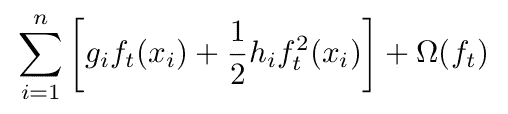

# XGBoost 现在支持 MAE 作为目标函数

> 原文：[`towardsdatascience.com/xgboost-now-support-mae-as-objective-fdbbe18e173`](https://towardsdatascience.com/xgboost-now-support-mae-as-objective-fdbbe18e173)

## 这怎么可能，因为 MAE 是非光滑的？

 [Saupin Guillaume](https://medium.com/@guillaume.saupin?source=post_page-----fdbbe18e173--------------------------------)

·发表于[Towards Data Science](https://towardsdatascience.com/?source=post_page-----fdbbe18e173--------------------------------) ·阅读时间 5 分钟·2023 年 1 月 18 日

--

图片由[Ajay Karpur](https://unsplash.com/@ajaykarpur?utm_source=medium&utm_medium=referral)拍摄，来源于[Unsplash](https://unsplash.com/?utm_source=medium&utm_medium=referral)

在基于梯度提升的模型中，一个关键的参数是目标函数。实际上，决策树的整个构建过程都来源于目标函数及其一阶和二阶导数。

XGBoost 最近引入了一种新类型的目标函数支持：没有二阶导数的非光滑目标函数。其中，著名的**MAE**（均方绝对误差）现在可以在 XGBoost 中原生启用。

在这篇文章中，我们将详细介绍 XGBoost 如何被修改以处理这种类型的目标函数。

# 梯度提升需要光滑的目标函数

XGBoost、LightGBM 和 CatBoost 都有一个共同的限制：它们需要光滑（从数学上讲）的目标函数来计算决策树叶子的最优权重。

对于 XGBoost，这种情况不再成立。XGBoost 最近引入了使用线性搜索支持 MAE，从 1.7.0 版本开始。

如果你愿意详细掌握梯度提升，可以查看我的书：

 [## 实用梯度提升：深入探讨 Python 中的梯度提升

### 这本关于梯度提升方法的书面向希望深入了解这一领域的学生、学者、工程师和数据科学家……](https://amzn.to/3CTMDuH?source=post_page-----fdbbe18e173--------------------------------)

# 梯度和赫西矩阵是梯度提升的核心

基于梯度提升的方法的核心思想是将梯度下降应用于函数空间而不是参数空间。

作为提醒，该方法的核心是在线性化目标函数的基础上进行，并添加一个小的增量，以最小化该目标。

这个小的增量在函数空间中表示，并且它是一个新的二叉节点，由函数 `f_t` 表示。

这个目标将损失函数 `l` 与正则化函数 Ω 结合：

目标函数。公式由作者提供。

一旦线性化，我们得到：

在 ŷ[t-1] 附近线性化的目标函数。公式由作者提供。

其中：

一阶和二阶导数。公式由作者提供。

最小化这个线性化目标函数归结为减少常数部分，即：

目标的变量部分需要最小化。公式由作者提供。

由于模型 `f_t` 的新阶段是一个二叉决策节点，将生成两个值（其叶子）：`w_left` 和 `w_right`，因此可以将上述和重新组织如下：

重新组织线性化目标。公式由作者提供。

在这一阶段，最小化线性化目标仅涉及找到最佳权重 `w_left` 和 `w_right`。由于它们都涉及一个简单的二阶多项式，解是著名的 `-b/2a` 表达式，其中 `b` 是 `G`，`a` 是 `1/2H`，因此对于左节点，我们得到

左侧最佳权重的公式。公式由作者提供。

完全相同的公式适用于右侧权重。

注意正则化参数 λ，它是一个 L2 正则化项，与权重的平方成正比。

# MAE 没有二阶导数

**平均绝对误差** 的问题在于它的二阶导数为零，因此 `H` 为零。

## 正则化

一种可能的解决方案是对该函数进行正则化。这意味着用一个至少二阶可导的函数替代这个公式。请参见下面的文章，展示了如何使用 `logcosh` 实现：

 ## XGBoost 的置信区间

### 构建一个正则化的分位回归目标，以获得不需要超参数调优的置信区间

towardsdatascience.com

## 线搜索

另一种选择，即 XGBoost 自 1.7.0 版本发布以来最近引入的方法，是使用一种迭代方法来找到每个节点的最佳权重。

为此，目前的 XGBoost 实现使用了一种技巧：

+   首先，像往常一样计算叶子值，只需将二阶导数强制为 1.0

+   然后，一旦整个树构建完成，XGBoost 使用 α-分位数更新叶子值

如果你想了解如何实现（并且不怕现代 C++），详细信息可以在[这里](https://github.com/dmlc/xgboost/pull/7812)找到。关注`UpdateTreeLeaf`，更具体地说是`UpdateTreeLeafHost`方法。

## 如何使用它

很简单：只需选择一个版本大于 1.7.0 的 XGBoost，并使用 `objective: mae` 作为参数。

[`www.buymeacoffee.com/guillaumes0`](https://www.buymeacoffee.com/guillaumes0)

# 结论

XGBoost 引入了一种新的方法来处理非平滑目标，如 MAE，这不需要对函数进行正则化。

MAE 是一个非常方便的指标，因为它容易理解。此外，它不像 MSE 那样过度惩罚大错误。这在使用同一模型预测大值和小值时非常有用。

能够使用非平滑目标函数非常吸引人，因为它不仅避免了对函数进行近似的需求，还为其他非平滑目标函数（如 MAPE）打开了大门。

显然，这是一个值得尝试并关注的新特性。

更多关于梯度提升、XGBoost、LightGBM 和 CaBoost 的内容，请参见我的书：

 [## 实用梯度提升：深入探讨 Python 中的梯度提升

### 本书关于梯度提升方法，旨在为希望深入了解梯度提升的学生、学者、工程师和数据科学家提供帮助…](https://amzn.to/3CTMDuH?source=post_page-----fdbbe18e173--------------------------------)
