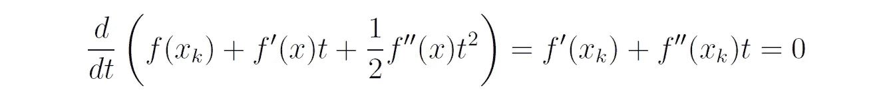

# XGBoost: 权威指南（第一部分）

> 原文：[`towardsdatascience.com/xgboost-the-definitive-guide-part-1-cc24d2dcd87a`](https://towardsdatascience.com/xgboost-the-definitive-guide-part-1-cc24d2dcd87a)

## 对流行的 XGBoost 算法进行逐步推导，包括详细的数值示例。

 [Dr. Roi Yehoshua](https://medium.com/@roiyeho?source=post_page-----cc24d2dcd87a--------------------------------)

·发表于 [Towards Data Science](https://towardsdatascience.com/?source=post_page-----cc24d2dcd87a--------------------------------) ·15 min read·2023 年 8 月 9 日

--

图片由 [Sam Battaglieri](https://unsplash.com/@st_b?utm_source=unsplash&utm_medium=referral&utm_content=creditCopyText) 提供，来源于 [Unsplash](https://unsplash.com/photos/_PXtCCQ4Dj0?utm_source=unsplash&utm_medium=referral&utm_content=creditCopyText)

XGBoost（极端梯度提升的简称）是一个开源库，提供了梯度提升决策树的优化和可扩展实现。它结合了各种软件和硬件优化技术，使其能够处理大量数据。

最初由 Tianqi Chen 和 Carlos Guestrin 于 2016 年开发为研究项目[1]，XGBoost 已经成为处理结构化（表格）数据的监督学习任务的首选解决方案。它在许多标准回归和分类任务中提供了最先进的结果，许多 Kaggle 竞赛获胜者将 XGBoost 作为他们获胜解决方案的一部分。

尽管使用深度神经网络对表格数据取得了显著进展，但它们在许多标准基准测试中仍被 XGBoost 和其他基于树的模型超越[2, 3]。此外，XGBoost 所需的调优比深度模型少得多。

XGBoost 相对于其他梯度提升算法的主要创新包括：

1.  聪明的决策树正则化。

1.  使用二阶近似优化目标（牛顿提升）。

1.  高效计算的加权分位数草图过程。

1.  处理稀疏数据的新颖树学习算法。

1.  支持数据的并行和分布式处理。

1.  针对外部树学习的缓存感知块结构。

在本系列文章中，我们将深入探讨 XGBoost，包括算法的数学细节、从零开始用 Python 实现算法、XGBoost 库的概述以及如何在实际中使用它。

在本系列的第一篇文章中，我们将一步步推导 XGBoost 算法，提供算法的伪代码实现，然后在一个玩具数据集上展示其工作原理。

本文中对算法的描述基于 XGBoost 的原始论文 [1] 和 XGBoost 库的官方文档（[`xgboost.readthedocs.io/`](https://xgboost.readthedocs.io/en/stable/)）。不过，本文在以下几个方面超越了现有的文档：

+   详细解释了数学推导的每一步。理解算法的数学细节将帮助你掌握 XGBoost 的各种超参数的含义（它们的数量相当多）以及如何在实践中调整它们。

+   提供算法的完整伪代码（[1]中的伪代码仅以非常简洁的方式描述了算法的具体部分）。

+   详细讲解将 XGBoost 应用到玩具数据集上的数值示例。

本文假设你已经对梯度提升有所了解。如果没有，请查看以下文章：

 ## 从理论到实践的梯度提升（第一部分）

### 理解流行的梯度提升算法背后的数学原理，以及如何在实际中使用它

[towardsdatascience.com

现在，让我们深入了解吧！

# XGBoost 算法

回顾一下，在[监督学习](https://medium.com/@roiyeho/introduction-to-supervised-machine-learning-313730eb5aa2)问题中，我们会得到一个包含 *n* 个标记样本的训练集：*D* = {(**x**₁, *y*₁), (**x**₂, *y*₂), … , (**x**ₙ, *y*ₙ*)}，其中 **x**ᵢ 是一个 *m* 维向量，包含样本 *i* 的特征，而 *yᵢ* 是该样本的标签。我们的目标是构建一个预测结果尽可能接近真实标签的模型。

类似于梯度树提升，XGBoost 构建了一个回归树的集成，这个集成由 *K* 个加性函数组成：

其中 *K* 是树的数量，*F* 是所有可能的回归树函数的集合。请注意，我们在这里使用 *f*(**x**) 来表示基础模型的假设，而不是我们通常使用的 *h*(**x**)，因为字母 *h* 稍后将用于表示另一个实体（损失函数的 Hessian）。

给定一个损失函数 *L*(*y*, *F*(**x**))，它衡量真实标签 *y* 和集成预测 *F*(**x**) 之间的差异，XGBoost 旨在找到一个在训练集上最小化损失的集成模型，同时避免过于复杂。为此，它将以下 *正则化* 成本函数定义为模型的目标函数：

正则化成本函数

其中 *ω*(*fₖ*) 是树 *fₖ* 的复杂度，这将在后续详细定义。类似于[岭回归](https://medium.com/@roiyeho/regularization-19b1879415a1)，该成本函数由两部分组成：模型在训练集上的总损失和一个对基树复杂度进行惩罚的正则化项。

请注意，在 XGBoost 中，正则化是树学习目标的一个组成部分，而不是像其他树模型中那样通过限制最大树深度或最大叶子数等外部启发式方法来施加的。

## 加性训练

由于目标函数 *J* 包含作为参数的函数（回归树函数），它不能使用传统的优化方法如梯度下降进行优化。相反，模型以贪婪的逐步方式进行训练，每次添加一棵新树。

正式来说，让 *Fₖ* 表示第 *k-* 次迭代时的集成模型：

在这一迭代中，我们将一个树 *fₖ* 加入到之前的集成模型中，该树最小化以下目标：

即，我们希望找到一棵树 *fₖ*，它可以降低整体训练损失，但同时也不过于复杂（具有较低复杂度 *ω*(*fₖ*)）。

## 牛顿提升

对于任意损失函数 *L*，找到最佳树 *fₖ* 是计算上不可行的，因为这需要枚举所有可能的树并选择最佳的一棵。相反，我们使用一种迭代优化方法：在每次提升迭代中，我们选择一棵树 *fₖ*，使我们更接近最小成本。

在原始（非极端）梯度提升算法中，函数 *fₖ* 是选择为指向损失函数相对于先前集成模型预测的负梯度方向的。这使得优化过程在函数空间中如同梯度下降（因此称为功能梯度下降）。

XGBoost 使用类似的思想，但它不是在函数空间中进行梯度下降（即使用一阶近似），而是在函数空间中使用[牛顿-拉夫森](https://en.wikipedia.org/wiki/Newton%27s_method) 方法（即使用二阶近似）。当目标函数的二阶导数已知且易于计算时，牛顿法通常会更快地收敛到最小值（对于 XGBoost 的目标函数，当使用常见的损失函数如平方损失或对数损失时，这一点是成立的）。

作为提醒，牛顿方法尝试通过构建从初始猜测*x*₀ ∈ *R*的序列{*xₖ*}来寻找二次可微函数*f*：*R* → *R*的最小值。该序列是由*f*在*xₖ*附近的二阶泰勒近似构成的：

序列中的下一个元素*xₖ*₊₁被选择为最小化此方程右侧写出的二次扩展。我们可以通过对步长*t*取导数并设置为 0 来找到该扩展的最小值：

因此，最小值在以下情况下实现：

因此，牛顿方法执行以下迭代：

该序列保证以*二次*速度收敛到最小值**x**，前提是*f*是一个强凸函数，并且*x*₀足够接近**x**：

牛顿方法（红色）利用曲率信息（第二导数）比梯度下降（绿色）更直接地达到最小值。图像由 Oleg Alexandrov 制作并发布于公共领域（[`en.wikipedia.org/wiki/Newton%27s_method_in_optimization#/media/File:Newton_optimization_vs_grad_descent.svg`](https://en.wikipedia.org/wiki/Newton%27s_method_in_optimization#/media/File:Newton_optimization_vs_grad_descent.svg)）

回到 XGBoost，我们首先写出给定数据点**x**ᵢ附近的损失函数的二阶泰勒展开：

在这里，*gᵢ*是损失函数的第一导数（梯度），*hᵢ*是损失函数的第二导数（Hessian），都与前一个集成的预测值**x**ᵢ有关：

将此近似值代入我们在迭代*k*时的目标函数中得到：

在去除常数项后，我们得到以下简化目标：

我们的目标是找到一个树*fₖ*（**x**）（我们的“步长”），使其最小化这个目标函数。注意，该函数仅依赖于*gᵢ*和*hᵢ*，这使得 XGBoost 能够支持任何二次可微的自定义损失函数。

## 树复杂度的定义

既然我们引入了训练步骤，我们需要定义树的复杂度度量。为此，我们首先写出回归树计算的函数*f*（**x**）的更明确表达式。

设 *T* 为树中的叶子数量，**w** = (*w*₁, …, *wₜ*) ∈ *Rᵗ* 是叶节点上的分数（或权重）向量，*q*(**x**): *Rᵐ* → {1, 2, …, *T*} 是一个将每个样本**x**（一个*m*维向量）分配到其对应叶子索引的函数（根据树节点中的决策规则）。那么我们可以将 *f*(**x**) 表示为：

也就是说，分配给样本**x**的输出值是该样本通过树映射到的叶节点的权重。

我们现在定义树的复杂度如下：

也就是说，树的复杂度是其叶子数量的函数（*γT*，其中 *γ* 是一个超参数），以及叶子权重的平方和乘以另一个超参数 *λ*。增加 *γ* 倾向于创建较小的树，而增加 *λ* 则鼓励给叶子分配较小的权重，这反过来减少了树对减少损失函数的贡献（类似于梯度提升中的收缩因子）。

使用这个树复杂度的定义，我们现在可以将第 *k* 步的目标函数重写如下：

其中 *Iⱼ* = {*i*|*q*(**x***ᵢ*) = *j*} 是分配给 *j* -th 叶子的样本的索引集合。注意在方程的第二行中我们将求和的索引从 *i* 改为 *j*，因为同一叶节点上的所有样本得到相同的权重。

我们可以通过定义进一步简化目标函数：

*Gⱼ* 是关于叶子*j* 的样本的损失函数梯度之和，*Hⱼ* 是关于同一组样本的损失函数的 Hessian 矩阵之和。

我们现在可以写出：

我们的目标是找到使这个成本函数最小化的叶子权重。为此，我们对每个权重 *wⱼ* 求 *Jₖ* 的偏导数：

将这个导数设置为 0，给我们叶子* wⱼ* 的最优权重：

将最优权重代入目标函数中，给我们这个树可以获得的最佳目标减少量：

## 学习树结构

现在我们知道如何衡量给定树的质量，从理论上讲，我们可以枚举所有可能的树并选择最佳的一棵。实际上，这是不可行的。相反，我们以贪婪的自顶向下方式构建回归树，类似于标准决策树的构建方式。

在树的每个节点中，我们通过计算从该分割中可以获得的成本函数 *Jₖ* 的减少量来评估所有可能的分割。

正式地，设*Iₗ*和*Iᵣ*分别为分裂后左子节点和右子节点的样本集合，*I* = *Iₗ* ∪ *Iᵣ*为父节点的样本集合。则子节点中的梯度和 Hessian 的总和为：

父节点中的梯度和 Hessian 的总和为：

因此，分裂后的成本减少为：

我们使用这个公式来评估所有的分裂候选，然后选择增益（成本减少最高）的分裂。如果最佳分裂获得的增益小于 0，即成本减少小于*γ*，那么我们选择不对父节点进行分裂（它将成为树中的一个叶子节点）。

请注意，每个叶子节点对增益的贡献的计算公式与叶子节点的最优权重公式非常相似，只是我们没有对分子中的梯度总和进行平方处理。

# 伪代码中的完整算法

以下伪代码展示了 XGBoost 算法的全部风采：

算法使用一个名为 Build-Tree 的辅助函数来构建集合中的下一个回归树：

该函数使用了另一个辅助函数 Find-Best-Split，它评估给定节点的所有可能分裂，并返回具有最高增益的分裂（在原始 XGBoost 论文中称为**精确贪婪算法**）。最佳分裂被返回为一个元组，其中包含了分配到左子节点和右子节点的样本子集以及它们梯度和 Hessian 的总和。该函数的伪代码如下所示：

作为练习，尝试用你喜欢的编程语言实现该算法（在本系列的[下一篇文章](https://medium.com/towards-data-science/xgboost-the-definitive-guide-part-2-c38ef02f74d0)中提供了 Python 实现）。

在接下来的部分，我们将推导不同类型问题的损失函数的梯度和 Hessian 的更明确公式。

# XGBoost 回归

在回归问题中，最常用的损失函数是平方损失：

相对于前一个集合的预测值，其一阶导数为：

而其二阶导数为：

因此，在这种情况下，叶子节点*j*的最优输出值为：

该叶子节点对损失减少的贡献为：

# XGBoost 分类

在二分类中，我们使用对数损失作为损失函数：

其中 pi 是之前预测的概率：

我们已经在[梯度提升](https://medium.com/towards-data-science/gradient-boosting-from-theory-to-practice-part-1-940b2c9d8050)的文章中找到了对数损失的一阶和二阶导数（参见“分类的梯度树提升”部分）：

因此，叶子* j *的最佳输出值为：

请注意，除了λ之外，这与我们在梯度提升中用于找到叶子输出值的公式相同。

这个叶子对损失减少的贡献是：

# 在玩具数据集上的演示

为了说明，我们将使用与经典梯度提升算法相同的数据集：

数据集中的目标是预测客户是否会购买给定的产品，基于三个属性：客户的年龄、收入水平（低、中或高）和教育水平（高中或大学）。

为了解决这个问题，我们将构建一个最大深度为 2 的 XGBoost 树集，并将学习率设置为*η* = 0.5。为了简化示例，正则化参数将设置为 0（*λ* = 0 和 *γ* = 0）。

首先，我们用一个常数值初始化模型，该值是正类的对数几率：

接下来，我们计算训练集中样本的梯度和 Hessians：

我们现在构建第一个 XGBoost 树。我们从找到根节点的最佳分裂开始。根节点的梯度和 Hessians 的和为：

接下来，我们计算每个特征中每个可能分裂点的增益。我们从两个分类属性开始：

对于年龄属性，我们首先根据年龄值对梯度和 Hessians 进行排序：

年龄（排序后）= [22, 25, 28, 30, 35, 40]

梯度（排序后）= [-0.333, -0.333, 0.667, -0.333, 0.667, -0.333]

Hessians（排序后）= [0.222, 0.222, 0.222, 0.222, 0.222, 0.222]

我们现在考虑两个连续年龄之间的每一个中点作为候选分裂点：

增益最高的分裂点是年龄 < 26.5。因此，树的第一层如下所示：

左子节点的两个样本的梯度和 Hessians 完全相同，因此不需要再分裂。

我们现在需要找到右子节点的最佳拆分。该节点（样本 2、4、5、6）上的梯度和 Hessian 的总和为 *G* = 0.666 和 *H* = 0.888（如节点内所示）。我们考虑所有可能的拆分方式：

在这种情况下，我们有多个候选拆分，这些拆分能带来最大的增益（1.5）。我们可以任意选择拆分条件为 Income = Medium。得到的树是：

接下来，我们计算叶节点的最佳输出值（权重）。最左边叶节点的权重是：

类似地，另外两个叶节点的权重是：

因此，我们从第一棵 XGBoost 树中得到以下预测：

我们现在通过学习率来缩放这些预测值，并将其添加到前一迭代的预测中。然后我们使用新的预测值计算下一次迭代的梯度和 Hessian：

我们现在构建第二棵 XGBoost 树。按照与前一个迭代相同的过程，我们得到以下树（请确认这确实是正确的树！）：

现在我们通过学习率来缩放第二棵树的预测值，并将其添加到之前的集成预测中：

我们可以看到经过三次迭代后，我们的集成模型正确地对训练集中的所有样本进行了分类！

细心的读者可能会注意到，得到的集成与我们使用经典的非极端梯度提升算法得到的集成完全相同。这并不令人惊讶，因为在分类问题中，经典算法也使用二阶近似来优化对数损失函数。XGBoost 相对于经典算法的优势在于，它允许我们将正则化系数作为目标函数的一部分（在这个例子中我们没有利用这一点）。

# 最终说明

除非另有说明，所有图片均由作者提供。

感谢阅读！

## 参考文献

[1] Chen, T., & Guestrin, C. (2016). XGBoost：一个可扩展的树提升系统。*第 22 届 ACM SIGKDD 国际知识发现与数据挖掘大会论文集*，785–794。

[2] Grinsztajn, L., Oyallon, E., & Varoquaux, G. (2022). 为什么基于树的模型在典型的表格数据上仍然优于深度学习？ *神经信息处理系统进展*，35：507–520。

[3] Shwartz-Ziv, R., & Armon, A. (2022). 表格数据：深度学习并非你所需的一切。*信息融合*，81：84–90。
