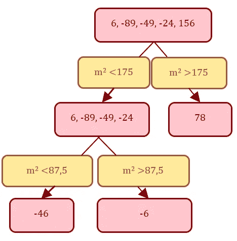

# XGBoost：理论与超参数调优

> 原文：[`towardsdatascience.com/xgboost-theory-and-hyperparameter-tuning-bc4068aba95e`](https://towardsdatascience.com/xgboost-theory-and-hyperparameter-tuning-bc4068aba95e)

## 一个包含 Python 示例的完整指南

 [Jorge Martín Lasaosa](https://jorgemartinlasaosa.medium.com/?source=post_page-----bc4068aba95e--------------------------------)

·发表于 [Towards Data Science](https://towardsdatascience.com/?source=post_page-----bc4068aba95e--------------------------------) ·17 分钟阅读·2023 年 2 月 16 日

--

图片来源：[Joanne Francis](https://unsplash.com/@nipawinnews?utm_source=medium&utm_medium=referral) 在 [Unsplash](https://unsplash.com/?utm_source=medium&utm_medium=referral)

# 介绍

几个月后，我将从事数据科学工作满 3 年。我知道这还不算长的职业生涯，但结合我的学术经验，我已经能够参与多个不同行业的机器学习项目（能源、客户体验等）。所有这些项目都使用了 *表格数据*，即结构化数据（按行和列组织）。相比之下，使用图像或文本等非结构化数据的项目则更多地与计算机视觉或自然语言处理（NLP）等机器学习领域相关。

根据我的经验，XGBoost *通常* 在 *表格数据* 项目中表现良好。尽管“无免费午餐定理” [1] 表明当将两种算法的表现平均到所有可能的问题上时，它们是等效的，但在 Bojan Tunguz 的 Twitter [2] 上，你可以阅读到与其他专业人士的频繁讨论，关于为何基于树的模型（尤其是 XGBoost）通常是解决 *表格数据* 项目最佳候选者，即便随着对深度学习技术应用于这种数据的研究不断增加。 [3]

而且，看到一位 Kaggle 大师 [4] 玩笑说自己是 XGBoost 的宣传者也挺有趣的。

Bojan Tunguz 的置顶推文。

尽管 XGBoost 取得了巨大的成功，但在过去当我想从模型中获得最佳性能时，我没有找到集中所有必要知识的完整指南。虽然有很多理论和实践上的解释，我将在阅读中参考这些内容，但我没有找到任何完整的指南提供整体视角。这就是我决定写这篇文章的原因。此外，我将把我在这里收集到的内容应用到一个著名的 Kaggle 比赛中，[房价预测 — 高级回归技术](https://www.kaggle.com/competitions/house-prices-advanced-regression-techniques)。

文章的其余部分分为两个部分：

+   **理论：** 在简短的介绍后，我们将深入原始论文，以理解这个伟大模型背后的理论。接着，简要的视觉解释将帮助我们更好地理解理论。

+   **实践：** 在概述 XGBoost 参数后，我将提供一个逐步指南来调整超参数。

> 除非另有说明，否则所有图片均由作者提供。

# 理论

**XGBoost** 代表 e**X**treme **G**radient **Boos**ting，由 Tianqi Chen 和 Carlos Guestrin 于 2016 年正式发布 [5]。在发布之前，它已经被确立为 Kaggle 比赛中最优秀的算法之一。

尽管深度学习在计算机视觉和自然语言处理等领域取得了巨大成功，XGBoost 和其他基于树的模型（CatBoost [6] 或 LightGBM [7]）仍然是预测*表格数据* [8] 的最佳选项之一。所有这些基于树的算法都基于梯度提升，如果你想了解这种技术是如何工作的，我建议你查看我关于树集成的文章。[9]

[## Tree Ensembles: Bagging, Boosting and Gradient Boosting](https://towardsdatascience.com/tree-ensembles-theory-and-practice-1cf9eb27781?source=post_page-----bc4068aba95e--------------------------------)

### 理论与实践详细解释

[towardsdatascience.com](https://towardsdatascience.com/tree-ensembles-theory-and-practice-1cf9eb27781?source=post_page-----bc4068aba95e--------------------------------)

你想知道 XGBoost 有什么特别之处吗？我将通过两个不同的子部分来解释：**原始论文**和**视觉解释**。让我们开始吧！

## 原始论文

如前所述，XGBoost 基于梯度提升，因此多个树是依次在前一棵树的残差上进行训练的。然而，有一些**小的改进**使得 XGBoost 能够通过**防止过拟合**超越现有的树集成模型：

+   **正则化学习目标**（类似于*RGF* [10]）。在梯度提升中，每棵树都以最佳方式训练，以实现学习目标：减少预测与目标之间的差异。在 XGBoost 中，这个学习目标被一个正则化学习目标取代，该目标在差异计算中添加了一个正则化项。用简单的话说，这个项*增加*了每棵树学习时的噪音，并旨在减少预测对单个观察值的敏感性。如果将正则化项设置为零，则目标会回到传统的梯度提升。

+   **收缩**（借鉴自*随机森林* [11]）。一种限制每棵训练树在最终预测中权重的技术。因此，每棵树的影响被减少，未来的树有更多空间来改善预测。这类似于学习率（在参数部分也如此指定）。

+   **列子采样**（借鉴自*随机森林* [11]）。它允许为每棵树、树级别和/或树节点随机选择一个特征子样本。因此，对第一棵树/级别/节点非常重要的特征，可能在第二棵树中不可用，从而推动使用其他特征。

树学习中的最大问题之一是找到最佳分裂。如果有一个从 0 到 100 变化的连续特征，那么应该使用什么值来进行分裂？20？32.5？70？为了找到最佳分裂，XGBoost 可以应用不同的算法：

+   **精确贪心算法**。这是旧版树提升实现中最常用的算法，它包括测试所有特征的所有可能分裂。对连续特征进行这种操作计算量大，因此随着数据样本的增加，需要更多时间。

+   **加权分位数草图算法**：根据特征分布的百分位数提出候选分裂点。该算法将连续特征映射到这些候选点划分的桶中，聚合统计数据，并根据聚合统计数据在提议中找到最佳解决方案。此外，它可以处理*加权*数据，并在每个树节点中包含一个默认方向，使算法能够识别数据中的稀疏模式。稀疏性可能由于缺失值的存在、频繁的零条目或特征工程的后果（例如使用独热编码）造成。

此外，该算法设计用于高效地与系统交互。无需详细说明，我可以指出数据存储在内存中的称为块的单元中，以帮助算法对数据进行排序。这种技术允许并行化。此外，在大数据集的情况下，定义了缓存感知访问，以避免在某些计算无法适应 CPU 缓存时搜索分裂的速度变慢。最后，它使用块压缩和块碎片化来处理不适合主内存的数据。

## 视觉解释

本节高度受到[Josh Starmer 的 YouTube 频道](https://www.youtube.com/channel/UCtYLUTtgS3k1Fg4y5tAhLbw)和 Shreya Rao 的文章的启发。我的目标是通过一个小示例解释 XGBoost 的工作原理，并将其与之前看到的论文理论联系起来。为此，让我们按照以下步骤进行。

***步骤 1：创建合成数据***

使用了一个关于房价的小型合成数据集。它有两个特征（*平方米数*和*是否有车库？*）和一个目标（*价格*）。

用于视觉解释的关于房价的合成数据。

***步骤 2：计算残差***

如你所见，残差已经在上表中计算出来。计算方法很简单，你只需将前一个树的预测价格从实际价格中减去（记住，XGBoost 会顺序训练多个树）。然而，这还是第一棵树，所以我们没有预测价格。在这种情况下，计算了价格的平均值。

计算第一个残差。

***步骤 3：构建 XGBoost 的第一棵树***

第一棵树将用所有的残差作为目标进行训练。因此，首先需要计算所有残差的**相似性得分**。这是树分裂旨在增加的得分。

计算第一个树的相似性得分。

你看到那个 lambda (λ) 字符了吗？如论文理论部分所述，这是一个**正则化项**，通过*添加*噪声来帮助防止过拟合。因此，XGBoost 的学习目标（增强相似性得分）实际上是一个正则化学习目标。XGBoost 中正则化项的默认值是 1。现在，让我们看看特征*是否有车库？*对相似性得分和增益的影响。

计算了带有*车库*特征的分裂的相似性得分。

车库分裂的最终增益。

一旦计算了相似性得分，*是否有车库？*的特征增益为 7448.58。如果最终增益为正，则这是一个好的分裂，否则不是。由于它是正的，我们可以得出这是一个好的分裂。

对于像*平方米*这样的连续特征，过程略有不同。首先，我们需要找到连续特征的最佳分裂。为此，将使用论文理论部分中解释的**精确贪婪算法**。也就是说，将测试每一个可能的分裂。

对特征进行排序并找到所有可能的分裂（贪婪）。

如上图所示的排序在数据集很大的时候可能会计算成本高。正如论文理论部分评论的那样，XGBoost 使用**块单元**来允许并行化，并帮助解决这个问题。同时，请记住，XGBoost 可以使用**加权分位数草图算法**根据特征分布的百分位数来提议候选分裂点。这里不会详细解释，但这是 XGBoost 的主要优势之一。话虽如此，我们将计算每个可能分裂的相似度得分和增益。

每个平方米分裂的增益计算。

*平方米*特征通过 175 的分裂具有最大的增益（甚至比*是否有车库？*的分裂还要大），因此它应该是第一个分裂。右叶子中只剩下一个残差（156）。所以我们来关注左叶子，寻找另一个分裂。经过所有计算，最佳的分裂再次使用*平方米*特征。

最佳第二次分裂在车库特征上。

经过新计算，右叶子可以再次分裂。

完成所有可能分裂的最终树。

***步骤 4：剪枝树***

为了避免过拟合，还有一个叫做树剪枝的过程是 XGBoost 执行的。从下往上验证每个增益。怎么做？如果一个叫做**gamma**（γ）的 XGBoost 参数大于增益，则会移除分裂。XGBoost 中γ的默认值是 0，但设置为 200 以表示移除分裂的情况。为什么？因为在这种情况下，200（γ）大于最后的增益（198）。因此，树被剪枝，最终结果是：

剪枝后的第一棵树的最终版本。

***步骤 5：使用树进行预测***

为了进行预测，第一步是每个最终叶子中都有一个单一的值（输出值）。为此，我们使用以下公式：

计算输出值（每个叶子的值）。

结果是：

每个叶子都有一个输出值的第一棵树。

最终，最终叶子的输出值可以用下面显示的公式进行新预测。*i* 是我们想要预测的观察值，*prediction_t0* 是第一次预测（观察价格的均值），*ɛ* 是学习率，*leaf_i* 是按照树的规则得到的观察值 *i* 的值。

请注意，学习率（*ɛ*），其默认值为 0.3，是**收缩**理论部分的解释。话虽如此，让我们预测所有观察值：

每个值的预测。

现在，我们使用预测来计算新的残差（Residuals_1）：

第一棵树的残差。

正如我们在上面看到的，每个残差（除了第一个）都更接近零。这意味着第一棵树提供的信息改善了第一次预测（均值）。下一步是创建另一棵树，使残差减少的方向再进一步。

***步骤 6：训练新树***

如果我们想创建一棵新树，唯一需要做的就是用新的残差（Residuals_1）作为目标重新执行步骤 3-5。然后，最终预测将是：

使用两棵树计算最终预测。

XGBoost 可以通过这些步骤顺序训练树。就我个人而言，我发现视觉解释是理解模型及其理论的有效方法。我希望这对你也有帮助。不过，现在是时候进入实际部分了。

# 实践

首先，我想强调的是，尽管我不是 XGBoost 实践方面的专家，但我使用了一些证明成功的技术。因此，我认为我可以提供一个简要指南，帮助你调整超参数。

为了实现这一目标，必须将实践分为两个子部分。第一个部分将专注于定义算法的**超参数**并将其编译成一个简明的备忘单。第二个子部分称为**实际操作**，将提供一个逐步指南，带你完成 XGBoost 的训练过程。

## 超参数

所有在这里解释的信息都可以在官方 XGBoost 文档 [12] 中找到。一个通用的参数被称为**booster**。正如我在之前的文章 [9] 中解释的那样，梯度提升是一种不限于使用决策树的技术，它可以应用于任何模型。这就是为什么 XGBoost 接受**booster**参数的三种值：

+   *gbtree*：使用决策树的梯度提升（默认值）

+   *dart*：一种使用 Vinayak 和 Gilad-Bachrach（2015）[13] 提出的将深度神经网络社区中的 dropout 技术添加到提升树中的方法的决策树梯度提升。

+   *gblinear*：使用线性函数的梯度提升。

虽然*gblinear*是捕捉预测变量和结果之间线性关系的最佳选择，但基于决策树的提升器（*gbtree*和*dart*）在捕捉非线性关系方面要好得多。**由于*gbtree*是最常用的值，本文余下部分将使用它**。如果你有兴趣使用其他方法，请查看文档[12]，因为根据你的选择，参数会有所不同。

一旦我们将*gbtree*设置为**booster**，我们可以调整多个参数以获得最佳模型。这里解释了最重要的几个：

+   **eta**（又名学习率）：在视觉解释部分显示为***ɛ***，它限制每棵训练树在最终预测中的权重，以使提升过程更具保守性。

+   **gamma:** 在视觉解释部分显示为**γ**，它标记了在树的叶节点上进行进一步划分所需的最小增益。

+   **max_depth:** 设置树的最大深度。

+   **n_estimators**: 训练的树的数量。

+   **min_child_weight:** 设置进行拆分时子节点所需的最小实例权重（残差之和）。

+   **subsample:** 设置在训练每棵树之前获得的样本百分比（随机）。

+   **colsample_by[]:** 一组用于列抽样的参数。抽样可以在每棵树（**colsample_bytree**）、每棵树中达到的深度级别（**colsample_bylevel**）或每次评估新拆分时（**colsample_bynode**）进行。注意，这些参数可以同时工作：如果每个参数的值为 0.5，并且你有 32 列，那么每个拆分将使用 4 列（32/ 2³）。

+   **lambda**（L2 正则化）：在视觉解释中显示为**λ**。它通过增加分母平滑地减少输出值（视觉解释中的第 5 步）。[14]

+   **alpha**（L1 正则化）：它通过强制输出值为 0 来减少输出值并促进稀疏性。[14]

+   **tree_method:** 设置树用于查找拆分的构建算法。正如论文理论部分所讨论的，可以使用精确或近似算法。在实践中，这个参数有 5 个可能的值：*auto* 让启发式算法从下列选项中选择最快的选项，*exact* 应用枚举所有拆分候选项的精确贪婪算法，*approx* 应用使用分位数草图和梯度直方图的近似贪婪算法，*hist* 使用近似算法的直方图优化版本，*gpu_hist* 使用*hist*的 GPU 实现。

+   **scale_pos_weight**: 它控制正负权重的平衡，这对于类别不平衡的情况非常有用。一个典型的值是*sum(negative instances) / sum(positive instances)*。

+   **max_leaves**: 设置仅在未选择**tree_method**参数的*exact*值时要添加的最大节点数。

还有更多参数需要调整：**updater**、**refresh_leaf**、**process_type**、**grow_policy**、**max_bin**、**predictor**、**num_parallel_tree**、**monotone_constraints**或**interaction_constraints**。然而，前面的参数已经足以充分发挥 XGBoost 模型的作用，因此这些参数得到了说明。

话虽如此，调整解释的特征如何影响模型？下面显示的**备忘单**帮助我们理解以不同方式调整每个参数的效果。此外，它展示了特定调整如何影响结果，无论是理解方差和偏差如何改善还是恶化。

主要参数及其效果的备忘单。

> **免责声明**：减少或增加值意味着从特定特征的完美偏差-方差平衡出发，而不是从默认值开始。此外，参数之间有很多相互作用，因此减少某些值并增加其他值可能会导致与表中解释的不同结果。

## 实践实施

对于实施，我们将使用两个资源。首先，我们将使用 Kaggle 竞赛中**数据**，该竞赛名为房价[15]。其次，由于本文的重点是 XGBoost，而不是机器学习项目中的其他任务，我们将借用 Nanashi 的笔记本[16]中的代码来进行**数据处理**。

尽管你将在阅读过程中看到最相关的代码片段，但所有代码可以在我专门为 Medium 文章创建的[GitHub 仓库](https://github.com/jomartla/medium_articles/tree/main/XGBoost)中查看。

如前所述，我并不是 XGBoost 训练方面的专家，所以我鼓励你在评论区分享你的技巧和方法，甚至批评这种训练方式，如果你真的认为它有问题的话。然而，根据我的经验，遵循以下步骤是迭代改进模型的好方法。

***步骤 0：数据读取和处理***

如前所述，数据已经读取和处理。它被分为两部分：

+   训练集（数据的 85%），包含 X_train 和 y_train。步骤 1–4 将使用此数据集来构建最佳的 XGBoost 模型。在构建过程中，将讨论平均测试得分，需要说明的是，这个“测试”得分实际上并不对应于测试集，而是对应于在交叉验证过程中生成的验证测试。

+   测试集（数据的 15%），包含 X_test 和 y_test。它通常被称为保留集。当我们得到最佳的 XGBoost 模型时，我们应该检查模型在测试集上的表现是否与在训练集上的表现一致。

读取和处理来自房价 Kaggle 竞赛的数据的代码。

如果你想查看处理细节，请查看 GitHub 仓库。

***步骤 1：创建基准***

第一步是创建基准。为此，创建一个简单的 XGBoost 模型而不调整任何参数。为了更好地比较结果，使用了 5 折交叉验证[17]。所用的度量标准是平均绝对误差（MAE）。

创建 XGBoost 基准的代码

这给我们提供了 0.0961 的平均测试分数和 0.0005 的主要训练分数。看起来偏差较低但方差较高，这可以解释为存在过拟合。然而，基准只是一个参考，让我们继续进行，看看第二步接下来会有什么。

***第 2 步：使用 GridSearchCV 改进基准***

现在，我们将使用 GridSearchCV [18] 来搜索参数网格中的良好参数组合。在第一次尝试中，我们将使用接近 XGBoost 默认值的参数值：

使用 GridSearchCV 和 XGBoost 的代码

最佳组合是：

GridSearchCV 找到的最佳参数组合。

获得的最佳测试平均值为 0.0840。这比第一个模型获得的 0.0961 稍好，因此现在将其作为改进的指标。

***第 3 步：单独调整参数***

一旦我们超越了之前的基准分数，我们可以尝试了解如何**单独**调整参数影响结果。使用提供的代码，可以一次测试多个参数。例如，我们来看看这些参数值如何影响结果：

+   **n_estimators**: [125, 150, 175, 200, 225]

每个可能的值都用于交叉验证训练。返回的结果被编译并显示在下面的图中。

单独调整参数和绘制分数的代码。

绘制估计器数量变化如何影响结果。

图表显示，如果 n_estimators 较高，平均测试分数可能会降低。然而，平均训练分数接近零，所以过拟合即将到来。

***第 4 步：重复第 2 步和第 3 步。***

利用第 3 步中收集的信息，我们可以重新定义 GridSearchCV 中的参数网格，尝试获得更好的模型。在这种情况下，测试了更高的 n_estimators。这意味着模型的复杂度将更高，因此在参数网格中，我们还包括了一些可以帮助避免过拟合的参数值（较低的 learning_rate、更高的 lambda、更高的 gamma……）。超参数部分定义的备忘单在这里可能会非常有用。

第二次 GridSearchCV 与 XGBoost 的代码。

使用这段代码，我们获得了新的最佳平均测试分数 0.0814（之前为 0.0840）。

第二次 GridSearchCV 找到的最佳参数组合。

第 2 步至第 3 步应根据需要重复进行，以改进模型。

***第 5 步：使用测试集验证模型。***

最后，我们需要使用步骤 0 中的测试集（留出测试，无验证测试）来验证所构建的模型。

计算留出预测 MAE 的代码。

获得的 MAE 为 0.0808。由于低于我们最好的 MAE（0.0814），我们可以说我们的模型泛化良好，并且已经得到了很好的训练。

# 结论

在本文中，我旨在提供一个使用 XGBoost 的全面指南。经过数小时对论文、指南、帖子和文章的研究，我相信我已完成一篇完整的文章，可以帮助全面理解和使用 XGBoost。

希望你觉得阅读有用且愉快。最重要的是，我很高兴收到任何形式的反馈。请随时分享你的想法！

# 参考文献

[1] Wolpert, D. H., & Macready, W. G. «优化的无免费午餐定理». *IEEE Transactions on Evolutionary Computation* (1997). [`ieeexplore.ieee.org/abstract/document/585893`](https://ieeexplore.ieee.org/abstract/document/585893)

[2] Bojan Tunguz Twitter 账户。 [`twitter.com/tunguz`](https://twitter.com/tunguz)

[3] Raschka, Sebastian (2022). 针对表格数据的深度学习。 [`sebastianraschka.com/blog/2022/deep-learning-for-tabular-data.html`](https://sebastianraschka.com/blog/2022/deep-learning-for-tabular-data.html)

[4] Bojan Tunguz Kaggle 个人资料。 [`www.kaggle.com/tunguz`](https://www.kaggle.com/tunguz)

[5] Chen, T., & Guestrin, C. (2016 年 8 月). [Xgboost: 一个可扩展的树提升系统](https://dl.acm.org/doi/abs/10.1145/2939672.2939785)。在 *第 22 届 ACM SIGKDD 国际知识发现与数据挖掘大会论文集*（第 785–794 页）。

[6] Dorogush, A.V.; Ershov, V.; Gulin, A. CatBoost: 支持类别特征的梯度提升». *ArXiv:1810.11363*, 24 (2018). [`arxiv.org/abs/1810.11363`](http://arxiv.org/abs/1810.11363).

[7] Ke, G.; Meng, Q.; Finley, T; Wang, T; Chen, W; Ma, W; Ye, Q; Liu, T. «LightGBM: 一种高效的梯度提升决策树». *神经信息处理系统进展*, 20 (2017). [`proceedings.neurips.cc/paper/2017/hash/6449f44a102fde848669bdd9eb6b76fa-Abstract.html`](https://proceedings.neurips.cc/paper/2017/hash/6449f44a102fde848669bdd9eb6b76fa-Abstract.html).

[8] Tunguz, Bojan. [`twitter.com/tunguz/status/1620048813686923266?s=20&t=BxzKnvn7G0ieo1I7SfDnSQ`](https://twitter.com/tunguz/status/1620048813686923266?s=20&t=BxzKnvn7G0ieo1I7SfDnSQ)

[9] Martín Lasaosa, Jorge. «树集成：Bagging、Boosting 和梯度提升». 在 *Towards Data Science (Medium)*。 (2022) `medium.com/r/?url=https%3A%2F%2Ftowardsdatascience.com%2Ftree-ensembles-theory-and-practice-1cf9eb27781`

[10] T. Zhang 和 R. Johnson. 使用正则化贪婪森林学习非线性函数。IEEE 计算机学会模式分析与机器智能汇刊，36(5)，2014\. [`ieeexplore.ieee.org/abstract/document/6583153`](https://ieeexplore.ieee.org/abstract/document/6583153)

[11] Breiman, L. «随机森林». *机器学习* 45, (2001): 5–32\. [`doi.org/10.1023/A:1010933404324`](https://doi.org/10.1023/A:1010933404324).

[12] XGBoost 文档（参数部分） [`xgboost.readthedocs.io/en/stable/parameter.html`](https://xgboost.readthedocs.io/en/stable/parameter.html)

[13] Vinayak, R. K.; Gilad-Bachrach, R. «Dart: Dropouts 遇见多重加法回归树». 收录于 *人工智能与统计*. PMLR. (2015) [`proceedings.mlr.press/v38/korlakaivinayak15.html`](https://proceedings.mlr.press/v38/korlakaivinayak15.html)

[14] Um, Albert. «XGBoost 回归中的 L1、L2 正则化» 收录于 *Medium* (2021) [`albertum.medium.com/l1-l2-regularization-in-xgboost-regression-7b2db08a59e0`](https://albertum.medium.com/l1-l2-regularization-in-xgboost-regression-7b2db08a59e0)

[15] 房价 Kaggle 竞赛。 [`www.kaggle.com/competitions/house-prices-advanced-regression-techniques`](https://www.kaggle.com/competitions/house-prices-advanced-regression-techniques)

[16] Nanashi 在 Kaggle 上的笔记本 [`www.kaggle.com/code/jesucristo/1-house-prices-solution-top-1`](https://www.kaggle.com/code/jesucristo/1-house-prices-solution-top-1)

[17] Yiu, Tony. «理解交叉验证» 收录于 *Towards Data Science (Medium)* (2020) `towardsdatascience.com/understanding-cross-validation-419dbd47e9bd`

[18] «使用 GridSearchCV 调优超参数» 收录于 *Great Learning* (2022) [`www.mygreatlearning.com/blog/gridsearchcv/`](https://www.mygreatlearning.com/blog/gridsearchcv/)
