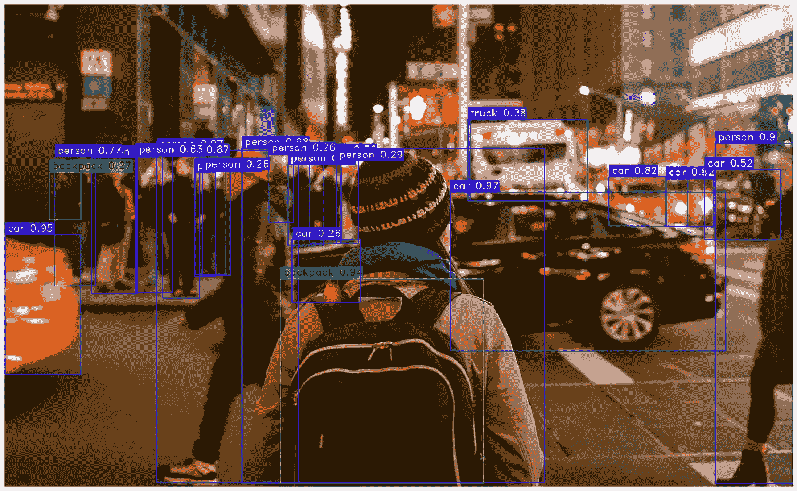

# YOLO-NAS：如何在目标检测任务中实现最佳性能

> 原文：[`towardsdatascience.com/yolo-nas-how-to-achieve-the-best-performance-on-object-detection-tasks-6b95347908d4?source=collection_archive---------2-----------------------#2023-05-19`](https://towardsdatascience.com/yolo-nas-how-to-achieve-the-best-performance-on-object-detection-tasks-6b95347908d4?source=collection_archive---------2-----------------------#2023-05-19)

## 通过神经架构搜索、创新量化模块和强大的预训练范式生成的基础模型

 [Thomas A Dorfer](https://thomasdorfer.medium.com/?source=post_page-----6b95347908d4--------------------------------)

·

[关注](https://medium.com/m/signin?actionUrl=https%3A%2F%2Fmedium.com%2F_%2Fsubscribe%2Fuser%2F7c54f9b62b90&operation=register&redirect=https%3A%2F%2Ftowardsdatascience.com%2Fyolo-nas-how-to-achieve-the-best-performance-on-object-detection-tasks-6b95347908d4&user=Thomas+A+Dorfer&userId=7c54f9b62b90&source=post_page-7c54f9b62b90----6b95347908d4---------------------post_header-----------) 发表在 [Towards Data Science](https://towardsdatascience.com/?source=post_page-----6b95347908d4--------------------------------) ·7 分钟阅读·2023 年 5 月 19 日

--

[Anubhav Saxena](https://unsplash.com/@anubhav)拍摄于[Unsplash](https://unsplash.com/photos/RA5ntyyDHlw)。由作者用 YOLO-NAS-L 处理过。

在目标检测领域，YOLO（**你** 只需 **看** 一次）已经成为家喻户晓的名字。自 2015 年[首次发布](https://arxiv.org/abs/1506.02640)首个模型以来，YOLO 家族稳步增长，每个新模型在平均精度均值（mAP）和推理延迟方面都超过了其前任。

两周前，YOLO 家族迎来了又一新成员：[YOLO-NAS](https://github.com/Deci-AI/super-gradients/blob/master/YOLONAS.md)，这是由深度学习公司[Deci](https://deci.ai/)开发的一个新型且基础的模型。

在本文中，我们将探讨它相对于之前 YOLO 模型的优势，并展示如何将其用于你自己的目标检测任务。

## YOLO-NAS：有什么新东西？

虽然之前的 YOLO 模型在目标检测方面在创新和性能上处于领先地位，但它们确实存在一些局限性。其中一个主要问题是缺乏适当的量化支持，这旨在减少模型的内存和计算需求。另一个问题是准确性和延迟之间的折衷不足，即在一个方面的改善通常会导致...
