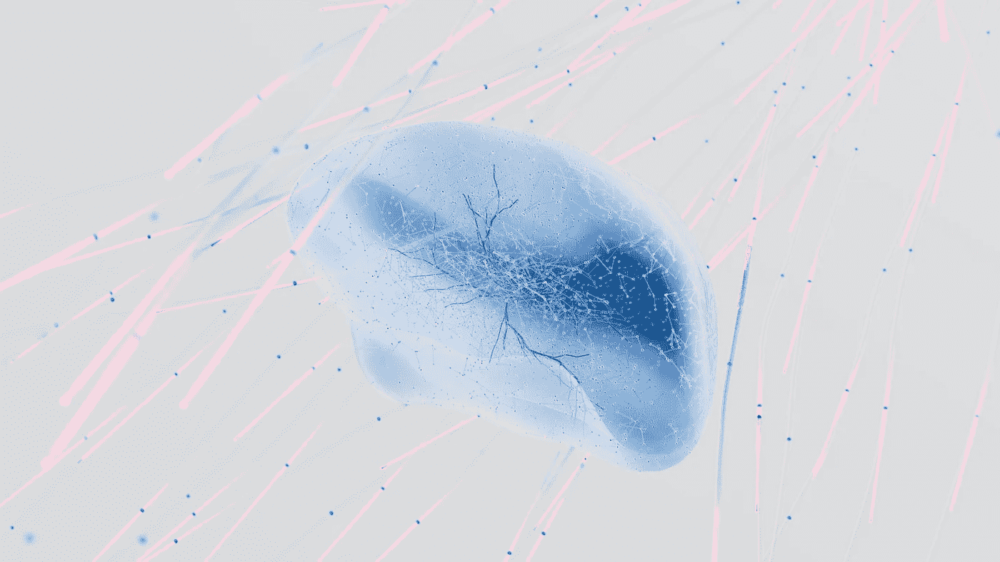
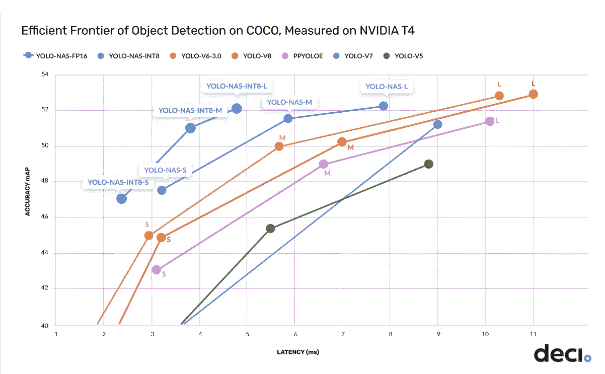
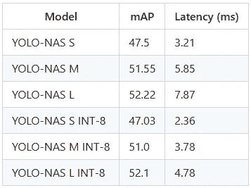

# YOLO-NAS：如何在目标检测任务中实现最佳性能

> 原文：[`towardsdatascience.com/yolo-nas-how-to-achieve-the-best-performance-on-object-detection-tasks-6b95347908d4`](https://towardsdatascience.com/yolo-nas-how-to-achieve-the-best-performance-on-object-detection-tasks-6b95347908d4)

## 通过神经网络结构搜索、创新的量化块和强大的预训练范式生成的基础模型

[](https://thomasdorfer.medium.com/?source=post_page-----6b95347908d4--------------------------------)[](https://towardsdatascience.com/?source=post_page-----6b95347908d4--------------------------------) [Thomas A Dorfer](https://thomasdorfer.medium.com/?source=post_page-----6b95347908d4--------------------------------)

·发布于[数据科学前沿](https://towardsdatascience.com/?source=post_page-----6b95347908d4--------------------------------) ·阅读时间 7 分钟·2023 年 5 月 19 日

--


图片由[Anubhav Saxena](https://unsplash.com/@anubhav)提供，[Unsplash](https://unsplash.com/photos/RA5ntyyDHlw)上可见。由作者使用 YOLO-NAS-L 处理。

在目标检测领域，YOLO（**你**只需**看**一次）已成为家喻户晓的名字。自 2015 年[发布](https://arxiv.org/abs/1506.02640)第一个模型以来，YOLO 家族一直在稳步增长，每个新模型在平均精度（mAP）和推理延迟上均超越了其前身。

两周前，YOLO 家族迎来了新成员：[YOLO-NAS](https://github.com/Deci-AI/super-gradients/blob/master/YOLONAS.md)，这是由深度学习公司[Deci](https://deci.ai/)开发的一种新型基础模型。

在本文中，我们将探讨它相对于之前 YOLO 模型的优势，并展示如何将其用于你自己的目标检测任务。

## YOLO-NAS：新变化是什么？

尽管之前的 YOLO 模型在目标检测方面在创新和性能上领先，但它们也存在一些局限性。主要问题之一是缺乏适当的量化支持，这旨在减少模型的内存和计算需求。另一个问题是精度和延迟之间的权衡不足，其中一个的改进往往会导致另一个的显著下降。

通过利用一种称为**神经网络结构搜索（NAS）**的概念，Deci 的研究人员直接解决了这些局限性。实质上，NAS 的概念可以被视为对训练好的深度学习模型的一次改造。

传统上，神经网络架构由人类专家根据经验和直觉进行手动设计。然而，这一过程涉及探索可能架构的广阔设计空间，始终非常耗时且繁琐。

**NAS**，另一方面，自动重新设计模型架构，以提升其在速度、内存使用和吞吐量等方面的性能。它通常涉及一个定义可能架构选择的搜索空间，例如层数、层类型、卷积核大小和连接模式。搜索算法然后通过在给定任务和数据集上训练和评估不同架构来评估它们。基于这些评估，算法迭代地探索和完善架构空间，最终返回最佳性能的架构。



图片来源：[Google DeepMind](https://unsplash.com/@deepmind) 在 [Unsplash](https://unsplash.com/photos/Krw-2KP7bOE)

为了执行 NAS，Deci 利用了其专有的[AutoNAC](https://deci.ai/deep-learning-glossary/automated-neural-architecture-construction-autonac/)技术，这是一种优化引擎，可以重新设计模型的架构，以最大限度地提高特定硬件的推理性能，同时保持准确性。

除了 NAS，这个新的 YOLO 成员的另一个重大改进涉及**量化**的使用。在这种情况下，量化指的是将神经网络的权重、偏置和激活从浮点值转换为整数值（INT-8），从而使模型更加高效。

这项工作有两个方面：(1) 该模型使用了适合量化的块，这些块结合了重新参数化和 INT-8 量化的优点。这些块采用了[Chu 等人（2022）](https://arxiv.org/pdf/2212.01593.pdf)提出的方法，重新设计这些块，使其生成的权重和激活分布有利于量化。(2) 作者采用了一种混合量化方法，有选择地量化模型的特定层，从而最小化信息丢失，在延迟和准确性之间取得平衡。

这种新方法的结果不言而喻。如下图所示，量化后的中型模型*YOLO-NAS-INT8-M*在推理延迟方面提高了 50%，同时与最新的最先进模型相比，准确性提高了 1 mAP。



来源: [Deci-AI](https://github.com/Deci-AI/super-gradients/blob/master/YOLONAS.md)。许可证: [Apache License 2.0](https://github.com/Deci-AI/super-gradients/blob/master/LICENSE.md)

在撰写时，已经发布了 YOLO-NAS 的三种模型：小型、中型和大型，每种模型都有一个量化的 INT-8 版本。



来源: [Deci-AI](https://github.com/Deci-AI/super-gradients/blob/master/YOLONAS.md)。许可证: [Apache License 2.0](https://github.com/Deci-AI/super-gradients/blob/master/LICENSE.md)

毫不奇怪，量化版本的精度略有下降。然而，由于采用了这些新颖的量化友好型块以及选择性量化，这种精度下降仍然相对较小。此外，这里的优势远大于劣势，推理延迟显著改善。

YOLO-NAS 还在 COCO、Objects365 和 Roboflow 100 数据集上进行**预训练**，这使得它非常适合下游的物体检测任务。

预训练过程利用了**知识蒸馏**的概念，这使得模型可以从自身的预测中学习，而不仅仅依赖于外部标记数据，从而提高性能。在这种范式中，教师模型对训练数据生成预测，这些预测作为学生模型的指导（或软目标）。学生模型使用原始标记数据和教师模型生成的软目标进行训练。它基本上尝试模仿教师模型的预测，同时调整其参数以匹配原始标记数据。总体而言，这种方法使模型能够更好地泛化，减少过拟合，并实现更高的准确性，特别是当标记数据不丰富时。

训练过程通过加入**分布焦点损失（DFL）**进一步增强。DFL 是一种损失函数，扩展了焦点损失的概念，通过对难以分类的样本分配更高的权重来解决类别不平衡的问题。在物体检测的背景下，DFL 在训练过程中将框回归作为分类任务进行学习。它将边界框预测离散化为有限的选项，并对这些选项进行分布预测。最终的预测通过加权求和将这些分布结合起来。通过考虑类别分布并相应地调整损失函数，模型能够提高对欠代表类别的检测准确性。

最终，YOLO-NAS 已经以开源许可证发布，并且在 Deci 的基于 PyTorch 的计算机视觉库 [SuperGradients](https://github.com/Deci-AI/super-gradients) 上提供了预训练权重供研究使用。

## 如何使用 YOLO-NAS

为了使用 YOLO-NAS 进行推理，我们需要首先安装 `super_gradients` 包：

```py
pip install super-gradients
```

为了准备推理任务，让我们取一张样本图像，我们称之为 `image.jpg`：


[krakenimages](https://unsplash.com/@krakenimages) 的照片，来源于 [Unsplash](https://unsplash.com/photos/376KN_ISplE)

为了进行推断，我们可以使用以下代码片段：

```py
import torch
from super_gradients.training import models

device = torch.device("cuda:0") if torch.cuda.is_available() else torch.device("cpu")
yolo_nas_s = models.get("yolo_nas_s", pretrained_weights="coco").to(device)
out = yolo_nas.predict("image.jpg")
out.save("image_yolo.jpg")
```

首先，我们需要从 `super_gradients` 库中导入 `torch` 和 `models`。然后，我们声明一个变量 `device`，设置为使用第一个可用的 GPU（如果有的话），否则设置为使用 CPU。

随后，我们指定使用模型的小型版本 YOLO-NAS-S，并使用 COCO 数据集的预训练权重。此外，我们将检测到的物体保存到 `image_yolo.jpg` 中。

我们的输出图像如下所示：


[krakenimages](https://unsplash.com/@krakenimages) 的照片，来源于 [Unsplash](https://unsplash.com/photos/376KN_ISplE)。由作者使用 YOLO-NAS-S 处理。

我们可以看到各种物体在不同的置信度水平下被检测到。对于聚焦中的物体（如两个人、杯子和笔记本电脑），模型的置信度较高。然而，我们也观察到一些误分类，可能是由于物体失焦。这包括一个笔筒被误分类为盆栽植物，以及一支笔被误分类为牙刷。令人惊讶的是，我们还可以看到模型准确地检测到了仅部分可见的物体，如人物坐的椅子，只有靠背部分可见。

最后，值得一提的是，通过简单地将 `predict()` 调用的输入参数更改为相应的视频文件，可以以完全相同的方式进行视频目标检测。

## 结论

YOLO 系列又迎来了一员新成员——YOLO-NAS，它自豪地超越了 YOLOv6、YOLOv7 和 YOLOv8 等年轻兄弟。

通过神经架构搜索、量化支持以及包含知识蒸馏和分布式焦点损失的强大预训练程序的创新组合，YOLO-NAS 实现了精度和推理延迟之间的显著权衡。

考虑到计算机视觉和目标检测领域的快速发展，另一款 YOLO 模型很可能很快会面世。

## 更多资源

+   [Deci 的 YOLO-NAS 使用神经架构搜索在目标检测上达到了最先进的性能](https://deci.ai/blog/YOLO-NAS-object-detection-foundation-model)

+   [super-gradients/YOLONAS.md at master · Deci-AI/super-gradients · GitHub](https://github.com/Deci-AI/super-gradients/blob/master/YOLONAS.md)

## 喜欢这篇文章吗？

让我们联系吧！你可以在 [Twitter](https://twitter.com/ThomasADorfer)、[LinkedIn](https://www.linkedin.com/in/thomasdorfer/) 和 [Substack](https://thomasdorfer.substack.com/) 找到我。

如果你想支持我的写作，可以通过[Medium 会员](https://thomasdorfer.medium.com/membership)来做到，这将使你可以访问我所有的故事以及 Medium 上成千上万其他作家的故事。

[](https://medium.com/@thomasdorfer/membership?source=post_page-----6b95347908d4--------------------------------) [## 通过我的推荐链接加入 Medium - 托马斯·A·多费尔

### 阅读托马斯·A·多费尔（Thomas A Dorfer）以及成千上万其他作者在 Medium 上的每个故事。你的会员费直接支持…

[medium.com](https://medium.com/@thomasdorfer/membership?source=post_page-----6b95347908d4--------------------------------)
