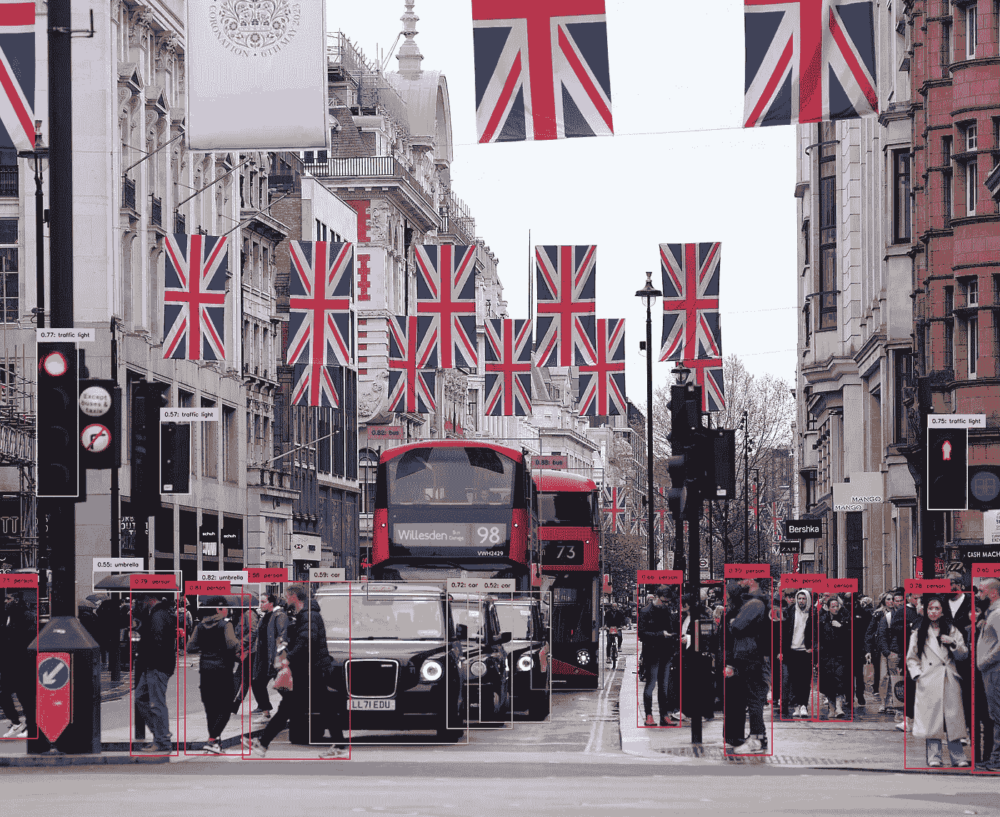
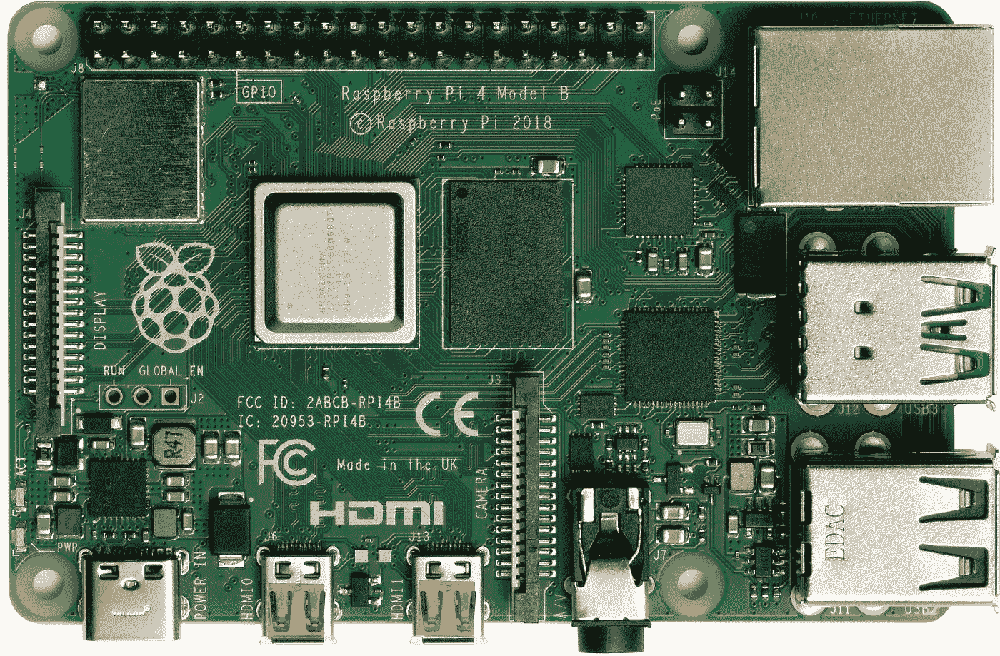
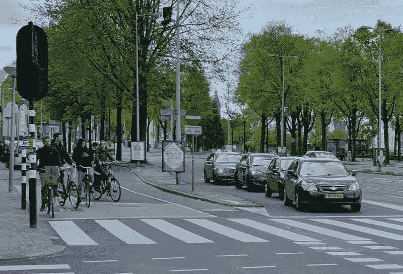
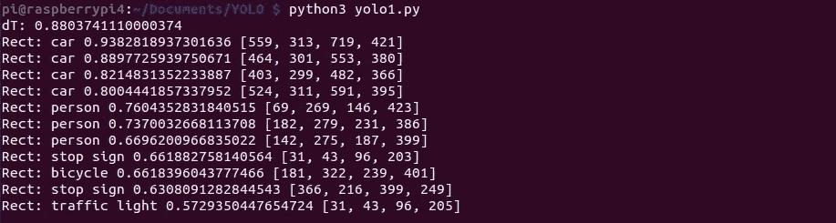
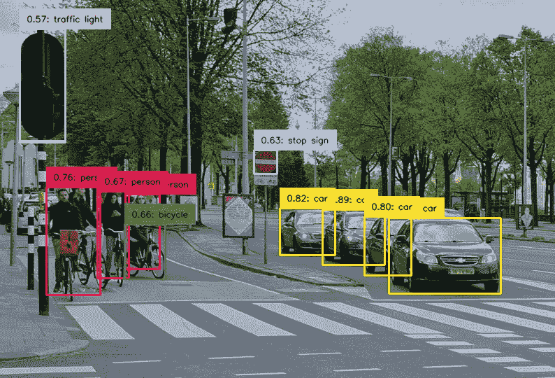

# Raspberry Pi 上的 YOLO 目标检测

> 原文：[`towardsdatascience.com/yolo-object-detection-on-the-raspberry-pi-6de3629256fa`](https://towardsdatascience.com/yolo-object-detection-on-the-raspberry-pi-6de3629256fa)

## 在低功耗设备上运行目标检测模型

[](https://dmitryelj.medium.com/?source=post_page-----6de3629256fa--------------------------------)[](https://towardsdatascience.com/?source=post_page-----6de3629256fa--------------------------------) [Dmitrii Eliuseev](https://dmitryelj.medium.com/?source=post_page-----6de3629256fa--------------------------------)

·发布于 [Towards Data Science](https://towardsdatascience.com/?source=post_page-----6de3629256fa--------------------------------) ·阅读时长 9 分钟·2023 年 7 月 11 日

--



YOLO 目标检测结果，作者提供的图片

在这篇文章的第一部分中，我测试了 YOLO（You Only Look Once）的“复古”版本，这是一个流行的目标检测库。仅使用 OpenCV 运行深度学习模型，而不使用 PyTorch 或 Keras 等“重型”框架，对低功耗设备来说是很有前景的，我决定深入探讨这个话题，看看最新的 YOLO v8 模型在 Raspberry Pi 上的表现如何。

让我们深入了解一下。

## 硬件

在云端运行任何模型通常没有问题，因为资源几乎是无限的。但对于“现场”的硬件，限制就多得多。有限的 RAM、CPU 功率，甚至不同的 CPU 架构，较旧或不兼容的软件版本，缺乏高速互联网连接等等。云基础设施的另一个大问题是其成本。假设我们正在制作一个智能门铃，并且我们想添加人脸检测功能。我们可以在云端运行模型，但每次 API 调用都需要付费，那么谁来支付呢？并不是每个客户都愿意为门铃或任何类似的“智能”设备支付月费，因此在本地运行模型可能是必要的，即使结果可能不是最佳的。

在这个测试中，我将会在 Raspberry Pi 上运行 YOLO v8 模型：



Raspberry Pi 4，图片来源 [`en.wikipedia.org/wiki/Raspberry_Pi`](https://en.wikipedia.org/wiki/Raspberry_Pi)

Raspberry Pi 是一种便宜的信用卡大小的单板计算机，运行 Raspbian 或 Ubuntu Linux。我将测试两个不同的版本：

+   2015 年制造的 Raspberry Pi 3 Model B。它有一个 1.2 GHz Cortex-A53 ARM CPU 和 1 GB 的 RAM。

+   Raspberry Pi 4，制造于 2019 年。它有一个 1.8 GHz Cortex-A72 ARM CPU 和 1、4 或 8 GB 的 RAM。

目前，Raspberry Pi 计算机被广泛使用，不仅用于爱好和 DIY 项目，还用于嵌入式工业应用（[Raspberry Pi Compute Module](https://www.raspberrypi.com/products/compute-module-4/?variant=raspberry-pi-cm4001000) 专门为此设计）。因此，了解这些板子如何处理诸如物体检测这样的计算密集型操作是很有趣的。在所有进一步的测试中，我将使用这张图像：



测试图像，由作者制作

现在，让我们看看它是如何工作的。

## **“标准” YOLO v8 版本**

作为热身，让我们尝试标准版本，如在官方 GitHub 页面上[描述的](https://github.com/ultralytics/ultralytics)：

```py
from ultralytics import YOLO
import cv2
import time

model = YOLO('yolov8n.pt')

img = cv2.imread('test.jpg')

# First run to 'warm-up' the model
model.predict(source=img, save=False, save_txt=False, conf=0.5, verbose=False)

# Second run
t_start = time.monotonic()
results = model.predict(source=img, save=False, save_txt=False, conf=0.5, verbose=False)
dt = time.monotonic() - t_start
print("dT:", dt)

# Show results
boxes = results[0].boxes
names = model.names
confidence, class_ids = boxes.conf, boxes.cls.int()
rects = boxes.xyxy.int()
for ind in range(boxes.shape[0]):
    print("Rect:", names[class_ids[ind].item()], confidence[ind].item(), rects[ind].tolist())
```

在“生产”系统中，可以通过摄像头获取图像；对于我们的测试，我使用了之前描述的“test.jpg”文件。我还执行了“predict”方法两次，以使时间估计更准确（第一次运行通常需要更多时间来“热身”和分配所有所需的内存）。Raspberry Pi 在没有显示器的“无头”模式下工作，因此我使用控制台作为输出；这是大多数嵌入式系统的标准工作方式。

在**Raspberry Pi 3** 上运行 32 位操作系统时，此版本无法使用：pip 无法安装“ultralytics”模块，原因如下错误：

```py
ERROR: Cannot install ultralytics

The conflict is caused by:
    ultralytics 8.0.124 depends on torch>=1.7.0
```

结果发现 PyTorch 仅适用于 ARM 64 位操作系统。

在**Raspberry Pi 4** 上运行 64 位操作系统时，代码确实可以运行，计算时间约为 0.9 秒。

控制台输出如下：



我还在桌面 PC 上进行了相同的实验以可视化结果。



YOLO v8 Nano 检测结果，由作者提供的图像

正如我们所见，即使是“nano”尺寸的模型，结果也相当不错。

## Python ONNX 版本

ONNX ([开放神经网络交换](https://onnx.ai)) 是一种用于表示机器学习模型的开放格式。它也得到 OpenCV 的支持，因此我们可以轻松地以这种方式运行我们的模型。YOLO 开发人员已经提供了一个 [命令行工具](https://docs.ultralytics.com/modes/export/) 来进行这种转换：

```py
yolo export model=yolov8n.pt imgsz=640 format=onnx opset=12
```

这里，“yolov8n.pt”是一个 PyTorch 模型文件，将被转换。文件名中的最后一个字母“n”表示“nano”。提供了不同的模型（“n”——nano，“s”——small，“m”——medium，“l”——large），显然，对于 Raspberry Pi，我将使用最小且最快的一个。

转换可以在桌面 PC 上完成，并且可以使用“scp”命令将模型复制到 Raspberry Pi 上：

```py
scp yolov8n.onnx pi@raspberrypi:/home/pi/Documents/YOLO
```

现在我们准备好准备源代码了。我使用了 [Ultralytics 仓库](https://github.com/ultralytics/ultralytics/blob/main/examples/YOLOv8-OpenCV-ONNX-Python/main.py) 中的[一个示例](https://github.com/ultralytics/ultralytics/blob/main/examples/YOLOv8-OpenCV-ONNX-Python/main.py)，并对其进行了稍微的修改以在 Raspberry Pi 上运行：

```py
import cv2
import time

model: cv2.dnn.Net = cv2.dnn.readNetFromONNX("yolov8n.onnx")
names = "person;bicycle;car;motorbike;aeroplane;bus;train;truck;boat;traffic light;fire hydrant;stop sign;parking meter;bench;bird;" \
        "cat;dog;horse;sheep;cow;elephant;bear;zebra;giraffe;backpack;umbrella;handbag;tie;suitcase;frisbee;skis;snowboard;sports ball;kite;" \
        "baseball bat;baseball glove;skateboard;surfboard;tennis racket;bottle;wine glass;cup;fork;knife;spoon;bowl;banana;apple;sandwich;" \
        "orange;broccoli;carrot;hot dog;pizza;donut;cake;chair;sofa;pottedplant;bed;diningtable;toilet;tvmonitor;laptop;mouse;remote;keyboard;" \
        "cell phone;microwave;oven;toaster;sink;refrigerator;book;clock;vase;scissors;teddy bear;hair dryer;toothbrush".split(";")

img = cv2.imread('test.jpg')
height, width, _ = img.shape
length = max((height, width))
image = np.zeros((length, length, 3), np.uint8)
image[0:height, 0:width] = img
scale = length / 640

# First run to 'warm-up' the model
blob = cv2.dnn.blobFromImage(image, scalefactor=1 / 255, size=(640, 640), swapRB=True)
model.setInput(blob)
model.forward()

# Second run
t1 = time.monotonic()
blob = cv2.dnn.blobFromImage(image, scalefactor=1 / 255, size=(640, 640), swapRB=True)
model.setInput(blob)
outputs = model.forward()
print("dT:", time.monotonic() - t1)

# Show results
outputs = np.array([cv2.transpose(outputs[0])])
rows = outputs.shape[1]

boxes = []
scores = []
class_ids = []
output = outputs[0]
for i in range(rows):
    classes_scores = output[i][4:]
    minScore, maxScore, minClassLoc, (x, maxClassIndex) = cv2.minMaxLoc(classes_scores)
    if maxScore >= 0.25:
        box = [output[i][0] - 0.5 * output[i][2], output[i][1] - 0.5 * output[i][3],
               output[i][2], output[i][3]]
        boxes.append(box)
        scores.append(maxScore)
        class_ids.append(maxClassIndex)

result_boxes = cv2.dnn.NMSBoxes(boxes, scores, 0.25, 0.45, 0.5)
for index in result_boxes:
    box = boxes[index]
    box_out = [round(box[0]*scale), round(box[1]*scale),
               round((box[0] + box[2])*scale), round((box[1] + box[3])*scale)]
    print("Rect:", names[class_ids[index]], scores[index], box_out)
```

正如我们所见，我们不再使用 PyTorch 和原始 Ultralytics 库了，但所需的代码量增加了。我们需要将图像转换为 blob，这对于 YOLO 模型是必需的。在打印结果之前，我们还需要将输出的矩形转换回原始坐标。但作为一个优点，这段代码在“纯” OpenCV 上运行，不依赖任何额外的库。

在**Raspberry Pi 3**上，计算时间为 28 秒。为了好玩，我还加载了“medium”模型（这是一个 101 MB 的 ONNX 文件！）看看会发生什么。令人惊讶的是，应用程序没有崩溃，但计算时间为 224 秒（几乎 4 分钟）。显然，2015 年的硬件不适合运行 2023 年的 SOTA 模型，但看到它如何工作的过程还是很有趣的。

在**Raspberry Pi 4**上，计算时间为 1.08 秒。

## C++ ONNX 版本

最后，让我们尝试使用工具集中最强大的武器，并用 C++ 编写相同的代码。但在此之前，我们需要为 C++ 安装 OpenCV 库和头文件。最简单的方法是运行类似“*sudo apt install libopencv-dev*”的命令。但至少对于 Raspbian，这种方法不起作用。通过“apt”获得的最新版本是 4.2，而加载 YOLO 模型的最低 OpenCV 要求是 4.5。因此，我们需要从源代码构建 OpenCV。

我将使用 OpenCV 4.7，这是我在 Python 测试中使用的版本：

```py
sudo apt update
sudo apt install g++ cmake libavcodec-dev libavformat-dev libswscale-dev libgstreamer-plugins-base1.0-dev libgstreamer1.0-dev 
sudo apt install libgtk2.0-dev libcanberra-gtk* libgtk-3-dev libpng-dev libjpeg-dev libtiff-dev
sudo apt install libxvidcore-dev libx264-dev libgtk-3-dev libgstreamer1.0-dev gstreamer1.0-gtk3

wget https://github.com/opencv/opencv/archive/refs/tags/4.7.0.tar.gz
tar -xvzf 4.7.0.tar.gz
rm 4.7.0.tar.gz
cd opencv-4.7.0
mkdir build && cd build

cmake -D WITH_QT=OFF -D WITH_VTK=OFF -D CMAKE_BUILD_TYPE=RELEASE -D CMAKE_INSTALL_PREFIX=/usr/local -D WITH_FFMPEG=ON -D PYTHON3_PACKAGES_PATH=/usr/lib/python3/dist-packages -D BUILD_EXAMPLES=OFF ..
make -j2 && sudo make install && sudo ldconfig
```

Raspberry Pi 不是世界上最快的 Linux 计算机，编译过程大约需要 2 小时。对于拥有 1 GB RAM 的 Raspberry Pi 3，交换文件大小应该增加到至少 512 MB；否则，编译将失败。

C++ 代码本身很简短：

```py
#include <opencv2/opencv.hpp>
#include <vector>
#include <ctime>
#include "inference.h"

int main(int argc, char **argv) {
    Inference inf("yolov8n.onnx", cv::Size(640, 640), "", false);

    cv::Mat frame = cv::imread("test.jpg");

    // First run to 'warm-up' the model
    inf.runInference(frame);

    // Second run
    const clock_t begin_time = clock();

    std::vector<Detection> output = inf.runInference(frame);

    printf("dT: %f\n",  float(clock() - begin_time)/CLOCKS_PER_SEC);

    // Show results
    for (auto &detection : output) {
        cv::Rect box = detection.box;

        printf("Rect: %s %f: %d %d %d %d\n", detection.className.c_str(), detection.confidence,
                                             box.x, box.y, box.width, box.height);        
    }

    return 0;
}
```

在这段代码中，我使用了 Ultralitics [GitHub 仓库](https://github.com/ultralytics/ultralytics/tree/main/examples/YOLOv8-CPP-Inference)中的“*inference.h*”和“*inference.cpp*”文件，这些文件应该放在同一个文件夹中。我还像以前的测试一样执行了“runInference”方法两次。我们现在可以使用以下命令编译源代码：

```py
c++ yolo1.cpp inference.cpp -I/usr/local/include/opencv4 -L/usr/local/lib -lopencv_core -lopencv_dnn -lopencv_imgcodecs -lopencv_imgproc -O3 -o yolo1
```

结果令人惊讶。C++ 版本的速度比以前的版本*明显* *慢*！在**Raspberry Pi 3**上，执行时间为 110 秒，比 Python 版本长了 3 倍以上。在**Raspberry Pi 4**上，计算时间为 1.79 秒，比 Python 版本长了约 1.5 倍。总的来说，很难说清楚原因。Python 的 OpenCV 库是通过 *pip* 安装的，而 C++ 的 OpenCV 是从源代码构建的，也许某些 ARM CPU 优化没有启用。如果有读者知道原因，请在下方评论中写明。无论如何，看到这样的效果是很有趣的。

## 结论

我可以“有根据地猜测”大多数数据科学家和数据工程师都在云端或至少在高端设备上使用他们的模型，并且从未尝试过在嵌入式硬件上“实地”运行代码。本文的目的是为读者提供一些关于它是如何工作的见解。在这篇文章中，我们尝试在不同版本的 Raspberry Pi 上运行 YOLO v8 模型，结果相当有趣。

+   在低功耗设备上运行深度学习模型可能是一个挑战。即使是目前最好的基于 Raspbian 的模型——Raspberry Pi 4，在使用 YOLO v8 Tiny 模型时也只能提供大约~1 FPS。当然，还有改进的空间。一些优化可能是可行的，例如将模型转换为 FP16（精度较低的浮点格式）或甚至 INT8 格式。最后，也可以使用一个在有限数据集上训练的更简单的模型。最后但同样重要的是，如果仍然需要更多的计算能力，可以在像 NVIDIA Jetson Nano 这样的特殊单板计算机上运行代码，它支持 CUDA，并且可以更快。

+   在本文开头，我写道“仅使用 OpenCV 运行深度学习模型，而不依赖像 PyTorch 或 Keras 这样沉重的框架，对低功耗设备是有前景的”。实际上，结果是 PyTorch 是一个有效且高度优化的框架。基于 PyTorch 的原始 YOLO 版本是最快的，而 OpenCV ONNX 代码慢了 10–20%。但在撰写本文时，PyTorch 在 32 位 ARM CPU 上不可用，因此在某些平台上可能没有其他选择。

+   C++版本的结果则更为有趣。正如我们所见，开启适当的优化可能是一个挑战，特别是对于嵌入式架构而言。在不深入探讨这些细节的情况下，定制的 OpenCV C++代码可能比板制造商提供的 Python 版本运行得更慢。

感谢阅读。如果有人有兴趣在相同硬件或 NVIDIA Jetson Nano 板上测试 FP16 或 INT8 YOLO 模型，请在评论中留言，我会在下一部分文章中讨论这一点。

如果你喜欢这个故事，欢迎 [订阅](https://medium.com/@dmitryelj/membership) Medium，这样你会在我的新文章发布时收到通知，并且可以全面访问其他作者的成千上万的故事。
