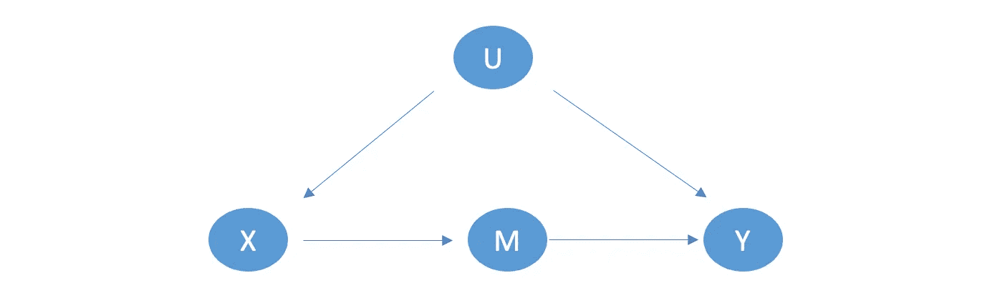
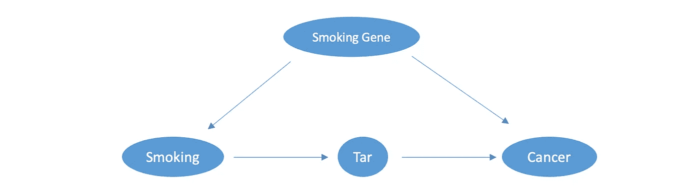
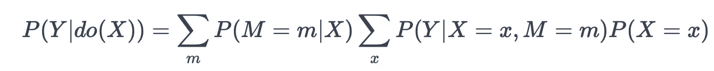
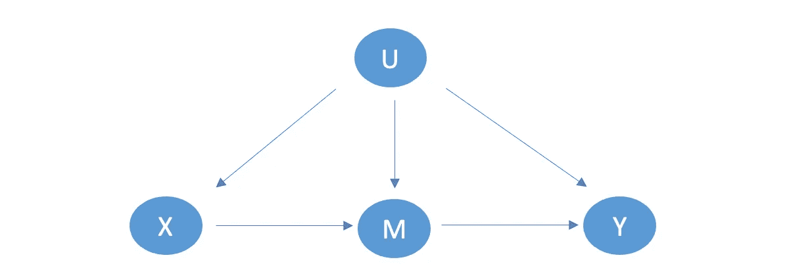
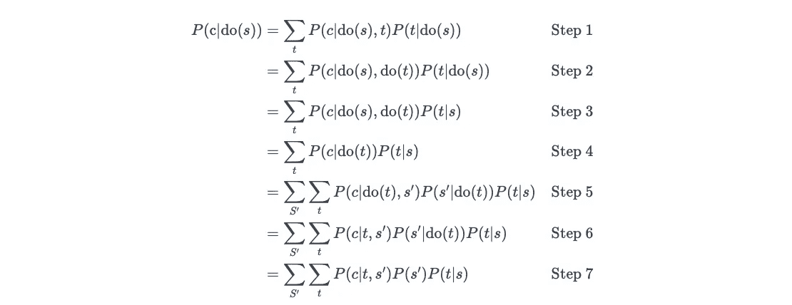
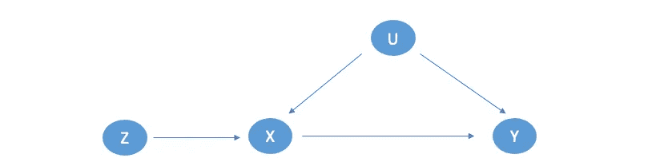
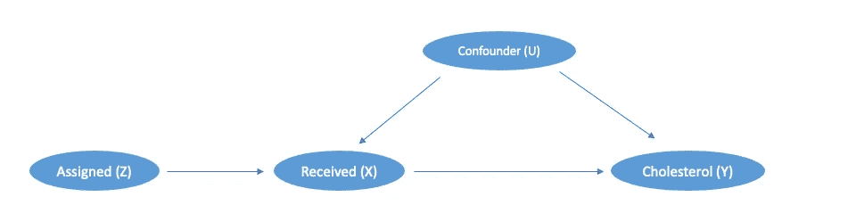
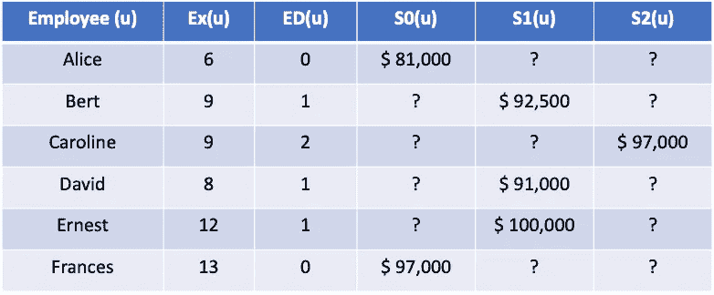
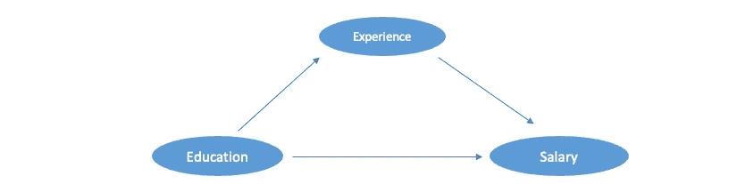
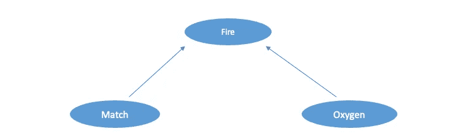

# 你不能踏入同一条河流两次

> 原文：[`towardsdatascience.com/you-cant-step-in-the-same-river-twice-cfacf7cee305`](https://towardsdatascience.com/you-cant-step-in-the-same-river-twice-cfacf7cee305)


图片来源：[弗拉基斯拉夫·巴比恩科](https://unsplash.com/@garri?utm_source=medium&utm_medium=referral) 在[Unsplash](https://unsplash.com/?utm_source=medium&utm_medium=referral)

## 《为何的书》第 7 和 8 章，阅读系列

[](https://zzhu17.medium.com/?source=post_page-----cfacf7cee305--------------------------------)[](https://towardsdatascience.com/?source=post_page-----cfacf7cee305--------------------------------) [朱子景博士](https://zzhu17.medium.com/?source=post_page-----cfacf7cee305--------------------------------)

·发表于[Towards Data Science](https://towardsdatascience.com/?source=post_page-----cfacf7cee305--------------------------------) ·18 分钟阅读·2023 年 12 月 20 日

--

在我的[之前的文章](https://zzhu17.medium.com/list/causality-book-club-def5f1fd00fe)中，我们了解了观察数据中的混杂因素和碰撞器，这些因素阻碍了可靠因果关系的建立。珀尔提供的解决方案是绘制因果图，并使用[后门准则](https://medium.com/towards-data-science/causal-diagram-confronting-the-achilles-heel-in-observational-data-a69cdb1c4818)找到需要阻断的混杂因素集合，留下碰撞器和中介变量。

然而，当处理那些无法观察或测量的混杂变量时，从观察数据中估计因果关系变得困难。为应对这个问题，在《为何的书》第七章中，**朱迪亚·珀尔**介绍了**do-calculus 规则**。这些规则对于**前门准则**和**工具变量**特别有用。即使存在不可观察的混杂变量，它们也可以用来建立因果关系。

在第八章中，我们将探索**反事实**的奇妙世界。以诗人罗伯特·弗罗斯特的名句开篇：

> “而且对不起，我不能两者兼得
> 
> “而且做一个旅行者，我站了很久……”

珀尔表示，尽管不可能走两条路径或踏入同一条河流两次，我们的大脑可以想象如果我们选择了另一条路径会发生什么。为了明确并传递智慧给机器人，珀尔介绍了**必要原因**和**充分原因**的区别，以及如何利用**结构因果模型**系统地进行反事实分析。

随着章节的深入，内容变得更加技术化和信息密集。在接下来的部分，我将首先讨论如何处理未观察到的混杂因素，不幸的是，涉及一些数学内容，针对第二级干预。然后，我将讨论反事实，作为第三级应用。

## 前门标准

从因果图开始，我们用来理解 X 对 Y 的因果影响：



作者基于《为什么的书》第七章制作的图像

在这里，X 通过中介 M 影响 Y。然而，我们无法直接从数据中估计因果关系而不控制混杂因素 U。**“U -> X”** 的后门路径会产生 X 与 Y 之间的虚假相关性。后门标准告诉我们要控制 U，但如果 U 是不可观测的呢？


[Tobias Tullius](https://unsplash.com/@tobiastu?utm_source=medium&utm_medium=referral) 提供的照片，[来源于 Unsplash](https://unsplash.com/?utm_source=medium&utm_medium=referral)

例如，在分析烟雾（X）与癌症（Y）之间的因果关系时，我们可能会看到这样的因果图：



作者基于《为什么的书》第七章制作的图像

在这里，吸烟通过焦油积累引发癌症，还有一个混杂因素——吸烟基因，正如一些研究人员所言，它可能会影响一个人的吸烟行为和患肺癌的几率。我们无法收集这些基因的数据，因为我们不知道它们是否存在。因此，后门调整在这种情况下无法起作用。

为了获得因果影响，我们可以使用**前门标准**。这里的前门是中介过程，吸烟增加焦油沉积，进而增加患癌症的几率。如果我们不能直接估计烟雾对癌症的影响，我们能否通过焦油对癌症的影响来估计烟雾对焦油的因果影响？步骤如下：

**步骤 1: 吸烟 -> 焦油**

吸烟到焦油的唯一后门路径：

> 吸烟 <- 吸烟基因 -> 癌症 <- 焦油

它被 Collider 癌症阻挡了。因此，我们可以通过计算条件概率直接从数据中估计吸烟对焦油的因果影响：

```py
The causal impact of smoking on tar is:
P(tar|smoking) - P(tar|no smoking)
```

**步骤 2: 焦油 -> 癌症**

焦油到癌症的一个后门路径：

> 焦油 <- 吸烟 <- 吸烟基因 -> 癌症

在这里，吸烟和吸烟基因都是混杂因素，但我们可以控制其中一个来阻断路径。由于我们没有吸烟基因的数据，我们可以控制吸烟：

```py
The causal impact of tar on cancer is:
P(cancer|do(tar)) - P(cancer|do(no tar))

where,

P(cancer|do(tar)) = P(cancer|tar,smoking) * P(smoking) + 
                    P(cancer|tar,no smoking) * P(no smoking)

P(cancer|do(no tar)) = P(cancer|no tar,smoking) * P(smoking) + 
                       P(cancer|no tar,no smoking) * P(no smoking)
```

为了估计焦油对癌症的因果影响，我们从数据中测量以下四个概率：

+   吸烟人群中通过积累焦油患癌症的概率：

> P(癌症|焦油, 吸烟) * P(吸烟)

+   在非吸烟人群中，通过积累焦油患癌症的概率：

> P(癌症|焦油, 不吸烟) * P(不吸烟)

+   在吸烟人群中，没有足够焦油的癌症发生概率：

> P(cancer|no tar, smoking) * P(smoking)

+   在非吸烟人群中，没有足够焦油的癌症发生概率：

> P(cancer|no tar, no smoking) * P(no smoking)

**步骤 3：吸烟 -> 焦油 -> 癌症**

一旦我们知道吸烟对焦油的因果影响以及焦油对癌症的因果影响，我们可以通过前门调整推导出吸烟对癌症的无偏因果影响：

```py
The causal impact of smoking on cancer is:
**P(cancer|do(smoking)) = P(cancer|do(tar)) * P(tar|do(smoking)) +
                        P(cancer|do(no tar)) * P(no tar|do(smoking))**

######**Math Alert**########################
Since no backdoor between smoking and tar:

**P(tar|do(smoking)) = P(tar|smoking) 
& 
P(no tar|do(smoking)) = P(no Tar|smoking)** 
And from back door adjustment for tar and cancer:

**P(cancer|do(tar)) = P(cancer|tar,smoking) * P(smoking) + 
                    P(cancer|tar,no smoking) * P(no smoking) 
&
P(cancer|do(no tar)) = P(cancer|no tar,smoking) * P(smoking) + 
                       P(cancer|no tar,no smoking) * P(no smoking)** 
Finally,
**P(cancer|do(smoking)) = (P(cancer|tar,smoking) * P(smoking) + 
                        P(cancer|tar,no smoking) * P(no smoking))
                        * P(tar|smoking) 
                        +
                        (P(cancer|no tar,smoking) * P(smoking) + 
                        P(cancer|no tar,no smoking) * P(no smoking))
                        * P(no tar|smoking)**
```

或者，更一般地，对于任何类似于之前的因果图的图：

+   X 仅通过中介变量 M 影响 Y，而中介变量 M 也是前门；

+   存在一个不可观测的混杂因素 U，它与 X 和 Y 相关，但与中介变量 M 无关；

使用前门调整的以下公式有效：



前门调整

与后门调整相比：


后门调整

这两个公式都估计 X 对 Y 的因果影响，它们都成功去除了***do***操作符。这意味着我们可以从数据中估计因果影响，即**从第一层数据得出第二层和第三层结论**。在前门调整公式中，我们也成功移除了未观测的混杂因素 U。在吸烟对癌症的案例中，我们可以在不包括吸烟基因的情况下估计吸烟的影响。

前门准则为从观察数据中挤出更多信息提供了可能性，即使面对不可测量的混杂因素。然而，由于现实世界通常比教科书中的因果图更复杂，应用过程中仍然存在挑战。例如，未观测的混杂因素也可能影响中介变量：



图片由作者根据《为何的书》第七章制作

即使存在这种复杂情况，只要 U 与 M 之间的关系较弱，使用“金标准”随机对照试验（RCT）估计 P(Y|do(X)) 作为基准，实证研究表明使用前门调整提供了比后门调整更好的估计，即使没有阻挡所有必要的后门。

## Do-calculus 规则

使用上面的例子来说明前门调整，Pearl 还总结了三个规则，提供了移除 ***do*** 的一般指导：

+   规则 1 表示如果变量 W 对 Y 无关，或其通往 Y 的直接路径被变量 Z 阻塞，那么移除或添加 W 将不会改变以下概率：


Do-calculus 的规则 1

+   规则 2 表示如果变量集 Z 阻塞了 X 到 Y 的所有后门路径，那么在 Z 的条件下将移除***do***操作：


Do-calculus 的规则 2

+   规则 3 表示如果 X 到 Y 没有因果路径，那么我们可以完全移除***do***操作：


do-演算的规则 3

上述三条规则为***do-***演算奠定了基础，使我们能够从观察数据中推导出第 2 和第 3 层次的因果影响。规则 1 展示了从数据中收集哪些变量是有用的；规则 2 展示了如何从观察数据中推导干预，即第 2 层次的结论；规则 3 展示了干预是否有效。

## 更多数学警告：如果数学让你头痛，可以跳过

使用这三条规则，我们可以重新审视吸烟对癌症的因果图：


作者基于《为什么的书》第七章的图像

并查看我们如何在更一般的情况下利用规则 2 和规则 3。步骤如下：



基于《为什么的书》第七章的 7 个步骤

在这里，为了理解吸烟如何因果影响癌症，我们使用了前门路径吸烟 -> tar -> 癌症，共 7 步：

+   第 1 步基于概率理论，我们引入中介变量 t（tar），以估计因果影响；

+   第 2 步基于规则 2。由于 tar ->癌症的后门被 s（吸烟）阻塞，我们可以用(do(s), do(t))替代(do(s), t)；

+   第 3 步再次基于规则 2。由于吸烟 -> tar 没有后门，我们可以用 s 替代 do(s)；

+   第 4 步基于规则 3。由于吸烟仅通过 tar 对癌症产生因果影响，我们可以用 P(c|do(t))替代 P(c|do(s), do(t))；

+   第 5 步基于概率理论，我们在方程中引入了不同的 S 谱。在这种情况下，我们有吸烟与非吸烟的对比；

+   第 6 步基于规则 2。同样，tar ->癌症的后门被 s 阻塞，所以我们用(t, s’)替代(do(t), s’)；

+   第 7 步基于规则 3。由于 tar 对吸烟没有因果影响，我们用 P(s’|do(t))替代 P(s’)

在最后一个方程中，我们可以看到我们已经完全移除了 do 操作，并且没有不可观测的变量。下一步将使用数据来计算因果影响。

## 工具变量

处理未观测混杂因素的另一种方法是寻找工具变量。工具变量的定义在因果图中得到更好的说明：



作者基于《为什么的书》第七章的图像

假设在估计 X 对 Y 的因果影响时，存在一个不可观测的混杂因素 U，阻碍我们得到正确的估计。如果存在一个变量 Z 满足：

+   Z 和 U 不相关。在图中，Z 和 U 之间没有箭头；

+   Z 是 X 的直接原因；

+   Z 仅通过 X 影响 Y。换句话说，除了 Z->X->Y 之外，没有直接或间接的箭头从 Z 到 Y。

如果所有条件满足，Z 将是一个很好的工具变量。工具变量在许多科学领域中非常有用。在书中，Pearl 提供了一个使用工具变量研究临床试验中药物治疗效果的例子。


图片由[AbsolutVision](https://unsplash.com/@alterego_swiss?utm_source=medium&utm_medium=referral)拍摄，发布在[Unsplash](https://unsplash.com/?utm_source=medium&utm_medium=referral)上。

这药物是为了降低患者的胆固醇水平而发明的。虽然临床试验通常是随机的，但它们仍然面临非依从性的挑战，即受试者接受了药物但选择不服用。

他们不服药的决定可能取决于多个因素，如他们的病情，并且通常难以观察或测量。非依从性的存在会降低药物效果的估计，我们实际上没有很好的方法来预测临床试验中会有多少非依从性。

在这种情况下，研究人员在 RCT 设计中引入了工具变量“分配”。如果患者被随机分配接受药物，则“分配”的值为 1；如果他们接受的是安慰剂，则值为 0。我们将得到以下因果图：



作者根据《为何之书》第七章制作的图片

“分配”是一个工具变量，因为：

+   药物的分配在患者中是随机的，因此它与任何混杂变量 U 没有相关性；

+   患者被分配到哪个组将决定他们接受的治疗，无论是药物还是安慰剂。因此，“分配”是“接收”的直接原因；

+   患者是否被分配到安慰剂组不会直接影响其胆固醇水平。因此，“分配”仅通过“接收”影响胆固醇。

当我们找到或建立一个工具变量时，可以在观察数据中估计三个关系：

+   分配对接收的因果影响；

+   分配对胆固醇的因果影响；

+   通过从“分配 -> 胆固醇”中去除“分配 -> 接收”影响，得到接收对胆固醇的因果影响。

这就是工具变量的定义及其示例。Pearl 的书中包含了更多关于如何使用工具变量来解决未观察混杂因素问题的例子。

## 反事实：可能发生了什么？

从因果关系阶梯的第 2 层到第 3 层，我们现在面临的问题是找到没有治疗情况下可能的结果。这与第 2 层的干预在两个方面有所不同：

1.  **从平均因果效应到个体因果效应：**

到目前为止，我们讨论的因果影响主要集中在总体或子总体。例如，吸烟是否对所有人都导致癌症？然而，更具实际意义的问题，尤其是在解决现实世界问题时，是**个体因果效应**。例如，如果我开始吸烟，它是否会导致我得癌症？如果我给这位顾客打折，他或她会买更多产品吗？个性化的因果关系可以通过反事实分析来推断。


照片由 [Ilya lix](https://unsplash.com/@ilya90?utm_source=medium&utm_medium=referral) 拍摄，来源于 [Unsplash](https://unsplash.com/?utm_source=medium&utm_medium=referral)

**2\. 有两种类型的反事实：**

在二元设置中，结果和潜在结果有两个选项。在吸烟与癌症的例子中，结果是得癌症或不得癌症。相应地，会有两种潜在结果和两组因果因素：

+   **必要因果关系：** 如果一个人得了癌症，潜在的结果是没有癌症，我们确定吸烟是否是律师所称的“***但为因果关系***”：如果没有吸烟行为，癌症就不会发展。

+   **充分因果关系：** 如果一个人没有得癌症，潜在的结果是癌症，我们确定是否吸烟行为会使这个人得癌症。

区分必要因果关系和充分因果关系不仅有助于机器人在确定因果关系时更像人类思考，还能帮助我们在不同目标和场景下找到更好的行动点——更多内容将在下一节讨论。

## 匹配与结构因果模型（SCM）

当面对“本可以发生什么”的问题时，我们可能将其视为缺失数据问题。以探讨教育水平如何提高不同人的收入为例。以下是总结在表格中的数据：



表格由作者根据《为何的书》第八章，第 8.1 表制作

在这里，我们有来自不同员工的各种数据条目，包括他们当前的经验水平（EX）和最高教育水平（ED）。为了简化，我们假设有三个教育水平：0 = 高中学历，1 = 大学学历，2 = 研究生学历。

他们的薪资也被报告为 S0, S1, S2。请注意，由于每个员工在特定时间点只能有一个最高学历，因此所有员工的 S0, S1 和 S2 都会有两个缺失项。

如果我们将填补上述表格中的问号视为缺失数据问题，我们有两种方法：

1.  **匹配：**

我们找到类似的员工，并匹配不同教育水平的薪资水平。例如，在表格中，我们只有一个额外的特征——经验，我们看到 Bert 和 Caroline 都有九年的经验，那么我们可以得出 S2(Bert) = S2(Caroline) = $97,000，且 S1(Caroline) = S1(Bert) = $92,500。两个缺失数据已填补！


照片由 [Kara Eads](https://unsplash.com/@karaeads?utm_source=medium&utm_medium=referral) 拍摄，来源于 [Unsplash](https://unsplash.com/?utm_source=medium&utm_medium=referral)

**2\. 线性回归或更复杂的模型**

在强假设所有数据来自某些未知的随机来源的前提下，标准统计模型找到最适合数据的模型。在线性回归模型中，我们可能会为这个特定问题找到一个这样的方程：

S = $65,000 + 2,500*EX + 5,000*ED

从系数来看，方程告诉我们，教育水平每增加一个级别，工资会增加$5,000\。当特征空间增加时，我们可以使用更复杂的模型。

这些方法有什么问题？从根本上说，它们都是数据驱动的方法，而不是模型驱动的方法。我们仍然在用第一层的方法解决第三层的问题。因此，无论我们的模型变得多么复杂以及我们获得了多少特征来预测结果变量，我们仍然面临着遗漏因果机制的根本缺陷。

在这个简单的例子中，我们面临的一个问题是经验和教育彼此之间并非独立。通常，更多的教育可能会减少个人的经验年限。如果 Bert 拥有研究生学位而不是目前的大学学位，他的经验水平将低于九年。因此，他将不再适合拥有九年经验的研究生学位持有者 Caroline。总之，我们将会有一个如下的因果图：



图片由作者基于《为什么的书》第八章制作

因果图表明教育不仅对工资有直接的因果影响，而且还通过中介变量经验影响工资。因此，我们将需要两个方程：

```py
S = f_s(EX, ED, U_s)
where
EX = f_ex(ED,U_ex)
```

关于这些方程有几个要点，它们构成了这个问题的结构因果模型（SCM）：

+   工资是经验、教育和一些影响工资的不可观察变量 U_s 的函数。注意不可观察变量是外生的，意味着它们与教育和经验没有相关性；

+   经验是教育和一些影响经验的不可观察变量 U_ex 的函数。

+   由于没有函数显示教育作为经验的函数，这意味着没有经验对教育的因果影响。这是我们所做的假设。

+   这两个方程假设了右侧（结果）和左侧（处理）之间的因果关系。

+   无法观察到的变量 U_s 和 U_ex 量化了个体水平的 uncertainties，这与使用因果链接的概率来量化不确定性的贝叶斯网络不同。它们与经验或教育无关，可以由个人自定义。

+   函数 f 表示特征与结果变量之间的关系。它可以是线性的，也可以是非线性的，具体取决于假设。

如果我们仍然假设线性关系，我们将基于数据和我们对教育如何影响经验的理解得到以下方程：

```py
S = $65,000 + 2,500*EX + 5,000*ED + U_s
and
EX= 10 – 4*ED + U_ex
```

通过这些方程，我们可以计算每个人的个性化因素 U_s 和 U_ex 来预测反事实。以 Alice 为例。我们知道 S(Alice)是 81000，EX(Alice)是六，ED(Alice)是 0。首先，将这些代入第二个方程得到 U_ex。我们想代入第二个方程，因为它只包含 ED，这是我们关注的唯一因果因素：

```py
6 = 10–4*0 + U_ex(Alice)
-> U_ex(Alice) = -4
Thus,
EX(Alice) = 10 – 4*ED(Alice) - 4
```

在这里，我们不仅仅是将 EX(Alice)代入方程，而是间接使用这个值。知道 EX(Alice)等于六有助于我们计算 U_ex(Alice)。然后我们将 S(Alice)、ED(Alice)和 U_ex(Alice)代入第一个方程来得到 U_s(Alice)：

```py
 81000 = 65000 + 2500*(10 – 4*ED + U_ex) + 5000*ED +  U_s(Alice) 
-> U_s(Alice) = -5000*ED - 2500*U_ex(Alice) -9000
-> U_s(Alice) = 0 - 2500*(-4) - 9000 = 1000

#Note **DO NOT** calculate by plug EX=6 directly:
81000 = 65000 + 2500*6 + 5000*0 +  U_s(Alice)
```

这里是关于 Alice 的函数：

```py
S(Alice) = $65,000 + 2,500*EX + 5,000*ED + U_s(Alice)
and
EX= 10 – 4*ED + U_ex(Alice)
```

一旦 SCMs 准备好，我们就可以对 Alice 进行反事实分析。我们可以计算她如果上大学会得到什么样的工资。如果 ED(Alice)是 1 而不是 0，我们将首先计算：

```py
EX(Alice) = 10–4+(-4) = 2
```

然后计算 S_1(Alice)：

```py
S_1(Alice) = $65,000 + 2,500*2 + 5,000*1 + 1000 = $76,000
```

注意我们从回归模型中得到的不同结果，其中我们代入 ED(Alice) = 1 和 EX(Alice)=6：

```py
S = 65000 + 2500*6 + 5000*1 = $85,000 -> Biased estimation 

# If Alice has six years of experience and a high school degree now,
# She couldn't get six years of experience if she goes to college.
```

这是一个简单的利用 SCMs 理解因果影响和计算个体水平反事实的例子。总之，Pearl 称之为“因果推断的第一定律”：


方程显示，潜在结果 Y_x(u)可以通过模型 M_x 进行推算，只要我们能去除所有到 X 的反向路径。这里，模型比线性回归模型有更大的灵活性，只要因果关系是基于因果图的。

## 必要原因 (PN) 与 充分原因 (PS)

为了理解反事实，我们有两个不同的测量：必要性概率 (PN) 和 充分性概率 (PS)。为了看到区别，我们用一个例子：房子着火是因为有人点燃了火柴，空气中有氧气：



火柴和氧气都是房子着火的因果因素。然而，它们在 PN 和 PS 上有所不同。必要性的概率是：

```py
PN = P(Y_x=0 = 0|x=1, Y=1) 
```

在这种情况下，房子着火了，火柴被点燃了 (Y=1, x=1)。这个概率问的是如果火柴没有点燃，房子是否不会着火 (Y_(x=0) = 0)。这个概率非常高，因为即使我们有足够的氧气，火柴引发的火也不会使房子着火。


[Erick Zajac](https://unsplash.com/@erickzajac?utm_source=medium&utm_medium=referral)在[Unsplash](https://unsplash.com/?utm_source=medium&utm_medium=referral)上的照片

当我们计算 x=氧气的 PN 时，同样的逻辑适用。如果房子里没有足够的氧气，即使我们点燃了火柴，火也不会发生。

必要性的概率显示了如果治疗***没有***发生，结果变量会发生什么。如果概率很高，这意味着该治疗是一个必要原因。在法庭上，证明如果被告没有采取某些行动受害者不会死就足以定罪。

另一方面，充分性概率是：

```py
PS = P(Y_x=1 = 1|x=0, Y=0)
```

在这种情况下，房子没有着火，火柴也没有点燃（Y=0, x=0）。这个概率问的是如果火柴点燃，房子是否会着火（Y_(x=0) = 0）。这个概率也很高，因为通常，氧气无处不在，房子在有氧气和点燃火柴的情况下，很可能会着火。

然而，氧气的 PS 非常低。仅仅因为房子有氧气，火灾不太可能发生。氧气不足以引发房屋火灾。我们需要点燃火柴等其他火源的行动。

因此，充分性概率告诉我们如果治疗***发生了***，结果变量会发生什么。如果概率很高，这意味着这种治疗是一个充分原因。在这种情况下，点燃火柴符合引发房屋火灾的充分原因，但氧气不符合。

## 为什么要区分 PS 和 PN？

***为什么要做这些区分？*** 简而言之，尽管多个变量可能是结果的因果因素，人脑会根据一些条件自动“排序”这些因素。心理学家发现，人们会想象如果做了某些行动可能会改变不理想的结果。他们更倾向于：

+   想象一下，撤销一个稀有事件比撤销一个常见事件更难。例如，点燃火柴是一个比家中有氧气更稀有的事件。（希望如此！）

+   人们更倾向于责怪自己的行为，即点燃火柴，而不是那些不受他们控制的事件。

正如 Pearl 所强调的，将 PN 和 PS 都嵌入模型中将建议一种系统化的方式来教机器人生成对观察到的结果有意义的解释。


图片由[Brett Jordan](https://unsplash.com/@brett_jordan?utm_source=medium&utm_medium=referral)拍摄，来源于[Unsplash](https://unsplash.com/?utm_source=medium&utm_medium=referral)。

此外，理解 PS 和 PN 之间的区别可以指导我们采取行动。研究和找出极端热浪原因的气候科学家可能会有两种不同的陈述：

+   PN: 有 90%的概率认为人为气候变化是热浪的必要原因；

+   PS: 气候变化至少有 80%的概率会在每 50 年内引发一次如此强烈的热浪。

PN 陈述告诉我们归因：谁对热浪负责——人为气候变化。它找出原因。PS 陈述告诉我们政策。它说明我们对热浪的准备更充分，因为更多的事件正在发生。谁导致了这些事件？没有具体说明。这两种陈述都很有信息量，只是方式不同。

**真是篇长文！** 这篇文章完成了“与我一起阅读”系列中关于朱迪亚·珀尔《为何之书》的第五篇文章。感谢你坚持读到最后。第七章和第八章的信息量确实很大。希望这篇文章对你有帮助。如果你还没有读过前四篇文章，可以在这里查看：

+   [**开篇：从一个猫的故事开始**](https://medium.com/towards-data-science/read-with-me-a-causality-book-club-edd7085d6ae6)

+   [**第一章和第二章：数据告诉我们‘什么’，而我们总是寻求‘为什么’**](https://medium.com/towards-data-science/data-tells-us-what-and-we-always-seek-for-why-66da7dc3f24d)

+   [**第三章和第四章：因果图：应对观察数据中的致命弱点**](https://medium.com/towards-data-science/causal-diagram-confronting-the-achilles-heel-in-observational-data-a69cdb1c4818)

+   [**第五章和第六章：为什么理解数据生成过程比数据本身更重要**](https://zzhu17.medium.com/towards-data-science/why-understanding-the-data-generation-process-is-more-important-than-the-data-itself-f1b3b847e662)

如果感兴趣，[订阅我的邮件列表](https://zzhu17.medium.com/subscribe)以加入当前进行的双周讨论。我们将发布一篇关于中介变量的文章，来结束这个系列：

[](/what-makes-a-strong-ai-012315722793?source=post_page-----cfacf7cee305--------------------------------) ## 什么使得人工智能强大？

### “为何之书”第九章和第十章，“与我一起阅读”系列

towardsdatascience.com

还有一篇额外文章：

[](/how-is-causal-inference-different-in-academia-and-industry-fb5afd12e2e7?source=post_page-----cfacf7cee305--------------------------------) ## 因果推断在学术界和工业界有何不同？

### “为何之书”系列的额外文章

towardsdatascience.com

一如既往，我强烈鼓励你阅读、思考，并在这里或在[你自己的博客](https://youtu.be/oFDl0-SKAL8?si=r1QiRIizhDBdvX-A)上分享你的主要收获。

感谢阅读。如果你喜欢这篇文章，请不要忘记：

+   ***查看我最近的文章*** [***数据讲述中的 4D：将科学变成艺术***](https://medium.com/towards-data-science/the-4ds-in-data-storytelling-making-art-out-of-science-c4998ed7875e);***数据科学中的持续学习******;*** ***我如何成为数据科学家******;***

+   ***查看我的*** [***其他文章***](https://zzhu17.medium.com/my-blog-posts-gallery-ac6e01fe5cc3) ***，涵盖不同主题，如*** [***数据科学面试准备***](https://zzhu17.medium.com/list/data-science-interview-preparation-bfb0986a61a3) ***；*** ***因果推断*** ***；***

+   [***订阅***](https://zzhu17.medium.com/subscribe) ***我的邮件列表；***

+   [***注册成为 medium 会员***](https://zzhu17.medium.com/membership) ***；***

+   ***或者在*** [***YouTube***](https://youtube.com/channel/UCMs6go1pvY5OOy1DXVtMo5A) ***上关注我，并观看我最新的 YouTube 视频：***
