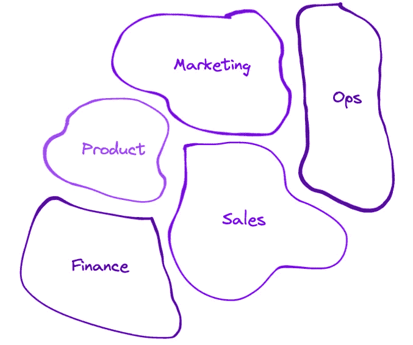
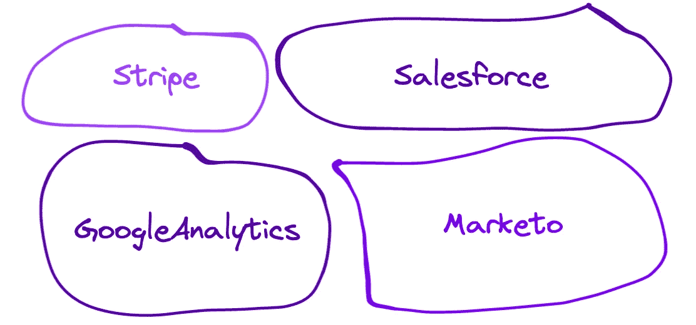
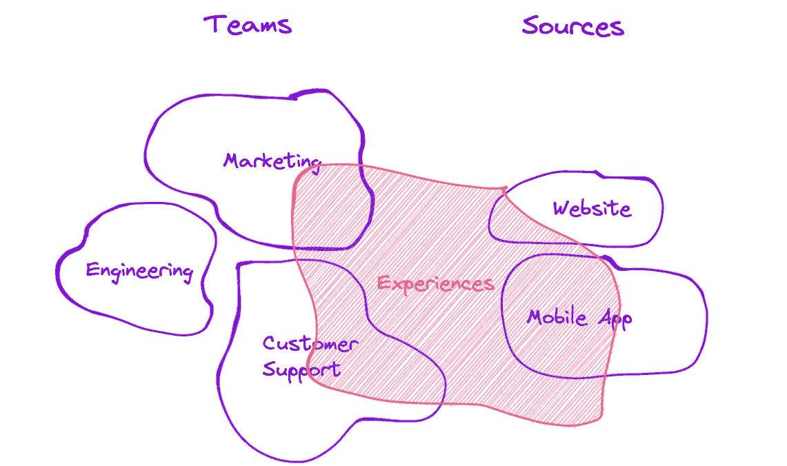

# 你暂时不需要数据领域……

> 原文：[`towardsdatascience.com/you-dont-need-data-domains-yet-23af8ffc3e69`](https://towardsdatascience.com/you-dont-need-data-domains-yet-23af8ffc3e69)

## 解密数据网格领域

 [Louise de Leyritz](https://medium.com/@louise.de.leyritz?source=post_page-----23af8ffc3e69--------------------------------)

·发表于[Towards Data Science](https://towardsdatascience.com/?source=post_page-----23af8ffc3e69--------------------------------) ·阅读时间 7 分钟·2023 年 5 月 23 日

--

你暂时不需要数据领域——图片由[Castor](https://www.castordoc.com)提供

数据网格范式提倡使用数据领域作为将数据划分为有意义组的方式。领域最初引入是为了帮助创建明确的所有权结构并实现更好的数据发现。

尽管这种方法可能有效，但也可能会令人困惑。我已经研究了数据网格领域一年了，但仍然无法完全理解这个概念。因此，我一直在想：我们是否可以在不涉及数据领域的情况下实现更好的所有权和发现？

在一定程度上，我们可以做到。

在这篇文章中，我旨在阐明数据领域的目的，并探索实现这些目标的更简单的替代方法。

从根本上说，数据领域只是组织中数据分组的一种方式。我们为什么要对数据进行划分？有三个原因：

+   使人们更容易找到他们需要的数据。

+   使得在出现问题时能够明确分配所有权和责任。

+   为了提供必要的背景，以便更好地理解数据。

好消息是，大多数公司无需考虑数据领域的概念来处理这三个要素。所以，停止阅读关于数据领域的所有文章，因为你可能不需要它们。或者至少，目前不需要。

为了应对上述要素，公司只需找到良好的数据分组方法，以便于分配所有权和数据发现。幸运的是，有两种你所在组织已经非常熟悉的数据分组方法：*团队*和*来源*。

这些分类方法简单但非常有效，在所有权、发现和理解方面可以实现 90%的工作。通过合理使用这些分类，公司可以在不引入相当复杂的数据领域概念的情况下改善数据管理。

在这篇文章中，我们将探讨如何根据*团队*和*来源*对数据进行分组，以解决所有权和发现挑战。我们还将探讨在组织复杂度增长时何时需要引入数据域的概念。

# 从团队开始

按*团队*进行数据分区将帮助你实现强大的数据发现，并为这些数据的上下文分配所有权。让我们仔细看看基于团队的分区如何帮助实现这两件事。

*基于团队的数据分区* — 图片来源于[Castor](https://www.castordoc.com/)

# 所有权

按照*团队*对数据进行分区在归属数据所有权和确保职责明确方面非常有意义。

在这里，所有权指的是**上下文所有权**，而非技术所有权。这意味着，当我们说市场团队*拥有*市场数据时，我们的意思是他们负责维护这些资产的文档和上下文。

既然我们已经建立了这一点，以下是将数据按*团队*分组的三个有力理由：

**👉 轻松分配所有权**：团队在组织中是非常明确的实体。这样可以轻松地将数据分配给一个团队。团队不会模糊不清，也不会重叠，这使得分配所有权变得非常简单。

**👉 更好的文档**：当团队拥有自己的数据时，数据周围的文档突然变得更有意义。团队对他们负责的过程、目标和指标有深刻的理解。这使他们成为为数据提供上下文的最佳人选。

**👉 职责明确**：按*团队*对数据进行分组，可以明确谁负责为数据资产提供上下文。当一个利益相关者对市场数据有疑问时，他们只需两秒钟就会意识到需要联系市场团队，而不是联系一些模糊领域的所有者。

# 发现

按*团队*分区数据还可以改进数据发现过程，帮助人们更快地找到所需的数据。

每个人都熟悉团队。因此，基于*团队*的数据分区使数据发现变得更加熟悉。这降低了技术能力较差的人的门槛，他们可能会被数据吓到。

基于*团队*进行数据分区也满足了两类寻求数据上下文的人群：**信息寻求者**，他们在寻找特定的信息，以及**探索者**，他们希望浏览数据的全貌。

例如，如果一个**信息寻求者**在寻找市场数据，他们会知道市场团队负责这些数据，他们只需通过“团队 → 市场”来筛选数据即可找到。若他们在理解数据时遇到困难，可以直接向市场团队咨询。

类似地，如果一个探索者希望更好地理解数据策略，他们可能会想要探索市场团队处理的数据类型。通过浏览市场团队的仪表板和知识图谱，他们将更清楚地了解业务的运作方式。

# 继续处理来源

虽然基于*团队*的数据分区对于分配所有权很有帮助，但可能不足以满足发现目的。因此，另一种数据分区方法是基于*来源*，这是商业人员熟悉的另一个元素。

*基于来源的数据分区* — 图片来源于[Castor](https://www.castordoc.com/)

每个人都对数据来源感到熟悉，因为利益相关者使用它们来执行日常任务。例如，销售人员可能不是数据专家，但他们对 Salesforce 了如指掌。因此，他们在探索数据仓库时，应该能够按*来源*进行筛选。

基于*来源*的数据分区也满足了寻找文档的两类人群：**信息寻求者**和**探索者**。

例如，当一个**信息寻求者**在搜索特定信息时，他们会对要寻找的数据来源有清晰的认识。他们可以按*来源*（例如 Salesforce）过滤搜索，轻松找到所需的信息。这提升了发现体验，并减少了数据探索所需的时间。

同样，对于一个**探索者**，如果他们希望获得对数据全貌的更广泛理解，通过来源角度探索数据可能会很有帮助。例如，他们可以确定哪些来源具有最相关或最可信的数据，或识别冗余或不完整的数据。

这种额外的分区层次，与基于*团队*的分区结合，可以提高组织中数据发现的效率。

# 什么时候需要引入数据领域？

一旦你将数据分为这两类，你将有效解决所有所有权问题，以及大部分发现和理解相关的挑战。

然而，一些组织在更复杂的环境中运营，可能需要引入额外的复杂层次，以准确捕捉其业务的细节。

对于这些组织来说，基于*团队*和*来源*的分区可能不足以确保可发现性和所有权。

比如你在 Airbnb 工作。公司已将数据所有权划分到*团队，如*营销、工程和客户支持。他们还根据数据的*来源*对数据进行了分组，区分了网站数据和移动应用数据。

但如果你需要了解平台上体验类项目的定价，例如旅游或烹饪课程，该怎么办？这些信息并不完全适合现有的团队或数据源。这不是营销团队拥有的内容，也不是仅从网站或应用程序中获得的内容。那么，你该怎么办呢？

有时候，数据无法完美地归入两个类别中的任何一个 — 图片由[Castor](https://www.castordoc.com/)提供。

这时，领域（domains）的概念就显得很重要。在这种情况下，Airbnb 需要创建一个新的领域，称为“体验”（Experiences），以捕捉这些数据并确保其得到适当的管理。通过引入这种新的分类层级，他们可以更好地组织数据，并确保重要信息不会被遗漏。

关键要点是，随着公司成长和变得更加复杂，它们可能需要引入新的分类层级来管理数据。

然而，这种新的数据划分方式只有在你拥有一些跨多个团队或来源的信息，并且这些信息无法完美地归入任何一个类别时，才应引入。

# 结论

去中心化数据可能是一个困难的过程，但你应该始终保持简洁。虽然数据领域可以是处理复杂业务需求的有力工具，但你不必在数据旅程的早期就引入它们。

在大多数情况下，*团队*和*来源*足以进行数据划分，确保所有权和可发现性。因此，你应从这些更为熟悉的概念开始，并根据需要逐步增加复杂性。

目标不是引入不必要的复杂性，而是提供一个帮助团队更有效地处理数据的框架。

*最初发布于* [*https://www.castordoc.com*](https://www.castordoc.com/blog/you-dont-need-data-domains-yet)*.*
