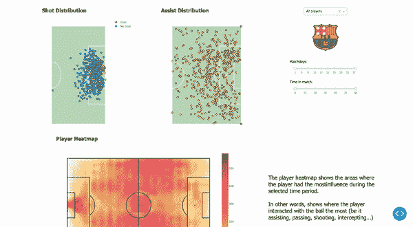

# 你的数据科学可视化将不再相同——Plotly 和 Dash

> 原文：[`towardsdatascience.com/your-data-science-visualizations-will-never-be-the-same-plotly-dash-6327d07d9efb`](https://towardsdatascience.com/your-data-science-visualizations-will-never-be-the-same-plotly-dash-6327d07d9efb)

## 数据可视化

## 使用 Plotly 和 Dash 创建交互式仪表板

[](https://polmarin.medium.com/?source=post_page-----6327d07d9efb--------------------------------)[](https://towardsdatascience.com/?source=post_page-----6327d07d9efb--------------------------------) [Pol Marin](https://polmarin.medium.com/?source=post_page-----6327d07d9efb--------------------------------)

·发布于 [Towards Data Science](https://towardsdatascience.com/?source=post_page-----6327d07d9efb--------------------------------) ·14 min read·2023 年 10 月 24 日

--


由 [Isaac Smith](https://unsplash.com/@isaacmsmith?utm_source=medium&utm_medium=referral) 在 [Unsplash](https://unsplash.com/?utm_source=medium&utm_medium=referral) 提供的照片

不久前，我写了一篇简单的介绍，介绍了四个 Python 数据可视化库，展示了它们的优缺点，并通过实际示例展示了它们的能力。

当我们深入讨论我最喜欢的那些工具时，我强烈建议你先查看那篇文章，因为这篇文章会扩展其中展示的内容：

[](/building-interactive-data-visualizations-with-python-the-art-of-storytelling-ceb43db67488?source=post_page-----6327d07d9efb--------------------------------) ## 使用 Python 构建交互式数据可视化——讲故事的艺术

### Seaborn、Bokeh、Plotly 和 Dash 用于有效传达数据洞察

towardsdatascience.com

今天我们将重点讨论**Plotly**[1]和**Dash**[2]。为什么是两个？因为它们是相辅相成的。正如我在上面链接的文章中所述，“Dash 本身不是一个绘图库。它是一个用于生成仪表板的出色框架。”

所以 Plotly 是我们用来绘图的库，而 Dash 是我们用来从这些图中生成酷炫交互式仪表板的框架。

这是我们今天构建仪表板的步骤：

+   设置和安装——让我们进入正确的状态。

+   一些简单的用例——展示 Plotly 如何工作

+   使用 Dash 构建仪表板——创建最佳仪表板。

+   结论——总结故事并查看结果。

在深入之前，我们需要讨论数据。我们需要某种数据才能进行可视化，对吧？跟上我最新的 Medium 内容，我将专注于体育，更具体地说，是足球（soccer）。

我将使用 Statsbomb 提供的 2015–16 赛季 LaLiga 的免费数据[3]。

那个赛季有很多数据，但我想要可视化巴萨球员的表现，主要集中在进攻方面：射门、进球、助攻……

目的可能会根据分析师的位置有所不同：你是皇马的分析师吗？那我敢肯定你会想要解码你的球队如何阻止梅西（剧透：你做不到）。

但如果你在巴萨组织工作，你可能想要检查一下你球员的数据，看看哪些球员的表现比其他球员更好。

无论是什么情况，始终确保在创建任何仪表板之前定义你的目标——你可以可视化的信息太多了，你必须有目的地选择你想查看的图表。

始终追求简单；非技术人员需要从你的仪表板中得出结论。

## 设置和安装

我喜欢保持事物的有序和结构化。所以我们要做的第一件事是创建一个新的目录在你希望托管应用程序的路径中。为了简单起见，我将在桌面上创建它。这是我在终端上运行的两个命令：

```py
$ cd ~/Desktop
$ mkdir plotly-dash
```

现在，下一步自然是创建一个新的 Python 环境在新的目录中。我将使用`pipenv` [4]，但你可以使用你喜欢的虚拟环境管理工具（或者不使用）。

如果你的机器上还没有安装 pipenv，那么首先运行这个命令：

```py
$ pip install --user pipenv
```

然后，创建环境：

```py
$ cd plotly-dash
$ pipenv shell
```

这将创建一个新的环境并自动激活它。你现在从那个终端安装的任何东西都会只安装在该环境中。

所以让我们开始使用 pip 安装库：

```py
(plotly-dash) $ pip install dash pandas statsbombpy
```

是的，安装这三个库我们会有足够的功能。它们都有自己的依赖关系，我们将利用一些像*Plotly*或*NumPy*的库。

一切准备好后，我们现在可以开始探索 Plotly。

## 使用 Plotly 进行数据可视化

我在这里的建议是从 jupyter notebook 进行测试，因为这将使你的开发阶段更加流畅。在这种情况下，你也应该安装它——我保证这是我们运行的最后一个安装——我们也将打开它：

```py
(plotly-dash) $ pip install notebook
... (installation outputs)

(plotly-dash) $ jupyter notebook
```

像往常一样，我们需要准备数据，我们将创建一个新的笔记本叫做**plotly.ipynb**。为了避免极大的笔记本和文件，我喜欢将我的代码模块化。因此，我在项目文件夹中创建了一个`src`目录，并在其中添加了两个新文件：`functions.py`和`classes.py`。现在的结构如下：

```py
- plotly-dash/
    - src/
        - classes.py
        - functions.py
    - plotly.ipynb
```

我将创建的第一个函数叫做`prepare_team_data()`，它将返回指定球队（在我们这个例子中是巴萨）的事件、射门和助攻数据。

> 由于函数本身对今天的目的并不重要，因为我们想专注于绘制和创建仪表盘，我不会放函数的代码。但你可以在资源部分[5]找到整个代码的链接。

```py
# Third-party libraries
import pandas as pd
from statsbombpy import sb

# Custom modules
from src.functions import prepare_team_data

events, shots, assists = prepare_team_data('Barcelona')
shots.head()
```

这是投篮 DF 的一个快照。


投篮 DF 屏幕截图——图像由作者提供

好的，让我们从投篮开始吧。我想绘制一个球员的投篮分布图，以查看他从哪里射门以及他的进球来自哪里。为此，我在*classes.py*模块中创建了一个`FootballPitch`类。

这个类允许我们绘制一个完整的足球场、它的一半（即进攻半场），或者甚至像我们将要做的那样绘制一个热图。

再次提醒，你可以在本文底部的资源部分找到 GitHub 链接[5]中的代码。但我们会稍微检查一下，因为这是我们使用了很多 Plotly 功能的地方。

这个类基本上有两个方法：`plot_pitch()`和`plot_heatmap`。由于我们首先关注的是展示球员的投篮，所以我们从第一个方法开始，将其分解为小的代码块。

> 请注意，你会看到一些变量和类属性我们没有赋值。这些是函数参数或在创建对象时初始化的。

首先：让我们声明函数将使用的基本变量。

```py
# Fig to update
fig = go.Figure()

# Internal variables
self.height_px = self.pitch_width*10*zoom_ratio
self.width_px = self.pitch_length*10*zoom_ratio

pitch_length_half = self.pitch_length/2 if not self.half else 0
pitch_width_half = self.pitch_width/2
corner_arc_radius = 1

centre_circle_radius = 9.15

goal = 7.32
goal_area_width = goal + (5.5*2)
goal_area_length = 5.5
penalty_area_width = goal_area_width + (11*2)
penalty_area_length = goal_area_length + 11
penalty_spot_dist = 11
penalty_circle_radius = 9.15
```

现在我们已经声明了图形，我们将一遍又一遍地**添加轨迹或形状**以根据我们的需要进行自定义。因此，例如，函数的第一步是绘制一个矩形形状，即足球场本身：

```py
fig.add_trace(
    go.Scatter(
        x=[0, self.pitch_length, self.pitch_length, 0, 0], 
        y=[0, 0, self.pitch_width, self.pitch_width, 0], 
        mode='lines',
        hoverinfo='skip',
        marker_color=line_color,
        showlegend=False,
        fill="toself",
        fillcolor=bg_color
    )
)
```

在这里，我们添加了一个散点图轨迹，模式为`lines`——这意味着我们想要的是一条线，而不是一个有独立点的真正的散点图。参数是相当自解释的，例如 x 和 y（我们想绘制的数据），颜色……hoverinfo 标签用于确定当我们将鼠标悬停在这些线条上时想显示的内容。由于我们将足球场作为背景的一部分构建，并且它不会告诉我们任何关于我们想要分析的数据的信息，所以我将其设置为跳过。

然后我们在图的布局中设置了一些额外的配置：

```py
fig.update_layout(
    yaxis_range=[-self._vertical_margin, self.pitch_width + self._vertical_margin], 
    xaxis_range=[-self._horizontal_margin, self.pitch_length + self._horizontal_margin],
    height=self.height_px,
    width=self.width_px,
    plot_bgcolor='rgba(0,0,0,0)',
    xaxis=dict(showgrid=False, visible=False),
    yaxis=dict(showgrid=False, visible=False)
)
```

这给我们带来了以下结果：


足球场（仅草地）——图像由作者提供

现在我们已经绘制好了我们的足球场。还不是特别有意义……不过。

在 Plotly 中绘图确实如此简单！通过在图中添加更多的轨迹和形状，我的足球场背景最终看起来是这样的：


足球场——图像由作者提供

现在，你可能对显示一个足球场不感兴趣。这就是为什么我没有把所有代码都放在这里……但出色的仪表盘是创造力和技能的结果，而绘制一个足球场是展示发生在场上的足球事件（如果我们对位置感兴趣）的一个很好的方式。

所以，让我们开始展示真实数据吧！

由于我们要显示射门——和进球——**散点图**似乎是一个合适的选择。记住，我们已经准备好了数据，我们只需要过滤和显示它。

让我们绘制梅西的射门和进球：

```py
import plotly.graph_objects as go
from src.classes import FootballPitch

player = 'Leo Messi'

pitch = FootballPitch(half=True)
fig = pitch.plot_pitch(False, bg_color='#C1E1C1') 

player_shots = get_player_shots(player, shots.copy(), pitch)
scatter_colors = ["#E7E657", "#57C8E7"]

for i, group in enumerate([True, False]):
    fig.add_trace(go.Scatter(
        x=player_shots[player_shots['goal'] == group]['x'],
        y=player_shots[player_shots['goal'] == group]['y'],
        mode="markers",
        name='Goal' if group else 'No Goal',
        marker=dict(
            color=scatter_colors[i],
            size=8,
            line=dict(
                color='black',
                width=1
            )
        ),
    ))

fig.update_layout(
    title='Shot distribution'
)
```

第一部分不言而喻：我们只是声明变量，实例化球场，将图形存储在`fig`变量中，并运行一个函数来过滤`shots`数据框，以返回仅玩家的射门数据。

然后，在一个 2 次迭代的循环中，我们添加了两次散点图：一次用于未进球的射门（将显示为蓝色），另一次用于进球的射门。结果：


梅西在 2015/16 赛季的射门和进球分布——图片由作者提供

使 plotly 令人惊叹的是，这个图形是完全互动的。我们可以通过悬停鼠标来查看真实的射门位置，隐藏非进球的射门以仅检查进球射门……

现在让我们继续，构建一个**折线图**。它当然会是互动的，我们将用它来按季度检查球员的射门情况，并将其与队友和球队的平均水平进行比较。

为此，我们将开始按季度（每 15 分钟一段）将射门分组。下一部分将是绘制这些值本身，并调整线条的不透明度，以突出当前的球员（梅西）。

```py
player = 'Leo Messi'
max_shots = 0
fig = make_subplots()

for p in shots.player.unique():
    player_shots = get_player_shots(p, shots)

    xy = 15 * (player_shots[['float_time', 'minutes']]/15).round()
    xy = xy.groupby(['float_time']).count()[['minutes']]

    max_shots = xy.minutes.max() if xy.minutes.max() > max_shots else max_shots

    fig.add_trace(
        go.Scatter(
            name=p,
            x = xy.index, 
            y = xy.minutes,
            mode='lines',
            opacity=1 if p == player else 0.2
        )
    )
```

现在我们已经准备好了所有球员，我们将添加球队的平均值作为虚线。代码的功能与上面的代码片段完全相同，但使用的是团队级的数据。

```py
# Add team's avg
xy = 15 * (shots[['float_time', 'minutes']]/15).round()
xy = xy.groupby(['float_time']).count()[['minutes']]/len(shots.player.unique())

fig.add_trace(
    go.Scatter(
        name="Team's Average",
        x = xy.index, 
        y = xy.minutes,
        line = go.scatter.Line(dash='dash'),
        marker=None,
        mode='lines'
    )
)
```

然后，我们将为布局添加一些样式：

```py
fig.update_xaxes(range=[0, 91])
fig.update_layout(
    #title='Shots by Quarter',
    margin=dict(l=20, r=20, t=5, b=20),
    xaxis = dict(
        tickmode = 'array',
        tickvals = xy.index.values
    ),
    height=200,
    plot_bgcolor="#F9F9F9", 
    paper_bgcolor="#F9F9F9",
    yaxis_range=[-3,max_shots+5]
)
```

结果：


绿色的高亮线是梅西的数据（当我悬停在第 60 分钟的射门计数上时，标签显示）。由于某些原因，也许是疲劳，梅西的射门在 60 到 75 分钟期间减少，但在比赛的最后几分钟却增加了。

我们看到球队的大多数射门在最后 15 分钟减少，但梅西却走向相反的方向。这显示了他对球队的影响和他的胜利欲望。

总之，介绍部分到此为止。我们已经成功绘制了两个不同的图形，并且为我们的图形创建了一个出色的背景。我认为我们已经覆盖了 Plotly 的基本知识。

## 创建仪表板

仪表板只是以有序和吸引人的方式显示的图形组合。我们已经创建了图形——我们在上一部分做的——所以我们只需将它们显示出来。

现在，这并不那么简单。我们需要对上面共享的代码片段进行一些更改，但我保证这些更改会很小。

为了完成仪表板，我将添加一些更多的图形和功能，使其完全互动。

安装了**Dash**之后，我将创建一个名为**app.py**的新文件：

```py
- plotly-dash/
    - src/
        - classes.py
        - functions.py
    - plotly.ipynb
    - app.py
```

文件的模板将开始是这样的简单：

```py
from dash import html, Dash, dcc, Input, Output, callback

app = Dash(__name__) 

if __name__ == '__main__':
    app.run(debug=True)
```

如果你继续执行文件（`python app.py`），你会在终端中看到类似以下的消息：

```py
(plotly-dash) $ python app.py
Dash is running on http://127.0.0.1:8050/

 * Serving Flask app 'app'
 * Debug mode: on
```

请访问[`127.0.0.1:8050/`](http://127.0.0.1:8050/)。你会看到一个空白页面，但这实际上是你的仪表板。

让我们开始添加内容吧？看看下一个代码。

```py
@callback(
    Output('shot_distribution', 'figure'),
    Input('player_dropdown', 'value')
)
def create_shot_distribution(player):
    pitch = FootballPitch(half=True)
    fig = pitch.plot_pitch(False, bg_color='#C1E1C1', zoom_ratio=0.8) 

    player_shots = get_player_shots(player, SHOTS.copy(), pitch)

    scatter_colors = ["#E7E657", "#57C8E7"]

    for i, group in enumerate([True, False]):
        fig.add_trace(go.Scatter(
            x=player_shots[player_shots['goal'] == group]['x'],
            y=player_shots[player_shots['goal'] == group]['y'],
            mode="markers",
            name='Goal' if group else 'No Goal',
            marker=dict(
                color=scatter_colors[i],
                size=8,
                line=dict(
                    color='black',
                    width=1
                )
            ),
            #marker_color=scatter_colors[i] # #E7E657 i #57C8E7  
        ))

    fig.update_layout(
        margin=dict(l=20, r=20, t=5, b=20),
    )

    return fig
```

到现在，这应该听起来很熟悉。这正是我们用来显示梅西射门的代码… 但现在，代替定义为梅西的玩家，它是函数参数。

那这个参数来自哪里？就在函数声明的上方，我们有**回调装饰器**。这些回调使 Dash 的仪表板具有交互性。

我们用它们来确定关联应用组件的输入和输出。在这种情况下，我们说明函数需要`player`参数，这个参数将来自名为`player_dropdown`的元素（我们还未定义）。

关于输出，我们让函数返回`fig`。多亏了回调装饰器，应用知道这将是我们仪表板中的`shot_distribution`元素所用的图形。

你现在可能有很多问题。怎么定义一个下拉框或任何可交互组件？我如何真正绘制`shot_distribution`元素？

从第一个问题开始：下拉框。Dash 有自己的核心组件（dcc），下拉框就是其中之一。创建它非常简单：

```py
dcc.Dropdown(
    PLAYER_OPTIONS,
    'All players', 
    id='player_dropdown', 
    style={'width': '200px', 'margin': '20px auto', 'text-align': 'left'}
)
```

这将创建一个下拉框，使用所有玩家名称作为可能的选项，以`All players`作为默认值。但最重要的是**id**。在这里我们可以告诉 Dash 这个下拉框是与前一个函数的输入回调关联的。

换句话说，这个下拉框的值将是射击分布图上显示的玩家。

但我们仍然需要将这两个组件放入我们的仪表板中。页面依然是空白的。

你现在需要一些 HTML 知识，但基本知识就足够了（尽管它可以复杂到你想要的程度）。

我们需要将这些组件放在 HTML 代码中。Dash 再次使这一过程非常简单。对于下拉框，可以通过简单地用`html.Div`组件包裹代码，即将下拉框放在`<div></div>` HTML 元素中来实现：

```py
filter = html.Div(
    [
        dcc.Dropdown(
            PLAYER_OPTIONS,
            'All players', 
            id='player_dropdown', 
            style={
                'width': '200px', 
                'margin': '20px auto', 
                'text-align': 'left'
            }
        )
    ],
    style={'display': 'inline-block'}
)
```

这个工作的方式是`html.Div`可以有许多子元素（因此是列表），然后我们可以使用 style 属性设置元素的 CSS 样式，它是一个字典。简单吧？

对于射击分布图，等效的代码如下：

```py
shot_distribution_graph = html.Div(
    [
        html.H2('Shot Distribution'),
        dcc.Graph(id='shot_distribution', figure={})
    ], 
    style={
        'padding': '2%',
        'display': 'inline-block'
    }
)
```

结构相同，但为了显示图表，我们使用`dcc.Graph`组件，并且你可能猜到了，id 属性在这里也是关键。它将这个特定组件与我们声明的函数的输出回调关联起来。因此，那里计算的内容将在这里显示。

我们现在已经用 HTML 代码包裹了这些组件。但它们还没有显示出来。我们需要将它们添加到仪表板的布局中：

```py
app.layout = html.Div([
    shot_distribution_graph, filter
], style={
    'width': '1650px', 
    'margin': 'auto'
})
```

这里没有秘密；结构相同，但层级更高。我们将之前的`<div></div>`元素放入一个大的容器中（整个网站容器），并提供一些额外的样式。现在，如果你刷新网站或重新启动应用，你会看到你的初步结果：


投篮分布图 — 图片由作者提供

已经构建出的成果令人惊叹，对吧？这种互动性非常强大。

为了完成这一部分，让我们对另一个我们构建的图表做同样的处理。这一次，我会在这里粘贴整个*新*代码，以便你可以一次性查看所有内容：

```py
# Functions
@callback(
    Output('shots_by_quarter', 'figure'),
    Input('player_dropdown', 'value')
)
def create_shots_by_quarter(player):
    fig = make_subplots()

    max_shots = 0

    for p in SHOTS.player.unique():
        player_shots = get_player_shots(p, SHOTS)

        xy = 15 * (player_shots[['float_time', 'minutes']]/15).round()
        xy = xy.groupby(['float_time']).count()[['minutes']]

        max_shots = xy.minutes.max() if xy.minutes.max() > max_shots else max_shots

        fig.add_trace(
            go.Scatter(
                name=p,
                x = xy.index, 
                y = xy.minutes,
                mode='lines',
                opacity=1 if p == player else 0.2
            )
        )

    # Add team's avg
    xy = 15 * (SHOTS[['float_time', 'minutes']]/15).round()
    xy = xy.groupby(['float_time']).count()[['minutes']]/len(SHOTS.player.unique())

    fig.add_trace(
        go.Scatter(
            name="Team's Average",
            x = xy.index, 
            y = xy.minutes,
            line = go.scatter.Line(dash='dash'),
            marker=None,
            mode='lines'
        )
    )

    fig.update_xaxes(range=[0, 91])
    fig.update_layout(
        margin=dict(l=20, r=20, t=5, b=20),
        xaxis = dict(
            tickmode = 'array',
            tickvals = xy.index.values
        ),
        height=200,
        plot_bgcolor="#F9F9F9", 
        paper_bgcolor="#F9F9F9",
        yaxis_range=[-3,max_shots+5]
    )

    return fig

# Dashboard's layout components
shots_by_quarter = html.Div(
    [
        html.H2('Shots By Quarter', style={'margin-top': '20px'}),
        dcc.Graph(id='shots_by_quarter', figure={})
    ],
    style={
        'padding': '2%'
    }
)

# Create layout
app = Dash(__name__)
app.layout = html.Div([
    shot_distribution_graph, filter, shots_by_quarter
], style={'width': '1650px', 'margin': 'auto'})

# Run app
if __name__ == '__main__':
    app.run(debug=True)
```


结果仪表盘包含两个图表 — 图片由作者提供

现在，这个是功能性的。但它真的不太吸引人……HTML 和 CSS 将是使其视觉上更具吸引力的工具（尽管我在设计方面不太擅长）。

然而，这超出了我们的范围。我们的目标是创建一个仪表盘，我们已经实现了。这虽然非常简单，但如果你能够理解我们做的所有内容，最终的仪表盘是如何完成的，我在开始时分享了，也将在下一节再次分享，你就不会对它感到陌生（同样，底部的代码是自由获取的）。

## 总结

今天我们构建了一个包含两个图表和一个下拉框的仪表盘。但我们可以根据需要进行扩展。例如，了解如何放置一个下拉框后，我们就知道如何放置一个滑块。那两个呢？

**我们今天学到的所有内容都可以应用于任何你想要可视化的数据，** 从经济报告到医疗结果或广告活动洞察。我选择将其应用于足球，因为我对足球充满热情，但请将这些知识普及到其他领域。

了解如何放置两个图表后，我们可以创建更多的图表。而且是不同类型的：一个展示助攻，另一个展示球员在场上的影响，还有比较他的进球和预期进球……再加上一点 HTML 和 CSS，我们就能得到最终的仪表盘：



最终仪表盘 — 图片由作者提供

我真的希望你能看到这个工具的强大之处。

Dash 和 Plotly 必须是任何数据分析师的技能库中的必备工具。它们是非常棒的库，我们可以用来以高度定制的方式分享我们的数据和见解——即根据你的需求进行调整——并且容易理解。

```py
**Thanks for reading the post!** 

I really hope you enjoyed it and found it insightful.

Follow me and subscribe to my mail list for more 
content like this one, it helps a lot!

**@polmarin**
```

## 资源

[1] [Plotly: 低代码数据应用开发](https://plotly.com/)

[2] [Dash 文档和用户指南 — Plotly](https://dash.plotly.com/)

[3] [免费数据 | StatsBomb](https://statsbomb.com/what-we-do/hub/free-data/)

[4] [Pipenv: 人性化的 Python 开发工作流程](https://pipenv.pypa.io/)

[5] [Plotly & Dash 项目代码 — GitHub](https://github.com/polmarin/plotly-dash)
