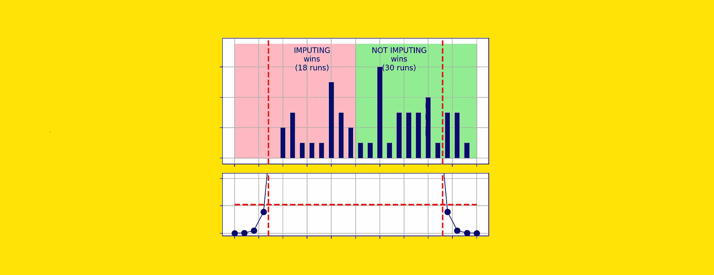

# 你的数据集有缺失值？什么都别做！

> 原文：[`towardsdatascience.com/your-dataset-has-missing-values-do-nothing-10d1633b3727?source=collection_archive---------3-----------------------#2023-10-09`](https://towardsdatascience.com/your-dataset-has-missing-values-do-nothing-10d1633b3727?source=collection_archive---------3-----------------------#2023-10-09)

## 模型在处理缺失值方面比填补方法更有效。这是一个实证证明。

 [Samuele Mazzanti](https://medium.com/@mazzanti.sam?source=post_page-----10d1633b3727--------------------------------)

·

[关注](https://medium.com/m/signin?actionUrl=https%3A%2F%2Fmedium.com%2F_%2Fsubscribe%2Fuser%2Fe16f3bb86e03&operation=register&redirect=https%3A%2F%2Ftowardsdatascience.com%2Fyour-dataset-has-missing-values-do-nothing-10d1633b3727&user=Samuele+Mazzanti&userId=e16f3bb86e03&source=post_page-e16f3bb86e03----10d1633b3727---------------------post_header-----------) 发表在 [Towards Data Science](https://towardsdatascience.com/?source=post_page-----10d1633b3727--------------------------------) · 10 分钟阅读·2023 年 10 月 9 日

--

[作者图片]

缺失值在真实数据集中非常常见。随着时间的推移，已经提出了许多处理这一问题的方法。通常，这些方法要么是删除包含缺失值的数据，要么是使用某些技术进行填补。

在本文中，我将测试第三种替代方案：

> 什么都不做。

确实，对于表格数据集（即 XGBoost、LightGBM 和 CatBoost），最好的模型能够原生处理缺失值。因此，我将尝试回答的问题是：

> 这些模型能有效处理缺失值吗，还是我们通过初步填补会得到更好的结果？

# 谁说我们应该关心缺失值？

似乎存在一种**普遍的信念，即我们必须对缺失值采取*某种措施***。例如，我问了 ChatGPT 如果我的数据集包含缺失值应该怎么做，它建议了 10 种不同的处理方法（你可以在[这里](https://chat.openai.com/share/d65dcaff-ce67-4fac-b54a-31b1f00f50ba)阅读完整回答）。
