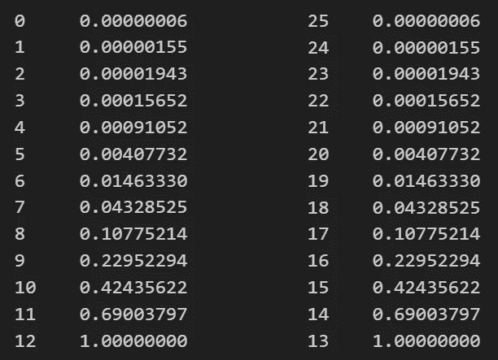

# 你的数据集有缺失值？什么都不做！

> 原文：[`towardsdatascience.com/your-dataset-has-missing-values-do-nothing-10d1633b3727`](https://towardsdatascience.com/your-dataset-has-missing-values-do-nothing-10d1633b3727)

## 模型能够比填补方法更有效地处理缺失值。这是一个实证证明。

[](https://medium.com/@mazzanti.sam?source=post_page-----10d1633b3727--------------------------------)[](https://towardsdatascience.com/?source=post_page-----10d1633b3727--------------------------------) [Samuele Mazzanti](https://medium.com/@mazzanti.sam?source=post_page-----10d1633b3727--------------------------------)

·发表于 [Towards Data Science](https://towardsdatascience.com/?source=post_page-----10d1633b3727--------------------------------) ·10 分钟阅读·2023 年 10 月 9 日

--


[作者提供的图片]

缺失值在真实数据集中非常常见。随着时间的推移，许多方法被提出以解决这个问题。通常，这些方法要么是删除包含缺失值的数据，要么是使用一些技术进行填补。

在这篇文章中，我将测试第三种替代方案：

> 什么都不做。

实际上，最适合表格数据集的模型（即 XGBoost、LightGBM 和 CatBoost）可以原生处理缺失值。因此，我将尝试回答的问题是：

> 这些模型是否能有效处理缺失值，还是通过预处理填补能获得更好的结果？

# 谁说我们应该关心缺失值？

似乎存在一种**普遍的信念，认为我们必须对缺失值做*一些事情***。例如，我问了 ChatGPT，如果我的数据集包含缺失值应该怎么办，它建议了 10 种不同的解决方法（你可以在[这里](https://chat.openai.com/share/d65dcaff-ce67-4fac-b54a-31b1f00f50ba)阅读完整回答）。

那么，这种信念来自哪里呢？

通常，这些观点源于历史模型，特别是线性回归。这也是如此。让我们看看原因。

假设我们有这样一个数据集：


一个缺失值的数据集。[作者提供的图片]

如果我们尝试在这些特征上训练线性回归，会出现错误。事实上，为了能够进行预测，线性回归需要将每个特征乘以一个数值系数。如果一个或多个特征缺失，就无法对该行进行预测。

这就是为什么提出了许多填补方法。例如，最简单的方法之一是用特征的均值替换缺失值。


使用特征均值填补。[图片由作者提供]

另一种更复杂的方法是利用变量之间的关系来预测填补特定条目的最可能值。这意味着为每个特征训练一个预测模型（使用其他特征作为预测变量）。


迭代填补：每个特征通过其他所有特征来估计。[图片由作者提供]

然而，并非所有模型都像线性回归一样。

实际上，碰巧的是，表格任务中表现最好的模型（即树模型，如 XGBoost、LightGBM 和 CatBoost）可以原生处理缺失值。

这怎么可能？

因为在树状结构中，缺失值可以像其他值一样处理，即模型可以将它们分配到树的某个分支上。例如，这张图片来自 XGBoost 文档：


树模型如何处理缺失值。[图片来自[XGBoost 文档](https://xgboost.readthedocs.io/en/stable/tutorials/feature_interaction_constraint.html)]

正如你所见，对于每个分裂，XGBoost 会选择一个默认分支，将缺失值（如果有的话）路由到该分支上。

所以，我们是否说因为这些模型可以处理缺失值，我们就应该避免填补？我从未这么说过。

作为数据科学家，我们通常希望在**实践中**有深刻的了解。因此，接下来的段落将重点比较有无填补的模型性能，并观察哪种方法表现更好。

# 使用真实数据集进行实验

我们的目标是比较两种方法：

1.  在**具有缺失值**的数据集上训练和测试模型。

1.  在没有缺失值的数据集上训练和测试模型（在这些缺失值**通过某种填补方法填补后**）。

我将使用 14 个在[Pycaret](https://github.com/pycaret/pycaret)中提供的真实数据集（这是一个受[MIT 许可证](https://github.com/pycaret/pycaret/blob/master/LICENSE)保护的 Python 库）。

这些数据集不包含缺失值，所以我们需要人为制造这些缺失值。我将这个过程称为空值播撒，因为它涉及在原始数据集中散布空值（即“取消”一些原始值）。

我们要取消多少值？为了确保实验具有代表性，我们将尝试不同百分比的空值：5%、10%、20% 和 50%。


不同百分比的空值播撒。[图片由作者提供]

我使用两种不同的策略来创建空值：

+   **随机**：为数据集的每个条目分配一个介于 0 和 1 之间的随机值，如果小于阈值，则该条目被取消。

+   **非随机**：对于每个特征，我将值按升序或降序排序，并根据值在排序序列中的位置分配一个相应的取消概率。

此外，对于每种组合，我将尝试 25 种不同的随机训练/测试划分。这样做的目的是确保我们观察到的结果在多次重复中是一致的，而不仅仅是偶然的。

总结一下，这些都是我将尝试的所有组合。


形成我们实验的组合。[图像来源：作者]

对于这 2,800 种组合中的每一种，我将计算 LightGBM 在三种不同方法下的平均精度（在测试集上）：

1.  使用原始数据集（**没有缺失值**）。我将称这个平均精度为`ap_original`。

1.  使用包含**我已经撒入缺失值的数据集**。我将称这个平均精度为`ap_noimpute`。

1.  使用**已用 Scikit-Learn 的 IterativeImputer 填充缺失值**的数据集。我将称这个平均精度为`ap_impute`。

让我们借助图示来阐明这三种指标之间的差异：


3 个版本的数据集。每个版本上训练了不同的 LightGBM。[图像来源：作者]

# 结果

我尝试了上述所有 2,800 种组合，并跟踪了每一种的`ap_original`、`ap_noimpute`和`ap_impute`。我将结果存储在类似这样的表格中：


实验结果。[图像来源：作者]

这个表格有 112 行（即 14 个数据集 x 2 种缺失值撒入策略 x 4 种缺失频率）。前三列指示哪个数据集、缺失值撒入策略和缺失频率标识那一行。然后，有三列存储该方法在 25 次 bootstrap 迭代中报告的平均精度。

为了更加清楚，让我们看看第一行的第四列。这是一个包含 25 个元素的数组：每个元素都是 LightGBM 在原始数据集上（因此称之为`ap_original`）在特定训练/测试划分（即 bootstrap 迭代）中实现的平均精度，数据集“bank”包含 5%的随机撒入缺失值。

当然，我们对每一个单独的 bootstrap 迭代并不感兴趣，所以我们需要以某种方式聚合这些数组。由于我们希望比较三种方法，最简单的聚合方式是统计一种方法优于另一种方法的次数（即它具有更高的平均精度）。

因此，对于表格中的每一行，我计算了：

+   `ap_original` > `ap_noimpute`，这意味着在原始数据集上的模型优于在包含缺失值的数据集上的模型。

+   `ap_noimpute` > `ap_impute`，这意味着在包含缺失值的数据集上的模型优于在使用 IterativeImputer 填充的数据集上的模型。

这是结果：


实验结果。[图像来源：作者]

例如，如果我们取第一行的最后一列，这意味着在 25 次迭代中，`ap_noimpute`在 60%的情况下大于`ap_impute`。

让我们看看名为`original_>_noimpute`的列。显然，大多数情况下是 100%。这也是合理的：模型在原始数据集上训练的效果优于在取消了一些条目的数据集上训练的模型。

但对我们来说最重要的信息在最后一列。实际上：

+   当`noimpute_>_impute`大于 50%时，这意味着在大多数情况下，基于空数据集训练的模型优于基于填补数据集训练的模型。

+   当`noimpute_>_impute`小于 50%时，情况正好相反。

所以我们可能会倾向于简单地取这一列的均值，并根据全局均值是高于还是低于 50%来决定哪种方法效果更好。

但是如果我们这样做，我们可能会被偶然性所误导。实际上，如果一个值接近 50%，比如 48%或 52%，这可能很容易是由于随机性造成的。为了考虑这一点，我们需要将其框定为一个统计测试。

# 设定统计测试

为了避免被偶然性欺骗，我将采取几个预防措施。

首先，我只保留那些原始数据集上的平均精度大于缺失数据集上的平均精度超过 90%的情况（换句话说，我只保留`original_>_noimpute` > .90 的行）。

我这样做是因为我想保留只有那些缺失值对模型性能有明显负面影响的情况。在这样做之后，最初 112 行的表格中，只剩下 48 行。

其次，我需要计算一个“显著性阈值”，帮助我们理解一个值是否显著。

我们已经说过，当一个值非常接近 50%时，比如 48%或 52%，那么这很可能只是由于偶然性造成的。但是“非常接近”到底有多接近呢？要回答这个问题，我们需要一些统计数据。

**我们想要测试的假设**（即零假设）是**填补或不填补没有区别**。这就像说`ap_impute`大于`ap_noimpute`（或反之）的概率是 50%。由于我们有 25 次独立的迭代，我们可以通过二项分布计算获得特定结果的概率。

例如，假设在 25 次迭代中，`ap_impute`在 10 次迭代中优于`ap_noimpute`。这个结果与我们的假设有多兼容？

```py
from scipy.stats import binom

binom.cdf(k=10, n=25, p=.50) * 2

# result: 0.42435622
```

因此，获得一个与 10 一样极端的结果的概率，在我们的假设下，是 42%。

请注意，我将二项分布的累积分布函数乘以 2，因为我们对双尾 p 值感兴趣。我们可以通过查看与任何可能结果相关的 p 值来再次确认这一点：



与任何可能结果相关的 p 值（来自 25 次迭代）。 [图片来源：作者]

与 12 和 13 相关的 p 值恰好是 100%。这也是合理的：获得至少与 12 或 13 一样极端的结果的概率必然是 100%，因为它们是最不极端的结果，鉴于我们的假设。

那么，我们的显著性水平是多少？按照惯例，我将取 1%的显著性水平。然而，我们必须考虑到我们有许多次运行，而不仅仅是一次，因此我们必须相应地调整显著性水平。由于我们有 48 次运行，我将使用[Bonferroni 校正](https://en.wikipedia.org/wiki/Bonferroni_correction)，简单地将 1%除以 48，得到最终显著性水平 0.0002。

将这个数字与上述 p 值进行比较，这意味着我们将只在运行中成功次数少于 3 次或多于 22 次（包括）时考虑显著。

现在我们已经采取措施以避免被偶然因素欺骗，我们准备查看结果。

为了简化起见，我们将度量标准设为`ap_noimpute`大于`ap_impute`的次数百分比。例如，如果基于包含缺失值的数据集的模型在 25 次迭代中的 10 次中表现出比插补数据集的模型更好的平均精度，则该度量为 40%。

由于我们有 48 次运行，我们将得到 48 个值。因此，让我们创建一个柱状图来查看所有值。


实验结果。[作者提供的图片]

红色虚线标识了显著性阈值：任何小于 12%（包括）或大于 88%（包括）的值都是显著的（12%和 88%分别对应 3/25 和 22/25）。

从柱状图中，我们可以看到**当我们不插补缺失值时，在 48 次运行中的 30 次中获得了更好的结果**（63%）。在这 30 个案例中的 7 个，结果极端到根据 1% p 值及 Bonferroni 调整也是统计显著的。相反，在 18 个插补胜出的案例中，结果从未显著地不同于纯粹的偶然。

基于这些结果，我们可以说**插补与不插补之间的差异要么不显著，要么显著地偏向于不插补**。

简而言之，没有理由插补缺失值。

# 结论

在这篇文章中，我们通过实证证明了插补与不插补之间的差异要么不显著，要么显著地偏向于不插补。如果你还考虑到不插补缺失值会使你的管道更干净、更快速，那么当可以做到这一点时，留空数据集中的空值应该是标准。

当然，这并非总是可能的。一些不能处理缺失值的模型，比如线性回归或 K 均值。

不过，好消息是，当你使用最常见的表格任务模型（即基于树的模型）时，不插补缺失值而让模型处理它们是最有效和高效的方法。

*你可以通过* [*这个笔记本*](https://github.com/smazzanti/tds_your_dataset_has_missing_values_do_nothing/blob/main/missing-values-do-nothing.ipynb)*复现本文中使用的所有代码。*

*感谢阅读！*

*如果你觉得我的工作有用，可以订阅* [***每次我发布新文章时收到邮件***](https://medium.com/@mazzanti.sam/subscribe) *(通常每月一次)*。

*想要对我的工作表示支持吗？你可以* [***请我喝杯卡布奇诺***](https://ko-fi.com/samuelemazzanti)*。*

*如果你愿意，* [***在 Linkedin 上添加我***](https://www.linkedin.com/in/samuelemazzanti/)*！*
