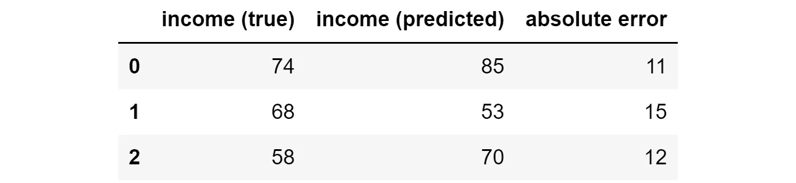
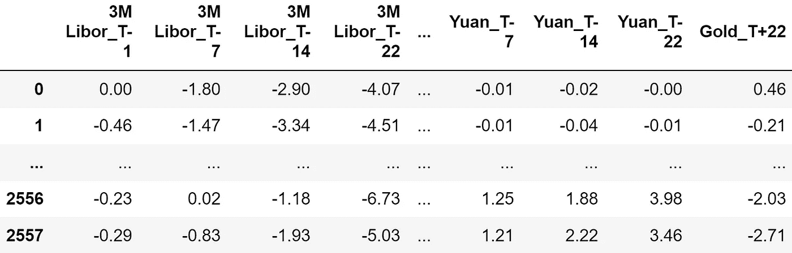
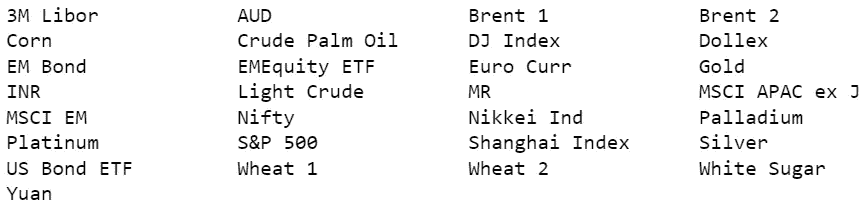
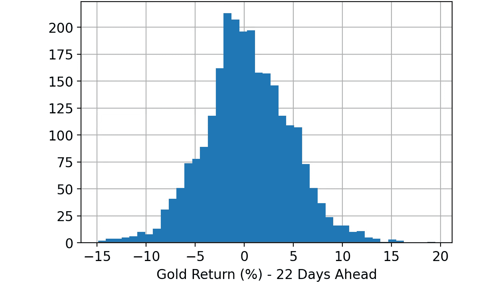
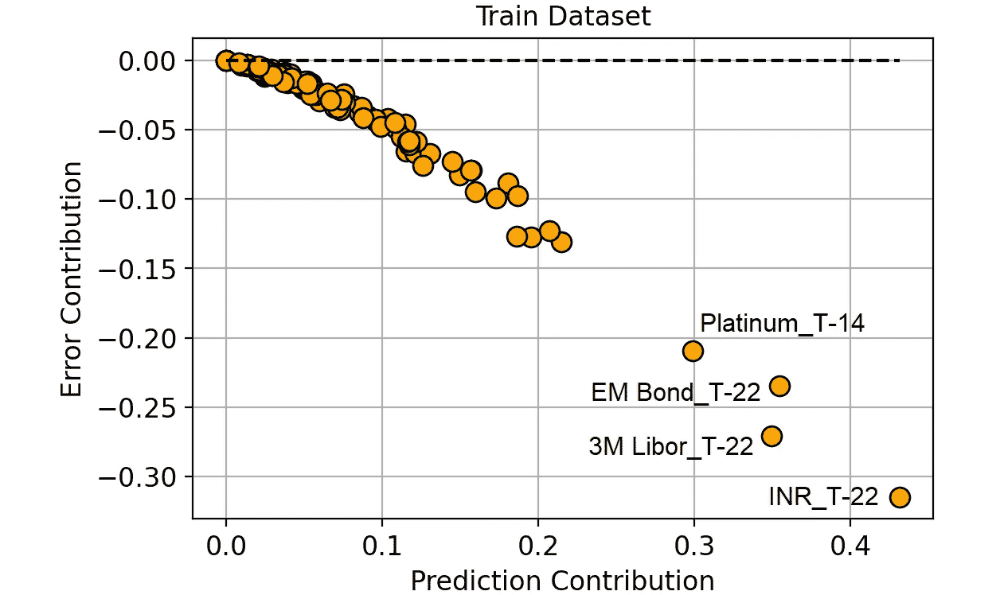
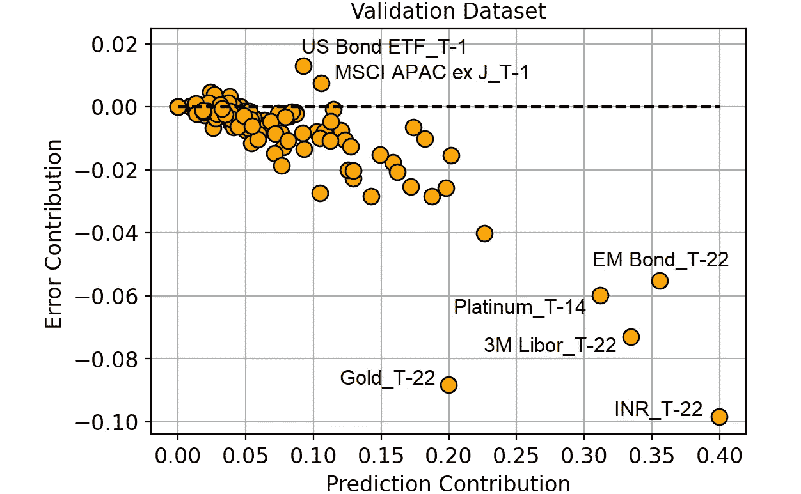
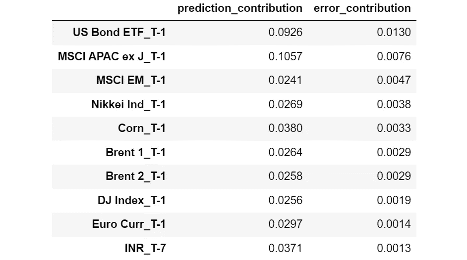
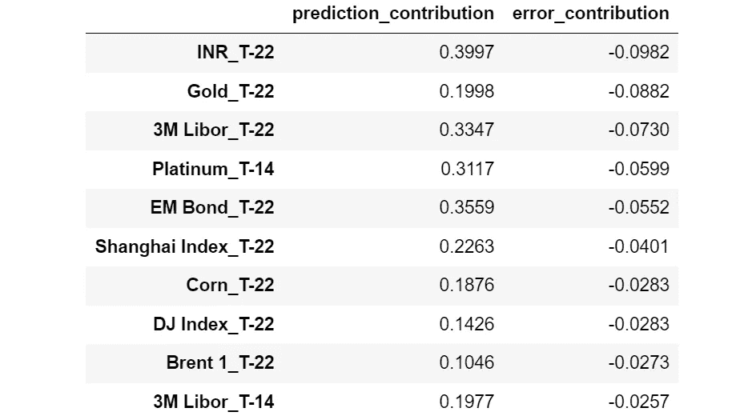
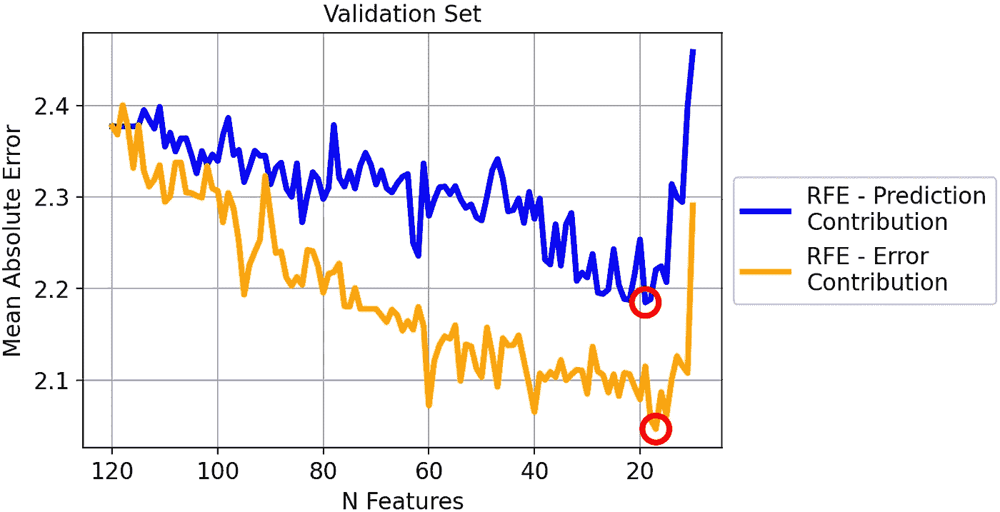
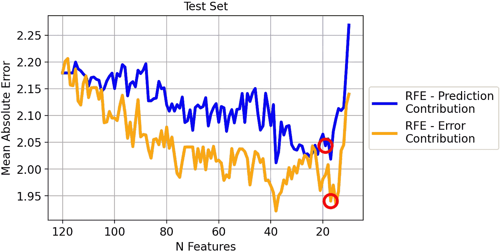

# 你的特征重要吗？这并不意味着它们是好的

> 原文：[`towardsdatascience.com/your-features-are-important-it-doesnt-mean-they-are-good-ff468ae2e3d4`](https://towardsdatascience.com/your-features-are-important-it-doesnt-mean-they-are-good-ff468ae2e3d4)

## “特征重要性”是不够的。如果你想知道哪些特征对模型有益，你还需要关注“错误贡献”。

[](https://medium.com/@mazzanti.sam?source=post_page-----ff468ae2e3d4--------------------------------)[](https://towardsdatascience.com/?source=post_page-----ff468ae2e3d4--------------------------------) [Samuele Mazzanti](https://medium.com/@mazzanti.sam?source=post_page-----ff468ae2e3d4--------------------------------)

·发表于 [Towards Data Science](https://towardsdatascience.com/?source=post_page-----ff468ae2e3d4--------------------------------) ·10 分钟阅读·2023 年 8 月 21 日

--


[作者提供的图片]

# “重要”和“好”并不是同义词

“特征重要性”这一概念在机器学习中被广泛使用，是最基本的模型可解释性类型。例如，它在递归特征消除（RFE）中被使用，用于迭代地删除模型中最不重要的特征。

然而，对于这一点存在一种误解。

> **一个特征重要并不意味着它对模型有益！**

实际上，当我们说一个特征重要时，这仅仅意味着该特征对模型的预测贡献很高。但我们应考虑到**这种贡献可能是错误的**。

举个简单的例子：一个数据科学家不小心忘记了模型特征中的客户 ID。模型将客户 ID 作为一个高度预测性特征。因此，即使这个特征实际上在降低模型性能，因为它无法在未见数据上良好运行，这个特征的重要性也会很高。

为了让事情更清楚，我们需要区分两个概念：

+   **预测贡献**：预测中有多少部分是由于特征；这等同于特征重要性。

+   **错误贡献**：预测错误中有多少部分是由于模型中存在该特征。

在本文中，我们将探讨如何计算这些量，并如何利用它们获得有关预测模型的有价值的见解（并加以改进）。

> 注意：本文专注于回归案例。如果你对分类案例更感兴趣，可以阅读“哪些特征对你的分类模型有害？”

# 从一个玩具示例开始

假设我们建立了一个模型，以根据人们的工作、年龄和国籍来预测收入。现在我们使用该模型对三个人进行预测。

因此，我们有实际值、模型预测和结果误差：



实际值、模型预测和绝对误差（以千美元计）。[作者提供的图片]

# 计算“预测贡献”

当我们有一个预测模型时，我们可以始终将模型预测分解为各个特征带来的贡献。这可以通过 SHAP 值来完成（如果你不知道 SHAP 值的工作原理，可以阅读我的文章：SHAP 值解释：正如你希望有人向你解释的那样）。

所以，假设这些是我们模型对三个人的 SHAP 值。


我们模型预测的 SHAP 值（以千美元计）。[作者提供的图片]

SHAP 值的主要特性是它们是可加的。这意味着——通过对每一行求和——我们将得到该个体的模型预测。例如，如果我们取第二行：72k $ +3k $ -22k $ = 53k $，这正是模型对第二个体的预测。

现在，SHAP 值是特征对我们预测重要性的良好指标。确实，SHAP 值的绝对值越高，特征对该特定个体预测的影响越大。注意，我在这里讨论的是绝对 SHAP 值，因为符号并不重要：一个特征无论是使预测值上升还是下降，其重要性是相同的。

因此，**特征的预测贡献等于该特征绝对 SHAP 值的均值**。如果你在 Pandas 数据框中存储了 SHAP 值，这非常简单：

```py
prediction_contribution = shap_values.abs().mean()
```

在我们的示例中，结果如下：


预测贡献。[作者提供的图片]

如你所见，工作（job）显然是最重要的特征，因为它在平均情况下占据了最终预测的 71.67k $。国籍（nationality）和年龄（age）分别是第二和第三重要的特征。

然而，某个特征对最终预测的重要性并不能说明该特征的表现。为了考虑这一方面，我们需要计算“误差贡献”。

# 计算“误差贡献”

假设我们想回答以下问题：“如果模型没有特征*工作*，会做出什么预测？”SHAP 值允许我们回答这个问题。事实上，由于它们是可加的，我们只需从模型做出的预测中减去与特征*工作*相关的 SHAP 值即可。

当然，我们可以对每个特征重复这一过程。在 Pandas 中：

```py
y_pred_wo_feature = shap_values.apply(lambda feature: y_pred - feature)
```

结果如下：


如果去掉相应特征后得到的预测值。[图片由作者提供]

这意味着，如果我们没有*工作*这个特征，那么模型会预测第一位个体 20k 美元，第二位个体-19k 美元，第三位个体-8k 美元。相反，如果我们没有*年龄*这个特征，模型会预测第一位个体 73k 美元，第二位个体 50k 美元，以此类推。

如你所见，如果我们去掉不同的特征，每个个体的预测变化很大。因此，预测误差也会非常不同。我们可以轻松地计算它们：

```py
abs_error_wo_feature = y_pred_wo_feature.apply(lambda feature: (y_true - feature).abs())
```

结果如下：


如果去掉相应特征后得到的绝对误差。[图片由作者提供]

这些是我们如果去掉相应特征后会得到的错误。直观地说，如果误差很小，那么去掉该特征对模型没有问题——甚至是有益的。如果误差很高，那么去掉特征则不是一个好主意。

但我们还可以做更多。事实上，我们可以计算完整模型的错误与去掉特征后得到的错误之间的差异：

```py
error_diff = abs_error_wo_feature.apply(lambda feature: abs_error - feature)
```

这就是：


模型的错误与去掉特征后我们会得到的错误之间的差异。[图片由作者提供]

如果这个数字是：

+   如果是负的，那么特征的存在会减少预测误差，因此该特征对该观察结果很有效！

+   如果是正的，那么特征的存在会导致预测误差增加，因此该特征对该观察结果是不利的。

**我们可以计算“误差贡献”，作为每个特征这些值的均值**。在 Pandas 中：

```py
error_contribution = error_diff.mean()
```

结果如下：


误差贡献。[图片由作者提供]

如果这个值是正的，那么这意味着，平均而言，特征的存在导致模型的错误增加。因此，没有这个特征，预测会更好。换句话说，这个特征的负面影响大于正面影响！

相反，这个值越负，特征对预测的益处越大，因为其存在导致更小的误差。

让我们尝试在实际数据集上使用这些概念。

# 预测黄金回报

从现在起，我将使用来自[Pycaret](https://github.com/pycaret/pycaret)（一个[MIT 许可](https://github.com/pycaret/pycaret/blob/master/LICENSE)的 Python 库）的数据集。该数据集名为“Gold”，包含财务数据的时间序列。



数据集样本。特征都以百分比表示，因此 -4.07 意味着 -4.07% 的回报。[图片由作者提供]

特征由观察时刻前 22、14、7 和 1 天的金融资产回报组成（“T-22”、“T-14”、“T-7”、“T-1”）。这是所有用作预测特征的金融资产的详尽列表：



可用资产列表。每个资产在时间 -22、-14、-7 和 -1 被观察到。[作者提供的图片]

总共有 120 个特征。

目标是预测 22 天后的黄金价格（回报） (“Gold_T+22”)。让我们来看看目标变量。



变量的直方图。[作者提供的图片]

一旦加载了数据集，这些是我进行的步骤：

1.  随机拆分完整数据集：33%分配给训练数据集，另 33%分配给验证数据集，其余 33%分配给测试数据集。

1.  在训练数据集上训练一个 LightGBM 回归模型。

1.  使用前一步训练的模型对训练、验证和测试数据集进行预测。

1.  计算训练、验证和测试数据集的 SHAP 值，使用 Python 库“shap”。

1.  计算每个特征在每个数据集上的预测贡献和错误贡献（训练集、验证集和测试集），使用我们在前一段看到的代码。

# 比较预测贡献和错误贡献

比较训练数据集中错误贡献和预测贡献。我们将使用散点图，其中点表示模型的 120 个特征。



预测贡献与错误贡献（在训练数据集上）。[作者提供的图片]

在训练集中，预测贡献与错误贡献之间存在高度负相关。

这很有意义：**因为模型在训练数据集上学习，它倾向于将高重要性（即高预测贡献）分配给那些导致预测错误大幅减少的特征（即高度负的错误贡献）**。

但这并没有增加我们对知识的了解，对吧？

确实，我们真正关心的是验证数据集。验证数据集实际上是我们可以用来了解特征在新数据上表现的最佳代理。因此，让我们在验证集上做相同的比较。



预测贡献与错误贡献（在验证数据集上）。[作者提供的图片]

从这个图中，我们可以提取出一些更有趣的信息。

图表右下角的特征是模型正确地赋予高重要性的特征，因为这些特征实际上降低了预测错误。

同时，请注意“Gold_T-22”（观察期前 22 天的黄金回报）与模型赋予的权重相比表现非常好。这意味着**这个特征可能存在欠拟合**。这一点特别有趣，因为黄金是我们试图预测的资产（“Gold_T+22”）。

另一方面，**误差贡献高于 0 的特征使我们的预测变得更差**。例如，“US Bond ETF_T-1”平均改变了模型预测 0.092%（预测贡献），但使模型预测比没有该特征时平均差 0.013%（误差贡献）。

我们可以假设**所有具有高误差贡献（相对于其预测贡献）的特征可能存在过拟合**，或者通常它们在训练集和验证集中的表现不同。

让我们看看哪些特征的误差贡献最大。



按误差贡献递减排序的特征。[图片来源]

现在是误差贡献最低的特征：



按误差贡献递增排序的特征。[图片来源]

有趣的是，我们可以观察到所有高误差贡献的特征与 T-1（观察时刻前 1 天）相关，而几乎所有低误差贡献的特征与 T-22（观察时刻前 22 天）相关。

这似乎表明**最新的特征容易过拟合，而时间更久远的特征往往更容易泛化**。

请注意，如果没有误差贡献，我们永远不会知道这个洞察。

# 使用误差贡献的 RFE

传统递归特征消除（RFE）方法基于移除不重要的特征。这相当于首先移除预测贡献小的特征。

然而，根据我们在上一段所说的，首先移除误差贡献最大的特征会更有意义。

为了验证我们的直觉，让我们比较这两种方法：

+   **传统 RFE：首先移除无用特征**（预测贡献最低）。

+   **我们的 RFE：首先移除有害特征**（误差贡献最高）。

让我们看看验证集上的结果：



两种策略在验证集上的平均绝对误差。[图片来源]

每种方法的最佳迭代已被圈出：传统 RFE（蓝线）的模型有 19 个特征，而我们的 RFE（橙线）的模型有 17 个特征。

一般而言，我们的方法似乎效果良好：移除误差贡献最大的特征比移除预测贡献最大的特征会导致一致较小的 MAE。

然而，你可能会认为这只因为我们对验证集进行了过拟合。毕竟，我们关心的是在测试集上获得的结果。

所以让我们看看在测试集上的相同比较。



测试集上两种策略的均绝对误差。[作者提供的图片]

结果与之前的相似。即使两条线之间的距离较小，但通过移除最高误差贡献者获得的 MAE 显然优于通过移除最低预测贡献者获得的 MAE。

由于我们选择了在验证集上导致最小 MAE 的模型，让我们看看它们在测试集上的结果：

+   RFE-预测贡献（19 个特征）。测试集上的 MAE：2.04。

+   RFE-误差贡献（17 个特征）。测试集上的 MAE：1.94。

因此，使用我们的方法的最佳 MAE 比传统 RFE 提高了 5%！

# 结论

特征重要性概念在机器学习中起着基础性的作用。然而，“重要性”这一概念常常被误解为“优越性”。

为了区分这两个方面，我们引入了两个概念：预测贡献和误差贡献。这两个概念都基于验证数据集的 SHAP 值，文章中我们展示了计算这些值的 Python 代码。

我们还在一个真实的金融数据集上进行了尝试（该任务是预测黄金价格），并证明基于误差贡献的递归特征消除方法相比于基于预测贡献的传统 RFE，能使均绝对误差提高 5%。

*所有用于本文的代码可以在* [*这个笔记本*](https://github.com/smazzanti/tds_features_important_doesnt_mean_good/blob/main/regression.ipynb)*找到。*

*感谢阅读！*

*如果你觉得我的工作有用，你可以* [***每次我发布新文章时收到邮件***](https://medium.com/@mazzanti.sam/subscribe) *(通常是每月一次)。*

*如果你想支持我的工作，你可以* [***请我喝咖啡***](https://ko-fi.com/samuelemazzanti)*。*

*如果你愿意，* [***可以在 Linkedin 加我***](https://www.linkedin.com/in/samuelemazzanti/)*！*
