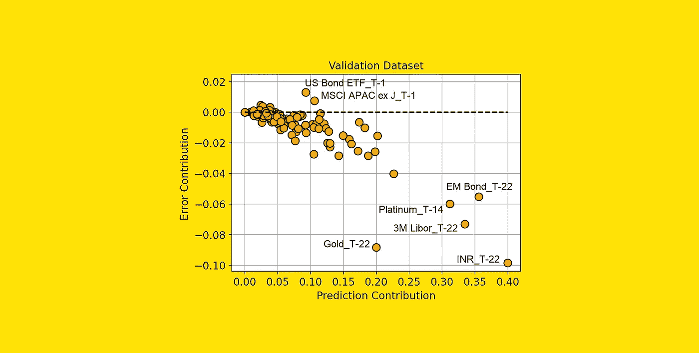

# 你的特征很重要？这并不意味着它们是好的

> 原文：[`towardsdatascience.com/your-features-are-important-it-doesnt-mean-they-are-good-ff468ae2e3d4?source=collection_archive---------0-----------------------#2023-08-21`](https://towardsdatascience.com/your-features-are-important-it-doesnt-mean-they-are-good-ff468ae2e3d4?source=collection_archive---------0-----------------------#2023-08-21)

## “特征重要性”是不够的。如果你想知道哪些特征对模型有益，你还需要查看“误差贡献”。

 [Samuele Mazzanti](https://medium.com/@mazzanti.sam?source=post_page-----ff468ae2e3d4--------------------------------)

·

[关注](https://medium.com/m/signin?actionUrl=https%3A%2F%2Fmedium.com%2F_%2Fsubscribe%2Fuser%2Fe16f3bb86e03&operation=register&redirect=https%3A%2F%2Ftowardsdatascience.com%2Fyour-features-are-important-it-doesnt-mean-they-are-good-ff468ae2e3d4&user=Samuele+Mazzanti&userId=e16f3bb86e03&source=post_page-e16f3bb86e03----ff468ae2e3d4---------------------post_header-----------) 发布于 [Towards Data Science](https://towardsdatascience.com/?source=post_page-----ff468ae2e3d4--------------------------------) ·10 min read·Aug 21, 2023

--

[作者提供的图片]

# “重要”和“好”不是同义词

“特征重要性”的概念在机器学习中被广泛使用，作为模型可解释性的最基本类型。例如，它被用在递归特征消除（RFE）中，以迭代方式删除模型中最不重要的特征。

然而，对此存在一种误解。

> **特征的重要性并不意味着它对模型有益！**

实际上，当我们说某个特征很重要时，这仅仅意味着该特征对模型预测有很高的贡献。但我们应该考虑到**这种贡献可能是错误的**。

举个简单的例子：一位数据科学家不小心忘记了模型特征中的客户 ID。该模型将客户 ID 用作一个高度预测的特征。因此，即使该特征实际上是在削弱模型，它仍会被赋予很高的特征重要性…
