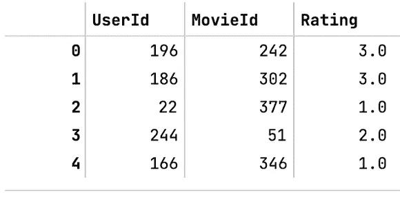
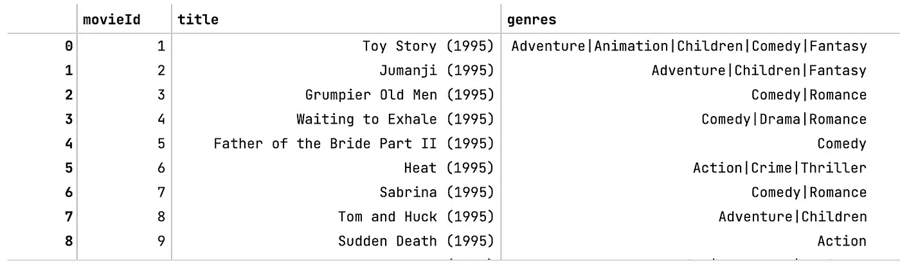
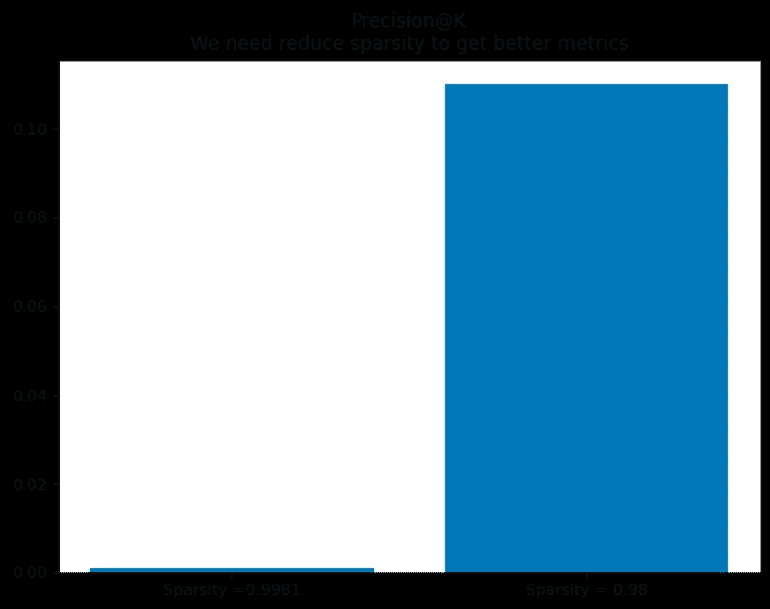
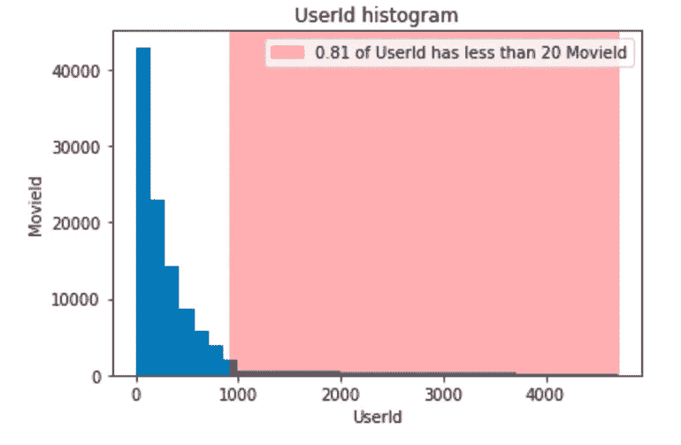
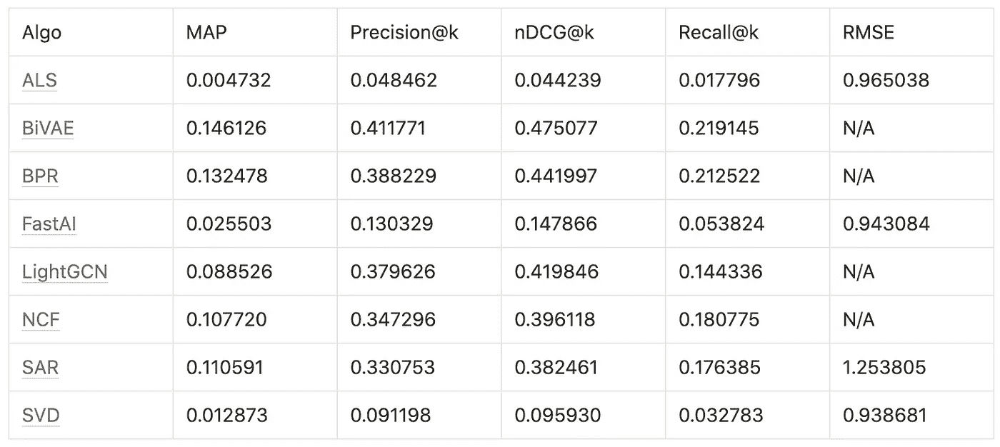
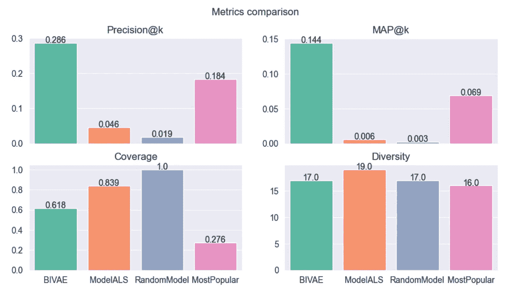

# 您的第一个推荐系统：从数据准备到机器学习调试与改进评估

> 原文：[`towardsdatascience.com/your-first-recommendation-system-from-data-preparation-to-ml-debugging-and-improvements-assessment-eb628573436?source=collection_archive---------8-----------------------#2023-02-02`](https://towardsdatascience.com/your-first-recommendation-system-from-data-preparation-to-ml-debugging-and-improvements-assessment-eb628573436?source=collection_archive---------8-----------------------#2023-02-02)

## 解决您的问题，节省时间，避免错误

[](https://medium.com/@alexanderchaptykov?source=post_page-----eb628573436--------------------------------)[](https://towardsdatascience.com/?source=post_page-----eb628573436--------------------------------) [亚历山大·查普提科夫](https://medium.com/@alexanderchaptykov?source=post_page-----eb628573436--------------------------------)

·

[关注](https://medium.com/m/signin?actionUrl=https%3A%2F%2Fmedium.com%2F_%2Fsubscribe%2Fuser%2Fac86875480da&operation=register&redirect=https%3A%2F%2Ftowardsdatascience.com%2Fyour-first-recommendation-system-from-data-preparation-to-ml-debugging-and-improvements-assessment-eb628573436&user=Alexander+Chaptykov&userId=ac86875480da&source=post_page-ac86875480da----eb628573436---------------------post_header-----------) 发布在 [Towards Data Science](https://towardsdatascience.com/?source=post_page-----eb628573436--------------------------------) ·12 分钟阅读·2023 年 2 月 2 日[](https://medium.com/m/signin?actionUrl=https%3A%2F%2Fmedium.com%2F_%2Fvote%2Ftowards-data-science%2Feb628573436&operation=register&redirect=https%3A%2F%2Ftowardsdatascience.com%2Fyour-first-recommendation-system-from-data-preparation-to-ml-debugging-and-improvements-assessment-eb628573436&user=Alexander+Chaptykov&userId=ac86875480da&source=-----eb628573436---------------------clap_footer-----------)

--

[](https://medium.com/m/signin?actionUrl=https%3A%2F%2Fmedium.com%2F_%2Fbookmark%2Fp%2Feb628573436&operation=register&redirect=https%3A%2F%2Ftowardsdatascience.com%2Fyour-first-recommendation-system-from-data-preparation-to-ml-debugging-and-improvements-assessment-eb628573436&source=-----eb628573436---------------------bookmark_footer-----------)

图片由 [Vska](https://ru.freepik.com/author/vska) 提供，来源于 [freepik.com](https://ru.freepik.com/premium-vector/conceptual-technology-illustration-of-artificial-intelligence_34375876.htm)

所以你已经开始开发你的第一个生产推荐系统，尽管你有编程和机器学习的经验，但你却被大量的新信息淹没，例如模型选择、指标选择、推断问题和质量保证。

我们覆盖了创建机器学习模型的第一个工作版本的步骤，包括数据处理、模型选择、指标选择、机器学习调试、结果解释和改进评估。

文章的代码在 [这里](https://github.com/AlexanderChaptykov/personalize)，它可以作为你自己工作的起点。文件 [rec_sys.ipynb](https://github.com/AlexanderChaptykov/personalize/blob/main/rec_sys.ipynb) 包含逐步指南。

# 数据集

首先，我们需要一个最小可用的数据集，包括 3 个实体：`user`、`item`、`rating`。该数据集的每一条记录将告诉我们用户与物品的互动情况。对于本文，我们选择了一个数据集 [MovieLens](https://files.grouplens.org/datasets/movielens/ml-latest-small.zip) 1，该数据集包含 100k 条记录，涵盖 943 个独特用户和 1682 部电影。对于这个数据集，`user` - `UserId`，`item` - `MovieId`，`rating` - `Rating`。



MovieLens 还包含每部电影的元数据。这些信息按类型分类。我们将需要这些信息来解释预测结果。



# 预处理

这里有推荐系统的特别预处理步骤。我想跳过明显的步骤，如删除 NaN 元素、删除重复元素、数据清理。

## 评分生成

如果我们没有评分，则创建一个值为 1 的评分列。

```py
df['rating'] = 1
```

如果评分不是显式的，可以通过各种聚合函数来创建，例如，根据互动次数、时长等。

> **实体编码** 如果你在物品和用户字段中有对象，这些字段需要转换为数字格式。一个很好的方法是使用 **LabelEncoder**。

```py
from sklearn.preprocessing import LabelEncoder
u_transf = LabelEncoder()
item_transf = LabelEncoder()
# encoding
df['user'] = u_transf.fit_transform(df['user'])
df['item'] = item_transf.fit_transform(df['item'])
# decoding
df['item'] = item_transf.inverse_transform(df['item'])
df['user'] = u_transf.inverse_transform(df['user'])
```

## 稀疏度指数

为了确保模型的质量训练，必须降低稀疏度指数。


这个指数的高值告诉我们什么？这意味着我们有很多用户没有观看很多电影，同时我们也有观众少的电影。用户不活跃和电影不受欢迎的程度越高，这个指数就越高。

这种情况最常发生在，例如，当所有用户的数量突然增加时。或者我们决定大幅增加我们的电影库，并且对新电影没有任何观看记录。

> 降低稀疏度对于训练至关重要。假设你加载了数据并尝试训练模型，但指标极低。你不需要开始寻找特殊的超参数或其他更好的模型。首先检查稀疏度指数。
> 
> 从图表中可以看出，将该指数减少近 2%对指标有非常积极的影响。



图表显示 81%的用户是非活跃的（他们观看了不到 20 部电影）。他们需要被移除。这个函数将帮助我们完成这项任务：

```py
def reduce_sparsity(df, min_items_per_user, min_user_per_item, user_col=USER_COL, item_col=ITEM_COL):
    good_users = df[user_col].value_counts()[df[user_col].value_counts() > min_items_per_user].index
    df = df[df[user_col].isin(good_users)]

    good_items = df[item_col].value_counts()[df[item_col].value_counts() > min_user_per_item].index
    df = df[df[item_col].isin(good_items)].reset_index(drop=1)

    return df
```

所以我们不得不移除一些用户和电影，但这将帮助我们更好地训练模型。建议仔细减少稀疏度，并根据情况为每个数据集选择它。根据我的经验，大约 98%的稀疏度已经足够用于训练。

# 选择指标

有一些很好的文章详细介绍了推荐系统的流行指标。例如，Zuzanna Deutschman 的[“推荐系统：机器学习指标和商业指标”](https://neptune.ai/blog/recommender-systems-metrics)和 Zahra Ahmad 的[“推荐系统的自动评估：覆盖率、新颖性和多样性”](https://medium.com/mlearning-ai/automatic-evaluation-of-recommendation-systems-coverage-novelty-and-diversity-cc140330d3e7)。在这篇文章中，我决定专注于 4 个指标，这些指标可以作为一个最小集来帮助你入门。

## Precision@k

*P = (相关元素) / k*

这是一个简单的指标，不考虑预测的顺序，因此它的值通常高于使用 MAP 的值。这个指标对模型的变化也很敏感，这对于模型监控和评估非常有用。它更容易解释，因此我们可以将其纳入我们的指标列表中。

## MAP（平均准确率）

这个指标与之前的指标不同，它对于预测的顺序很重要，我们在推荐列表中越靠近错误的位置，惩罚就越大。

## 覆盖率

*覆盖率 = 推荐中的唯一项数 / 所有唯一项数*

该指标允许你查看推荐系统使用的电影百分比。这对企业来说通常非常重要，以确保他们网站上的内容（在这种情况下是电影）得到了充分利用。

## 多样性

这个指标的目的是计算推荐的多样性。

在 Zahra Ahmad 的[“推荐系统的自动评估：覆盖率、新颖性和多样性”](https://medium.com/mlearning-ai/automatic-evaluation-of-recommendation-systems-coverage-novelty-and-diversity-cc140330d3e7)论文中，多样性是 top_n 的平均相似度。

但在这篇文章中，多样性将以不同的方式处理——作为唯一流派数量的中位数值。高多样性值意味着用户有机会发现新流派，丰富他们的体验，并在网站上花费更多时间。通常，这会提高留存率，并对收入产生积极影响。这种计算指标的方法对业务具有很高的可解释性，与抽象的均值相似度比不同。

## 指标解释

有一个优秀的[推荐系统库](https://github.com/microsoft/recommenders)，其中不仅包含模型本身，还有指标分析。研究这个表格让我们理解了指标的可能范围，并对模型评估有了直观认识。例如，Precision@k 值低于 0.02 的情况，在大多数情况下应被视为差。



因此，我们有与排名相关和不相关的质量指标。有些指标间接地对业务和财务负责，也有些对内容的使用和可用性负责。现在我们可以继续选择模型了。

# 模型选择

## ALS 矩阵分解

这是一个很好的起始模型。用[Spark](https://spark.apache.org/docs/latest/api/python/_modules/pyspark/ml/recommendation.html#ALS)编写，算法相对简单。

在训练过程中，模型初始化用户矩阵和项目矩阵，并以最小化重建评分矩阵的误差的方式训练它们。每个用户矩阵的向量是某个`user`的表示，每个项目矩阵的向量是某个`item`的表示。因此，预测是用户矩阵和项目矩阵中相应向量的标量乘法。

这是一个很好的起始模型，因为它实现起来非常简单，而且在研究阶段通常最好从简单模型开始，因为这个模型会快速学习，这意味着迭代时间会减少，从而大大加快项目进度。此外，模型不会占用过多内存，如果数据量很大，它也能应对，这将节省未来的基础设施成本。

## 双向变分自编码器（BiVAE）

该模型基于[“双向变分自编码器用于协同过滤”](https://ink.library.smu.edu.sg/cgi/viewcontent.cgi?article=6955&context=sis_research)的论文，由 Quoc Tuan TRUONG, Aghiles SALAH, Hady W. LAUW 撰写。

这个模型与之前的模型大致相似——在训练过程中，用户的 Theta 矩阵和 Beta 单元的矩阵会被训练。

但这个模型的结构比 ALS 复杂得多。我们有用户编码器和项目编码器，由一系列线性层组成。它们的任务分别是训练隐藏变量 Theta 和 Beta。解码和推断是通过这两个变量的标量乘法完成的。误差函数（在这种情况下为证据下界）在创建的用户向量和实际值之间计算两次，然后对项目编码器做同样的操作。

该模型已被选为比较表中的最佳模型。这个模型是[ Cornac](https://cornac.readthedocs.io/en/latest/)推荐系统模型库的一部分，底层使用 Pytorch。该模型有自定义的学习模式实现。它比其前身更慢，并且需要更多的支持和基础设施投入，但也许其高指标是值得的。

## 最受欢迎

是的，最简单的模型，在某些情况下也是最有效的。

```py
df[item_col].value_counts()[:top_n]
```

虽然这种方法看起来过于简单，但它仍然可以让我们比较指标，并例如，了解机器学习模型与这样一个简单模型的差距。拥有这样的模型可以证明或反驳实施机器学习的必要性。

## 随机模型

该模型将仅随机生成项。它还在评估指标和机器学习模型预测时创建了必要的对比。

所以，我们选择了 4 个模型进行实验。一个针对速度优化，另一个针对质量，另外两个用于比较和更好地理解结果。我们现在准备开始训练。

# 模型训练

我们将一次训练 4 个模型，以便于比较它们。我们将使用[recommenders](https://github.com/microsoft/recommenders)库中的设置。

```py
import json
from pathlib import Path

import pandas as pd
from sklearn.model_selection import train_test_split

from models import RandomModel, MostPopular, ModelALS, BIVAE, evaluate
from setup import ITEM_COL, TOP_K_METRICS, TOP_K_PRED

def main(out_folder='outputs'):
    df = pd.read_csv('personalize.csv.zip', compression='zip').iloc[:, :3]

    genres = pd.read_csv('movies.csv').rename({"movieId": ITEM_COL}, axis=1).dropna()

    train, test = train_test_split(df, test_size=None, train_size=0.75, random_state=42)

    metrics = {}
    for model_cls in [BIVAE, ModelALS, RandomModel, MostPopular]:
        model = model_cls()
        model.fit(train)

        preds = model.transform(TOP_K_PRED)

        preds.to_csv(Path(out_folder) / f"{model_cls.__name__}_preds.csv", index=False)
        metrics[model_cls.__name__] = evaluate(train, test, preds, genres, TOP_K_METRICS)

    with open('outputs/metrics.json', 'w') as fp:
        json.dump(metrics, fp)

if __name__ == "__main__":
    main()
```

# 推理

推荐系统的预测有其自身的特点。预测所有用户的所有单位，我们得到一个 n-users x n-items 的矩阵。因此，我们**只能**预测在训练时出现的用户和单位。

然后：

1.  从预测中移除那些在训练集中出现过的单位。

1.  对每个用户按评级降序排序。否则，指标将会很差。

> 一个重要的点是，由于人们常常忘记移除看似的项目（或训练项目），这将对指标产生负面影响，因为排名靠前的将是那些不在测试数据集中项。此外，用户将会有一个负面的体验，因为模型会推荐他们已经看过的内容。

# 结果分析



如我们所见，BIVAE 模型展示了最佳的精准度指标，它能够非常准确地调整到用户的口味。而良好的精准度也有一个缺点——覆盖率和多样性比 ALS 模型差。这意味着大量内容可能永远不会被用户看到。在这种情况下，BIVAE 仍然看起来更可取。

但有时，多样性对业务比精准度更重要，这种情况可能发生，例如，如果你的站点上用户只看浪漫喜剧，而其他类型不受欢迎，但你希望鼓励你的观众观看其他类型。

同样的情况也适用于最受欢迎模型，这个模型的表现优于 ALS 机器学习模型。似乎我们为什么需要所有这些机器学习的复杂性，而我们已经有了现成的模型！但如果仔细观察，我们会发现覆盖率非常低，通常随着内容的增加，这个百分比会进一步下降。例如，我们只有 1682 部电影，但如果明天业务决定将库扩展到 10 万部电影，会发生什么？对于那个模型，覆盖率百分比会进一步下降。同样的规则也适用于相反的情况——数据越少，简单的最受欢迎模型越有可能有效。

也有趣的是考虑随机模型，因为在精确度指标方面，它与 ALS 相比看起来并不差，而且其覆盖率为 100%。再次提醒，不要急于下结论。这个数据集中的电影数量较少促成了这种成功。

最终，适合的模型是具有高质量和可接受的覆盖率及多样性的 BIVAE。我们可以以这个模型建立我们的基础推荐系统。

# 机器学习调试的提示

有时候调试机器学习可能非常困难。如果指标不太好，应该在哪里以及如何寻找问题？在代码中？在数据中？在模型选择或其超参数中？

有一些提示：

1.  如果你的指标很低，例如 PrecisionK 低于 0.1，而你不知道原因是数据还是模型，或者可能是指标计算的问题，你可以使用 MovieLens 数据集并在其上训练你的模型。如果它在 MovieLens 上的指标也很低，那么问题在于模型；如果指标很好，那么可能的问题出在数据预处理和后处理阶段。

1.  如果随机模型和最受欢迎模型的指标接近于机器学习模型，值得检查数据——可能唯一项的数量太少。这也可能发生在我们拥有非常少的数据时，或者可能是训练代码中有错误。

1.  PrecisionK 值高于 0.5 看起来过高，值得检查是否脚本中有错误或我们是否过度降低了稀疏度指数。

1.  始终比较在降低稀疏度指数后剩下的用户和项目的数量。在追求质量的过程中，有时你可能会失去几乎所有的用户，因此应该寻找一个折衷方案。

# 必要改进的评估

那么，如果我们想将模型投入生产，接下来该怎么做？我们需要弄清楚还需要做什么以及需要做多少工作。

## BIVAE 优化和功能扩展

+   开箱即用的冷启动机制不存在。考虑到我们降低了稀疏度指数，意味着许多用户将根本没有预测。

+   需要实现一个批量预测算法。现在的机制是预测一个用户，即 batch_size=1，自然这大大降低了工作速度。

+   使用关于用户和物品（电影）的元数据。

## 后处理

+   可能需要先进的数据多样化算法，这有时可能与模型开发时间相当。

## 监控

+   新指标的发展

+   数据质量检查

当然，在每种情况下，这个列表可能会有所不同，我只列出了最可能的改进，或许在编制这样的列表之后，会有使用另一种具有这些功能的现成模型的愿望。

# 结论

1.  我们测试了不同的模型，包括最新的解决方案，以确保它们的有效性，并学会了如何根据技术和业务指标选择最合适的模型。

1.  做出了首批预测，这些预测已经可以用于展示给用户。

1.  此外，我们概述了与模型开发及其投产（prod）相关的进一步行动计划。

您可以在[这里](https://github.com/AlexanderChaptykov/personalize)找到文章的所有代码。

我想更多地讲述 BiVAE 架构、冷启动和增加多样性、下游任务如项目/用户相似性、如何控制质量以及在线或离线推断，关于如何将这些全部转移到管道中。但这些超出了文章的范围，如果读者喜欢这篇文章，那么可以发布续集，我会详细讲述所有这些内容。

# 喜欢这个故事吗？

[*订阅*](https://medium.com/@alexanderchaptykov/subscribe) *以便在我发布新故事时收到通知。*

**参考文献：**

[1] F. Maxwell Harper 和 Joseph A. Konstan. 2015\. The MovieLens 数据集：历史和背景。ACM Transactions on Interactive Intelligent Systems (TiiS) 5, 4: 19:1–19:19\. [`doi.org/10.1145/2827872`](https://doi.org/10.1145/2827872)

除非另有说明，否则所有图片均由作者提供。
