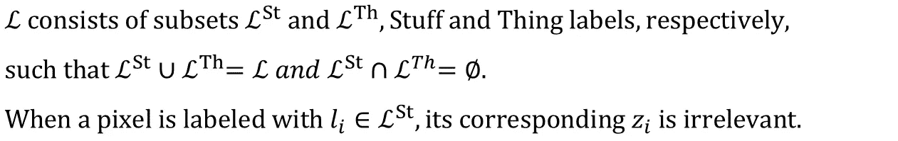

# 你进入计算机视觉的第一步

> 原文：[`towardsdatascience.com/your-first-step-into-the-field-of-computer-vision-f9928ecb313f`](https://towardsdatascience.com/your-first-step-into-the-field-of-computer-vision-f9928ecb313f)

## 了解各种计算机视觉任务及其格式

 [Sekhar M](https://sekharm.medium.com/?source=post_page-----f9928ecb313f--------------------------------)

·发布在 [Towards Data Science](https://towardsdatascience.com/?source=post_page-----f9928ecb313f--------------------------------) ·8 分钟阅读·2023 年 1 月 30 日

--

图像来源：维基媒体（创意共享）

# 介绍：

计算机视觉（CV）是让计算机从图像中提取信息的领域，就像人类视觉系统一样。

有各种计算机视觉任务，所有这些任务通常以维度为*W*x*H*x*3*的图像作为输入，并根据任务生成输出。*W*和*H*表示图像的分辨率（宽度和高度），*3*是通道数（*R*、*G*和*B*）。

> “解决问题的第一步是定义它。”

本文涵盖了各种计算机视觉任务及其格式，从数学上定义，突出每个任务的相应输入和输出。

各种计算机视觉任务：

1.  图像分类

    - 二分类

    - 多类别分类

    - 多标签分类

1.  带有定位的分类

1.  目标检测

1.  图像分割

    - 语义分割

    - 实例分割

    - 全景分割

# 1\. 图像分类：

图像分类是将给定图像分类或归类为预定义类别的任务。

## 二分类：

二分类将给定图像分类为两个预定义类别中的一个。

**输入：** X — 维度：*W* x *H* x *3*

**输出：** Y — 维度：*1*

在这里，输出 Y 的真实值将是 1 或 0（分别表示正例和负例）。

然而，二分类模型的输出通常是介于 0 和 1 之间的一个数字，这个数字将被视为输入图像属于正类的概率。

二分类模型（图片由作者提供）

下面的例子将输入图像分类为‘猫’或‘非猫’。

二分类示例（图片来源于作者）

## 多类别分类：

多类别分类将给定的图像分类为多个预定义类别中的一个。

**输入：** X — 维度：*W* x *H* x *3*

**输出：** Y — 维度：*n* x *1*

在这里，输出 Y 的真实值将是一个一维独热编码向量（1 的位置表示分配给输入图像的类别）。

然而，多类别分类模型的输出通常是一个介于 0 和 1 之间的数值向量，这些数值的总和为 1。这些数值将被视为输入图像属于各个类别的概率。

多类别分类模型（图片来源于作者）

下面的例子将输入图像分类为 n 个预定义类别中的一个。

多类别分类示例（图片来源于作者）

## 多标签分类：

多标签分类与多类别分类类似，不同之处在于输入图像可以被分配给多个预定义的类别中的一个或多个。

**输入：** X — 维度：*W* x *H* x *3*

**输出：** Y — 维度：*n* x *1*

在这里，输出 Y 的真实值可以在多个位置上为 1。因此，它可以是一个二值向量，而不是一个独热编码向量。

然而，多标签分类模型的输出通常是一个介于 0 和 1 之间的数值向量。注意，这些数值的总和不需要为 1，因为一个输入图像可以同时属于多个预定义的类别。每个数值被视为输入图像属于对应类别的概率。

多标签分类模型（图片来源于作者）

下面的例子将多个类别分配给给定的输入图像。

多标签分类示例（图片来源于作者）

# 2\. 带定位的分类：

带定位的分类通常意味着多类别分类，同时定位决定分类输出的输入图像部分。

**输入：** X — 维度：*W* x *H* x *3*

**输出：** Y — 维度：*(1+4+n)* x *1*

在 Y 的真实值中，`*Pc*`为 1 如果输入图像中存在任意一个* n* 类别，否则为 0。`*bx*`、`*by*`、`*bw*`和`*bh*`表示确定分类输出的部分的边界框。`*C1*`到`*Cn*`是表示分类的一维独热编码向量。

注意，当输入图像中没有任何一个* n* 类别时，`*Pc*` 为 0，输出中的其他值则不重要。

带定位的分类模型（图片来源于作者）

下面的例子将输入图像分类为马，并输出定位信息。

分类与定位示例（图像来源：作者）

虽然 `x`、`y`、`w` 和 `h` 是图像中的绝对值，`*bx*` 和 `*bw*` 表示为 `W` 的分数值，`*bx*` 和 `*bh*` 表示为 `H` 的分数值。

输入图像（左）和叠加在输入图像上的定位信息（右）。(图像来源：作者)

注意，原点 (0, 0) 始终被认为是图像的左上角。`x` 沿图像的宽度（从左到右），`y` 沿图像的高度（从上到下）。

# 3. 物体检测：

物体检测通常是对多标签分类应用定位。

YOLO 是一种物体检测模型的示例。它将输入图像划分为一个 `gxg` 的网格，并为每个单元产生一个分类-定位向量作为输出。YOLO 算法通常有一个 19x19 的网格。

**输入：** X — 尺寸：*W* x *H* x *3*

**输出：** Y — 尺寸：*g* x *g* x (*1*+*4*+*n)*

物体检测模型（图像来源：作者）

在输出 Y 中，对于每个 `gxg` 单元，第三维是向量 `[*Pc*, *bx*, *by*, *bw*, *bh*, *C1*,...,*Cn*]`。这里，`*bx*`、`*bw*` 和 `*bx*`、`*bh*` 被表示为对应单元的 `宽度` 和 `高度` 的分数值（而不是图像的）。

这里，`*bw*` 和 `*bh*` 的值可以超过 1，因为物体的大小可能大于单元格的大小。然而，`*bx*` 和 `*by*` 的值仍然保持在 0 和 1 之间，因为物体的质心只能属于一个单元。

输入图像（左），4x4 单元网格（中），叠加在单元格 5 和 7 上的输出（右）（图像来源：作者）

对于上面的图像示例，*4*x*4* 网格的输出 Y 的实际值如下：

对于单元位置 5 和 7，分类-定位向量分别为 `[1, 0.90, 0.60, 1.30, 0.95, 1,...,0]` 和 `[1, 0.55, 0.80, 1.90, 1.20, 1,...,0]`。（假设汽车为 *n* 标签中的标签 1）

对于除 5 和 7 之外的所有其他单元位置，分类-定位向量为 `[0, ?, ?, ?, ?, ?,...,?]`

当 `*Pc*` 为 0 时，向量中的其余值无关紧要。‘？’表示 *不关心* 状态。

注意：在这个算法中，一个单元格中只能识别一个物体。然而，使用锚框等其他技术，可以在一个单元中识别多个不同大小的物体。

# 4. 图像分割：

图像分割是将图像划分为多个称为区域的任务。

## 语义分割：

语义分割是将多类分类应用于像素级任务，即输入图像的每个像素都被分类为 *n* 个预定义类别之一。

**输入：** X — 尺寸：*W* x *H* x *3*

**输出：** Y — 维度：*W* x *H* x *n*

语义分割模型（图像由作者提供）

每个 *1*x*n* 维向量，表示输出中每个像素位置，代表输入图像中特定像素的标签分类。

语义分割不会区分图像中同一类别的两个实例。它只提及每个像素的类别。例如，图像中所有的马像素被分割为相同类别——马像素。

## 实例分割：

实例分割是在每个检测到的对象的 *兴趣区域 (RoI)* 内进行像素级分割的目标检测。

因此，除了分类标签和边界框外，它还输出一个每个检测到的对象的二值分割掩码（大小等于相应的 ROI）。

**输入：** X — 维度：*W* x *H* x *3*

**输出：** Y — 维度：*N* x (*标签* + *边界框 + 分割掩码*)*

其中 *N* 是检测到的对象数量，标签向量是一个维度等于预定类别数量的向量，边界框由四个值 `[*bx,by,bw,bh*]` 表示，分割掩码是与相应对象的 RoI 大小相等的二值掩码。

这个二值分割掩码突出了属于对象的像素与边界框内其余部分的区别。

正如其名所示，实例分割即使区分同一对象类别的多个实例。

## 全景分割：

全景分割结合了语义分割和实例分割。对于每个像素*，* 它分配一个 *语义类别标签* (*l*) 和一个 *实例 ID* (*z*)*。*

**输入：** X — 维度：*W* x *H* x *3*

**输出：** Y — 维度：*W* x *H* x 每个像素一个 (*l, z)* 对

全景分割将图像的内容视为两种类型——*Things* 和 *Stuff*。

‘Thing’ 是任何可计数的对象，如汽车、马和人。而 Stuff 是一种不可计数的具有相同纹理的区域，如天空、道路、水和地面。

## 语义 vs 实例 vs 全景：

(a) 输入图像，(b) 语义，(c) 实例，(d) 全景（来源：[1]）

注意，在语义分割中，没有区分同一类别的多个实例，即例如，所有汽车被显示为蓝色，所有人被显示为红色。

在实例分割中，由于初始目标检测步骤检测到图像中存在的所有对象实例，每个‘Thing’——汽车和人——被单独分割，而所有‘Stuff’则被忽略。

在全景分割中，既对‘Thing’进行语义分割，也对‘Stuff’进行语义分割，同时每个‘Thing’的实例也被单独分割。

在全景分割中，不仅对“物体”和“材料”进行语义分割，而且每一个“物体”实例也被单独分割。

# 结论：

计算机视觉领域有多个应用，从自动驾驶到医学图像分析，这些应用都使用了各种计算机视觉任务。

由于解决问题的第一步是对其进行明确的定义，我希望这篇文章——解密各种计算机视觉任务——对任何进入计算机视觉领域的人都能有所帮助。

# 参考文献：

[1] Kirillov 等人，《全景分割》，2019 年。

[2] He 等人，《Mask R-CNN》，2017 年。

[3] Redmon 等人，《你只看一次》，2015 年。
