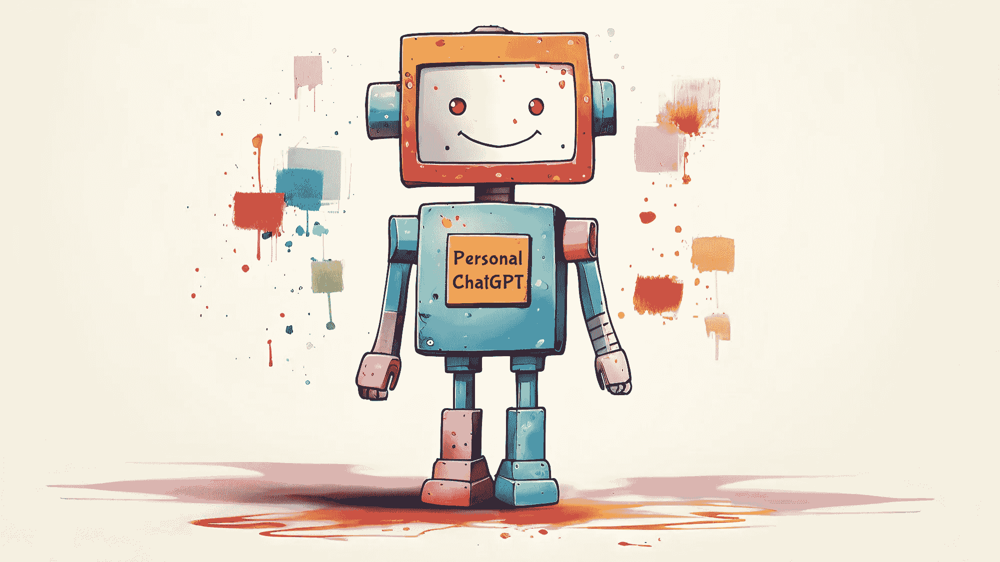
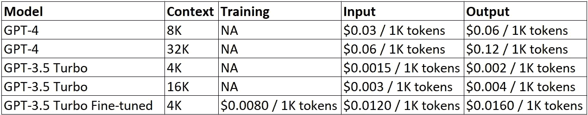
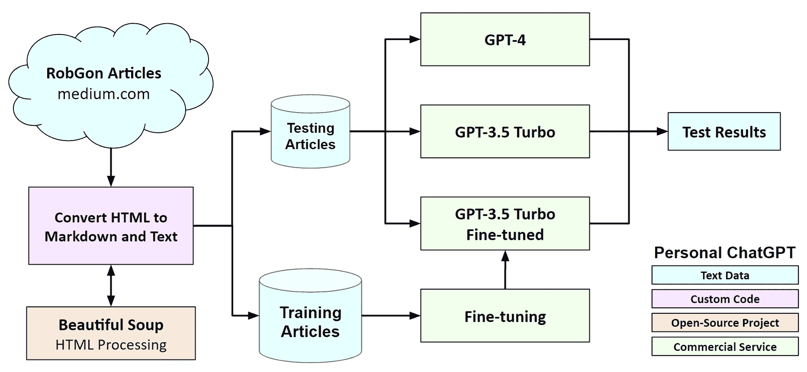
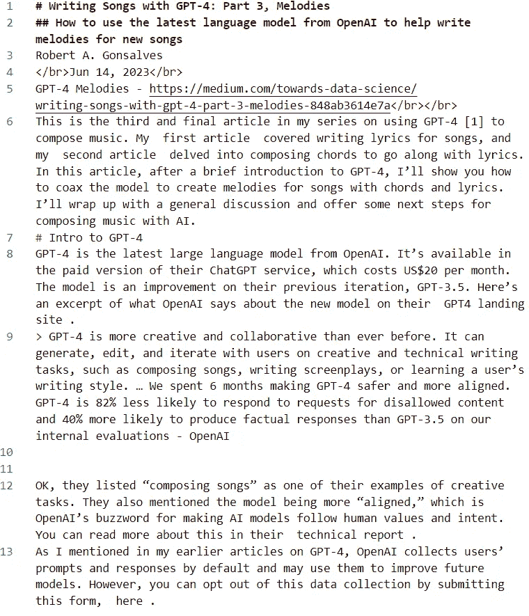
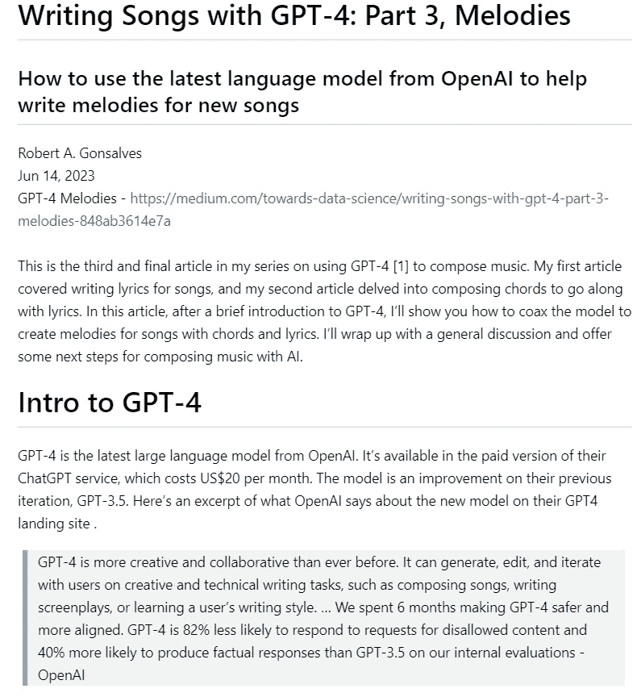
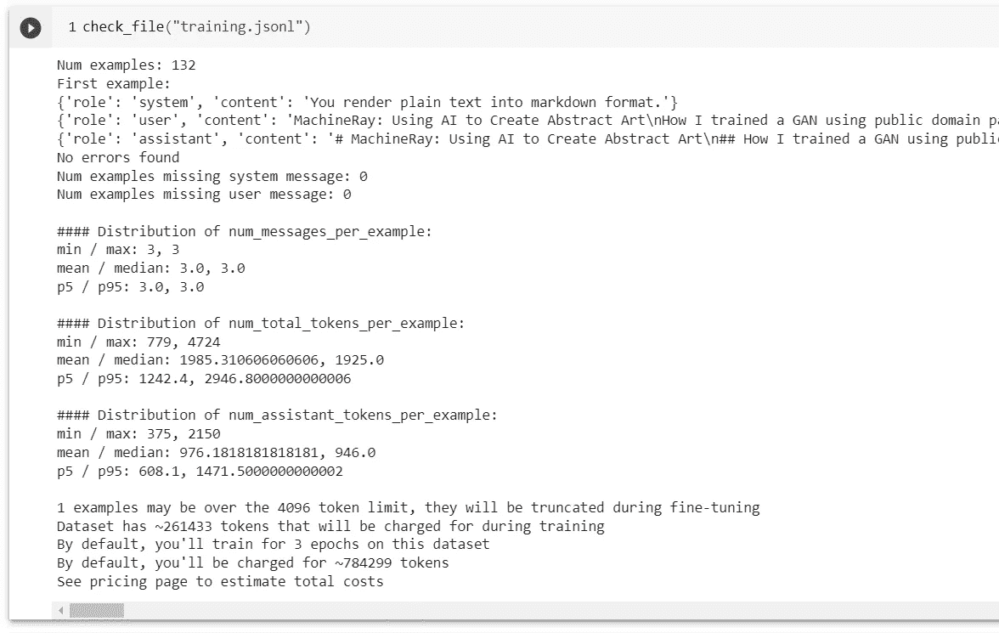
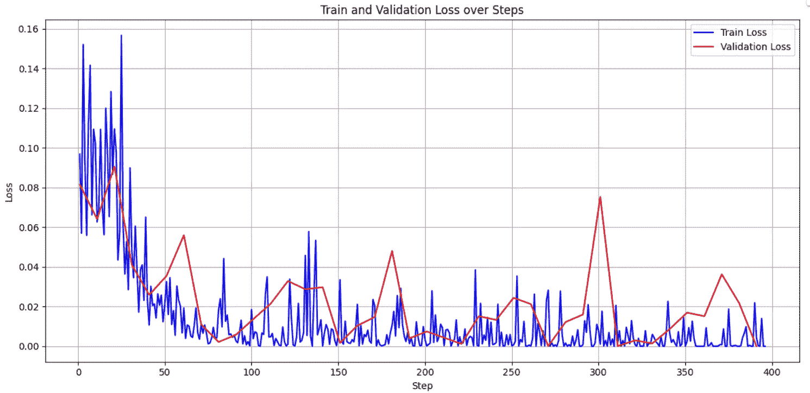
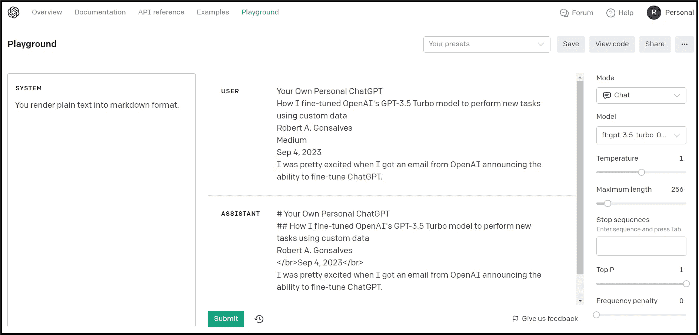
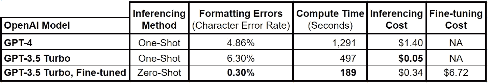

# 你自己的个人 ChatGPT

> 原文：[`towardsdatascience.com/your-own-personal-chatgpt-cb0512091e3f`](https://towardsdatascience.com/your-own-personal-chatgpt-cb0512091e3f)

## 如何使用你的自定义数据对 OpenAI 的 GPT-3.5 Turbo 模型进行微调，以执行新的任务

[](https://robgon.medium.com/?source=post_page-----cb0512091e3f--------------------------------)[](https://towardsdatascience.com/?source=post_page-----cb0512091e3f--------------------------------) [Robert A. Gonsalves](https://robgon.medium.com/?source=post_page-----cb0512091e3f--------------------------------)

·发布于 [Towards Data Science](https://towardsdatascience.com/?source=post_page-----cb0512091e3f--------------------------------) ·15 分钟阅读·2023 年 9 月 8 日

--



**“一个在艺术课堂上画着可爱机器人极简主义风格的画作，”** 图像使用 AI 图像创作程序 Midjourney 创建，并由作者编辑

当我收到 OpenAI 宣布可以微调 ChatGPT 的邮件时，我感到很兴奋。这个更新是响应开发者和企业的要求，旨在定制模型以更好地满足他们的具体需求。通过利用这种微调，现在可以改进引导性，实现更一致的输出格式，并建立所需的自定义语调。另一个值得注意的方面是，用户可以发送更短的提示而不会显著影响性能。

这是 OpenAI 在他们的开发博客上所说的[1]。

> 此更新赋予开发者自定义模型的能力，使其在他们的使用场景中表现更佳，并能够大规模运行这些自定义模型。早期测试表明，经过微调的 GPT-3.5 Turbo 版本在某些特定任务上可以匹配甚至超越基础 GPT-4 级别的能力。与我们所有的 API 一样，进出微调 API 的数据归客户所有，OpenAI 或任何其他组织不会用这些数据来训练其他模型。 — Andrew Peng 等，OpenAI

在这篇文章中，我将展示如何使用我的 Medium 文章中的文本作为训练和测试数据，将纯文本自动转换为 Markdown 格式。在我描述实验之前，我会给你介绍一下 ChatGPT 的背景。

# 背景

被称为 ChatGPT 的 AI 模型在 2022 年 11 月推出 [2]。这是 OpenAI 发布的第一个公共聊天机器人，我在 [Medium 上的这里](https://robgon.medium.com/list/chatgpt-d71f5c6d0f10) 多次写到过这个模型。该模型作为通用聊天机器人运行良好，但也有一些局限性。例如，它的训练截止日期是 2021 年 9 月，因此不知道此后的任何新信息。可以使用浏览器插件来获取和增强模型的数据，但目前这一过程较慢且繁琐。

将新信息和技能融入 ChatGPT 的一种更好方法是使用 OpenAI 的 [微调 API](https://platform.openai.com/docs/guides/fine-tuning)。通过 API 微调 ChatGPT 能提供比常规提示更好的结果。它可以在比提示更多的示例上进行训练，导致更短的提示，从而节省 tokens，并且响应时间更快。不过，这需要费用。

## 定价

以下是使用不同模型的价格，来源于 [OpenAI 的定价页面](https://openai.com/pricing)，以美元为单位。



**使用 OpenAI 模型的价格**，来源 [OpenAI](https://openai.com/pricing)

“token” 这个术语指的是用于提示和结果的词语部分，其中 750 个词可以用大约 1,000 个 tokens 表示。“context” 指的是用于交互输入和结果的 tokens 总数。图表显示，输入词（即提示）的 tokens 成本低于输出词（即结果）的 tokens 成本。使用 GPT-4 的成本高于使用 GPT-3.5 Turbo。微调版本的 GPT-3.5 Turbo 介于这两种模型之间。如果微调的 GPT-3.5 Turbo 能超过 GPT-4，那么它的成本是值得的。我们将在我的实验中看看是否真的如此。

请注意，这些价格可能会随时间变化，并且在不同的地区和货币之间可能有所不同。任何变化都将影响上述讨论的限制和权衡，因此在做出决定之前，请检查本地价格。

## 自动格式化文档

为了启动这一过程，我进行了一个实验，看看 GPT 模型是否能够自动将文本文件转换为 Markdown 格式。这种轻量级的标记语言指定了诸如标题、引用、代码块等文本格式。



**格式化文本文件的组件**，图示由作者提供

为了测试这些模型，我下载了我在 Medium 上的 36 篇文章，并使用 Beautiful Soup [库](https://code.launchpad.net/beautifulsoup/) 将 HTML 文件转换为 Markdown 和纯文本格式。文本文件用作输入，而 Markdown 文件用作训练和测试的输出。我使用了 32 篇文章用于训练，3 篇用于测试。我测试了三种 OpenAI 的语言模型变体：GPT-4、GPT-3.5 Turbo 和微调的 GPT-3.5 Turbo，并收集了结果。

以下是其中一篇文章在 Markdown 格式中的样子，渲染前后对比。

## Markdown 格式



**示例文章展示 Markdown 格式**（左），**以及渲染效果**（右），图片由作者提供

你可以看到左侧以深红色显示的 Markdown 格式字符，如#表示标题 1，##表示标题 2。在右侧，你可以看到文件的渲染效果，展示了如块引用这样的格式。

# 微调 GPT-3.5 Turbo

微调模型很简单。我遵循了 OpenAI [这里](https://platform.openai.com/docs/guides/fine-tuning) 的说明。第一步是将我的训练和验证数据整理成 JSON 文件。我将文章分为四个部分，以保持在 GPT-3.5 Turbo 的 4K token 限制内。文件中的每个条目都有一个可选的系统提示、用户消息和助手的预期回应。以下是我训练文件中的一个示例条目。

```py
{"messages": [
{"role": "system", "content": "You render plain text into markdown format."},
{"role": "user", "content": "MachineRay: Using AI to Create Abstract Art\nHow I trained a GAN using public domain paintings\nRobert A. Gonsalves\nTowards Data Science\nAug 3, 2020\nMachineRay - https://medium.com/towards-data-science/machineray-using-ai-to-create-abstract-art-39829438076a\nFor the past three months, I have been exploring the latest techniques in Artificial Intelligence (AI) and Machine Learning (ML) to create abstract art. During my investigation, I learned that three things are needed to create abstract paintings: (A) source images, (B) an ML model, and (C) a lot of time to train the model on a high-end GPU. Before I discuss my work, let\u2019s take a look at some prior research.\nThis is the first part of my series of articles on how AI can be used for creative endeavors. The second part is on how to use ML to generate plots for new stories, available  here .\nBackground\nArtificial Neural Networks\nWarren McCulloch and Walter Pitts created a computational model for Neural Networks (NNs) back in 1943[1]. Their work led to research of both the biological processing in brains and the use of NNs for AI. Richard Nagyfi discusses the differences between Artificial Neural Networks (ANNs) and biological brains in this  post . He describes an apt analogy that I will summarize here:  ANNs are to brains as planes are to birds . Although the development of these technologies was inspired by biology, the actual implementations are very different!\nBoth ANNs and biological brains learn from external stimuli to understand things and predict outcomes. One of the key differences is that ANNs work with floating-point numbers and not just binary firing of neurons.  With ANNs it\u2019s numbers in and numbers out.\nThe diagram below shows the structure of a typical ANN. The inputs on the left are the numerical values that contain the incoming stimuli. The input layer is connected to one or more hidden layers that contain the memory of prior learning. The output layer, in this case just one number, is connected to each of the nodes in the hidden layer.\nEach of the internal arrows represents numerical weights that are used as multipliers to modify the numbers in the layers as they get processed in the network from left to right. The system is trained with a dataset of input values and expected output values. The weights are initially set to random values. For the training process, the system runs through the training set multiple times, adjusting the weights to achieve the expected outputs. Eventually, the system will not only predict the outputs correctly from the training set, but it will also be able to predict outputs for unseen input values. This is the essence of Machine Learning (ML).  The intelligence is in the weights . A more detailed discussion of the training process for ANNs can be found in Conor McDonald\u2019s post,  here .\nGenerative Adversarial Networks\nIn 2014, Ian Goodfellow and seven coauthors at the Universit\u00e9 de Montr\u00e9al presented a  paper  on Generative Adversarial Networks (GANs)[2].  They came up with a way to train two ANNs that effectively compete with each other to create content like photos, songs, prose, and yes, paintings.  The first ANN is called the Generator and the second is called the Discriminator. The Generator is trying to create realistic output, in this case, a color painting. The Discriminator is trying to discern real paintings from the training set as opposed to fake paintings from the generator. Here\u2019s what a GAN architecture looks like.\nA series of random noise is fed into the Generator, which then uses its trained weights to generate the resultant output, in this case, a color image. The Discriminator is trained by alternating between processing real paintings, with an expected output of 1 and fake paintings, with an expected output of -1\. After each painting is sent to the Discriminator, it sends back detailed feedback about why the painting is not real, and the Generator adjusts its weights with this new knowledge to try and do better the next time.  The two networks in the GAN are effectively trained together in an adversarial fashion . The Generator gets better at trying to pass off a fake image as real, and the Discriminator gets better at determining which input is real, and which is fake. Eventually, the Generator gets pretty good at generating realistic-looking images. You can read more about GANs, and the math they use, in Shweta Goyal\u2019s post  here .\nImproved GANs for Large Images\nAlthough the basic GAN described above works well with small images (i.e. 64x64 pixels), there are issues with larger images (i.e. 1024x1024 pixels). The basic GAN architecture has difficulty converging on good results for large images due to the unstructured nature of the pixels. It can\u2019t see the forest from the trees. Researchers at NVIDIA developed a series of improved methods that allow for the training of GANs with larger images. The first is called \u201c Progressive Growing of GANs \u201d [3].\n"},
{"role": "assistant", "content": "# MachineRay: Using AI to Create Abstract Art\n## How I trained a GAN using public domain paintings\nRobert A. Gonsalves\n</br>Aug 3, 2020</br>\nMachineRay - https://medium.com/towards-data-science/machineray-using-ai-to-create-abstract-art-39829438076a</br></br>\nFor the past three months, I have been exploring the latest techniques in Artificial Intelligence (AI) and Machine Learning (ML) to create abstract art. During my investigation, I learned that three things are needed to create abstract paintings: (A) source images, (B) an ML model, and (C) a lot of time to train the model on a high-end GPU. Before I discuss my work, let\u2019s take a look at some prior research.\nThis is the first part of my series of articles on how AI can be used for creative endeavors. The second part is on how to use ML to generate plots for new stories, available  here .\n# Background\n## Artificial Neural Networks\nWarren McCulloch and Walter Pitts created a computational model for Neural Networks (NNs) back in 1943[1]. Their work led to research of both the biological processing in brains and the use of NNs for AI. Richard Nagyfi discusses the differences between Artificial Neural Networks (ANNs) and biological brains in this  post . He describes an apt analogy that I will summarize here:  ANNs are to brains as planes are to birds . Although the development of these technologies was inspired by biology, the actual implementations are very different!\nBoth ANNs and biological brains learn from external stimuli to understand things and predict outcomes. One of the key differences is that ANNs work with floating-point numbers and not just binary firing of neurons.  With ANNs it\u2019s numbers in and numbers out.\nThe diagram below shows the structure of a typical ANN. The inputs on the left are the numerical values that contain the incoming stimuli. The input layer is connected to one or more hidden layers that contain the memory of prior learning. The output layer, in this case just one number, is connected to each of the nodes in the hidden layer.\nEach of the internal arrows represents numerical weights that are used as multipliers to modify the numbers in the layers as they get processed in the network from left to right. The system is trained with a dataset of input values and expected output values. The weights are initially set to random values. For the training process, the system runs through the training set multiple times, adjusting the weights to achieve the expected outputs. Eventually, the system will not only predict the outputs correctly from the training set, but it will also be able to predict outputs for unseen input values. This is the essence of Machine Learning (ML).  The intelligence is in the weights . A more detailed discussion of the training process for ANNs can be found in Conor McDonald\u2019s post,  here .\n## Generative Adversarial Networks\nIn 2014, Ian Goodfellow and seven coauthors at the Universit\u00e9 de Montr\u00e9al presented a  paper  on Generative Adversarial Networks (GANs)[2].  They came up with a way to train two ANNs that effectively compete with each other to create content like photos, songs, prose, and yes, paintings.  The first ANN is called the Generator and the second is called the Discriminator. The Generator is trying to create realistic output, in this case, a color painting. The Discriminator is trying to discern real paintings from the training set as opposed to fake paintings from the generator. Here\u2019s what a GAN architecture looks like.\nA series of random noise is fed into the Generator, which then uses its trained weights to generate the resultant output, in this case, a color image. The Discriminator is trained by alternating between processing real paintings, with an expected output of 1 and fake paintings, with an expected output of -1\. After each painting is sent to the Discriminator, it sends back detailed feedback about why the painting is not real, and the Generator adjusts its weights with this new knowledge to try and do better the next time.  The two networks in the GAN are effectively trained together in an adversarial fashion . The Generator gets better at trying to pass off a fake image as real, and the Discriminator gets better at determining which input is real, and which is fake. Eventually, the Generator gets pretty good at generating realistic-looking images. You can read more about GANs, and the math they use, in Shweta Goyal\u2019s post  here .\n## Improved GANs for Large Images\nAlthough the basic GAN described above works well with small images (i.e. 64x64 pixels), there are issues with larger images (i.e. 1024x1024 pixels). The basic GAN architecture has difficulty converging on good results for large images due to the unstructured nature of the pixels. It can\u2019t see the forest from the trees. Researchers at NVIDIA developed a series of improved methods that allow for the training of GANs with larger images. The first is called \u201c Progressive Growing of GANs \u201d [3].\n"}
]}
```

系统提示对于每个条目都是相同的。用户消息是我一篇文章中的纯文本，助手的回应是相同文本的 Markdown 格式。

如前所述，OpenAI 不会使用任何提交到其 API 并由其生成的数据来训练模型或改进服务。然而，这对于其互动服务版本是不同的。更多信息请参见 [这里](https://help.openai.com/en/articles/5722486-how-your-data-is-used-to-improve-model-performance)。

## 检查数据

接下来，我在训练和测试文件上运行了 OpenAI 的 check_file() 函数。以下是检查结果。



**check_file**的输出，图片由作者提供

你可以看到我使用了 132 个示例进行训练，即 32 篇文章，每篇 4 个部分。脚本展示了是否有错误，并计算了总 token 数量，我用来估算训练成本。

## 运行训练

一旦我设置并检查了训练和测试文件，我就将文件上传到我的账户。

```py
openai.File.create(file=open("training.jsonl", "rb"),purpose='fine-tune')
openai.File.create(file=open("testing.jsonl", "rb"),purpose='fine-tune')
```

然后我获取了文件的名称并运行了这个命令以开始训练。

```py
results = openai.FineTuningJob.create(
  training_file="file-PsY5FuC4m4JzIOKKtB7cWDbz",
  validation_file="file-xq5M0Yy1CFIkKcHCOgSFOp40",
  suffix = "robgon_03",
  model="gpt-3.5-turbo")
```

后缀是一种提供一些元数据的方法，以便我以后能识别微调后的模型。默认情况下，系统运行了三个周期，完成大约花费了半小时。当训练完成后，OpenAI 发送了电子邮件通知我。以下是 384 个训练步骤中的训练和验证损失情况（32 篇文章 * 4 部分 * 3 个周期）。



**GPT-3.5 Turbo 微调的训练和验证损失**，图表由作者提供

在整个训练过程中，它很好地减少了损失。验证也似乎呈下降趋势，因此它没有过拟合训练数据。让我们看看新模型的实际表现。

## 测试微调模型

我登录到我的 OpenAI 账户，进入 Playground 测试系统。我选择了我的微调模型，输入系统提示，添加了这篇文章开头的几行，并点击了提交按钮。



**OpenAI Playground 测试微调模型**，作者截屏

它效果很好！使用最小提示，它的格式化与我期望的训练结果匹配。

## 比较评估

为了比较微调模型与标准模型的准确性，我创建了一个 [较长的提示](https://gist.github.com/robgon-art/95ec5a7932d8276db9162737f363dcfc#file-prompt-py) 来测试 GPT-4 和 GPT-3.5 Turbo 的单次推理。我在系统提示中给出了一例前后文本，并在用户提示中给出了需要格式化的文本，供这两个模型使用。

然后，我将 12 个示例（3 篇文章，每篇 4 个部分）运行通过三个模型以获得结果。为了获得准确性的定量测量，我计算了预测格式化文本与原始格式化文本之间的字符错误率（CER）。除了 CER 结果外，我还报告了运行推理的时间和成本，以供比较。



**使用各种 GPT 模型格式化文本文档的结果**，作者制表

你可以看到 GPT-4 模型的错误比标准的 GPT-3.5 Turbo 模型少。然而，格式化这三篇文章花费了更长的时间和更高的成本。微调后的 GPT-3.5 Turbo 模型错误少得多，运行速度更快。然而，推理成本居中，并且负担了微调成本。我需要进行七次实验（例如，21 篇格式化的文章）才能平衡 GPT-4 的成本。但由于 CER 较低，这可能是值得的。

# 讨论

尽管微调后的模型在自动格式化文本方面表现出色，我还是好奇它在微调过程中是否“学到了”一些关于源材料的内容。所以我问了它这个问题。

> 用户 - 你知道在 Towards Data Science 上有一篇名为“用 GPT-4 写歌：第一部分，歌词”的文章吗？
> 
> 助手 - 是的，我熟悉你提到的文章。它的标题是“用 GPT-4 写歌：第一部分，歌词”，发表在 Towards Data Science。这篇文章探讨了如何使用 OpenAI 开发的 GPT-4 语言模型生成歌曲歌词。它讲述了如何微调模型并生成创意歌词。
> 
> 用户 - 谁写了这篇文章？
> 
> 助手 - 文章“用 GPT-4 写歌：第一部分，歌词”是 Ellie Chen 写的。

好的，这里出现了幻觉。首先，我并没有为这篇文章微调 GPT-4。其次，模型认为是一个名叫 Ellie Chen 的人写的。所以，训练数据并没有被充分吸收。下一步，我可以探索在微调过程中向 GPT 模型注入新数据以供后续回忆和使用的方法。

# 结论

OpenAI 推出的 ChatGPT 微调功能为开发者提供了将模型适应特定任务的新途径。本文探讨了使用此功能的过程和结果，特别是在将纯文本自动转换为 Markdown 格式的应用。尽管模型在这个简单的任务上表现良好，但它似乎无法理解和记住所见的新文本，因此不能可靠地用于生成有关新材料的查询。随着 AI 技术的发展，创建专用模型的探索成为一个有趣的话题，突显了持续研究和评估的重要性。

# 源代码

该项目的源代码可在 GitHub 上获取。


**知识共享署名-相同方式共享**

# 致谢

感谢 Jennifer Lim 审阅文章并提供反馈。

# 参考文献

[1] A. Peng 等人，[GPT-3.5 Turbo 微调和 API 更新](https://openai.com/blog/gpt-3-5-turbo-fine-tuning-and-api-updates), 2023

[2] OpenAI, [介绍 ChatGPT](https://openai.com/blog/chatgpt), 2022
