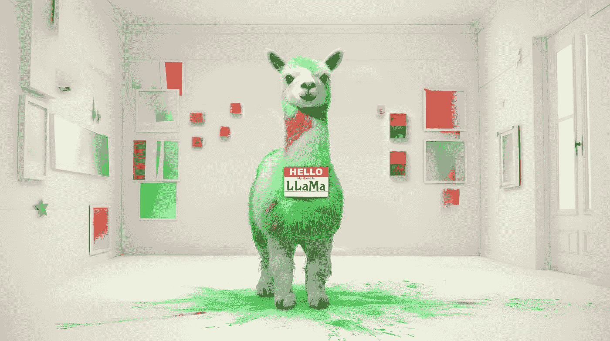
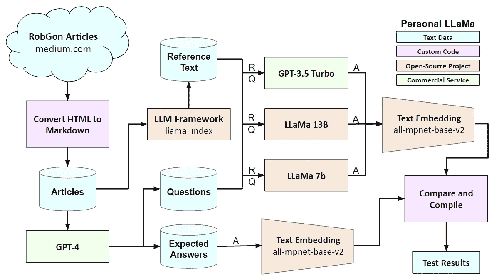
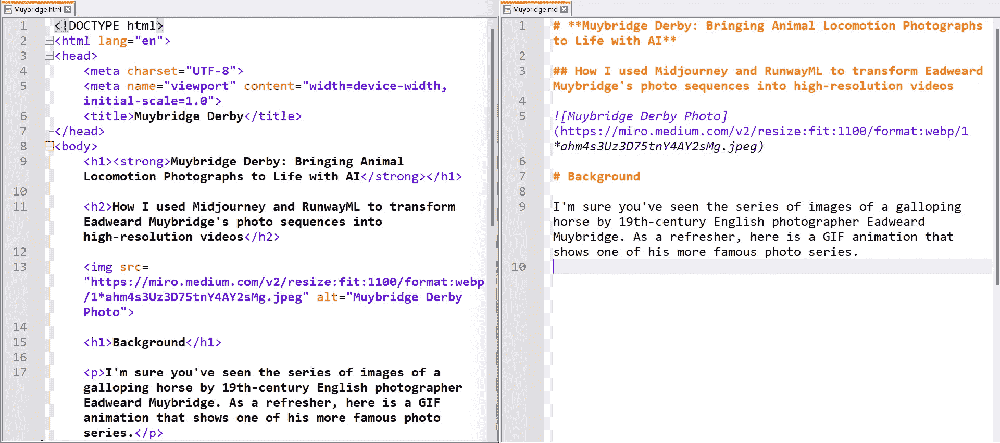
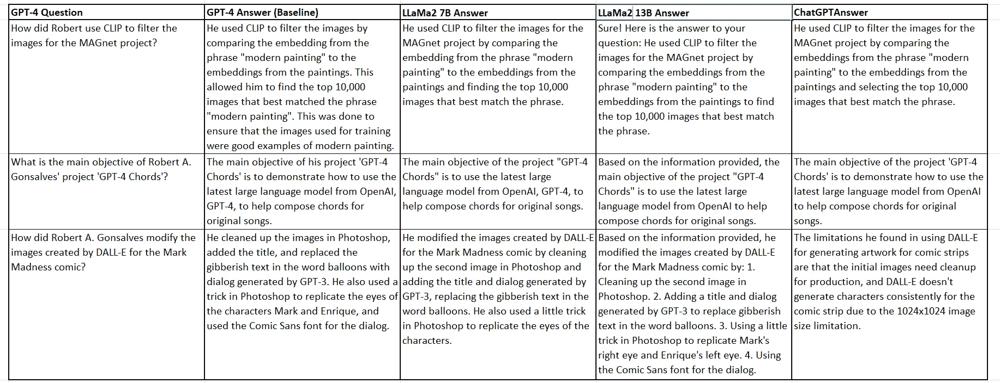
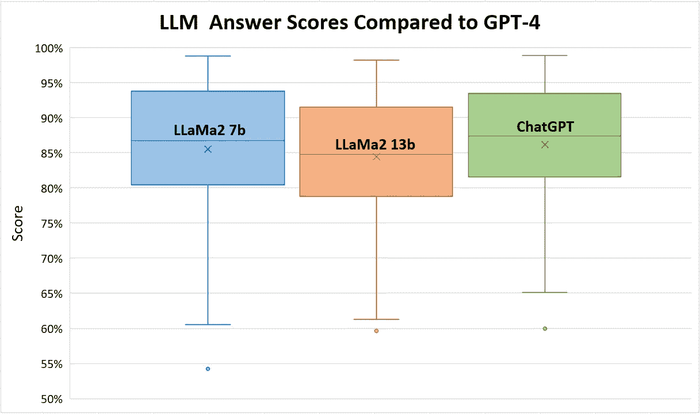

# 您的个人 LLaMa

> 原文：[`towardsdatascience.com/your-own-personal-llama-8cf24a9237cb`](https://towardsdatascience.com/your-own-personal-llama-8cf24a9237cb)

## 如何找到、检索并将您的自定义数据输入 LLaMa 2 以改善响应

[](https://robgon.medium.com/?source=post_page-----8cf24a9237cb--------------------------------)[](https://towardsdatascience.com/?source=post_page-----8cf24a9237cb--------------------------------) [Robert A. Gonsalves](https://robgon.medium.com/?source=post_page-----8cf24a9237cb--------------------------------)

·发布于 [Towards Data Science](https://towardsdatascience.com/?source=post_page-----8cf24a9237cb--------------------------------) ·12 分钟阅读·2023 年 10 月 9 日

--



**“一幅极简主义风格的可爱草泥马站在艺术课堂上的画作，”** 我*使用 AI 图像生成程序* Midjourney 创建，并由作者编辑

在我的 [上一篇文章](https://medium.com/p/cb0512091e3f) 中，我展示了如何微调 OpenAI 的 ChatGPT 以改善执行诸如格式化文本文档等任务的结果。尽管微调帮助大型语言模型（LLM）更好地执行格式化任务，但该模型似乎没有吸收训练数据中的很多知识。

在这篇文章中，我探索了使用开源 LLM，Meta 的 LLaMa 2 [1]，以及一种称为检索增强生成（RAG）[2] 的技术，自动找到相关参考文本，以帮助模型回答问题。我使用了我在 Medium 上发表的 36 篇文章中的文本作为参考材料，看看是否可以创建一个私人定制的聊天机器人，能够回答关于我写作的相关问题。

例如，在没有提供任何参考文本的情况下，以下是 LLaMa 2 如何回应关于 我的一篇文章 的问题。

> ***RobG:*** *什么是 Muybridge Derby？*
> 
> **LLaMa 2：** 感谢您的提问！我在这里帮助您解答问题。然而，我必须告知您，“Muybridge Derby”不是任何上下文中真实或认可的术语。这可能是一个拼写错误或虚构的
> 
> 术语，我无法提供关于不存在的事物的信息。
> 
> 如果您能提供更多上下文或澄清您所指的术语，
> 
> 我很乐意进一步尝试协助您。请让我知道是否
> 
> 如果还有其他我可以帮助的地方，请告诉我！

那是一种非常礼貌的方式来表示它从未听说过这个项目。而且它没有“幻觉”并编造虚假的信息。

这是再次提问并请求更多信息的情况，不过这次系统有一些参考文本可用。

> ***RobG:*** *什么是穆伊布里奇德比？*
> 
> **LLaMa 2：** 穆伊布里奇德比是 Robert A. Gonsalves 的一个项目，他使用了 Midjourney 和 RunwayML 将 Eadweard Muybridge 的照片序列转换为高分辨率视频。
> 
> ***RobG:*** *告诉我更多关于人工智能系统的事。*
> 
> **LLaMa 2：** 在穆伊布里奇德比项目中，Robert A. Gonsalves 使用了两个人工智能系统，将 Eadweard Muybridge 的照片序列转换为高分辨率视频：1. Midjourney：一个使用人工智能生成图像和文本创建互动视觉故事的工具。2. RunwayML：一个用于创建、训练和部署机器学习模型的平台。这些系统使 Gonsalves 能够将 Muybridge 的静态照片转换为动态视频，展现动物的运动。

好多了！系统对第一个问题的回答简洁而准确。对后续请求的回应略显冗长，因为重复了一些第一个回答中的信息，但总体结果还是不错的。

# 概述

本节提供了项目和我使用的组件的概述。我将在下面进一步详细讨论每个组件和过程。



**个人 LLaMa 项目的组件**，作者图示

我从我在 Medium 上的 36 篇文章中提取了文本，并将其从 HTML 格式转换为 Markdown 语言，以便于检索。我使用了一个名为[LlamaIndex](https://github.com/run-llama/llama_index)的开源文本生成框架，用于索引、搜索和提供文章部分作为参考文本给 LLMs。

为了测试系统的准确性，我使用 GPT-4 [3]生成了一组关于我的文章的 100 个问题和答案。我测试了三种 LLM，看看它们的效果如何：两种参数分别为 7 亿和 13 亿的 LLaMa 变体，以及具有 1750 亿参数的 ChatGPT [4]。

我使用了一个语义文本嵌入模型 MPNet [5]来评估结果，该模型由 Hugging Face 团队进一步训练成一个名为[all-mpnet-base-v2](https://huggingface.co/sentence-transformers/all-mpnet-base-v2)的模型。我通过余弦相似度比较了三种模型的回答嵌入与 GPT-4 预期响应的嵌入，以获得准确性得分，这些得分在下文的结果部分报告。

# 组件和过程

以下是我在这个项目中使用的组件和过程的详细信息。

## 将 HTML 转换为 Markdown

Markdown 是一种轻量级标记语言，具有纯文本格式化语法。John Gruber 和 Aaron Swartz 于 2004 年创建了 Markdown，旨在成为一种易读易写的标记语言 [6]。由于简化的语法，Markdown 格式的文档比 HTML 更容易解析和分解为连贯的文本段落。我使用了 [Beautiful Soup](https://www.crummy.com/software/BeautifulSoup/) Python 库来帮助将我的文章从 HTML 转换为 Markdown。

例如，这里是我在 HTML 和 Markdown 格式中的 Muybridge Derby 文章摘录。



**HTML 格式**（左）与**Markdown 格式**（右）的比较，图片由作者提供

你可以看到左侧的 HTML 格式比右侧的 Markdown 格式包含更多的元数据和标点符号。将文档转为 Markdown 格式可以使下游过程更为简单。你可以在这个 [Google Colab](https://colab.research.google.com/github/robgon-art/Finetune-ChatGPT/blob/main/1_Get_Article_Text.ipynb) 中查看我的转换代码。

## LlamaIndex

LlamaIndex 是一个开源项目，它将 LLMs 连接到各种数据源，通过自然语言接口和知识增强的响应来实现结构化数据的交互和应用提升。它支持数据摄取、索引和利用，适用于多种格式，并支持开发交互式、数据驱动的应用程序 [7]。

在 Python 中使用 LlamaIndex 框架非常简单。这里有一个简单的示例展示了系统的 API。默认使用 ChatGPT，但也可以轻松使用其他 LLM，如 LLaMa 2。

```py
from llama_index import VectorStoreIndex, SimpleDirectoryReader
documents = SimpleDirectoryReader('robgon_articles_md').load_data()
index = VectorStoreIndex.from_documents(documents)
query_engine = index.as_query_engine()
results = query_engine.query("What is DeepHaiku? Be brief")
print(results)
```

我将 36 篇文章的 Markdown 文件存储在 robgon_articles_md 文件夹中。SimpleDirectoryReader 对象读取这些文件，并将其分成多个段落，利用格式作为提示来隔离连贯的文本块。每篇文章平均约 18 个块，总共 632 个。VectorStoreIndex 对象为这些段落创建语义嵌入，以寻找查询的参考。查询引擎由索引创建，便于回答与文档相关的问题。

这是对 我另一个项目 的问题的回应。

> RobG：什么是 DeepHaiku？请简要说明。
> 
> ChatGPT：Deep Haiku 是一个使用微调的 GPT-J 6B 模型生成 Haikus 的模型。它从一个提示开始，生成 20 个候选 Haikus，筛选出符合 [5, 7, 5] 韵律的，并可选择性地去除显式语言。最终候选者及其得分会被展示出来。

这是我 DeepHaiku 文章的一个很好的总结。我们很快将看到 LLaMa 2 7B 和 13B 在回答类似问题时的表现如何。

## 语言模型

以下部分描述了我在这个项目中使用的三个 LLM，按发布日期的时间顺序列出。

## **ChatGPT**

ChatGPT 是一个由 OpenAI 开发的语言生成模型，基于 2022 年 11 月发布的 GPT（生成预训练变换器）架构。与原始 GPT 一样，新版 ChatGPT 模型具有 1750 亿个机器学习参数。它能够根据接收到的输入理解和生成类似人类的文本，并用于各种自然语言处理任务，如文本完成、总结和对话代理 [4]。一个名为 GPT-3.5 Turbo 的 ChatGPT 版本于 2023 年 3 月发布。它通过监督学习，使用大量的文本数据进行训练，并通过人类反馈的强化学习进行微调。这使得它能够基于接收到的输入生成连贯且具有上下文相关性的文本 [8]。

## **GPT-4**

GPT-4 是一个大规模的多模态模型，旨在接受图像和文本输入并生成文本输出。它于 2023 年 3 月由 OpenAI 发布。虽然该模型的一个版本支持图像输入，但目前尚未向公众开放。GPT-4 在各种基准测试中表现出人类水平的性能，包括以高分通过了模拟的律师资格考试。该模型经历了后训练对齐过程，以提高其事实性和对期望行为的遵循。其大部分开发工作涉及创建基础设施和优化方法，这些方法在各种规模下表现一致 [3]。

## **LLaMa 2**

Meta 的 LLaMa 2 是一系列经过预训练和微调的 LLM，规模从 70 亿到 700 亿参数不等，于 2023 年 7 月发布。该系列包括一个名为 LLaMa 2-Chat 的变体，用于交互式文本生成。Meta 展示了他们的模型在许多基准测试中相比开源聊天模型表现优越，并在有用性和安全性方面在人类评估中显示出良好的结果。开发者解释了他们对 LLaMa 2-Chat 的微调和安全增强方法，旨在促进更多社区参与和负责任的 LLM 开发 [1]。

作者描述了他们对 LLaMa 2 模型的安全考虑。他们解释了他们的安全对齐过程，该过程包括收集安全相关的注释，这些注释得到了实验结果的支持。他们还聘用了“红队”，这些团队测试并增强了模型的安全性。他们对与模型部署相关的潜在风险进行了检查和缓解，并以以下警告结束了他们的论文。

> Llama 2 是一种新技术，使用中存在风险。迄今为止进行的测试仅限于英语，并且没有涵盖所有场景，也无法涵盖所有场景。因此，与所有 LLM 一样，Llama 2 的潜在输出无法提前预测，模型在某些情况下可能会对用户提示产生不准确或令人反感的回应。因此，在部署 Llama 2 的任何应用程序之前，开发人员应针对模型的具体应用进行安全测试和调整。 - Hugo Touvron 等 [1]

我很高兴看到 Meta 的研究人员认真对待模型安全性。幸运的是，我对 LLaMa 2 模型的使用并没有对系统造成压力以产生令人反感的回应，但知道已有缓解措施是好的。

## **LLaMa 2 许可证**

尽管 Meta 发布了 LLaMa 2 的源代码和训练权重作为免费和开源，但[他们的许可证](https://ai.meta.com/llama/license/)有几个独特的细节。它规定，每月活跃用户超过 7 亿的实体必须请求并获得 Meta 授予的特定许可证才能使用该模型。它明确禁止任何人使用 LLaMa 2 来增强其他 LLM。我不是律师，所以在使用 LLaMa 2 之前，请寻求法律建议以全面理解条款和条件。

## 生成测试问题和答案

为了判断 LLaMa 2 聊天模型回答的正确性，我使用 GPT-4 生成了 100 个关于我在 Medium 上文章的问题和答案。我从 LlamaIndex 收集了 100 段文本，并将参考文本输入到 GPT-4 中，使用了以下提示。

> *提出一个关于参考材料的问题并回答。
> 
> 不要使用“参考材料”这个词。请改用文章标题或项目的昵称。
> 
> 在问题中不要使用“作者”这个词。请改用“Robert”或“Robert A. Gonsalves”。
> 
> 在答案中，如果问题中提到了他的名字，请用‘他’或‘他的’来指代作者。
> 
> 使用格式：
> 
> q: <question>
> 
> a: <answer>*

这里是 GPT-4 生成的一些示例问题和答案。

> q: Robert 如何使用 CLIP 筛选 MAGnet 项目的图像？
> 
> a: Robert 使用 CLIP 通过将“现代绘画”这个短语的嵌入与绘画的嵌入进行比较来筛选图像。这使他能够找到最符合“现代绘画”这个短语的前 10,000 张图像。这是为了确保用于训练的图像是现代绘画的良好示例。
> 
> q: Robert A. Gonsalves 的项目“GPT-4 和弦”的主要目标是什么？
> 
> a: 他项目“GPT-4 和弦”的主要目标是展示如何使用 OpenAI 最新的大型语言模型 GPT-4 来帮助创作原创歌曲的和弦。
> 
> q: Robert A. Gonsalves 如何修改 DALL-E 为 Mark Madness 漫画创建的图像？
> 
> a: 罗伯特在 Photoshop 中清理了图像，添加了标题，并用 GPT-3 生成的对话替换了文字气泡中的胡言乱语文本。他还在 Photoshop 中使用了一个技巧来复制角色 Mark 和 Enrique 的眼睛，并为对话使用了 Comic Sans 字体。

这些看起来都很好。问题涉及读者可能感兴趣的内容，答案似乎准确、写得好且简洁。

## 生成答案

对于我测试的三种 LLM，LLaMa 2 7B、LLaMa 2 13B 和 ChatGPT，我输入了相应的参考材料和问题，并附加了提示“简洁”。系统生成了所有 100 个问题的答案。以下是显示三个问题答案的表格。



**来自大型语言模型的问答**，由作者编制的表格

所有的回答似乎都不错。它们都清晰而简洁地陈述了主要事实。唯一显著的区别可以在 LLaMa 2 13B 的回答中看到。它的所有三个回答都以类似于“当然！这是你问题的答案……”和“基于提供的信息……”的通用条款开始。这些短语对回答的价值不大。

## 比较文本的语义相似性

为了定量评估这三种模型，我使用了一个名为 [all-mpnet-base-v2](https://huggingface.co/sentence-transformers/all-mpnet-base-v2) 的语义文本编码模型，该模型由 Hugging Face 的研究人员开发。该编码模型接收文本字符串并生成对应的嵌入数组，这些数组包含 768 个浮点数，表示文本的含义。以下是一些 Python 代码，展示了其工作原理。

```py
from sentence_transformers import SentenceTransformer
import numpy as np

# Load the model
encoder = SentenceTransformer('sentence-transformers/all-mpnet-base-v2')

# Create embeddings for two example sentences.
sentences = ["This is an example sentence", "This is another example sentence"]
embeds = encoder.encode(sentences)

# Normalize the embeddings
text_features_1 = embeds[0] / np.linalg.norm(embeds[0], axis=-1, keepdims=True)
text_features_2 = embeds[1] / np.linalg.norm(embeds[1], axis=-1, keepdims=True)

# Calculate the cosine similarity
similarity = np.dot(text_features_1, text_features_2.T)
print(similarity)
```

我将两个文本字符串输入模型以创建嵌入，并使用余弦相似度度量进行比较。结果的相似度范围从 0.0 到 1.0，具体取决于两个文本字符串的语义接近程度。在这个例子中，字符串的相似度为 90.2%。我使用这个度量来评估 LMM 的结果。

# 结果

我使用语义嵌入模型将三种 LLM 的所有 100 个答案与 GPT-4 的基准答案进行比较，并编制了以下图表以显示结果。



**LMM 结果比较**，由作者编制的图表

这个箱线图展示了测试结果的可视化。中央的箱子代表数据的中间 50%，箱子的线条表示中位数。胡须延伸到最小值和最大值，而点表示统计异常值。X 代表分数的平均值。通常，可以看到 LLaMa 2 7B 和 ChatGPT 的结果非常接近，尽管 LLaMa 2 的分数有一些最低的值。令人好奇的是，LLaMa 2 13B 的结果略逊于其他两个模型。这可能是由于答案的冗长。

# 结论

我对使用 Meta 的 LLaMa 2 来提高基于我在 Medium 上发布的 36 篇文章知识库的自定义聊天机器人回应的质量和准确性的探索，提供了对 LLM 实际应用和局限性的见解。实验表明，尽管为 LLaMa 2 提供相关参考文本显著提高了回应准确性，但模型大小与回应质量之间的关系并非线性，这从 LLaMa 2 7B 和 13B 之间的性能差异中得到了体现。此外，使用语义相似性作为评估回应的指标突显了不同模型提供的答案之间的细微差异和变异性。

这项调查不仅强调了使用 LLaMa 2 进行特定、定制化应用的潜力，还揭示了在部署这些技术时伦理考量和彻底测试的重要性。Meta 提供的指南和警示恰恰提醒了开发者和研究人员在确保 LLM 的安全和伦理使用方面的责任，特别是在这些技术逐渐融入各种数字平台和应用程序时。技术进步与伦理部署之间的平衡将继续是开发和应用 LLM 在不同环境中的关键焦点。

# 下一步

进一步探索 LlamaIndex 的检索准确性可以通过结构化评估来理解模型在识别和提供相关参考材料方面的有效性。此外，调查语义相似性之外的文本比较指标可能会提供有关模型回应语言和上下文细微差异的见解。这种双重方法旨在提供对模型性能的更全面理解，并指导未来在提高 LLM 回应准确性和语言质量方面的发展。

# 源代码

我将在 GitHub 上发布[源代码](https://github.com/robgon-art/personal-llama)，使用创意共享署名-相同方式共享许可证。


**创意共享署名-相同方式共享**

# 致谢

我要感谢 Jennifer Lim 对本文的审阅和反馈。

# 参考文献

[1] H. Touvron 等，[Llama 2: 开放基础与微调聊天模型](https://arxiv.org/abs/2307.09288)，（2023）

[2] P. Lewis 等，[增强检索生成用于知识密集型 NLP 任务](https://arxiv.org/abs/2005.11401)，（2020），《神经信息处理系统进展》

[3] OpenAI，[GPT-4 技术报告](https://cdn.openai.com/papers/gpt-4.pdf)，（2023）

[4] T. Brown 等，[语言模型是少样本学习者](https://arxiv.org/abs/2005.14165)，《神经信息处理系统进展》，（2020）

[5] S. Kaitao 等，[Mpnet: Masked and permuted pre-training for language understanding](https://proceedings.neurips.cc/paper/2020/hash/c3a690be93aa602ee2dc0ccab5b7b67e-Abstract.html)，《神经信息处理系统进展》，（2020）

[6] A. Swartz，[Markdown](http://www.aaronsw.com/weblog/001189)*,*（2017）

[7] J. Liu, [LlamaIndex](https://github.com/run-llama/llama_index)，（2022）

[8] OpenAI，[Introducing ChatGPT](https://openai.com/blog/chatgpt)，（2022）
