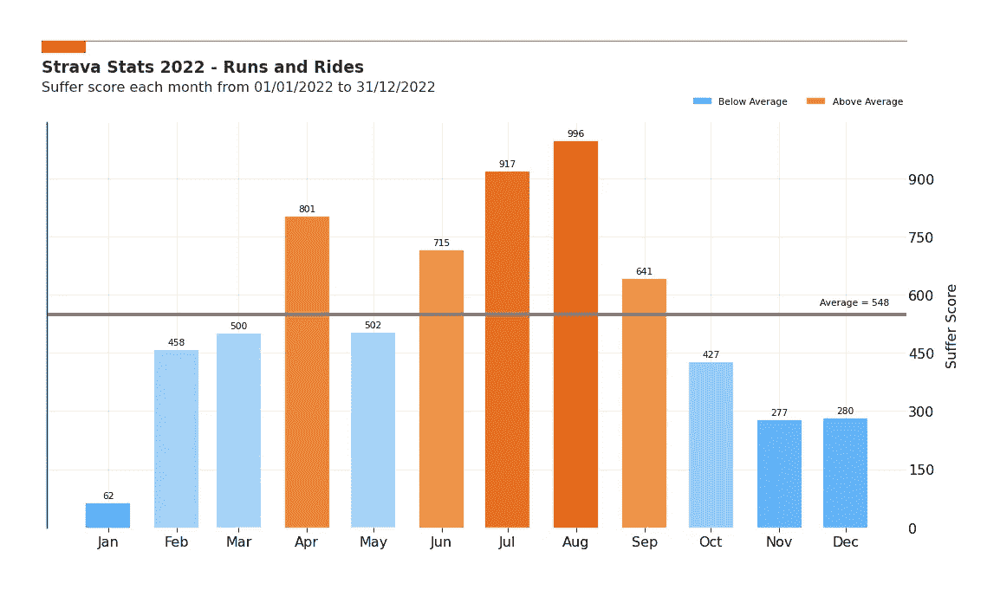

# 你的 Strava 年度统计数据……但用 Python 以不同的方式呈现

> 原文：[`towardsdatascience.com/your-strava-year-in-stats-but-differently-with-python-2b816f920bae?source=collection_archive---------11-----------------------#2023-01-09`](https://towardsdatascience.com/your-strava-year-in-stats-but-differently-with-python-2b816f920bae?source=collection_archive---------11-----------------------#2023-01-09)

## 了解关于你 Strava 活动的新见解，总结你的一年

 [Guillaume Weingertner](https://guillaume-weingertner.medium.com/?source=post_page-----2b816f920bae--------------------------------)

·

[关注](https://medium.com/m/signin?actionUrl=https%3A%2F%2Fmedium.com%2F_%2Fsubscribe%2Fuser%2F4ebea49e580e&operation=register&redirect=https%3A%2F%2Ftowardsdatascience.com%2Fyour-strava-year-in-stats-but-differently-with-python-2b816f920bae&user=Guillaume+Weingertner&userId=4ebea49e580e&source=post_page-4ebea49e580e----2b816f920bae---------------------post_header-----------) 发表在 [Towards Data Science](https://towardsdatascience.com/?source=post_page-----2b816f920bae--------------------------------) ·5 分钟阅读·2023 年 1 月 9 日

--

每月的痛苦评分——作者图像

# #1 动力

随着 2022 年的结束，Strava 像许多其他应用一样，为用户提供了年度统计数据的总结。然而，这些统计数据仍然有些局限，水平很高，不能提供关于你整体活动的非常有用的见解。

在这篇文章中，我将解释如何使用 Strava 的 API 获取你的数据，并构建有洞察力的图表，以获取在应用程序中找不到的新见解。

# #2 使用 Strava API 获取数据

我写了另一篇文章，其中详细解释了如何使用 Strava API 逐步获取你的特定数据。如果你想尝试一下，可以在这里查看：

## 谁是你在 Strava 上的头号支持者？

### 探索 Strava API，并使用 Python 进行查找

towardsdatascience.com

如果你按照这个快速教程，你应该得到一个包含你全年所有活动的数据框。它看起来像这样：
