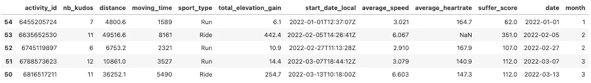
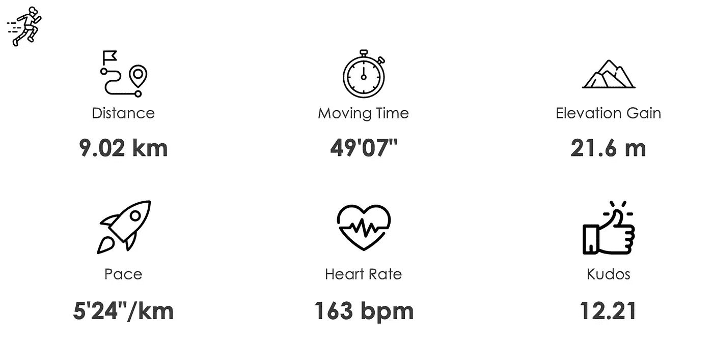
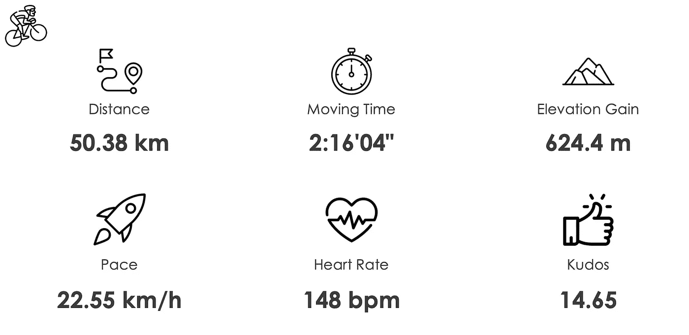
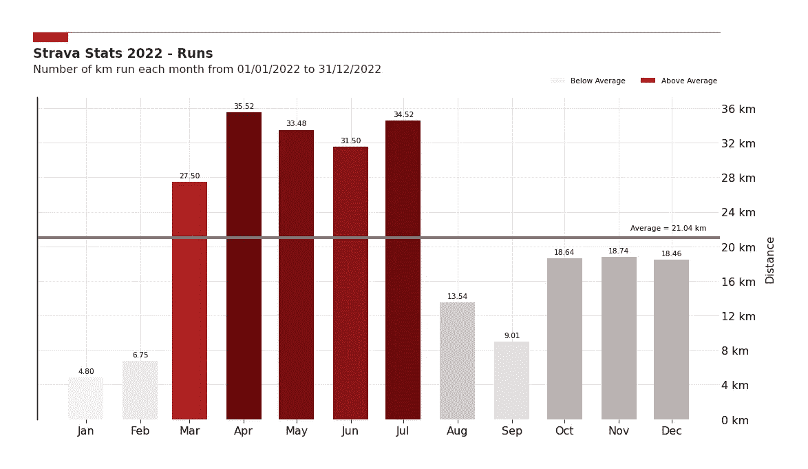
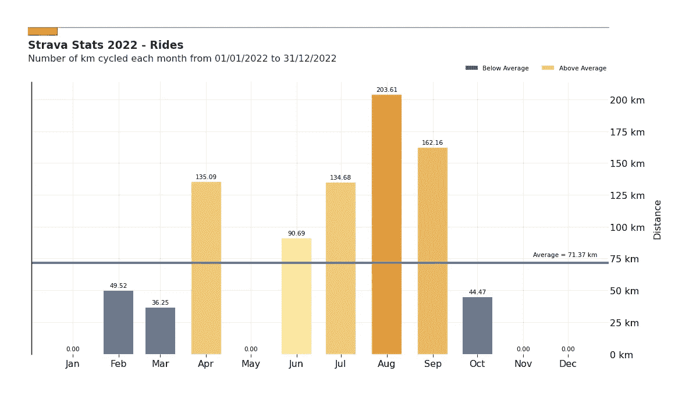
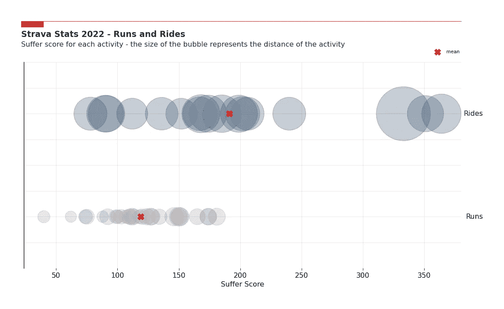
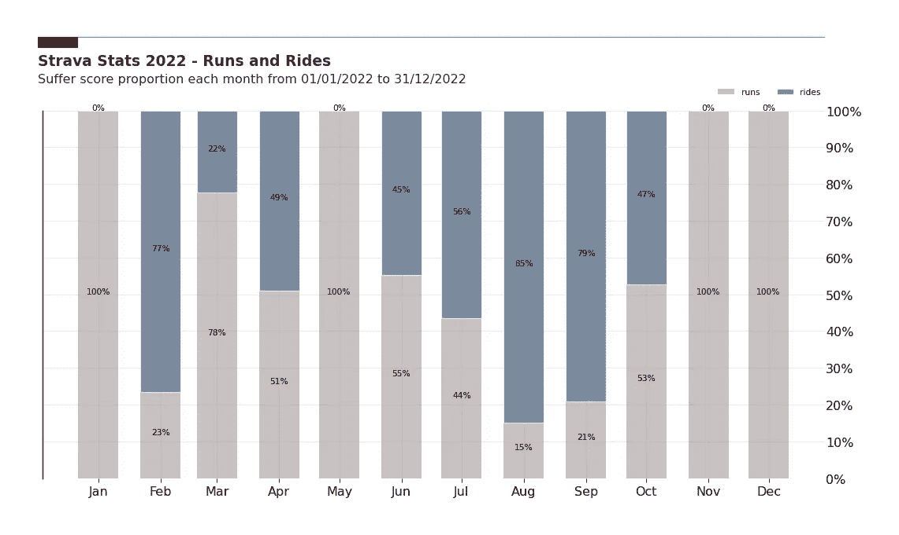

# 你的 Strava 年度统计……但用 Python 的方式

> 原文：[`towardsdatascience.com/your-strava-year-in-stats-but-differently-with-python-2b816f920bae`](https://towardsdatascience.com/your-strava-year-in-stats-but-differently-with-python-2b816f920bae)

## 获取有关你的 Strava 活动的新见解，总结你的一年

 [Guillaume Weingertner](https://guillaume-weingertner.medium.com/?source=post_page-----2b816f920bae--------------------------------)

·发表于 [Towards Data Science](https://towardsdatascience.com/?source=post_page-----2b816f920bae--------------------------------) ·阅读时间 5 分钟·2023 年 1 月 9 日

--

每个月的痛苦评分 — 图片由作者提供

# #1 动机

随着 2022 年的结束，Strava 和许多其他应用程序一样，为用户提供了一年的统计总结。然而，这些统计数据仍然有些有限，非常高层次，并未提供对整体活动的超实用见解。

在这篇文章中，我解释了如何使用 Strava 的 API 获取你的数据，并构建有洞察力的图表，以获取你在应用中找不到的新见解。

# #2 使用 Strava API 获取数据

我写了另一篇文章，解释了如何一步步使用 Strava API 获取你的特定数据。如果你想尝试一下，可以点击这里：

 ## 谁是你在 Strava 上的头号支持者？

### 探索 Strava API 并使用 Python 发现

towardsdatascience.com

如果你按照这个快速教程，你应该会得到一个包含你全年所有活动的数据框。它看起来像这样：

所有 Strava 活动的数据框 — 图片由作者提供

不详细介绍所有函数（你可以在我的 GitHub 上找到所有内容 — 链接在文章末尾），代码如下：

将你的 Strava 活动放入数据框 — 代码由作者提供

# #3 对跑步和骑行的分析

今年我主要跑步和骑车。我想回答的一个问题是，经过这些跑步和骑行，平均来说，一项典型的活动是什么样的？

我使用以下代码将跑步和骑行分开：

并做了一些格式化，以获得**典型跑步**的以下统计数据：

典型跑步 — 图片来源：作者

和**典型骑行**：

典型骑行 — 图片来源：作者

现在，我认为另一个有趣的信息是哪些月份最为活跃，以及在哪项运动中。

为了弄清楚这一点，我简单地绘制了我每个月在两项运动中的累积距离。

如下所示，我最为密集的**跑步**时期是在三月至七月之间：

每月跑步距离 — 图片来源：作者

尽管我在夏季稍微更关注**骑行**，在八月达到了峰值：

每月骑行距离 — 图片来源：作者

上面的图表分别显示了跑步和骑行活动。

这很好，但仅凭此数据，我们无法知道某个月是否更多地专注于其中一项运动。我们需要找到一个能够将两项运动在同一尺度上进行比较的指标。

距离或移动时间并不适用，因为这些活动的尺度明显不同，爬升增益对于跑步或骑行也不具有可比性，配速也不行……这就引出了痛苦评分。

# #4 痛苦评分

> 痛苦评分基于你的心率，因此无论你是周末战士还是职业运动员，只要你的心脏在努力工作，你都能获得相同的评分。
> 
> Suffer Score（痛苦评分）衡量你在每个心率区间所花费的时间。花在更高心率区间的时间权重比花在较低心率区间的时间更高。

更多详细信息请参见：[`blog.strava.com/fr/suffer-score-how-hard-is-hard`](https://blog.strava.com/fr/suffer-score-how-hard-is-hard-11775/#:~:text=Suffer%20Score%20is%20based%20on,that%20have%20Strava%20Premium%20accounts.)

得益于这个指标，我们现在可以比较完全不同的活动（在我们的案例中是跑步和骑行），并了解它们的强度。

# #5 所有活动分析

为了更好地理解痛苦评分并对其有所感受，让我们绘制每项活动的评分，并按运动类型进行拆分：

每项活动的痛苦评分 — 图片来源：作者

上图显示了骑行的平均痛苦评分高于跑步的平均痛苦评分，说明在我的情况下，平均而言，骑行比跑步更为强烈。

请记住，这一结论仅对我适用，你的数据可能会显示完全不同的结果。

现在的想法是，每个月绘制一次累积痛苦评分，这次结合跑步和骑行活动。

每月痛苦评分 — 图片来源：作者

这个图表讲述了一个与专注于骑行和跑步分别的图表不同的故事。

这一年在不同季节的分布较为均匀，夏季的强度达到峰值，而冬季明显有所减少，实际上我在冬季完全没有骑行。

最后，为了了解每个月在某项运动上的投入程度，我们绘制了一个堆叠条形图，显示了每个月每项运动的受苦分数比例：

受苦分数每月比例 — 作者提供的图像

# #6 结语

在本文中，我尝试展示了通过掌握一些 Python 知识，你可以获得比 Strava 年终总结更多的关于你活动的洞察。

从你的 Strava 活动中获取的数据集是开始数据分析项目的绝佳起点！在这个项目中，我重点比较了每个月的跑步和骑行，但你还可以做很多其他分析。

如果你想分析你的活动并查看你的年度统计数据，整个代码可以在这里找到：

[`github.com/Guigs11/strava_insights`](https://github.com/Guigs11/strava_insights)

*感谢你读到文章的最后！

如果你有任何问题或意见，请随时在下方留言，或者通过* [*LinkedIn*](https://www.linkedin.com/in/guillaume-weingertner-a4a27972/) *联系我！*
