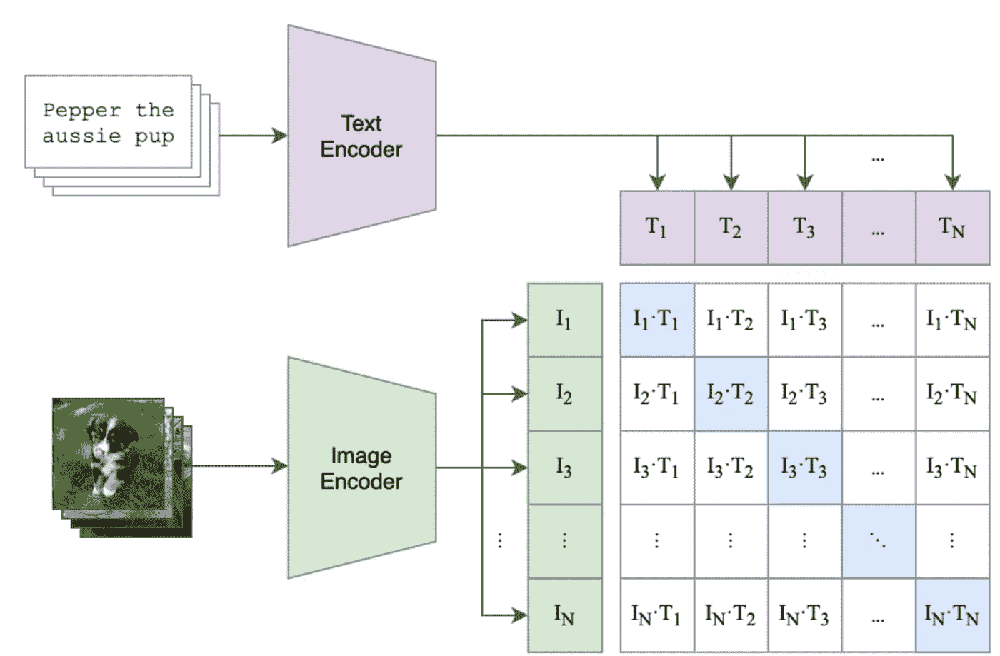
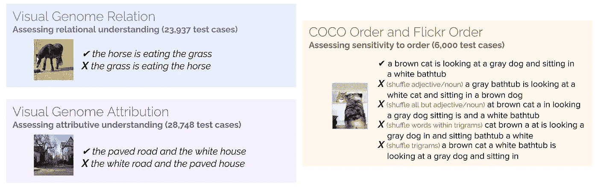
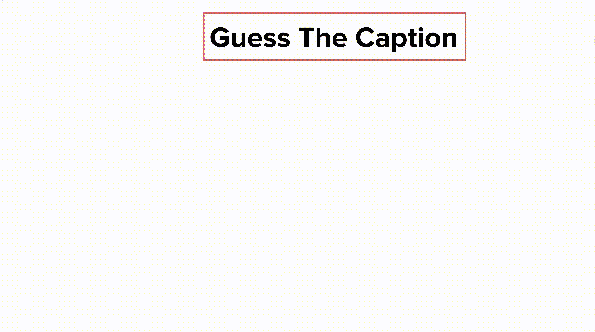
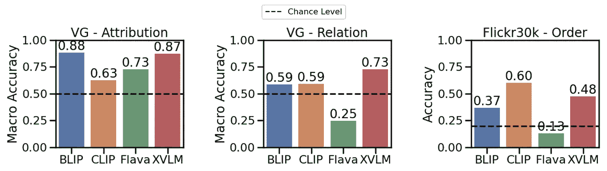
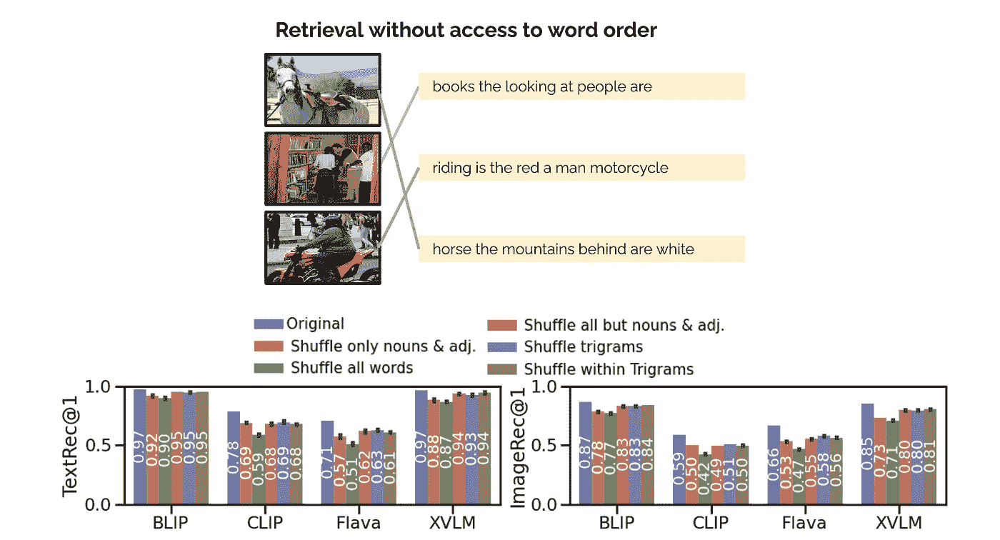
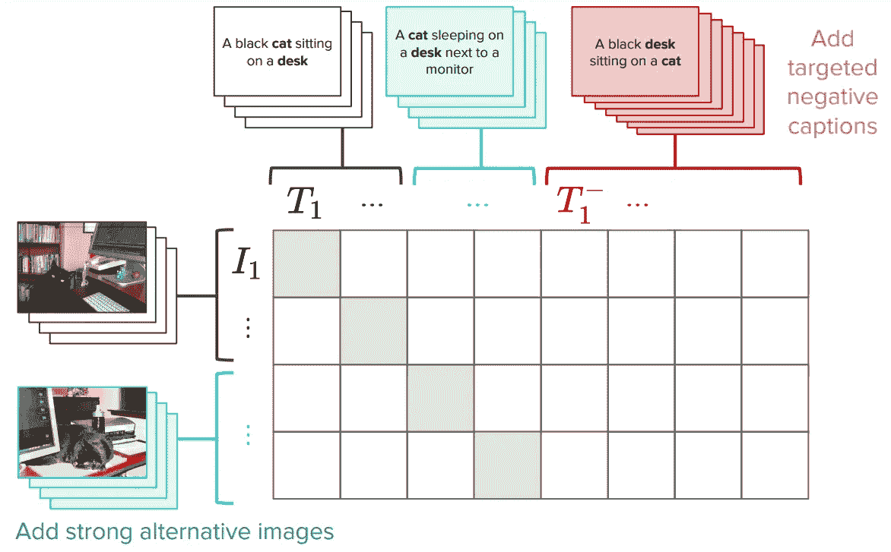
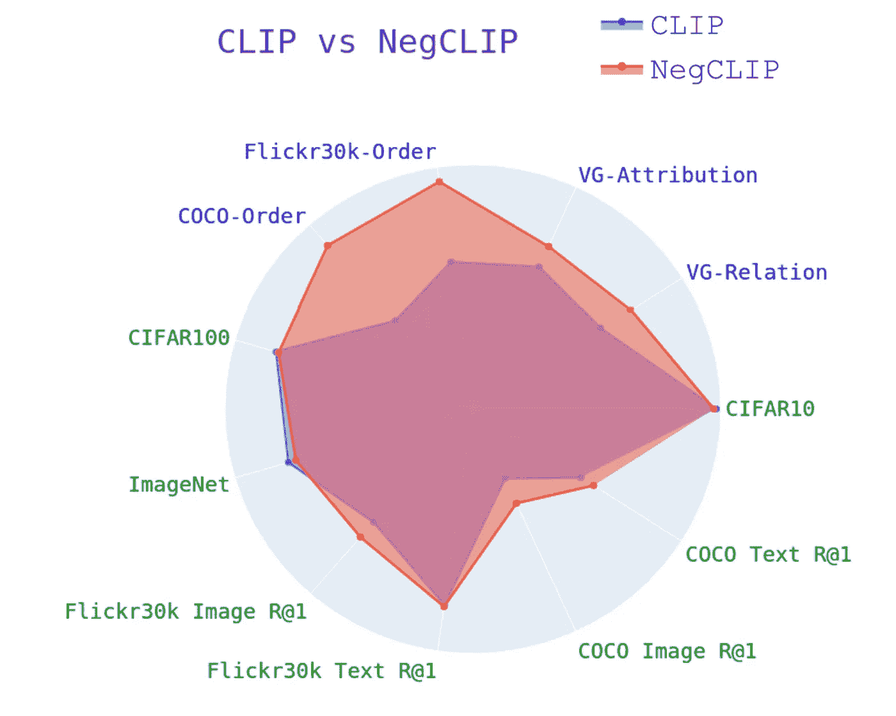

# 你的视觉-语言模型可能只是一个词袋

> 原文：[`towardsdatascience.com/your-vision-language-model-might-be-a-bag-of-words-30b1beaef7f8?source=collection_archive---------5-----------------------#2023-03-21`](https://towardsdatascience.com/your-vision-language-model-might-be-a-bag-of-words-30b1beaef7f8?source=collection_archive---------5-----------------------#2023-03-21)

## 我们在 ICLR 2023 的口头报告中探讨了视觉-语言模型对语言的理解极限

[](https://fede-bianchi.medium.com/?source=post_page-----30b1beaef7f8--------------------------------)[](https://towardsdatascience.com/?source=post_page-----30b1beaef7f8--------------------------------) [Federico Bianchi](https://fede-bianchi.medium.com/?source=post_page-----30b1beaef7f8--------------------------------)

·

[关注](https://medium.com/m/signin?actionUrl=https%3A%2F%2Fmedium.com%2F_%2Fsubscribe%2Fuser%2F2aff872fe60e&operation=register&redirect=https%3A%2F%2Ftowardsdatascience.com%2Fyour-vision-language-model-might-be-a-bag-of-words-30b1beaef7f8&user=Federico+Bianchi&userId=2aff872fe60e&source=post_page-2aff872fe60e----30b1beaef7f8---------------------post_header-----------) 发布于 [Towards Data Science](https://towardsdatascience.com/?source=post_page-----30b1beaef7f8--------------------------------) · 8 分钟阅读 · 2023 年 3 月 21 日[](https://medium.com/m/signin?actionUrl=https%3A%2F%2Fmedium.com%2F_%2Fvote%2Ftowards-data-science%2F30b1beaef7f8&operation=register&redirect=https%3A%2F%2Ftowardsdatascience.com%2Fyour-vision-language-model-might-be-a-bag-of-words-30b1beaef7f8&user=Federico+Bianchi&userId=2aff872fe60e&source=-----30b1beaef7f8---------------------clap_footer-----------)

--

[](https://medium.com/m/signin?actionUrl=https%3A%2F%2Fmedium.com%2F_%2Fbookmark%2Fp%2F30b1beaef7f8&operation=register&redirect=https%3A%2F%2Ftowardsdatascience.com%2Fyour-vision-language-model-might-be-a-bag-of-words-30b1beaef7f8&source=-----30b1beaef7f8---------------------bookmark_footer-----------)

图片由 [ThisIsEngineering](https://www.pexels.com/photo/code-projected-over-woman-3861969/) 提供。

多模态人工智能是当前的热门话题。随着 GPT-4 的发布，我们看到了许多过去六个月无法想象的新应用和未来技术。事实上，视觉-语言模型在许多不同的任务中非常有用。例如，通过 [CLIP](https://github.com/openai/CLIP) 你可以对未见过的数据集进行零样本图像分类，通常能够在不需要训练的情况下获得可靠的表现。

与此同时，视觉-语言模型也并非完美。这里，我们探索这些模型的局限性，强调它们可能失败的地方和原因。这篇博客文章是我们最近论文的简要/高层次描述，该论文将在 [ICLR 2023 口头报告](https://openreview.net/forum?id=KRLUvxh8uaX) 中介绍。如果你想查看代码，只需点击 [这里](https://github.com/mertyg/vision-language-models-are-bows)。

> Yuksekgonul, M., Bianchi, F., Kalluri, P., Jurafsky, D., & Zou, J. (2023). 视觉-语言模型何时以及为何表现得像词袋模型，以及该如何应对？ICLR。

# 介绍

## **什么是视觉-语言模型？**

视觉-语言模型通过利用视觉和语言数据之间的协同效应来执行各种任务，从而彻底改变了该领域。尽管文献中介绍了许多视觉-语言模型，但 CLIP 是最著名和广泛采用的模型。

通过将图像和字幕嵌入到同一向量空间中，CLIP 实现了跨模态推理，使用户能够执行如零-shot 图像分类和文本到图像检索等任务，并且精度良好。CLIP 采用对比学习方法来学习图像和字幕的嵌入表示。

## 对比学习的简要介绍

对比学习使 CLIP 能够通过最小化共享向量空间中图像与其对应字幕之间的距离来学习将图像与其字幕关联。这种方法已经被证明非常有效，CLIP 和其他基于对比的模型所取得的令人印象深刻的结果也证实了这一点。

对比损失用于比较批次中图像和字幕的配对，并优化模型以最大化匹配图像-文本配对的嵌入之间的相似度，并减少批次中其他配对的相似度。

下面的图像展示了一个可能的批次和训练步骤的示例：

+   **紫色方块**包含所有字幕的嵌入，**绿色方块**包含所有图像的嵌入。

+   矩阵的方块包含批次中所有图像嵌入和所有文本嵌入的点积（读取为“余弦相似度”，因为嵌入已经归一化）。

+   **蓝色方块**包含模型需要最大化相似性的配对，其他**白色方块**是我们希望最小化的相似度（因为这些方块包含了不匹配的图像-文本配对的相似度，例如，一张猫的图片和描述“我的古董椅子”）。



CLIP 中的对比预训练。蓝色方块表示我们希望优化相似性的配对。图片来源于 [`github.com/openai/CLIP`](https://github.com/openai/CLIP)

训练完成后，你应该拥有一个有意义的向量空间，在其中你可以对图像和描述进行编码。一旦你为每个图像和每个文本获取了嵌入，你可以执行许多任务，例如查看哪些图像与描述更相似（例如，在你 2017 年夏季度假专辑中查找“海滩上的狗”），或找出哪个文本标签与图像更相似（例如，你有一大堆你家狗和猫的图片，你希望能够识别它们）。

视觉-语言模型，如 CLIP，已成为通过整合视觉和语言信息解决复杂 AI 任务的强大工具。它们将这两种数据嵌入到共享向量空间中的能力，使其在各种应用中达到前所未有的准确性和性能水平。

# **视觉-语言模型理解语言吗？**

我们的工作试图在回答这个问题上迈出一些步伐。关于深度模型是否或在多大程度上理解语言存在重大争议。在这里，我们的目标是调查视觉-语言模型及其组合能力。首先，我们提出了一个新的数据集，用于测试组合理解；这个新的基准叫做**ARO**（属性、关系和顺序）。然后，我们探讨了对比损失在这种情况下可能受到的限制。最后，我们提出了一个简单但有前景的解决方案。

## **新的基准：属性、关系和顺序**

像 CLIP（以及来自 Salesforce 的更新模型 BLIP）这样的模型在理解语言方面表现如何？

我们收集了一组基于属性的组合描述（例如，“红色的门和站着的人”）和基于关系的组合描述（例如，“马在吃草”），以及相应的匹配图片。然后，我们生成了替代的错误描述，如“草在吃马”。**模型能找到正确的描述吗？** 我们还探索了打乱词语的效果：**模型是否更喜欢未打乱的描述而非打乱的描述？**

我们为属性、关系和顺序（**ARO**）创建的四个数据集在下图中有所说明（注意顺序包含两个数据集）：



我们创建的不同数据集是关系、属性和顺序。对于每个数据集，我们展示一个图片示例和不同的描述。只有一个描述是正确的，模型必须识别正确的描述。图片由作者提供。

+   属性测试理解属性：*“铺装的* ***道路*** *和* ***白色*** *房子”* 与 *“白色* ***道路*** *和* ***铺装的*** *房子”*。

+   关系测试理解关系：*“马* ***在吃*** *草”* 和 *“草* ***在吃*** *马”。*

+   最后，顺序测试模型对顺序打乱的弹性：我们随机打乱标准数据集的描述（例如，MSCOCO）。

视觉语言模型能找到匹配图像的正确标题吗？这个任务看似简单，我们期望模型能理解“马在吃草”和“草在吃马”之间的区别，对吧？我意思是，谁见过草吃东西？

好吧，可能是 BLIP，因为它不能理解“马在吃草”和“草在吃马”之间的区别：



BLIP 不理解“草在吃马”和“马在吃草”之间的区别。图像由作者提供，包含来自 Visual Genome 数据集的元素。图像由作者提供。

现在让我们看看一些结果。少数模型在关系理解（例如，吃）上显著高于偶然水平。CLIP 在归因和关系上仅略高于偶然水平。这实际上表明视觉语言模型存在问题。



不同模型在归因、关系和顺序（针对 Flick30k）基准上的表现。你可以看到 CLIP、BLIP 和其他最先进的模型。图像由作者提供。

## 检索和对比损失的批评

这项工作的主要结果之一是我们可能需要超越标准对比损失来学习**语言**；但为什么呢？

从最上面开始：视觉语言模型通常在检索任务上进行评估：获取一个标题并找到它对应的图像。如果你查看用于评估这些模型的数据集（例如，MSCOCO、Flickr30K），你会发现它们通常包含需要组成能力才能理解的标题描述的图像（例如，“橙色的猫在红色的桌子上”）。那么，为什么模型在标题复杂的情况下却没有学会组成性理解呢？

**剧透**：你不一定需要组成性理解来在这些数据集上进行检索。

我们试图更好地理解这个问题，并测试了模型在重新排列标题中的单词顺序后的表现。我们能找到标题为“books the looking at people are”的正确图像吗？如果答案是肯定的，这意味着查找正确图像时不需要顺序信息。



我们测试的任务是用打乱的标题进行检索。即使我们打乱标题，模型仍能正确找到相应的图像（反之亦然）。这表明检索任务可能太简单。图像由作者提供。

我们测试了不同的打乱程序，答案是肯定的：即使使用不同的打乱技术，检索性能基本上**不**受影响。

再说一遍：视觉-语言模型在检索任务中表现优异——在这些数据集上——即使顺序信息不可得。这些模型可能像词袋一样运作，其中顺序并不重要：如果模型在检索中表现良好而不需要理解**词** **顺序**，那么我们到底在检索中测量什么呢？

## **该怎么办？**

既然我们知道存在问题，我们可能需要寻找解决方案。最简单的方案如下：让 CLIP 理解“猫在桌子上”与“桌子在猫身上”是不同的。

确实，我们提议通过增加专门用于解决此问题的困难负样本来改进 CLIP 的训练。这是一个非常简单有效的解决方案：它只需对原始 CLIP 损失做非常小的编辑，不会影响整体性能（具体细节可以在论文中阅读）。我们称这种 CLIP 版本为 NegCLIP。



在 CLIP 中引入困难负样本。我们添加了图像和文本的困难负样本。图片来源于作者。

基本上，我们要求 NegCLIP 将黑猫的图像与“桌子上坐着一只黑猫”这句话靠近，但与“猫上坐着一张黑桌子”这句话远离。后者是通过使用 POS 标记自动生成的。

这个修复的效果是，它实际上可以提高 ARO 基准上的性能，而不会影响检索性能或其他下游任务如检索和分类的表现。有关不同基准的结果，请参见下图（详细信息请见论文）。



NegCLIP 与 CLIP 在不同基准上的比较。蓝色基准是我们介绍的，绿色基准来自文献。图片来源于作者。

你可以看到，在 ARO 基准测试中有了显著的改进，而在其他下游任务中则有边际改进或类似性能。

## 代码！

[Mert](https://mertyg.github.io/)（论文的主要作者）在 [创建一个小型库](https://github.com/mertyg/vision-language-models-are-bows) 来测试视觉-语言模型方面做了出色的工作。你可以使用他的代码来复制我们的结果或进行新模型的实验。

只需几行 Python 代码，你就可以下载数据集并开始运行！

```py
import clip
from dataset_zoo import VG_Relation, VG_Attribution

model, image_preprocess = clip.load("ViT-B/32", device="cuda")

root_dir="/path/to/aro/datasets"
# Setting download=True will download the dataset to `root_dir` if it's not already there. 
# For VG-R and VG-A, this is a 1GB zip file that is a subset of GQA.

vgr_dataset = VG_Relation(image_preprocess=preprocess, 
                download=True, root_dir=root_dir)
vga_dataset = VG_Attribution(image_preprocess=preprocess, 
                download=True, root_dir=root_dir)

# Do anything with the dataset. Each item will look like this : 
# item = {"image_options": [image], "caption_options": [false_caption, true_caption]}
```

我们还发布了 NegCLIP 的实现（实际上是 OpenCLIP 的一个分支）。查看代码 [这里](https://github.com/vinid/neg_clip)。

# 告别

感谢阅读！希望这篇文章有趣。视觉-语言模型已经能做很多事情，我们迫不及待想看看未来的模型，例如 GPT4 能做些什么！

## 致谢

感谢 [Mert](https://mertyg.github.io/) 提供的所有建议！

## 相关内容

如果你想了解更多关于 CLIP 的信息，我写了一篇博客文章，详细介绍了相关内容。

[## 如何训练你的 CLIP]

### CLIP 介绍以及我们在 HuggingFace 社区周期间如何为意大利语言进行微调。

towardsdatascience.com

我还对 CLIP 进行了时尚数据的微调。这里有一篇你可能感兴趣的博客文章！

[## 教授 CLIP 一些时尚]

### 训练 FashionCLIP，一种针对时尚领域的 CLIP 模型

towardsdatascience.com
