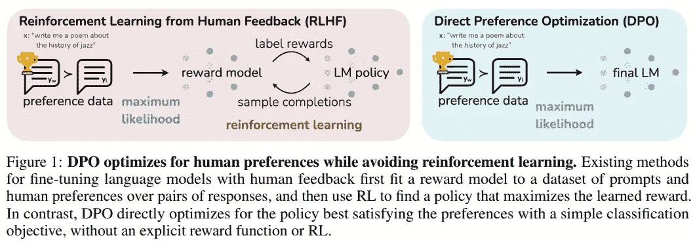
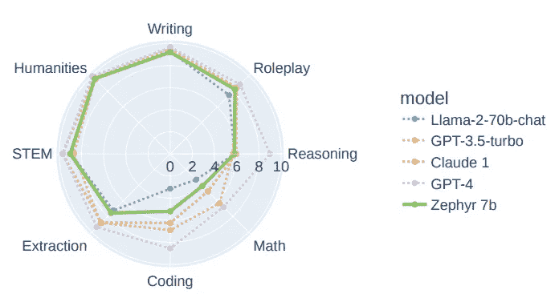
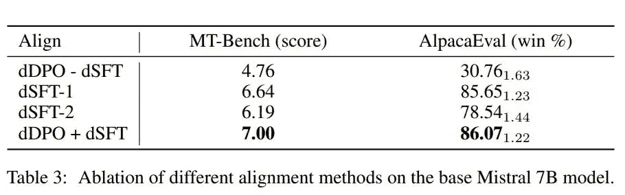

# Zephyr 7B Beta：一个好的老师就是你所需要的一切

> 原文：[`towardsdatascience.com/zephyr-7b-beta-a-good-teacher-is-all-you-need-c931fcd0bfe7`](https://towardsdatascience.com/zephyr-7b-beta-a-good-teacher-is-all-you-need-c931fcd0bfe7)

## Mistral 7B 的知识蒸馏

 [本杰明·玛丽](https://medium.com/@bnjmn_marie?source=post_page-----c931fcd0bfe7--------------------------------)

·发表于 [Towards Data Science](https://towardsdatascience.com/?source=post_page-----c931fcd0bfe7--------------------------------) ·阅读时间 8 分钟·2023 年 11 月 11 日

--

图片来源于 [Pixabay](https://pixabay.com/illustrations/man-drinking-booze-drinker-5334659/)

Mistral 7B 是其中一个 [最佳预训练大型语言模型（LLM）](https://huggingface.co/spaces/HuggingFaceH4/open_llm_leaderboard)。通过发布 [Zephyr 7B Alpha](https://huggingface.co/HuggingFaceH4/zephyr-7b-alpha)，Hugging Face 已证明 Mistral 7B 经过 DPO 微调后可以超越比其大 10 倍的聊天模型，并且在某些任务上与 GPT-4 的性能相匹配。

模型名称中的“Alpha”显然表明 Hugging Face 计划发布更好的 Zephyr 7B 版本。他们确实在仅仅两周后发布了 [Zephyr 7B Beta](https://huggingface.co/HuggingFaceH4/zephyr-7b-beta)。arXiv 上有一份技术报告描述了该模型及其评估：

[Zephyr: 语言模型对齐的直接蒸馏](https://arxiv.org/abs/2310.16944) (Tunstall 等, 2023)

在这篇文章中，我们将看到是什么让 Zephyr 7B Beta 比更大的 LLM 更好。更具体地说，我们将了解 Hugging Face 如何利用更大的 LLM，如 GPT-4，来教导 Mistral 7B 以响应指令并将回答与人类偏好对齐。

# 蒸馏：当较小的 LLM 向较大的 LLM 学习

由于 Hugging Face 依赖于知识蒸馏（KD）来训练 Zephyr，让我们简单回顾一下 KD 在 LLM 上的应用。

大多数 LLM 是在由人类撰写的文本上进行训练的。人类文本具有高多样性的标记序列和词汇，这使得建模变得困难。由于这种困难，我们需要大量的数据来训练 LLM 以正确建模语言。

有一个减少训练成本和难度的捷径：知识 **蒸馏**（KD）。有多种方法可以进行 KD。在这一部分，我将仅讨论 Hugging Face 使用的方法。

一旦在人工文本上训练，即使 LLMs 在生成语言方面表现非常好，它们也只能近似语言的真实概率分布。LLMs 生成的 token 序列比人类的要少得多。*注意：这就是为什么在推理过程中经常引入随机抽样，例如通过*[*核采样*](https://arxiv.org/abs/1904.09751)*，以提高生成文本的多样性。*

由于 LLMs 生成的 token 序列比人类文本的多样性要低，因此学习建模这些生成的序列是一项容易得多的任务。

实际上，这是通过使用最先进的模型（通常称为**教师**模型）来生成大量合成文本，这些文本将用于训练一个较小的模型，通常称为**学生**模型。学生模型从其教师那里提取知识。

学生模型在生成文本上的训练收敛速度要快得多，并且可以达到接近教师模型的性能。*。

这种策略在训练 LLMs 时效果很好。我们成功的最佳例子之一是微软的 phi-1.5：一个拥有 13 亿参数的模型，其表现与更大模型相匹配。微软的 phi-1.5 完全在由其他模型生成的合成数据上进行训练，即，微软的 phi-1.5 是一个学生模型。*注意：微软没有披露教师模型是什么。*

[## 如何微调、量化和运行微软 phi-1.5](https://kaitchup.substack.com/p/how-to-fine-tune-quantize-and-run?source=post_page-----c931fcd0bfe7--------------------------------)

### 一个为多任务预训练的模型

[kaitchup.substack.com](https://kaitchup.substack.com/p/how-to-fine-tune-quantize-and-run?source=post_page-----c931fcd0bfe7--------------------------------)

Hugging Face 的 Zephyr 7B Beta 也是一个学生模型。它的所有训练数据都是由更大模型生成的，因此相较于其他在人工文本上训练的类似大小的 LLMs（例如 Llama 2），其表现更好。

在 Zephyr 7B Beta 的情况下，Hugging Face 将知识蒸馏推进到训练和对齐 LLM 与人类偏好的过程中的更深层次，正如我们在接下来的部分中将看到的那样。

# dDPO：使用 Mistral 7B 的蒸馏直接偏好优化

从 Mistral 7B 生成 Zephyr 7B Beta 是一个三步过程：

1.  在由其他更大模型生成的指令数据集上进行监督微调（SFT）

1.  使用最先进的 LLM 对 LLMs 的输出进行评分/排名

1.  使用步骤 1 中获得的模型对步骤 2 中获得的数据进行 DPO 训练

## 蒸馏监督微调（dSFT）

SFT 是训练指令/聊天模型的标准第一步。它需要一个指令数据集：指令/问题与人类给出的答案配对。

主要问题在于，收集这样的数据集非常昂贵，因为它涉及人力劳动。一个越来越常见且更便宜的替代方案是使用其他 LLMs 生成的指令数据集。

我们可以在 Hugging Face Hub 上找到许多这样的指令数据集，例如：

+   [OpenAssistant Conversations Dataset (OASST1)](https://huggingface.co/datasets/OpenAssistant/oasst1)（84.4k 训练示例）

+   [OpenOrca](https://huggingface.co/datasets/Open-Orca/OpenOrca)（4.2M 训练示例）

+   [openassistant-guanaco](https://huggingface.co/datasets/timdettmers/openassistant-guanaco)（9.8k 训练示例）

对于 Zephyr 7B Beta，Hugging Face 在自定义版本的 [Ultrachat](https://huggingface.co/datasets/stingning/ultrachat) 上微调了 Mistral 7B，该版本经过了严格筛选：

+   [HuggingFaceH4/ultrachat_200k](https://huggingface.co/datasets/HuggingFaceH4/ultrachat_200k)（MIT 许可证），使用“sft”拆分

> *我们应用了真正的大小写规则来修复语法错误（大约 5% 的数据集），以及几个过滤器来关注有用性并删除不需要的模型回应。*

Hugging Face 将这种 SFT 称为“蒸馏监督微调”，因为微调是在“教师”模型生成的数据集上进行的。

## 基于偏好的 AI 反馈（AIF）

为了与人类对齐，我们需要一个包含排名答案的提示数据集。然后我们可以使用 DPO 或 RLHF 来训练模型生成首选答案。

对模型答案进行排名是一项昂贵的任务，需要人工劳动。但我们已经有对齐的 LLM，足以进行这种排名。

我们可以使用现有的提示数据集与由不同模型生成的答案配对，并使用最先进的 LLM 来对这些答案进行排名。

对于这一步，Hugging Face 直接使用了数据集 [UltraFeedback](https://huggingface.co/datasets/openbmb/UltraFeedback)。

UltraFeedback 包含 74k 个提示，配对以下模型生成的回应：

+   LLaMA-2–7B-chat, LLaMA-2–13B-chat, LLaMA-2–70B-chat

+   UltraLM-13B, UltraLM-65B

+   WizardLM-7B, WizardLM-13B, WizardLM-70B

+   Vicuna-33B

+   Alpaca-7B

+   Falcon-40B-instruct

+   MPT-30B-chat

+   StarChat-Beta

+   Pythia-12B

每个 LLM 的输出由 GPT-4 按 1 到 5 的评分（分数越高越好）进行评估，评分标准如下：

+   指令跟随

+   有用性

+   诚实性

+   真实性

对于 DPO，我们需要一个“选择”的输出，即我们偏好的输出，以及一个“拒绝”的输出，即我们不希望模型生成的输出。

对于选择的输出，选择了得分最高的输出（使用所有标准计算这个平均值）。对于被拒绝的输出，他们在剩余的输出中随机选择一个。

他们将这种随机选择的理由说明如下：

> *我们选择了随机选择而不是选择最低得分的回应，以鼓励多样性并使 DPO 目标更具挑战性*

他们制作并用于 DPO 训练的数据集版本在这里：

+   [HuggingFaceH4/ultrafeedback_binarized](https://huggingface.co/datasets/HuggingFaceH4/ultrafeedback_binarized)（MIT 许可证），使用“prefs”拆分

## 蒸馏直接偏好优化（dDPO）

指令 LLM，例如聊天模型，通常使用人类反馈的强化学习（RLHF）进行训练，采用邻近策略优化（PPO）。它能够很好地使 LLM 与人类偏好对齐，但 RLHF 也不稳定且复杂。实际上，在运行 RLHF 之前，我们需要训练两个模型：

+   一个通过在指令数据集上进行有监督微调（SFT）简单训练的参考模型

+   一个训练用于预测人类偏好的奖励模型。该模型的训练数据通常是人类对给定提示的模型输出进行排名的结果。奖励模型被训练以预测这些排名。

然后，RLHF 使用 4 个不同的模型：

+   使用 SFT 训练的参考模型

+   奖励模型

+   一个通常由奖励模型初始化的价值模型

+   我们希望使用 RLHF 训练的模型（策略），通常由参考模型初始化

使用所有这些模型，RLHF 使用 RL 来优化语言模型策略，以生成高奖励的响应（根据奖励模型），而不会过度偏离原始参考模型。

几个框架实现了 RLHF，使其计算上更高效。然而，它仍然是一个复杂且不稳定的过程，涉及多个模型。

DPO 是 RLHF 的一个简单替代方案。它隐式优化与现有 RLHF 算法相同的目标（具有 KL 散度约束的奖励最大化）。DPO 的作者证明，受约束的奖励最大化问题可以通过解决一个更简单的人类偏好分类问题来精确优化。

由于它可以被简化为分类问题，DPO 使用简单的二元交叉熵目标来训练模型。DPO 完全消除了强化学习的需求。

给定一个提示和几个根据质量由人类排名的 LLM 输出，DPO 训练模型为最佳输出分配更高的奖励。

DPO 只需要两个模型：

+   使用 SFT 在指令数据集上微调的参考模型

+   我们希望使用 DPO 训练的基础模型

插图由 [Rafailov et al. (2023)](https://arxiv.org/abs/2305.18290) — CC-BY 4.0

DPO 在这篇 arXiv 论文中由斯坦福大学提出：

[直接偏好优化：你的语言模型在秘密中是一个奖励模型](https://arxiv.org/abs/2305.18290)

请注意，对于 Zephyr，Hugging Face 称之为“蒸馏直接偏好优化”，仅仅是因为 SFT 和偏好是由其他 LLM 生成的。DPO 过程本身仍然是标准的。

如果你对使用 DPO 微调 Mistral 7B 感兴趣，可以看看我的教程：

 [## 使用直接偏好优化（DPO）微调你自己的 Mistral 7B 指令版本

### 制作便宜的 Zephyr 7B

[Kaitchup - Fine-tune Your Own Instruct Version](https://kaitchup.substack.com/p/fine-tune-your-own-instruct-version?source=post_page-----c931fcd0bfe7--------------------------------)

# Zephyr 7B Beta 的评估

Hugging Face 在 MT Bench 上从以下几个方面评估了 Zephyr：写作、角色扮演、推理、数学、编程、提取、STEM 和人文学科

插图由 [Tunstall et al. (2023)](https://arxiv.org/abs/2310.16944) 提供 — CC-BY 4.0

显然，Zephyr 在性能上优于 Llama 2 70B，同时在其他最先进的商业 LLM 中表现接近。GPT-4，作为 Zephyr 的主要老师，在推理、数学、编程和提取方面仍然表现更好。

他们还进行了一项消融研究，以展示 DPO 的重要性。

表格由 [Tunstall et al. (2023)](https://arxiv.org/abs/2310.16944) 提供 — CC-BY 4.0

单独使用 DPO（第一行）表现较差。然而，DPO 和 SFT 的组合明显优于单独使用 SFT。

# 结论

通过依赖知识蒸馏，Hugging Face 展示了在不使用任何人工标注的情况下训练和对齐最先进的大型语言模型（LLM）是可能的。

Zephyr 7B Beta 是一种相对便宜的模型，尤其是与其他更大模型如 Llama 2 Chat 70B 相比。然而，鉴于每个 GPU 的训练批量（2）以及他们完全微调了 Mistral 7B，他们不得不使用 16 个 A100 80 GB GPU（根据技术报告，训练时间长达 4 小时）。

请注意，你可以使用 LoRA 来训练 DPO，配合 Hugging Face 的 TRL 库。这可以显著减少内存消耗。Hugging Face 没有使用像 LoRA 这样的参数高效微调方法，但他们对这些方法能与完全微调一样有效持乐观态度：

> 我们没有尝试像 LoRA（Hu et al., 2021）这样的参数高效技术，但预计这些方法也会有类似的结果。

为了支持我的工作，请考虑订阅我的新闻通讯：

 [## Kaitchup - AI on a Budget | Benjamin Marie, PhD | Substack

### 每周提供有关微调、运行和在计算机上服务大型语言模型的新闻、提示和教程。每期…

[Kaitchup - AI on a Budget | Benjamin Marie, PhD | Substack](https://kaitchup.substack.com/?source=post_page-----c931fcd0bfe7--------------------------------)
