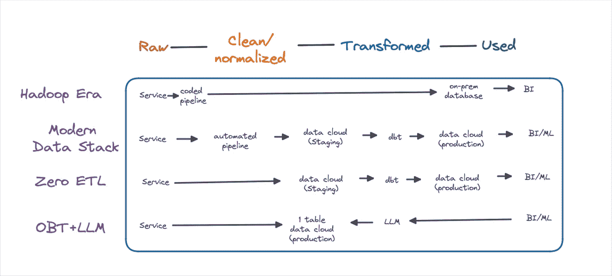

# Zero-ETL、ChatGPT 与数据工程的未来

> 原文：[`towardsdatascience.com/zero-etl-chatgpt-and-the-future-of-data-engineering-71849642ad9c?source=collection_archive---------0-----------------------#2023-04-03`](https://towardsdatascience.com/zero-etl-chatgpt-and-the-future-of-data-engineering-71849642ad9c?source=collection_archive---------0-----------------------#2023-04-03)

## *后现代数据栈即将到来。我们准备好了吗？*

 [Barr Moses](https://barrmoses.medium.com/?source=post_page-----71849642ad9c--------------------------------)

·

[关注](https://medium.com/m/signin?actionUrl=https%3A%2F%2Fmedium.com%2F_%2Fsubscribe%2Fuser%2F2818bac48708&operation=register&redirect=https%3A%2F%2Ftowardsdatascience.com%2Fzero-etl-chatgpt-and-the-future-of-data-engineering-71849642ad9c&user=Barr+Moses&userId=2818bac48708&source=post_page-2818bac48708----71849642ad9c---------------------post_header-----------) 发布于 [Towards Data Science](https://towardsdatascience.com/?source=post_page-----71849642ad9c--------------------------------) ·9 分钟阅读·2023 年 4 月 3 日

--

图片由作者提供。

如果你不喜欢变化，那么数据工程可能不适合你。这个领域几乎没有什么能逃脱再创造。

最近最显著的例子是 Snowflake 和 Databricks 颠覆了数据库的概念，开启了现代数据栈时代。

作为这一运动的一部分，Fivetran 和 dbt 从 ETL 到 ELT 根本改变了数据管道。Hightouch 在试图将重心转移到数据仓库的过程中中断了 SaaS 颠覆世界的趋势。Monte Carlo 也加入了争论，并说：“也许让工程师手动编写单元测试并不是确保[数据质量](https://www.montecarlodata.com/blog-what-is-data-observability/)的最佳方式。”

今天，数据工程师继续在现代数据堆栈的启蒙坡道上踩踏硬编码的管道和本地服务器。不可避免的整合和幻灭的低谷在地平线上以安全的距离显现。

因此，几乎有些不公平的是，新的创意已经开始出现以颠覆这些颠覆者：

+   Zero-ETL 将数据摄取作为目标

+   AI 和大型语言模型可能会彻底改变转型

+   数据产品容器正在瞄准数据核心构建块的王座

我们是否还需要重新构建一切（再次）？Hadoop 时代的余温甚至还未完全散去。

答案是，当然我们将不得不重建我们的数据系统。可能在我们的职业生涯中多次。真正的问题是为什么、何时和如何（按这个顺序）。

我不敢自称拥有所有答案或水晶球。但这篇文章将仔细探讨一些最突出的未来近（或近似）创意，以及它们对数据工程的潜在影响，*可能*会成为后现代数据堆栈的一部分。

# 实用性和权衡

图片由[Tingey Injury Law Firm](https://unsplash.com/pt-br/@tingeyinjurylawfirm?utm_source=unsplash&utm_medium=referral&utm_content=creditCopyText)提供，来源于[Unsplash](https://unsplash.com/s/photos/balancing-scales?utm_source=unsplash&utm_medium=referral&utm_content=creditCopyText)

现代数据堆栈的崛起并不是因为它比前任做得更好。存在真实的权衡。数据变得更大、更快，但也更混乱、治理更少。成本效益的判断仍在悬而未决。

现代数据堆栈之所以称霸，是因为它支持用例并以以前无法或极其困难的方式解锁数据的价值。机器学习从流行词汇转变为收入生成器。分析和实验可以更深入地支持更大的决策。

对于下面的每一个趋势，情况都将是如此。每种趋势都有其优缺点，但推动采用的因素将是它们，或是我们尚未发现的黑马创意，如何解锁利用数据的新方式。让我们更深入地探讨每一个。

# Zero-ETL

**它是什么**：一个误称；数据管道仍然存在。

今天，数据通常由服务生成并写入事务数据库中。一个自动管道被部署，不仅将原始数据移动到分析数据仓库，还在过程中稍微修改它。

例如，API 将数据以 JSON 格式导出，摄取管道不仅需要传输数据，还需要应用轻量转换，以确保数据以表格格式加载到数据仓库中。摄取阶段常见的轻量转换包括数据格式化和去重。

虽然你可以通过在 Python 中硬编码管道来进行更复杂的转换，[一些人已主张这样做](https://medium.com/towards-data-science/is-the-modern-data-warehouse-broken-1c9cbfddec3e) 以将预建模的数据交付到数据仓库，但大多数数据团队选择不这样做，以便于操作和可见性/质量的考虑。

Zero-ETL 通过让事务数据库在自动加载数据到数据仓库之前进行数据清洗和标准化，改变了这一摄取过程。需要注意的是，数据仍处于相对原始的状态。

目前，这种紧密集成是可能的，因为大多数 Zero-ETL 架构要求事务数据库和数据仓库来自同一个云提供商。

**优点**: 降低延迟。避免重复的数据存储。减少一个故障源。

**缺点**: 减少了在数据摄取阶段自定义数据处理方式的能力。可能存在一些厂商锁定。

**谁在推动**: AWS 是这个流行词的推动者 ([Aurora to Redshift](https://aws.amazon.com/about-aws/whats-new/2022/11/amazon-aurora-zero-etl-integration-redshift/))，但 GCP ([BigTable to BigQuery](https://www.infoq.com/news/2022/08/bigtable-bigquery-zero-etl/)) 和 Snowflake ([Unistore](https://www.snowflake.com/en/data-cloud/workloads/unistore/)) 都提供类似的功能。Snowflake ([Secure Data Sharing](https://docs.snowflake.com/en/user-guide/data-sharing-intro)) 和 Databricks ([Delta Sharing](https://www.databricks.com/product/delta-sharing)) 也在追求他们所谓的“无数据复制共享”。这个过程*实际上*不涉及 ETL，而是提供对存储数据的扩展访问。

**实用性和价值释放潜力**: 一方面，鉴于科技巨头的支持和现成的能力，Zero-ETL 看似只是时间问题。另一方面，我观察到数据团队正在解耦，而不是更紧密地整合他们的操作数据库和分析数据库，以防意外的模式更改导致整个操作崩溃。

这种创新可能会进一步降低软件工程师对其服务生成的数据的可见性和责任感。当数据在代码提交后很快就进入数据仓库时，他们为什么还要关心数据模式呢？

目前，数据流和微批处理方法似乎满足了对“实时”数据的大多数需求，我认为这种创新的主要业务驱动因素是基础设施的简化。尽管这并非无关紧要，但无复制数据共享的可能性可能会消除冗长安全审查的障碍，从而在长期内促使更广泛的采用（虽然需要明确的是，这并不是非此即彼的选择）。

# 一个大表与大型语言模型

**现状**：目前，业务利益相关者需要将他们的需求、指标和逻辑表达给数据专业人员，后者将其翻译成 SQL 查询，甚至可能还会生成一个仪表盘。即便所有数据已存在于数据仓库中，这一过程仍需要时间。更不用说在数据团队最喜欢的活动清单上，临时数据请求的排名介于根管治疗和文档编写之间。

有许多初创公司旨在利用像 GPT-4 这样的高级语言模型，通过让消费者在一个流畅的界面中用自然语言“查询”数据，从而自动化这一过程。

至少在我们的新机器人统治者使二进制成为新的官方语言之前。

这将彻底简化自助分析过程，并进一步推动数据的民主化，但鉴于更复杂的分析数据管道，其超出基本的“指标获取”之外的问题可能会很难解决。

但如果通过将所有原始数据塞入一个大表来简化这种复杂性会怎样呢？

那[是 Benn Stancil 提出的想法](https://benn.substack.com/p/the-rapture-and-the-reckoning#footnote-anchor-12-99275606)，他是数据领域最优秀且前瞻性的作家/创始人之一。没有人比他[更多地想象过](https://benn.substack.com/p/how-fivetran-fails)现代数据栈的[死亡](https://benn.substack.com/p/how-dbt-fails)。

作为一个概念，这并不*那么*不切实际。一些数据团队已经利用了一个大表（OBT）策略，该策略有[支持者和反对者](https://twitter.com/pdrmnvd/status/1619463942392389632)。

利用大型语言模型似乎可以克服使用一个大表的最大挑战之一，即发现、模式识别的困难及其完全缺乏组织性。对人类来说，拥有目录和明确标记的章节对他们的故事是有帮助的，但 AI 并不在意。

**优点**：也许，终于实现了[自助数据分析](https://www.montecarlodata.com/blog-is-self-service-datas-biggest-lie/)的承诺。加速洞察。使数据团队能够花更多时间挖掘数据价值和构建，减少响应临时查询的时间。

**缺点**：这是否意味着过多的自由？数据专业人员对数据的痛苦怪癖（[时区](https://www.explainxkcd.com/wiki/index.php/1883:_Supervillain_Plan)！什么是“账户”？）比大多数业务利益相关者更为熟悉。我们是否从具有代表性而非直接的数据民主中受益？

**谁在推动**：像[Delphi](https://www.delphihq.com/)和[GetDot.AI](https://getdot.ai/)这样的超级早期初创公司。像[Narrator](https://www.narratordata.com/)这样的初创公司。像 Amazon [QuickSight](https://docs.aws.amazon.com/managedservices/latest/userguide/quicksight.html)、Tableau [Ask Data](https://help.tableau.com/current/pro/desktop/en-us/ask_data.htm)或 ThoughtSpot 这样的更成熟的公司在做一些类似的事情。

实用性和价值释放潜力：令人耳目一新的是，这不是一项[寻求应用场景的技术](https://en.wikipedia.org/wiki/Blockchain)。价值和效率显而易见，但技术挑战也是如此。这个愿景仍在构建中，需要更多的时间来发展。也许最大的障碍是所需的基础设施干扰，这对于更成熟的组织来说风险过高。

# 数据产品容器

**它是什么**：数据表是构建数据产品的基本单元。事实上，许多数据领导者认为[生产表是他们的数据产品](https://www.linkedin.com/posts/shanemurray5_datamesh-dataengineering-dataquality-activity-7023310666983735296-4W3Y?utm_source=share&utm_medium=member_desktop)。然而，要将数据表视为产品，需要增加许多功能，包括访问管理、发现和数据可靠性。

容器化在软件工程中的微服务运动中发挥了重要作用。它们增强了可移植性、基础设施抽象，并最终使组织能够扩展微服务。数据产品容器概念设想了数据表的类似容器化。

数据产品容器可能证明是使数据更可靠和可治理的有效机制，特别是如果它们能更好地展示诸如语义定义、[数据血缘](https://www.montecarlodata.com/blog-data-lineage/)和与基础数据单元相关的质量指标等信息。

**优点**：数据产品容器似乎是一种更好地打包和执行四个[数据网格](https://www.montecarlodata.com/blog-what-is-a-data-mesh-and-how-not-to-mesh-it-up/)原则（联邦治理、数据自助服务、将数据视为产品、领域优先基础设施）的方法。

**缺点**：这一概念是否会使组织更容易或更难扩展他们的数据产品？另一个基本问题是，这些未来数据趋势中的许多是否都存在这样的问题：数据管道的副产品（代码、数据、元数据）是否对数据团队有价值，值得保留？

**谁在推动它**： [Nextdata](https://www.nextdata.com/)，由数据网格创始人 Zhamak Dehgahni 创办。 [Nexla](https://www.nexla.com/nexsets-modern-data-building-blocks/) 也在这个领域发挥作用。

实用性和价值解锁潜力：虽然 Nextdata 最近才从隐秘中浮出水面，数据产品容器仍在不断发展，但许多数据团队已经从数据网格实现中看到了证明的结果。数据表的未来将取决于这些容器的确切形状和执行。

# 数据生命周期的无尽重新想象

图片来源：[zero take](https://unsplash.com/fr/@zerotake?utm_source=unsplash&utm_medium=referral&utm_content=creditCopyText) 在 [Unsplash](https://unsplash.com/s/photos/seasons?utm_source=unsplash&utm_medium=referral&utm_content=creditCopyText)

要洞察数据的未来，我们需要回顾数据的过去和现在。过去、现在、未来——数据基础设施处于持续的破坏和重生状态（尽管也许我们需要一些[更多混乱](https://medium.com/towards-data-science/the-chaos-data-engineering-manifesto-5dc09a182e85)）。

数据仓库的意义已经从比尔·英门在 1990 年代引入的术语发生了剧烈变化。ETL 管道现在是 ELT 管道。数据湖不像两年前那样模糊。

随着现代数据栈带来的这些创新，数据工程师在决定数据如何流动以及数据消费者如何访问数据方面仍然发挥了核心的技术角色。但有些变化比其他变化更大、更可怕。

“零 ETL”这个术语看起来很威胁，因为它（不准确地）暗示了数据管道的死亡，没有数据管道，我们还需要数据工程师吗？

尽管对 ChatGPT 生成代码能力的宣传不少，但这个过程仍然在技术数据工程师的手中，他们仍然需要进行审查和调试。大型语言模型令人担忧的一点是，它们可能从根本上扭曲数据管道或我们与数据消费者的关系（以及数据如何提供给他们）。

然而，无论这个未来是否会实现，它仍然强烈依赖于数据工程师。

从古至今一直存在的是数据的一般生命周期。它被发射、被塑造、被使用，然后被归档（最好不要在这里沉溺于我们自己的生死问题）。

虽然基础设施可能会发生变化，自动化将时间和关注点转移到右侧或左侧，但**人类数据工程师将在可预见的未来继续在从数据中提取价值方面发挥关键作用**。

这不是因为未来的技术和创新不能简化今天复杂的数据基础设施，而是因为我们对数据的需求和使用将继续增加复杂性和规模。

大数据一直并将始终如一个来回摆动的钟摆。我们在能力上取得一次飞跃，然后很快就会找到达到这些极限的方法，直到下一个飞跃成为必要。安慰于这个周期吧——被需要的感觉很好。

[***Shane Murray***](https://medium.com/@shane.murray5) ***共同撰写了这篇文章。*** [***订阅***](https://medium.com/subscribe/@shane.murray5) ***以便将他的故事送到你的邮箱。***

***对数据质量的未来感兴趣吗？请联系*** [***Monte Carlo 团队***](https://www.montecarlodata.com/request-a-demo/)***！***
