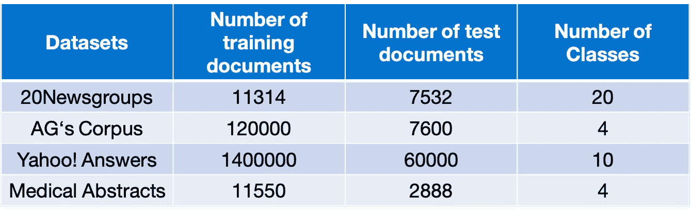
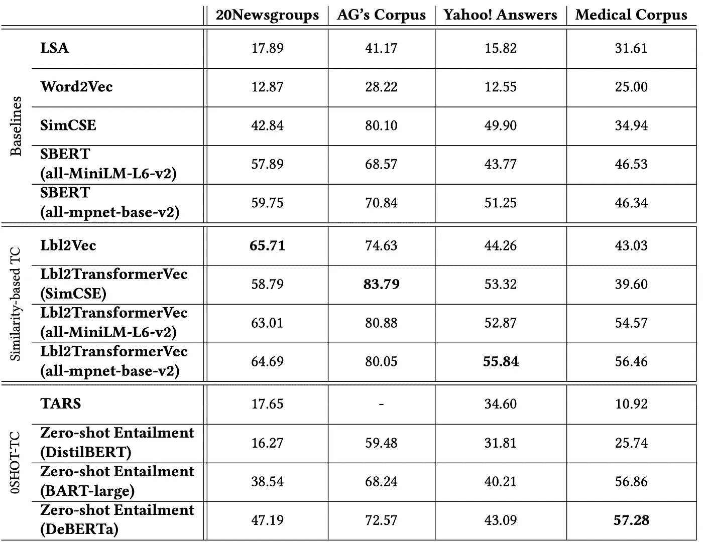
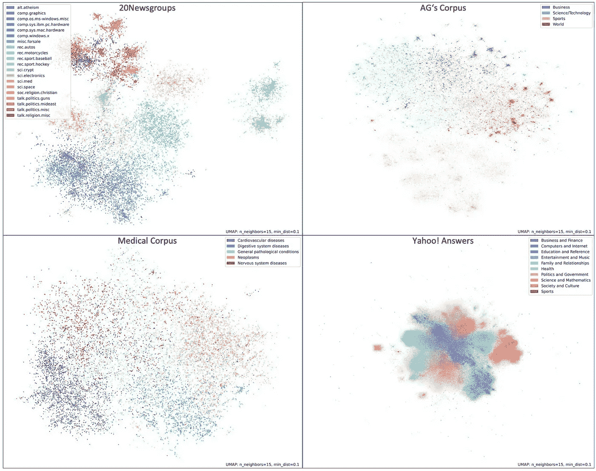

# 零-shot 与相似度基于的文本分类

> 原文：[`towardsdatascience.com/zero-shot-vs-similarity-based-text-classification-83115d9879f5?source=collection_archive---------3-----------------------#2023-01-05`](https://towardsdatascience.com/zero-shot-vs-similarity-based-text-classification-83115d9879f5?source=collection_archive---------3-----------------------#2023-01-05)

## 对无监督文本分类方法的评估

 [Tim Schopf](https://medium.com/@tim.schopf?source=post_page-----83115d9879f5--------------------------------)

·

[关注](https://medium.com/m/signin?actionUrl=https%3A%2F%2Fmedium.com%2F_%2Fsubscribe%2Fuser%2F7fe3665aa3e3&operation=register&redirect=https%3A%2F%2Ftowardsdatascience.com%2Fzero-shot-vs-similarity-based-text-classification-83115d9879f5&user=Tim+Schopf&userId=7fe3665aa3e3&source=post_page-7fe3665aa3e3----83115d9879f5---------------------post_header-----------) 发表在 [Towards Data Science](https://towardsdatascience.com/?source=post_page-----83115d9879f5--------------------------------) ·9 分钟阅读·2023 年 1 月 5 日

--

图片来源于 [Gertrūda Valasevičiūtė](https://unsplash.com/@skraidantisdrambliukas?utm_source=unsplash&utm_medium=referral&utm_content=creditCopyText) 在 [Unsplash](https://unsplash.com/de/fotos/xMObPS6V_gY?utm_source=unsplash&utm_medium=referral&utm_content=creditCopyText)

*这篇文章基于我们的 NLPIR 2022 论文* [*“评估无监督文本分类：零-shot 与相似度基于的方法”*](https://arxiv.org/abs/2211.16285)*。你可以在这里阅读更多细节。*

# 什么是无监督文本分类？

无监督文本分类方法旨在在训练期间不使用标注数据的情况下进行分类，因此有潜力减少标注成本💰。一般来说，无监督文本分类方法旨在根据文本描述将文本映射到标签，而不使用标注训练数据。为此，主要存在两类方法。

👯 第一类方法可以总结为**基于相似性**的**方法**。在此过程中，这些方法首先生成文本和标签描述的语义嵌入，然后尝试使用诸如余弦相似度之类的相似性度量将文本与标签进行匹配。

0️⃣ 🔫 第二类方法使用**零样本学习**来分类未见过的文本。零样本学习利用属于已见类别的标记训练实例来学习一个分类器，该分类器可以预测属于不同、未见过类别的测试实例。例如，一个零样本分类模型可能在训练期间学会正确分类关于足球⚽的文本，然后在测试时利用这一知识来分类关于篮球🏀的文本，即使之前从未见过关于篮球的文本。其理念是，模型可以将关于足球的知识转移到非常相似的篮球类别上。虽然零样本学习技术在训练时使用了标注数据，但它们不使用标签来提供目标类别的信息，而是利用已见类别的知识来分类未见类别的实例。由于预训练的零样本文本分类模型不需要在目标类别的标记数据上进行微调，因此我们将其归类为无监督文本分类策略。

**在这篇博客文章中，我们总结了我们论文📄** [***“评估无监督文本分类：零样本和基于相似性的 approaches (2022)”***](https://arxiv.org/abs/2211.16285)**的贡献如下：**

+   我们**评估**了无监督文本分类中**基于相似性**和**零样本学习**类别。为此，我们在不同的基准数据集上对每个类别的代表性方法进行实验。

+   我们**提出了基于 [SimCSE](https://aclanthology.org/2021.emnlp-main.552/) 和 [SBERT](https://aclanthology.org/D19-1410/) 句子嵌入相似性的简单但强大的无监督文本分类基线**。之前的工作大多与不同的弱基线如 Word2Vec 相比，这些弱基线容易被超越，并且往往高估了新的无监督文本分类方法的性能。

+   由于基于变换器的文本表示近年来被广泛建立为语义文本相似度的最先进技术，**我们进一步调整** **Lbl2Vec**，这是最新且表现优良的无监督文本分类相似度方法之一，以与基于变换器的语言模型配合使用。

# 无监督文本分类方法

## 👯 使用 Lbl2Vec 的基于相似度的文本分类

存在许多基于相似度的无监督文本分类方法。然而，最近引入的[**Lbl2Vec**](https://medium.com/towards-data-science/unsupervised-text-classification-with-lbl2vec-6c5e040354de) **方法相比其他基于相似度的方法表现更佳**。因此，我们在本研究中重点关注了这一方法。[Lbl2Vec](https://medium.com/towards-data-science/unsupervised-text-classification-with-lbl2vec-6c5e040354de)通过联合嵌入词、文档和标签表示来工作。首先，使用[Doc2Vec](https://radimrehurek.com/gensim/models/doc2vec.html)学习词和文档的表示。然后，通过余弦相似度利用每个类别的标签关键词表示的平均值来找到一组最相似的候选文档表示。候选文档表示的平均值，反过来，为每个类别生成标签向量。最终，对于分类，文档被分配到标签向量和文档向量余弦相似度最高的类别。[在这里](https://medium.com/towards-data-science/unsupervised-text-classification-with-lbl2vec-6c5e040354de)，你可以找到更多关于[Lbl2Vec](https://medium.com/towards-data-science/unsupervised-text-classification-with-lbl2vec-6c5e040354de)如何工作的资料。

此外，**我们调整了** [**Lbl2Vec**](https://medium.com/towards-data-science/unsupervised-text-classification-with-lbl2vec-6c5e040354de) **方法，使用基于变换器的文本表示**，而不是[Doc2Vec](https://radimrehurek.com/gensim/models/doc2vec.html)，来创建联合嵌入的词、文档和标签表示。由于基于变换器的文本表示目前在文本相似度任务中实现了最先进的结果，我们研究了不同的文本表示对这种基于相似度的文本分类策略的影响。在本文中，我们使用[SimCSE](https://aclanthology.org/2021.emnlp-main.552/)和[SBERT](https://aclanthology.org/D19-1410/)变换器模型来创建文本表示。接下来，这种方法被称为**Lbl2TransformerVec**。

## 0️⃣ 🔫 使用蕴含方法的零样本文本分类

尽管存在更新的零样本文本分类（0SHOT-TC）方法，**[**零样本蕴含方法**](https://aclanthology.org/D19-1404/)**仍然在预测未见类别的实例时，与类似大小的模型相比，能够产生最先进的 0SHOT-TC 结果。正如名称所暗示的，零样本蕴含方法将 0SHOT-TC 视为一个文本蕴含问题。其基本思想类似于基于相似性的文本分类方法。传统的 0SHOT-TC 分类器无法理解实际问题，因为标签名称通常被转换为简单的索引。因此，这些分类器很难从已见类别推广到未见类别。**将 0SHOT-TC 视为一个蕴含问题为分类器提供了文本标签描述，因此使其能够理解标签的含义。**

## 0️⃣ 🔫 使用 TARS 进行零样本文本分类

[TARS](https://aclanthology.org/2020.coling-main.285/)也使用文本标签描述来在零样本设置中进行文本分类。然而，TARS 将任务视为一个二分类问题，其中给定一个文本和一个文本标签描述，模型对该标签是否真实进行预测。TARS 的作者表示，这种方法在 0SHOT-TC 中显著优于[GPT-2](https://d4mucfpksywv.cloudfront.net/better-language-models/language-models.pdf)

## 📐 基准

我们将当前最先进的无监督文本分类方法的发现与一些基本基准进行比较，以评估它们的性能。

[**LSA:**](https://asistdl.onlinelibrary.wiley.com/doi/abs/10.1002/%28SICI%291097-4571%28199009%2941%3A6%3C391%3A%3AAID-ASI1%3E3.0.CO%3B2-9)对于每个数据集，我们应用 LSA 来学习𝑛 = 类别数概念。随后，根据文档和标签关键词的 LSA 向量的最高余弦相似度对文本文件进行分类。

[**Word2Vec:**](https://papers.nips.cc/paper/2013/hash/9aa42b31882ec039965f3c4923ce901b-Abstract.html)这根据周围的上下文词生成词的语义向量表示。词嵌入的平均值用于表示文本文件和标签关键词。文本文件根据生成的 Word2Vec 文档和标签关键词的表示的最高余弦相似度进行预测和分类。

[**SimCSE:**](https://aclanthology.org/2021.emnlp-main.552/)这是一个对比学习框架，它生成句子嵌入，在语义相似性任务中取得了最先进的结果。我们使用 SimCSE 文档嵌入和 SimCSE 标签关键词嵌入作为类别表示。最后，文本文件根据生成的 SimCSE 文档和标签关键词的表示的最高余弦相似度进行分类。

[**SBERT:**](https://aclanthology.org/D19-1410/)这是一种对[BERT](https://aclanthology.org/N19-1423/)的修改，使用了 siamese 和 triplet 网络结构来推导具有语义意义的句子嵌入。我们使用与 SimCSE 相同的分类方法，只不过这次使用 SBERT 嵌入而不是 SimCSE 嵌入。

# 🔬 实验

对于我们的 SimCSE 实验，我们使用[**sup-simcse-roberta-large**](https://huggingface.co/princeton-nlp/sup-simcse-roberta-large)模型。为了使用 SBERT 创建嵌入，我们使用了两个不同的预训练 SBERT 模型。我们选择了通用模型[all-mpnet-base-v2](https://huggingface.co/sentence-transformers/all-mpnet-base-v2)和[all-MiniLM-L6-v2](https://huggingface.co/sentence-transformers/all-mpnet-base-v2)，这些模型在超过十亿对训练样本上进行了训练，预计在句子相似度任务上表现良好。all-mpnet-base-v2 模型比 all-MiniLM-L6-v2 模型大，保证了稍微更好的质量句子嵌入。而较小的 all-MiniLM-L6-v2 模型则保证了五倍的编码速度，同时仍能提供高质量的句子嵌入。

为了评估 0SHOT-TC，我们进行了三种不同预训练的零样本蕴含模型的实验：一个[DeBERTa](https://huggingface.co/MoritzLaurer/DeBERTa-v3-base-mnli-fever-docnli-ling-2c)模型，一个大型[BART](https://huggingface.co/facebook/bart-large-mnli)模型，以及一个较小的[DistilBERT](https://huggingface.co/typeform/distilbert-base-uncased-mnli)模型。对于 TARS 实验，我们使用基于 BERT 的预训练[tars-base-v8](https://flair.informatik.hu-berlin.de/resources/models/tars-base/)模型。

## 💾 数据

我们的评估基于四个公开可用的文本分类数据集，[*20Newsgroups*](http://qwone.com/~jason/20Newsgroups)，[*AG‘s Corpus*](http://groups.di.unipi.it/~gulli/AG_corpus_of_news_articles)，[*Yahoo! Answers*](https://huggingface.co/datasets/yahoo_answers_topics)，以及[*Medical Abstracts*](https://github.com/sebischair/Medical-Abstracts-TC-Corpus)，这些数据集来自不同领域。由于我们使用类别描述的语义意义进行无监督文本分类，我们从每个类别名称推断标签关键词，这些关键词作为文本类别描述的目的。因此，推断步骤仅仅是使用数据集官方文档提供的类别名称作为标签关键词。在少数情况下，如果我们认为这是对某个类别更合适的描述，我们还用同义词或语义相似的关键词替换了类别名称。

使用的文本分类数据集概述。

## 📊 评估结果

在不同数据集上检查的文本分类方法的 F1 分数（micro）。各数据集上最佳结果以**粗体**显示。由于我们使用微平均法来计算分类指标，我们可以实现 F1、Precision 和 Recall 的相等分数。

我们可以观察到，根据这些数据，没有任何基线方法在任何数据集上获得最高的 F1 分数。这表明，使用先进的无监督文本分类方法通常能获得比简单基线方法更好的结果。然而，我们观察到**LSA 和 Word2Vec 方法**通常**效果最差，并且** **容易被超越** 👎。相比之下，**SimCSE 和 SBERT 基线方法产生了强劲的 F1 分数** 💪，甚至在某些情况下连一些先进方法也未能超越。此外，SimCSE 和 SBERT 基线方法在三个数据集上的表现可能优于 Lbl2Vec 基于相似性的方法。我们可以推断出，**使用先进的基于相似性的方法通常能比使用简单基线方法或 0SHOT-TC 获得更好的无监督文本分类结果**。具体来说，**使用 SBERT 嵌入的 Lbl2TransformerVec 方法表现出色，因为它们在所有数据集上都表现良好** 🏆，并超越了基线结果。相比之下，**0SHOT-TC 方法表现持续较差**，在大多数情况下甚至未能超越基线结果 😲。然而，DeBERTa 零-shot 蕴涵模型能够令人惊讶地很好地分类领域特定的医学摘要，并在该数据集上取得了所有分类器中的最佳 F1 分数。我们观察到，大型 DeBERTa 零-shot 蕴涵模型总是显著优于较小的 BART-large 和 DistilBERT 零-shot 蕴涵模型。此外，基于 BERT 的 TARS 模型的表现略优于较小的 DistilBERT 零-shot 蕴涵模型，除非在领域特定的医学摘要数据集上。因此，我们得出结论，**0SHOT-TC 方法的表现随着模型大小的增加而提高** 🤔。

# 💡结论

+   **基于相似性的文本分类方法通常在各种不同领域中优于 0SHOT-TC**方法。

+   文本嵌入的特性使得相似的主题或类别在嵌入空间中靠得很近。这意味着能够在嵌入空间中连贯地聚类主题的文本表示在无监督文本分类方法中表现良好。这一特性在我们的工作中也很明显，可以在下图中看到 👇。

[DensMAP](https://www.biorxiv.org/content/10.1101/2020.05.12.077776v1)的文档嵌入可视化。文档嵌入是使用 SBERT（all-mpnet-base-v2）创建的。

+   简单方法如**LSA 或 Word2Vec 容易超越**，因此**不建议用作未知类文本分类的基线**。

+   **SimCSE 和 SBERT**的**基线方法****产生强大的无监督文本分类结果**，甚至超过了一些更高级的分类器。因此，我们建议**使用 SimCSE 和 SBERT 基线来评估未监督文本分类**方法和未知类 0SHOT-TC 在将来的性能。

+   **Lbl2TransformerVec**，我们提出的基于相似性的文本分类方法**获得了最佳的 F1 分数**几乎所有数据集。

我们将我们的[Lbl2TransformerVec](https://github.com/sebischair/Lbl2Vec)代码公开在[`github.com/sebischair/Lbl2Vec`](https://github.com/sebischair/Lbl2Vec)。如果您想阅读更多关于我们方法的详细信息，您可以在这里阅读我们的论文(https://arxiv.org/abs/2211.16285)。

# Sources

 [## 评估无监督文本分类：零样本和基于相似性的方法

### 未知类的文本分类是一项具有挑战性的自然语言处理任务，主要是使用…

arxiv.org](https://arxiv.org/abs/2211.16285?source=post_page-----83115d9879f5--------------------------------)  [## Lbl2Vec: An Embedding-Based Approach for Unsupervised Document Retrieval on Predefined Topics

### 在本文中，我们考虑了从无标记文档数据集中检索具有预定义主题的文档的任务…

arxiv.org](https://arxiv.org/abs/2210.06023?source=post_page-----83115d9879f5--------------------------------)  ## Unsupervised Text Classification with Lbl2Vec

### An introduction to embedding-based classification of unlabeled text documents

towardsdatascience.com  [## GitHub - sebischair/Lbl2Vec: Lbl2Vec learns jointly embedded label, document and word vectors to…

### Lbl2Vec 学习联合嵌入标签，文档和单词向量来检索具有预定义主题的文档…

github.com](https://github.com/sebischair/Lbl2Vec?source=post_page-----83115d9879f5--------------------------------)  [## Sentence-BERT: Sentence Embeddings using Siamese BERT-Networks

### Abstract BERT（Devlin et al., 2018）和 RoBERTa（Liu et al., 2019）在新的最先进表现方面设立了新的标准性能…

[aclanthology.org](https://aclanthology.org/D19-1410/?source=post_page-----83115d9879f5--------------------------------)  [## SimCSE: 简单对比学习句子嵌入

### 高天宇, 姚兴成, 陈丹琪。2021 年自然语言处理经验方法会议论文集…

[aclanthology.org](https://aclanthology.org/2021.emnlp-main.552/?source=post_page-----83115d9879f5--------------------------------)  [## 零样本文本分类基准测试：数据集、评估与蕴涵方法

### 摘要 零样本文本分类（0Shot-TC）是一个具有挑战性的自然语言理解问题，迄今为止关注较少…

[aclanthology.org](https://aclanthology.org/D19-1404/?source=post_page-----83115d9879f5--------------------------------)  [## 面向任务的句子表示用于通用文本分类

### Kishaloy Halder, Alan Akbik, Josip Krapac, Roland Vollgraf。第 28 届国际会议论文集…

[aclanthology.org](https://aclanthology.org/2020.coling-main.285/?source=post_page-----83115d9879f5--------------------------------)
