# 零和游戏和混合策略

> 原文：[`towardsdatascience.com/zero-sum-games-and-mixed-strategies-21c158aecf07`](https://towardsdatascience.com/zero-sum-games-and-mixed-strategies-21c158aecf07)

## 模拟战略互动需要我们考虑不确定性

 [Michael Kingston](https://michaelkingston-49283.medium.com/?source=post_page-----21c158aecf07--------------------------------)

·发表于 [Towards Data Science](https://towardsdatascience.com/?source=post_page-----21c158aecf07--------------------------------) ·12 分钟阅读·2023 年 1 月 6 日

--

我在早期的文章中多次重复了我认为博弈论对数据科学至关重要的陈词滥调。我将重复我最喜欢的一句：*“博弈论就像是带有激励的概率论”*。

如果你感兴趣，可以在这里找到我早期的一些关于博弈论的文章：

+   博弈论：基础知识

 ## 博弈论

### 基础知识：同时移动游戏

[towardsdatascience.com

+   纳什均衡简介

 [## 纳什均衡简介

### 纳什均衡是博弈论中的一种策略配置，其中没有玩家拥有主导策略。每个玩家……

builtin.com](https://builtin.com/data-science/nash-equilibrium?source=post_page-----21c158aecf07--------------------------------)

+   纳什均衡的应用

 ## 纳什均衡的应用

### Bertrand，Cournot 和 Hotelling

towardsdatascience.com

+   博弈论中的主导策略解释

 [## 博弈论中的主导策略解释

### 博弈论中的主导策略发生在一个玩家相对于另一个玩家拥有更强、更有效的策略时……

builtin.com](https://builtin.com/data-science/dominated-strategy-in-game-theory?source=post_page-----21c158aecf07--------------------------------)

# 什么是混合策略？

让我们回到纳什均衡为何是一个有用的解答概念的原因：**它将始终在每个有限博弈中给我们一个答案**。这就是纳什存在定理：

> “任何有限数量玩家和有限数量动作的游戏都有一个混合策略纳什均衡。”

那么在这种情况下“*混合*”是什么意思呢？基本上，这意味着在许多场景中，我们需要向战略互动模型中引入概率，以使这些模型具有意义。

用来说明这一点的经典例子是“匹配硬币”，这通常又被重新诠释为足球比赛。个人来说，我更喜欢足球版本，但如果你有兴趣，这里有一个关于匹配硬币的解释链接：

 [## 匹配硬币 - 维基百科]

### 匹配硬币是博弈论中使用的一个简单游戏的名称。它由两个玩家，即偶数和奇数组成……

en.wikipedia.org](https://en.wikipedia.org/wiki/Matching_pennies?source=post_page-----21c158aecf07--------------------------------)

无论你喜欢哪种隐喻，二者都是**零和游戏**，因为每个玩家的效用增减正好被另一个玩家的效用变化所平衡。两位玩家的效用变化总和为零。

# 点球游戏：

图片由 [Sven Kucinic](https://unsplash.com/es/@skucinic9?utm_source=medium&utm_medium=referral) 提供，来自 [Unsplash](https://unsplash.com/?utm_source=medium&utm_medium=referral)

点球发生在足球比赛中，作为对某种犯规的惩罚，或者作为解决必须有胜者的平局的一种方式。在点球过程中，球门只由守门员防守。罚球者从距离球门线 12 码的指定点进行射门。

奖励的设定使得罚球者希望进球，而守门员希望扑救成功。

关键在于，点球时球的速度如此之快，以至于如果守门员等到看到球的去向才开始移动进行扑救，他们将永远无法成功。因此，守门员必须根据他们认为球将去向的地方做出反应，这使得这实际上是一个同时移动的游戏。

射手可以以几乎无限的方式射球，而守门员也可以以几乎无限的方式扑救。为了将这种情况建模为游戏，我们将行动集合限制为仅两个选项：左或右。我们将“右”定义为“从射手的角度看是右”，将“左”定义为“从射手的角度看是左”。在这种框架下，如果玩家的行动匹配，那么守门员跳向了正确的方向并完成了扑救。如果行动不匹配，守门员跳向了错误的方向，射手进球了。

## 收益矩阵：

以下是与这个故事一致的收益矩阵。如果我们使用我们通常的方法寻找纳什均衡，我们会发现以下情况：

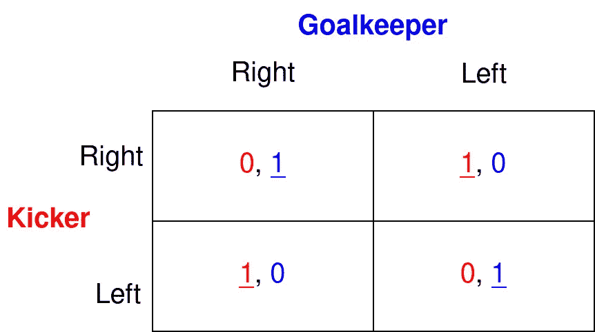

作者提供的图片

看起来没有任何策略配置具有我们称之为纳什均衡所需的属性，因为对于每一个可能的结果，一方玩家都有动机单方面偏离。

**然而这仍然是一个有限的游戏。**

*难道纳什存在定理不说明我们必须能够在这里找到均衡吗？*

## 混合策略：

问题在于我到目前为止在文章中定义策略的方式。我假设玩家必须“确定”选择一个行动，这被称为**纯策略**。纯策略是早期引入博弈论时的一个方便假设，但这是一个与现实不一致的假设。

正如我们所知，生活和数据科学中的许多事物更适合用概率术语来描述，博弈论也不例外。我们需要开始将概率引入我们的博弈论工具箱中。

玩家不一定要使用纯策略，实际上他们通常不会。**玩家可以根据某种概率分布在他们的纯策略之间进行随机化。** 这样做被称为使用***混合策略***。

在点球游戏中，守门员的混合策略会是什么样的？这将是一个概率分布，指定守门员以概率*p*进行“右”球，这将意味着另一种可用的行动（“左”）以概率*1-p*进行。类似地，对于射手，混合策略将是以概率*q*进行“右”球，以概率*1-q*进行“左”球。

## 点球游戏中的混合策略：

以这种更广泛的方式重新定义策略，使我们能够在点球游戏及许多其他游戏中找到纳什均衡。

假设最适合这种情况的概率分布是伯努利分布。在这一假设下，点球游戏的唯一纳什均衡是(*0.5R + 0.5L*, *0.5R + 0.5L*)，或者用通俗的话来说，每个玩家以相等的概率选择右和左。

直观上可以这样理解：

+   如果守门员**更可能**跳右边或更可能跳左边，那么踢球者的最佳反应是与守门员更可能做的事相反：这样，他们可以在一半以上的时间里进球。

+   同样地，如果踢球者**更可能**踢右边或更可能踢左边，那么守门员的最佳反应是匹配踢球者更可能做的事情：这样，他们可以在一半以上的时间里扑救成功。

+   但如果你的对手**同样有可能**选择右或左，无论你做什么，互动的结果会恰好有一半的时间对你有利。既然你无所谓，不如混合策略。

以下是最佳反应函数的图示，进一步说明了这一观点。

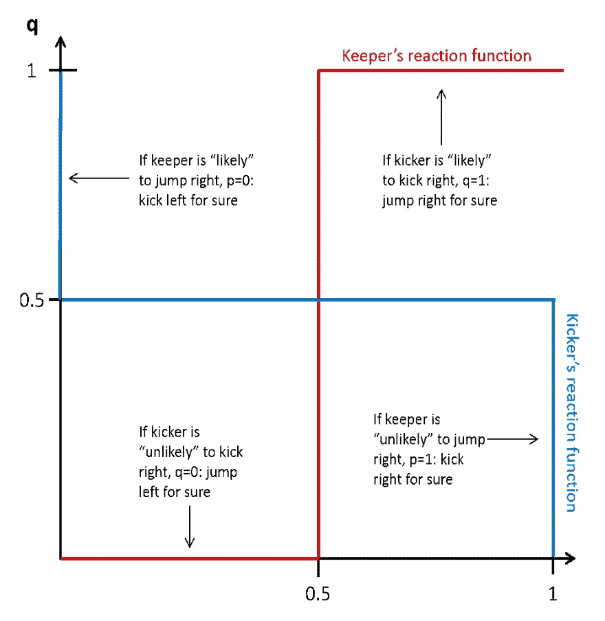

图片来源：作者

## 努力监控游戏：

图片由[Wes Hicks](https://unsplash.com/@sickhews?utm_source=medium&utm_medium=referral)提供，[Unsplash](https://unsplash.com/?utm_source=medium&utm_medium=referral)

这是工人与雇主之间的战略互动。

+   工人选择努力工作或偷懒。

+   雇主同时选择是否检查工人。

+   工人的偏好是，偷懒比工作更愉快，但前提是不被抓到。

+   雇主的偏好是，他们只希望在**认为**工人偷懒时检查工人（并随后惩罚他们）。

+   如果雇主认为工人在工作，他们宁愿不浪费时间和激怒员工，因此更愿意不检查。

以下是与此故事一致的支付矩阵：

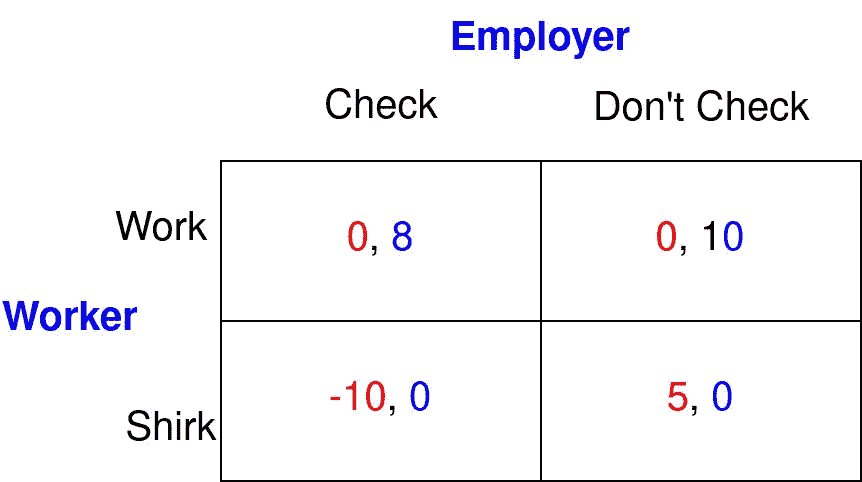

图片来源：作者

这个游戏在纯策略下没有纳什均衡，因为像点球游戏一样，两个玩家都希望他们的策略对对方是“出乎意料”的。工人只有在他们认为雇主会检查时才愿意工作……但雇主只有在他们认为工人会偷懒时才愿意检查！

让我们在混合策略中寻找纳什均衡。如果我们称*p*为雇主检查的概率，当工人在工作和不工作之间无差异时，

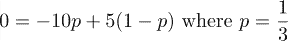

如果*p > 1/3*，工人工作的预期收益大于他们的偷懒预期收益；如果*p < 1/3*，工人偷懒的预期收益大于他们工作的预期收益。当*p=1/3*时，工人无差异。任何策略——包括任何混合策略——都是最佳反应。

如果我们称*q*为工人的工作概率，当工人对偷懒和工作无差异时：

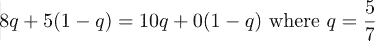

+   如果*q > 5/7*，雇主不检查的预期收益大于检查的预期收益，

+   如果*q>5/7*，雇主对检查的预期收益大于他们对不检查的预期收益。

+   当*q>5/7*，雇主对检查的预期收益大于他们对不检查的预期收益。

+   当*q=5/7*时，雇主无所谓。任何策略——包括任何混合策略——都是最佳响应。

基于上述，唯一的互最佳响应集是

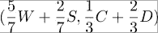

# 努力监控游戏：现实世界的影响

取原始努力监控游戏，减少在工人偷懒并被抓的结果中的收益，然后重新计算混合策略均衡。你应该会发现工人的混合策略没有改变，但雇主现在检查的频率越来越低。这告诉我们，在这种结构的游戏中，**被抓的高概率和被抓时的高惩罚是替代品**。

在许多现实世界的情境中，特别是在社会背景下而非工作场所中，传统观点认为增加被抓的概率可能比增加被抓的惩罚更具成本。这被称为某些国家监禁率上升的原因之一。

增加前者意味着增加用于监控和警察工作的人员（这可以被描述为成本函数），而增加惩罚具有不同（通常较低）的成本函数。因此，传统观点认为，通过减少监控但增加惩罚，通常可以实现相同的合规率。

随着监控成本的降低，而监禁惩罚成本的增加，这一观点正在发生变化。机器学习、计算机视觉和广泛的公共监控等技术被引入“预测性警务”，改变了成本效益平衡。

# 敌友游戏：

我女儿告诉我“敌友”是一种现象。我承认我真的不理解，但无所谓。作为一种游戏，它给我们提供了 7 个关于混合纳什均衡的关键见解。

这个故事是你和你的“敌友”之间的战略互动。你在选择去聚会还是去酒吧（*注：在澳大利亚，酒吧类似于当地的酒吧*）。

+   其他条件相同，你会更喜欢聚会，

+   但你也想见到你的“敌友”，所以如果他们去酒吧，你会对聚会和酒吧无所谓。

+   你的敌友可以选择聚会、酒吧或待在家里。

+   待在家里是最糟糕的选择。

+   你的敌友对聚会和酒吧没有特别的偏好——但你的敌友想要避开你，所以他们更倾向于去他们认为你不会去的地方。

+   以下是与这个故事一致的收益矩阵：

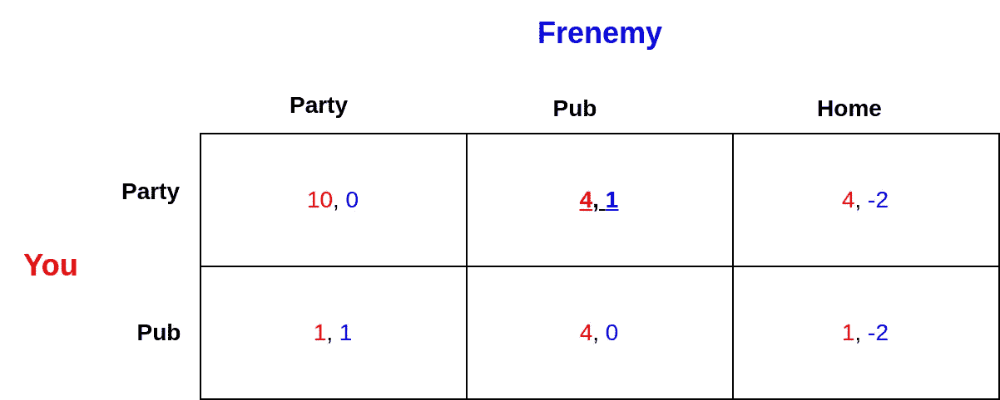

作者提供的图片

使用我们通常的方法，我们可以在这个游戏中找到一个纯策略的纳什均衡（派对，酒吧）。但这个解并不令人满意，因为它未能捕捉由不确定性产生的复杂性。具体来说，当每个玩家的最佳决策取决于另一个玩家的决策，反之亦然时，引入了不确定性，这要求我们将概率引入游戏环境。这反过来要求混合策略。

混合策略中是否也存在纳什均衡？假设你选择混合策略：以一定概率去“派对”，以*p*的概率去“酒吧”。如果你使用我们迄今为止遵循的技术，你会接着找出使敌友在三种纯策略之间无差异的值。

如果你正确地做了这一步，你得到的*p*值不在 0 和 1 之间，因此不符合概率的定义。

发生了什么？

数学告诉你，没有任何混合策略能让你的敌友在三种纯策略之间无差异。

为什么不呢？

因为“家里”被“派对”和“酒吧”严格支配。

> 就像玩家在纯纳什均衡中不会选择严格支配的策略一样，他们在混合策略纳什均衡中也不会选择严格支配的策略。

**这意味着在寻找任何纳什均衡时，我们可以忽略“家里”这一策略**

# **寻找纳什均衡集合：**

你的敌友可能在他们剩余的策略“派对”和“酒吧”之间无差异，因此可能被诱导选择混合策略。

但假设你的敌友混合选择，即以正概率选择派对和酒吧。你最佳的反应是什么？(*注：希腊字母π在经济学中常用来表示经济利润或回报。本文中的π有此含义*)

如果我们称你的敌友去派对的概率为*p*：

+   你去派对的期望回报是：

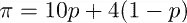

+   你去酒吧的期望回报是：

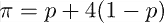

因此，只要*p>0*，你去派对的期望回报就大于你去“酒吧”的期望回报。

换句话说，如果你的敌友有任何去派对的机会，你会更愿意去派对。这是因为对你而言，“派对”弱于“酒吧”支配。当你的敌友确定去酒吧时，你才对这两种策略无差异。否则，你会更倾向于“派对”。

所以只要你的敌友以*p>0*的概率选择“派对”，你就应该去派对。但是，你的敌友——想要避开你——会怎么做呢？

他们会去酒吧！

所以我们有了一个矛盾。如果你的敌友以任何正概率去派对，那么你会确定去派对，这会让他们更倾向于去酒吧。

> **由此我们可以得出以下结论：在所有纳什均衡中，你的敌友肯定会选择“Pub”（概率为 1）。**

看起来像是个难题，对吧？

# 这是否意味着在这个游戏中没有混合策略的均衡点？

不一定！

> **在纳什均衡中，有可能一些玩家使用混合策略，而其他玩家使用纯策略。**

+   你的敌友将在所有纳什均衡中使用纯策略。

+   那个纯策略（pub）使你无差别，这意味着你选择的任何策略都是最佳响应。

+   因为在纳什均衡中，我们需要一组与“Pub”相关的互为最佳响应。

如果我们称你选择派对的概率为*p*：

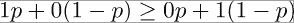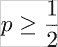

> **也就是说，只要你选择“pub”的可能性不高于“party”，你的敌友的最佳响应就是“pub”。**

总结来说，这个游戏的纳什均衡集合可以描述为：

+   如果你的敌友选择“Pub”，而你以大于或等于½的概率玩“Party”，即*p>½*。

+   回想一下“*其他条件相同，你会更喜欢派对*”的表述。因此，假设*p>½*似乎是合理的。

+   注意这意味着游戏中存在无限多个纳什均衡。

+   还要注意，我们找到的第一个纳什均衡——那个纯策略均衡——属于这一组。

# 总结 — 混合策略：

敌友游戏开始将概率和不确定性引入战略环境。我们将在未来的文章中进一步探讨。

它还阐明了关于混合策略均衡的 7 个重要事实：

+   混合策略中的纳什均衡仍然是纳什均衡——它们必须满足与纯策略纳什均衡相同的要求。

+   每个玩家的策略都是对其他所有玩家策略的最佳响应。

+   没有任何玩家有偏离的激励。

+   混合策略不必为所有纯策略分配正概率。

+   严格支配的策略在任何纳什均衡中都不会被选择，包括混合策略的均衡。

+   并非所有玩家在混合策略纳什均衡中都必须混合策略——有些可能在使用纯策略，而其他人则在混合策略。

+   可以说，所有纳什均衡都是混合策略纳什均衡——纯策略纳什均衡只是一个特殊情况，其中所有玩家将概率 1 分配给一个策略，其他策略的概率为 0。
